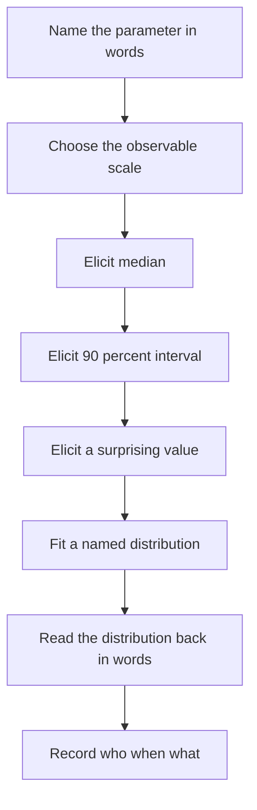
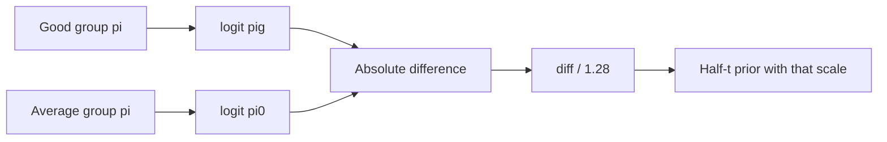

# Appendix B — Prior Elicitation Worksheets and Recommended Default Priors

## Purpose

A prior that was never written down was never elicited. It was a default wearing a lab coat. This appendix is a set of printable worksheets — Markdown tables you can copy into a note, a protocol, or a consent-to-analyze file — plus a recommended-default table for the neurology models this book uses. Defaults are starting points for *weakly* informative regularization when no expert is in the room. They are not a substitute for the worksheets when the prior will move a decision.

Do not paste a default into a protocol and call it an expert prior.

---

## How to run an elicitation

One facilitator, one or more clinicians who will not see the new data first, twenty to forty minutes, a piece of paper or a tablet. The facilitator does not offer numbers. The facilitator offers *questions on the observable scale*.

Rules:

1. Elicit on the scale the clinician thinks in: probability of LVO, meters on a 6-minute walk, annual recurrence risk — not log-odds, not \(\tau\) on the log-OR scale, unless the expert is a methodologist.
2. Ask for a median, then for a 90% interval, then for a value they would call surprising. Translate to a named distribution afterwards.
3. Record *who*, *when*, *what they were shown*, and *what they were not shown*.
4. If two experts disagree, do not average in your head. Record both and, if the decision is sensitive, carry both as a discrete mixture.
5. Stop when further precision would not change the action. A Beta(3, 7) and a Beta(4, 8) that produce the same treat/wait decision are the same prior for this book’s purposes.



---

## Worksheet 1 — A Beta prior on a probability

Use for a prevalence, a response rate, a 90-day independence probability, a diagnostic prior. The parameter is \(\pi \in (0,1)\), \(\pi \sim \text{Beta}(\alpha, \beta)\).

**Context line (fill in):** *parameter = _______________ ; population = _______________ ; time horizon = _______________*

| Prompt | Expert answer | Facilitator use |
|---|---|---|
| In 100 patients like this, how many would have the event / the disease / the response? (median) | _____ / 100 | Median \(m =\) that proportion |
| A number so low that only 1 in 20 experts like you would go lower (5th percentile) | _____ / 100 | \(q_{0.05}\) |
| A number so high that only 1 in 20 would go higher (95th percentile) | _____ / 100 | \(q_{0.95}\) |
| If the first 10 patients produced _____ events, would you call the data surprising? | _____ | Consistency check |
| Source of this judgment (experience, a named trial, a registry, a guess) | | Honesty |
| Shown any of the *new* data? (must be no) | yes / no | If yes, stop |

**Translation after the room.**

A quick method of moments, sufficient for teaching and for most protocols:

\[
\mu = m, \qquad
s \approx \frac{q_{0.95} - q_{0.05}}{3.3}, \qquad
\alpha + \beta = \frac{\mu(1-\mu)}{s^{2}} - 1, \qquad
\alpha = \mu(\alpha+\beta), \quad
\beta = (1-\mu)(\alpha+\beta).
\]

If \(s^{2} \geq \mu(1-\mu)\), the expert was more uncertain than a Bernoulli draw. Use a flatter Beta, or ask again.

| Teaching example | Median | 90% interval | Fitted Beta | Implied prior *n* |
|---|---|---|---|---|
| LVO among NIHSS \(\geq 10\), mothership | 0.35 | 0.20–0.52 | Beta(8, 15) | 23 |
| 90-day mRS 0–2 after EVT, early window | 0.46 | 0.32–0.60 | Beta(16, 19) | 35 |
| Spot-sign-positive expansion, deep ICH | 0.55 | 0.35–0.74 | Beta(9, 8) | 17 |
| Annual AF detection after negative 30-day monitor | 0.08 | 0.03–0.18 | Beta(3, 32) | 35 |

Fitted Betas are rounded to integer hyperparameters, so your own `fit_beta` run will land within a pseudo-observation or two of these. Read the Beta back in words before you dismiss the expert: “Beta(8, 15) means your best guess is 35 in 100, and you have given us about as much information as twenty-three imaginary patients.” If they flinch, flatten it.

```r
# Fit a Beta to elicited q05, median, q95 by least squares on the CDF.
# Teaching helper. Not a substitute for conversation.

fit_beta <- function(q05, q50, q95) {
  obj <- function(ab) {
    a <- exp(ab[1]); b <- exp(ab[2])
    qs <- qbeta(c(0.05, 0.50, 0.95), a, b)
    sum((qs - c(q05, q50, q95))^2)
  }
  opt <- optim(log(c(4, 6)), obj)
  a <- exp(opt$par[1]); b <- exp(opt$par[2])
  c(alpha = a, beta = b, prior_n = a + b, mean = a / (a + b))
}

# Teaching: LVO row from the table
fit_beta(0.20, 0.35, 0.52)
```

---

## Worksheet 2 — A Normal prior on a log odds ratio

Use for a treatment contrast on a binary outcome (death, mRS 0–2, ICH, recurrence). Clinicians think in relative risks and absolute risks. The worksheet stays there. You translate to \(\theta = \log\text{OR}\) afterwards.

**Context line:** *outcome = _______________ ; contrast = ________ vs ________ ; time = _________*

| Prompt | Expert answer |
|---|---|
| Control-arm event risk you expect (anchor) | \(p_{0} =\) _____ |
| Median treatment-arm risk at that control risk | \(p_{1} =\) _____ |
| Treatment-arm risk so *low* only 1 in 20 would go lower | \(p_{1}^{(05)} =\) _____ |
| Treatment-arm risk so *high* only 1 in 20 would go higher | \(p_{1}^{(95)} =\) _____ |
| Would a doubling of odds surprise you? A halving? | yes / no, yes / no |
| Source, and were new data shown? | |

**Translation.**

\[
\theta_{\text{median}} = \log\left(\frac{p_{1}/(1-p_{1})}{p_{0}/(1-p_{0})}\right),
\qquad
\theta_{0.05} = \log\text{OR}(p_{1}^{(05)}, p_{0}),
\qquad
\theta_{0.95} = \log\text{OR}(p_{1}^{(95)}, p_{0}).
\]

A Normal approximation: \(\theta \sim \mathcal{N}(\mu, \sigma^{2})\) with \(\mu = \theta_{\text{median}}\) and \(\sigma = (\theta_{0.95}-\theta_{0.05}) / 3.3\). Check symmetry. If the expert’s interval is badly asymmetric on the log-OR scale, use a skew-normal or elicit on the risk-difference scale and put the prior there.

| Teaching example | \(p_{0}\) | Median \(p_{1}\) | 90% on \(p_{1}\) | \(\mu_{\log\text{OR}}\) | \(\sigma\) |
|---|---|---|---|---|---|
| EVT vs medical, early LVO, mRS 0–2 | 0.30 | 0.44 | 0.36–0.52 | 0.61 | 0.20 |
| Intensive vs standard BP, ICH expansion | 0.30 | 0.26 | 0.18–0.36 | −0.20 | 0.28 |
| Anticoag vs antiplatelet, ESUS recurrence | 0.05 | 0.05 | 0.035–0.07 | 0.00 | 0.22 |
| Complement inhibitor vs placebo, 12-week response | 0.20 | 0.32 | 0.18–0.50 | 0.63 | 0.46 |

!!! note "Mathematical Detail"
    Odds ratios and risk ratios diverge when \(p_{0}\) is not small. For ESUS at 5% annual risk they almost coincide. For mRS 0–2 at 30% they do not. Always convert through the *odds* if the model is logistic. Telling an expert “the log-OR is 0.61” is how elicitation sessions end early.

!!! warning "Common Pitfall"
    Anchoring the control risk on a trial the expert just journal-clubbed, then eliciting a treatment effect from the same trial, is double-counting. If the trial will enter the likelihood, it cannot also be the prior. If it will *not* enter the likelihood (different population), say that out loud.

---

## Worksheet 3 — A hierarchical \(\tau\)

Use when hospitals, raters, or studies are exchangeable and you need a prior on the between-group SD of a varying intercept (or slope). Clinicians can answer this if you stay on the probability scale.

**Context line:** *grouping factor = _______________ ; outcome probability at the average group = _________*

Imagine many groups (hospitals, trials). The *average* group has probability \(\pi_{0}\). \(\tau\) is the SD of the group intercepts on the *logit* scale.

| Prompt | Expert answer |
|---|---|
| Probability in the average group, \(\pi_{0}\) | _____ |
| A group that is “unusually good,” about 1 in 10 groups is better | \(\pi_{\text{good}} =\) _____ |
| A group that is “unusually bad,” about 1 in 10 is worse | \(\pi_{\text{bad}} =\) _____ |
| Would a group with probability _____ make you doubt exchangeability? | _____ |
| How many groups have you actually seen? | \(J =\) _____ |

**Translation.**

The 10th and 90th percentiles of a Normal intercept are about \(\pm 1.28\,\tau\) from the mean. So

\[
\tau_{\text{good}} = \frac{|\text{logit}(\pi_{\text{good}}) - \text{logit}(\pi_{0})|}{1.28},
\qquad
\tau_{\text{bad}} = \frac{|\text{logit}(\pi_{\text{bad}}) - \text{logit}(\pi_{0})|}{1.28}.
\]

Average them. Put a half-Normal or a half-\(t\) on \(\tau\) with that scale, not a point-mass at that number. A teaching default when the worksheet produces \(\hat{\tau} \approx 0.3\) is \(\tau \sim \text{HalfStudentT}(3, 0, 0.4)\).

| Teaching example | \(\pi_{0}\) | Unusually good | Implied \(\tau\) | Recommended prior |
|---|---|---|---|---|
| Hospital intercept, EVT mRS 0–2 | 0.46 | 0.58 | 0.38 | Half-\(t_{3}(0, 0.5)\) |
| Site intercept, NIHSS change | — (use points) | \(+4\) NIHSS vs mean | \(\tau \approx 3\) points | Half-\(t_{3}(0, 3)\) |
| Study intercept, log-OR meta-analysis | OR 1.0 | OR 1.6 | 0.37 | Half-\(t_{3}(0, 0.5)\) |
| Rater intercept, mRS (collapsed) | 0.40 | 0.50 | 0.32 | Half-\(t_{3}(0, 0.4)\) |



---

## Recommended default priors for common neurology models

Use these when no worksheet was completed and the prior is not the scientific object — typical of a first pass, a homework fit, or a model whose likelihood will dominate. Replace them the moment a decision depends on the prior.

| Model | Parameter | Default prior | Rationale, one line |
|---|---|---|---|
| Bernoulli / logistic, intercept-only | Intercept (logit) | \(\mathcal{N}(0, 1.5^{2})\) | Puts 95% of \(\pi\) roughly in (0.05, 0.95) |
| Logistic, binary covariate | Slope | \(\mathcal{N}(0, 0.7^{2})\) | Odds ratio typically in (0.25, 4) |
| Logistic, NIHSS per point | Slope | \(\mathcal{N}(0.12, 0.06^{2})\) | Teaching clinical range; not a “noninformative” prior |
| Logistic, age per decade | Slope | \(\mathcal{N}(0, 0.4^{2})\) | Large but not cartoonish |
| Logistic, hospital intercept SD | \(\tau\) | Half-\(t_{3}(0, 0.5)\) | Matches Worksheet 3’s EVT row |
| Linear, NIHSS change | Intercept | \(\mathcal{N}(0, 10^{2})\) | Residual NIHSS lives on tens of points |
| Linear, residual SD | \(\sigma\) | Half-\(t_{3}(0, 10)\) | Same scale |
| Linear, treatment contrast (NIHSS) | Slope | \(\mathcal{N}(0, 4^{2})\) | A 10-point mean shift is already extreme |
| Linear, 6MWD change (meters) | Contrast | \(\mathcal{N}(0, 40^{2})\) | MCID near 40 m; see Chapter 18 Case 4 |
| Beta-binomial prevalence | \(\pi\) | Beta(2, 2) | Weakly informative; not Jeffreys unless you mean it |
| Poisson / negative binomial, log rate | Intercept | \(\mathcal{N}(0, 1^{2})\) | Recenter the offset first |
| Ordinal (mRS 0–6), thresholds | Ordered intercepts | `brms` default student-\(t\), check `get_prior` | Then regularize adjacent gaps if thresholds wander |
| Ordinal, treatment on latent scale | Slope | \(\mathcal{N}(0, 0.5^{2})\) | One-category shift is already large |
| Survival (Weibull / Cox-via-Poisson), log HR | Slope | \(\mathcal{N}(0, 0.5^{2})\) | HR in (0.4, 2.7) at 2 SD |
| Measurement-error, NIHSS noise SD | \(\sigma_{u}\) | Half-\(t_{3}(0, 2)\) | Inter-rater NIHSS is a few points |
| HSROC / bivariate diagnostic | Mean logit-Sn, logit-Sp | \(\mathcal{N}(1.4, 1^{2})\) | Centers Sn/Sp near 0.80, wide |
| Go/no-go skeptical treatment contrast | Mean effect | \(\mathcal{N}(0, \text{MCID}^{2})\) | MCID sits at 1 SD; Spiegelhalter-style |

`brms` encodings for the first few rows:

```r
# Appendix B: pasteable defaults. Weakly informative. Teaching only.
# Replace after a worksheet when the prior is identified.

prior_logistic_default <- c(
  prior(normal(0, 1.5), class = Intercept),
  prior(normal(0, 0.7), class = b),
  prior(student_t(3, 0, 0.5), class = sd)
)

prior_nihss_slope <- c(
  prior(normal(0, 1.5), class = Intercept),
  prior(normal(0.12, 0.06), class = b, coef = nihss),
  prior(normal(0, 0.7), class = b)
)

prior_6mwd <- c(
  prior(normal(0, 40), class = Intercept),
  prior(normal(0, 40), class = b),
  prior(student_t(3, 0, 40), class = sigma)
)
```

---

## When a default is the wrong object

- Rare-disease go/no-go (Chapter 18 Case 4): the skeptical prior *is* the decision. Worksheet it.
- First-in-class safety endpoint: do not center a log-OR at 0 if harm is more plausible than benefit.
- Transport across a different base rate: a prior on a *risk difference* will not travel; a prior on a *log-OR* might; neither travels into a new mechanism.
- Hierarchical \(\tau\) with \(J = 3\) groups: the likelihood cannot rescue you. Worksheet 3 or a strongly informative default, and say which.

!!! tip "Clinical Pearl"
    If you cannot read the prior back to the attending in one sentence — “we treated this as if we had already seen about twenty patients like yours, with seven independents” — it is not yet a clinical prior. It is a software default. Software defaults are allowed. Calling them expert opinion is not.

---

## A one-page record block

Copy this into the protocol or the sidecar file.

| Field | Entry |
|---|---|
| Parameter in words | |
| Scale elicited | probability / risk / meters / other: |
| Worksheet used | 1 Beta / 2 log-OR / 3 tau / default table row: |
| Experts (initials, role) | |
| Date | |
| New data shown? | no / yes (if yes, invalid as a prior) |
| Named distribution and hyperparameters | |
| Read-back sentence the expert accepted | |
| Decision that would flip if the prior flattened | |
| Signature of facilitator | |

---

## Further reading

- O’Hagan A, Buck CE, Daneshkhah A, et al. *Uncertain Judgements: Eliciting Experts’ Probabilities*. Wiley; 2006.
- Spiegelhalter DJ, Abrams KR, Myles JP. *Bayesian Approaches to Clinical Trials and Health-Care Evaluation*. Wiley; 2004. Skeptical and enthusiastic priors.
- Gelman A, Jakulin A, Pittau MG, Su Y-S. A weakly informative default prior distribution for logistic and other regression models. *Ann Appl Stat*. 2008;2:1360–1383.
- Stan Development Team. Prior choice recommendations. https://github.com/stan-dev/stan/wiki/Prior-Choice-Recommendations
- Johnson SR, Tomlinson GA, Hawker GA, Granton JT, Feldman BM. Methods to elicit beliefs for Bayesian priors: a systematic review. *J Clin Epidemiol*. 2010;63:355–369.
- Kynn M. The ‘heuristics and biases’ bias in expert elicitation. *J R Stat Soc A*. 2008;171:239–264.

!!! success "Key Takeaway"
    Elicit on the scale the clinician thinks in. Write a median, a 90% interval, and a surprising value. Translate to a Beta, a Normal on a log-OR, or a half-\(t\) on \(\tau\) afterwards, and read the distribution back in words. Defaults exist so a first fit can run; they are not expert opinion. Record who, when, and whether the new data were in the room.
