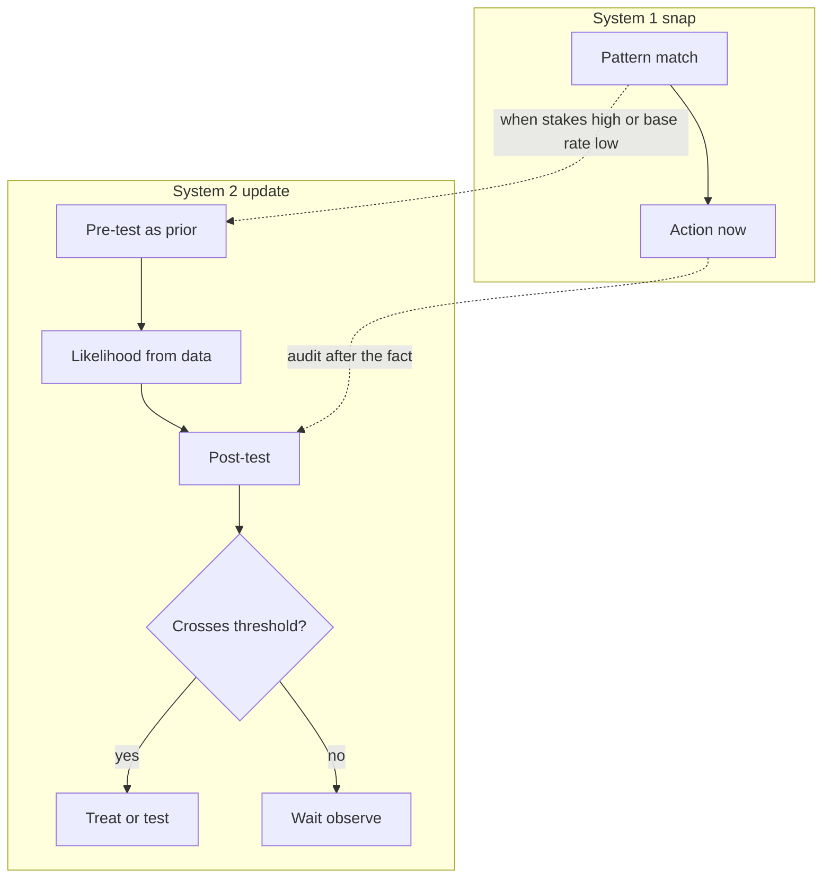
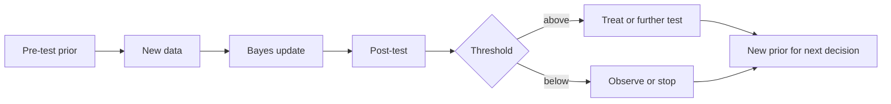

# Why Bayesian Thinking Matters for Clinicians and Researchers

## Opening

A 68-year-old man arrives eighty minutes after abrupt left-hemisphere weakness. The NIHSS is 14. Noncontrast CT is unremarkable. The fellow says, “NINDS was positive. We should treat.” The attending asks a quieter question: positive *for what*, at *what prior*, and relative to *what threshold*? That question is not pedantry. It is the difference between a p-value and a decision, and it is the reason this book exists.

## Learning objectives

After working this chapter you should be able to:

- Distinguish System 1 snap judgment from System 2 formal updating, and say when each is appropriate at the bedside.
- Name base-rate neglect as a structural error, not a personality flaw, and correct it with a pre-test probability.
- Explain why a frequentist p-value does not answer the question a clinician is actually asking.
- Treat pre-test probability as a prior, and update it with data to a post-test probability that can be compared with a decision threshold.
- Compute a conjugate Beta–Binomial update for a proportion in R without MCMC.

## Clinical vignette

It is 02:10. You are the stroke attending. EMS brings a 72-year-old woman last seen well ninety minutes ago. She is aphasic, with right hemiparesis; NIHSS 11. Glucose is 118 mg/dL. Blood pressure is 168/86. Noncontrast head CT shows no hemorrhage and no early infarct signs that would, in your shop, stop you. There is no large-vessel occlusion on CTA. The fellow has already mixed alteplase.

Your hospitalist colleague, who trained in an era that treated p < 0.05 as a hunting license, asks: “Wasn’t the original trial positive? Why are we still talking?”

A medical student, who has just finished a journal club on “the replication crisis,” asks the opposite question: “If p-values are so misleading, how can we ever treat anyone?”

You have four minutes before the clock, not the statistics, will decide. Write down, before you read further:

1. What quantity do you actually need in order to decide?
2. What is your pre-test probability that this woman will have a good functional outcome *without* thrombolysis?
3. What evidence, exactly, is the trial contributing?
4. At what posterior probability of net benefit would you treat, and at what probability would you not?

Do not look up a number. The exercise is to notice what you already believe, and what you are about to update.

## Two systems, one decision

Kahneman’s labels are overused and still useful. System 1 is the pattern-matching engine that lets an experienced neurologist walk into a room, hear “sudden aphasia, right face and arm,” and think *left MCA* before the sentence is finished. System 2 is the slower, serial, capacity-limited process that can hold a pre-test probability, a likelihood ratio, and a threshold in working memory at the same time.

Neither system is the villain. System 1 is how you survive a night float. System 2 is how you avoid treating the migraineur, missing the basilar occlusion, or quoting a p-value as if it were a probability of benefit. The failure mode that this book is written against is not intuition. It is *unexamined* intuition that never gets a chance to be updated by data, or *misapplied* formalism that answers a question nobody asked.



The dotted arrows are the discipline. When the base rate is low, when the stakes are irreversible, or when two attendings disagree, you force the snap judgment through the formal loop. You do not replace judgment with a formula. You expose the judgment so that data can move it.

System 1 is not sloppy. It is compressed. An experienced stroke attending has already, without naming them, used a prior (age, NIHSS, clock, the look of the CT), a likelihood (what alteplase has done to people like this), and a threshold (what this service, and often this family, will tolerate). The compression is why the bolus can go in at minute 82 instead of minute 140. The cost of the compression is that the prior, the likelihood, and the threshold cannot be criticized, taught, or updated when the next paper arrives. Formal Bayes is how you decompress the judgment on demand. You do not decompress every migraine. You decompress the case that will be discussed tomorrow, the case that splits the room, and the case whose base rate is low enough that System 1’s training set is thinner than it feels.

There is a practical test. After the bolus, or after the decision not to bolus, can you write four numbers on a scrap — prior, likelihood in one sentence, posterior, threshold — and have a fellow reconstruct the decision? If you cannot, you made a System 1 decision and dressed it in guideline language. Sometimes that is the right speed. It is never the right documentation of reasoning.

!!! tip "Clinical Pearl"
    If two competent neurologists disagree about thrombolysis, they almost never disagree about the CT. They disagree about the prior, the likelihood, or the threshold. Name which one.

## Base-rate neglect is the house error

Imagine a diagnostic test for a rare vasculitis that is 95% sensitive and 95% specific. A resident applies it to a patient whose pre-test probability is 1%, gets a positive result, and announces that the patient “almost certainly” has the disease. That announcement is base-rate neglect. The positive result is real. The disease is still unlikely.

Natural frequencies make the arithmetic less slippery. In a teaching cohort of 1,000 such patients you expect about 10 with disease. The test finds 9 or 10 of them (sensitivity 95%) and falsely flags about 50 of the 990 without disease (false-positive rate 5%). Among the roughly 60 positive tests, only about 10 are true. The post-test probability is near 1 in 6, not 95%.

The same error appears in treatment decisions, dressed in different clothes. “The trial was positive” is a statement about a test of a sharp null in a selected sample. It is not a statement about *this* patient’s probability of net benefit. If the trial population is a poor match — wake-up stroke, NIHSS 3, extensive early ischemic change, dual antiplatelet therapy an hour ago — the relevant pre-test has moved, and a “positive trial” does not automatically drag the posterior across your treatment threshold.

Thrombolysis is the running example of this book’s first movement because it concentrates every ingredient: a time-limited irreversible decision, a noisy outcome (disability at 90 days, not a lab value), a historically famous p-value, and a pre-test that varies wildly with age, severity, imaging, and clock time.

!!! warning "Common Pitfall"
    Quoting sensitivity as if it were a post-test probability is the diagnostic form of base-rate neglect. Quoting “the trial was positive” as if it were a posterior probability of benefit for *this* patient is the therapeutic form. Both skip the prior.

## What a p-value is, and what a bedside decision is

A frequentist p-value answers a question about data given a hypothesis: if there were no true average effect, and if we repeated this exact experiment many times, how often would we see a result at least this extreme? That is a coherent question. It is almost never the question in front of you at 02:10.

The question in front of you is approximately this: given everything I believed before I saw these data, and given these data, what is the probability that treating this woman with alteplase will leave her better rather than worse, and is that probability high enough to act?

Those are different objects.

| Quantity | Frequentist meaning | Bayesian meaning | What you can do with it at the bedside |
|---|---|---|---|
| p-value | Tail probability of the data (or more extreme) under a sharp null | None — it conditions on a null hypothesis, not on a prior and the observed data | Almost nothing directly. A small p does not give P(benefit). |
| 95% confidence interval | Interval that would cover the true fixed parameter in 95% of repetitions | Not a probability statement about the parameter | Indirectly useful as a compatibility range, easy to misread as a credible interval. |
| Posterior probability P(θ > 0 \| y) | Not defined without a prior | Probability, given prior and data, that the effect is beneficial | Directly comparable to a decision threshold. |
| 95% credible interval | Not defined without a prior | Interval containing 95% of the posterior mass | The range you can honestly say the effect “is probably in.” |
| Likelihood ratio | Relative support the data give two hypotheses | The factor that converts prior odds to posterior odds | The cleanest single number to carry from a paper to a patient. |
| Pre-test / prior | Informal “index of suspicion,” often unstated | Probability distribution over unknowns before these data | The quantity you must write down or you are updating nothing. |

The table is unfair to good frequentist practice. A carefully designed trial, a pre-specified analysis, and a confidence interval reported with absolute risks are not empty rituals. They are excellent *inputs* to a Bayesian decision. The failure is using the p-value as if it *were* the decision.

What, then, should you do with a published confidence interval at 02:10? Read it as a likelihood summary, not as a posterior. A **teaching** interval of 5 to 21 absolute points of benefit (roughly what the 600-patient version of the teaching trial below would report), if it came from an analysis you trust, tells you where the data are pointing and how sharply. It does not tell you whether *her* expected benefit sits inside that interval, because she was not sampled from that interval. To move from the interval to a probability of net benefit you still need a prior on the effect, a model for how her covariates shift the effect, and a utility for hemorrhage. The interval has done honest work: it has constrained the likelihood. It has not finished the decision. People who say “the CI excludes zero, so treat” have smuggled in a flat prior, a transportability claim, and a threshold of 50 percent, and have not named any of the three.

NINDS-like teaching numbers make the mismatch concrete. Suppose, as a **teaching number** and not as a quotation from the 1995 paper, that a trial of about 300 patients reports 39% good outcome (mRS 0–1) with alteplase and 26% with placebo, with a two-sided p-value near 0.02 — or that a 600-patient trial with that same 13-point contrast would give p on the order of \(10^{-3}\), not 0.02. The p-value says: under a null of no average difference, data this lopsided (or more) would be uncommon. It does not say that the probability of benefit in a 72-year-old woman with NIHSS 11, no occlusion, and a 90-minute clock is 99%. It does not say whether a 5% increase in symptomatic hemorrhage is worth a 13-point increase in good outcome *for her*. Those are posterior and utility questions. They require a prior and a threshold.

!!! note "Mathematical Detail"
    Write \(\theta\) for the risk difference (alteplase minus control) in a population like yours. A one-sided p-value is roughly \(P(T \ge t_{\text{obs}} \mid \theta = 0)\). The clinical probability is \(P(\theta > 0 \mid y)\). Bayes’ theorem connects them only after you specify \(p(\theta)\). There is no algebra that turns a p-value into a posterior without a prior. Anyone who offers you that conversion is smuggling in a prior and not saying so.

## Pre-test probability is a prior

Clinicians already speak Bayesian without the vocabulary. “What’s your pre-test?” is the sentence that separates a reasoning service from a protocol service. The pre-test probability *is* a prior: a probability distribution, often collapsed to a single number for conversation, over the unknown that the next piece of data will update.

Three remarks keep the idea from becoming either mystical or bureaucratic.

First, a prior is not a guess about the patient in front of you after you have seen everything. It is what you believed *before this particular datum*. If you have already seen the NIHSS, the CT, and the clock, those facts are already in the prior relative to the trial result, or already in the prior relative to the CTA, depending on the order you choose. Order is bookkeeping. The point is not to pretend you have not looked. The point is to know what the next likelihood is allowed to move.

Second, a point pre-test (say 0.30) is a convenient summary of a distribution. For a binary disease state it is enough. For a treatment effect it is not: you care whether the mass sits just above zero or far above zero, because the expected utility of treating is an integral, not a tail probability alone. This book will spend several later chapters on that distinction. Tonight, a point prior is already a revolution if yesterday you had none.

Third, the prior can come from a registry, a published control arm, a local audit, or an attending’s calibrated experience. It should not come from the desire to treat or the desire not to treat. Those desires belong in the *threshold*, which is a utility statement, not a probability statement. Mixing them is how departments get into unexplained variation that looks like science and behaves like taste.



This is the clinical Bayesian loop. It is not a software pipeline. It is a habit of mind. Every time you obtain a piece of data — a d-dimer, a CTA, a trial result, a 24-hour scan — you are somewhere on this loop. The only choice is whether you know it.

## Thrombolysis as a running example

Stay with the 02:10 woman. You need at least four numbers, even if three of them are rough.

**The prior on untreated outcome.** In a **teaching-number** population of similar age and NIHSS, suppose about 30% reach mRS 0–1 at 90 days without reperfusion therapy. That 30% is not her destiny. It is the location of a Beta distribution you could write as Beta(6, 14) if you want a prior with a mean of 0.30 and a modest amount of information — the equivalent of 20 previous patients. A more experienced service that has audited 200 such patients might use Beta(60, 140). Same mean, much less willingness to be moved by the next 20.

**The likelihood from evidence.** A NINDS-like **teaching** contrast of 39% versus 26% good outcome is a likelihood. It is information about a treatment effect, not a substitute for her untreated baseline. How you attach that likelihood to *her* is the subject of later chapters on transportability and effect modification. For tonight, treat it as a factor that shifts the odds of a good outcome upward, and notice that the shift is smaller if her untreated prognosis is already excellent or already hopeless.

**The harm.** Symptomatic hemorrhage is not a footnote. A **teaching number** of 6% versus 1% is a second likelihood, pointing the other way. A decision that updates only on disability and ignores hemorrhage is not Bayesian. It is wishful.

**The threshold.** Suppose, after talking with a typical patient who values independence highly and fears fatal hemorrhage, you would treat if the posterior probability of net benefit exceeded 0.60 and would not treat if it fell below 0.40, with a toss-up band between. Those numbers are utilities wearing probability clothes. They are allowed to differ by patient. They are not allowed to be invented after you see the scan in order to rationalize what you already wanted.

The four objects, and the slogans that usually impersonate them:

| Loop object | Teaching number for the 02:10 woman | Slogan that is not this object |
|---|---|---|
| Prior on untreated mRS 0–1 | About 0.30, written as a Beta with modest \(n\) | “NINDS good-outcome rate was 39 percent” |
| Likelihood from evidence | A NINDS-like contrast plus her hemorrhage risk | “p = 0.01” |
| Posterior of net benefit | A probability you can compare with 0.60 | “The trial was positive” |
| Treatment threshold | ~0.60 treat / ~0.40 do not, patient-dependent | “Eligible by the order set” |
| Action | Bolus, or wait | “We should talk about it” |

None of this requires a Hamiltonian Monte Carlo run at 02:12. It requires you to stop treating “p = 0.01” as if it were “P(should treat) = 0.99.” The table is also a checklist for morbidity conference. If the only sentence in the note is a slogan from the right-hand column, the loop was not run. The patient may still have been treated correctly. You will not be able to say why.

!!! example "R Deep Dive"
    The smallest honest Bayesian calculation is a conjugate update for a proportion. If your prior for the untreated good-outcome probability \(\pi\) is \(\operatorname{Beta}(\alpha, \beta)\), and you then observe \(s\) good outcomes in \(n\) similar untreated patients (a local audit, a registry extract), the posterior is \(\operatorname{Beta}(\alpha + s, \beta + n - s)\). No sampler. No warmup. No divergences.

## A conjugate update you can do before the bolus

The R block below is the entire engine for a Beta–Binomial problem. We put a weakly informative prior on the untreated good-outcome probability — Beta(6, 14), mean 0.30, as a **teaching** prior, not a claim about any trial — and update it with a **teaching** audit of 40 similar patients of whom 14 reached mRS 0–1. We then look at the posterior mean and at the probability that \(\pi\) exceeds 0.25, a number you might care about when counseling.

```r
# Teaching calculation only. Not a protocol and not an analysis of NINDS.
# Conjugate Beta-Binomial update for a good-outcome proportion.
# Prior: Beta(6, 14)  -> mean 6/(6+14) = 0.30, prior n = 20.
# Data:  14 good outcomes in 40 audited patients (teaching numbers).

set.seed(2026)

alpha <- 6
beta  <- 14
s     <- 14
n     <- 40

post_alpha <- alpha + s
post_beta  <- beta + (n - s)

prior_mean <- alpha / (alpha + beta)
post_mean  <- post_alpha / (post_alpha + post_beta)

# Posterior probability that untreated good-outcome rate exceeds 0.25
p_gt_025 <- 1 - pbeta(0.25, post_alpha, post_beta)

# 95% equal-tailed credible interval
ci <- qbeta(c(0.025, 0.975), post_alpha, post_beta)

cat("Prior mean:              ", round(prior_mean, 3), "\n")
cat("Posterior mean:          ", round(post_mean, 3), "\n")
cat("P(pi > 0.25 | data):     ", round(p_gt_025, 3), "\n")
cat("95% credible interval:   ", round(ci[1], 3), " to ", round(ci[2], 3), "\n")

# Optional picture of the move from prior to posterior
x <- seq(0, 1, length.out = 400)
plot(x, dbeta(x, alpha, beta), type = "l", lty = 2, lwd = 2,
     ylab = "density", xlab = expression(pi),
     main = "Teaching: Beta prior to posterior")
lines(x, dbeta(x, post_alpha, post_beta), lwd = 2)
legend("topright", c("prior Beta(6,14)", "posterior"), lty = c(2, 1), lwd = 2)
```

Run it. You should see the mean move from 0.30 toward the audit rate of 0.35, and a credible interval that is still wide. That width is the point. Forty patients do not pin a prognosis to two decimal places. A p-value on a difference of 14/40 versus some historical 26% would miss “significance” under any standard test (p ≈ 0.1–0.2). The posterior does not play that game. It tells you how much you still do not know.

A treatment-effect version of the same idea uses two Betas, or a single Beta on a risk difference after a transformation, or — once the book has earned it — a `brms` logistic model. The conceptual move does not change: write a prior, show the data, read a posterior probability, compare it with a threshold.

### For the biostatistician / methodologist

The conjugate update is a special case of

\[
p(\pi \mid y) \propto p(y \mid \pi)\, p(\pi),
\]

with \(y \mid \pi \sim \operatorname{Binomial}(n, \pi)\) and \(p(\pi) = \operatorname{Beta}(\alpha, \beta)\). The Beta is the conjugate prior for the binomial likelihood, which is why the posterior stays inside the same family. Conjugacy is a computational convenience, not a philosophical requirement. It is the right first calculation because it makes the bookkeeping visible: \(\alpha\) is prior “successes,” \(\beta\) is prior “failures,” and the data add to those counts. When a colleague says a prior is “subjective,” ask them to state the implied prior sample size \(\alpha + \beta\). A Beta(1, 1) is one success and one failure of fiction. A Beta(60, 140) is a small registry. Those are different scientific claims, and they should be defended as such.

Frequentist coverage and Bayesian calibration come apart when the prior is wrong in a way the data cannot yet correct. That is not an argument against priors. It is an argument for writing them down, for using weakly informative defaults when you are ignorant, and for checking prior–data conflict — all of which later chapters treat as routine hygiene rather than as a crisis.

## Why the loop changes practice even when the drug does not

Skeptics say: we already thrombolyse by guideline; a prior will not change the bolus. Sometimes that is true. A 54-year-old with NIHSS 18, a normal CT, a witnessed onset at 50 minutes, and no contraindication is not a Bayesian puzzle. The prior is already past the threshold, and the likelihood from two decades of evidence does not pull it back.

The loop earns its keep in the cases that generate morbidity and morbidity conferences:

- The NIHSS 3 patient whose “positive trial” was driven by more severe strokes.
- The wake-up patient whose imaging mismatch is a different likelihood than a clock.
- The 90-year-old for whom a good outcome is defined differently, so the utility threshold has moved even if the probability of radiographic reperfusion has not.
- The hospital that wants to know whether *its* post-alteplase hemorrhage rate is a draw from the trial’s Beta or a new process that needs a new prior.

In each of those settings the alternative to a Bayesian loop is not “objectivity.” It is an implicit prior that no one can criticize, plus a p-value that no one can apply.

Researchers meet the same fork with different furniture. A phase II hemorrhage-rate study that “does not reach significance” against a historical 6 percent is not a finding of safety. It is a likelihood that has not yet overcome a prior. A secondary-prevention trial that reports p = 0.049 for a composite and p = 0.11 for stroke is not a pair of contradictory truths. It is two likelihoods, two (probably correlated) endpoints, and a community that has not said what posterior probability of a stroke reduction it would require in order to change a guideline. The loop does not make those papers longer. It makes their last paragraphs shorter and more honest: here is what we believed, here is how far the data moved us, here is whether we crossed the threshold we named in the protocol. That paragraph is the difference between a p-value and a decision, written for a journal instead of for a family.

!!! tip "Clinical Pearl"
    When a guideline says “offer if eligible,” it has already combined a prior, a likelihood, and a typical utility. Your job is to notice when *this* patient is not the typical one the guideline averaged over.

## Worked solution to the opening vignette

Return to 02:10. The four questions, answered as teaching reasoning rather than as an order set:

1. **The quantity you need** is a posterior probability of net benefit for *this* woman — something in the family of \(P(\text{benefit} - \text{harm} > 0 \mid \text{data, prior})\) — compared with a threshold that reflects her utilities. You do not need a p-value. You do not need “was the trial positive.”

2. **The pre-test on untreated good outcome** is not 39% and not 26%. Those are trial-arm **teaching** rates. For a 72-year-old with NIHSS 11 and no occlusion, a defensible teaching prior might sit near 0.25–0.35, depending on what your own service has seen. Write 0.30 if you have nothing better, and admit the uncertainty with a wide Beta.

3. **What the trial contributes** is a likelihood for a treatment effect in a population that is only partly like her. It pushes the odds of a good outcome up and the odds of hemorrhage up. How far it should push *her* is a transportability problem. Ignoring that problem is how “NINDS was positive” becomes a slogan.

4. **The threshold** is hers, elicited in the ninety seconds you have, or taken from a previously discussed default if she cannot participate and no surrogate is present. A teaching default of “treat if posterior net benefit exceeds about 0.6” is a starting point for conversation, not a hospital policy.

Would you treat? In this vignette — disabling deficit, 90 minutes, clean CT, no occlusion but a clinical syndrome that still has something to gain from systemic thrombolysis — most calibrated stroke services would find the posterior above their threshold. The Bayesian contribution is not a different bolus. It is a different sentence to the family: not “the trial was positive,” but “given her baseline, the evidence we have, and what she values, the probability of net benefit is high enough that treating is the better bet.” If the next patient is an NIHSS 2 with resolving symptoms, the same sentence may reverse without any contradiction.

## Exercises

1. A resident quotes a 95% sensitive, 95% specific test and a positive result as “95% chance of disease.” Invent a pre-test of 2% and compute the post-test probability with natural frequencies. Where did the resident’s System 1 go wrong?

2. Using the R block above, change the prior to Beta(1, 1) and then to Beta(60, 140), keeping the same 14/40 audit. What happens to the posterior mean and to \(P(\pi > 0.25 \mid y)\)? Which prior is “more objective,” and why is that the wrong question?

3. Write, in one sentence each, the frequentist meaning and the Bayesian meaning of a 95% interval for the alteplase risk difference. Which sentence can you say out loud to a family?

4. A colleague says, “If we put a prior on the table, the lawyers will eat us.” Draft a three-sentence reply that distinguishes an implicit prior from an explicit one, and that does not offer legal advice.

5. For the 02:10 woman, list three facts that belong in the *prior* relative to the trial evidence and three facts that belong in the *likelihood*. Then swap the order: treat the trial as the prior and her phenotype as the likelihood. Do you get a different decision, or only different bookkeeping?

6. **Technical.** Show that if \(\pi \sim \operatorname{Beta}(\alpha, \beta)\) and \(y \sim \operatorname{Binomial}(n, \pi)\), the posterior mean is a weighted average of the prior mean and the sample proportion. Interpret the weights as sample sizes. (Hint only: write \(\mathbb{E}(\pi \mid y) = (\alpha + y)/(\alpha + \beta + n)\) and rearrange.)

## Further reading

- Kahneman D. *Thinking, Fast and Slow*. Farrar, Straus and Giroux; 2011. The System 1 / System 2 vocabulary, used here as a clinical discipline rather than as popular psychology.
- Meehl PE, Rosen A. Antecedent probability and the efficiency of psychometric signs, patterns, or cutting scores. *Psychol Bull.* 1955;52(3):194–216. The classic demolition of base-rate neglect, decades before it had that name.
- Goodman SN. Toward evidence-based medical statistics. 1: The P value fallacy. *Ann Intern Med.* 1999;130(12):995–1004. Still the cleanest short essay on why a p-value is not a posterior.
- Spiegelhalter DJ, Abrams KR, Myles JP. *Bayesian Approaches to Clinical Trials and Health-Care Evaluation*. Wiley; 2004. The reference text for putting priors and thresholds into therapeutic decisions.
- National Institute of Neurological Disorders and Stroke rt-PA Stroke Study Group. Tissue plasminogen activator for acute ischemic stroke. *N Engl J Med.* 1995;333(24):1581–1587. Cite for design and historical role; do not scrape its tables into a protocol.
- Pauker SG, Kassirer JP. The threshold approach to clinical decision making. *N Engl J Med.* 1980;302(20):1109–1117. The missing half of Bayes: a posterior is useless until it meets a threshold.
- Gelman A, Carlin JB, Stern HS, Dunson DB, Vehtari A, Rubin DB. *Bayesian Data Analysis*. 3rd ed. CRC Press; 2013. Chapters 1–2 for the formal objects in the table above.
- Wasserstein RL, Lazar NA. The ASA statement on p-values: context, process, and purpose. *Am Stat.* 2016;70(2):129–133. A professional society admitting, in public, what this chapter claims.

!!! success "Key Takeaway"
    A bedside decision needs a prior, a likelihood, a posterior, and a threshold. A p-value is none of those. Pre-test probability is already a prior; the only choice is whether you write it down. System 1 gets you to the room; System 2 decides whether the next piece of data is allowed to change the plan. The conjugate Beta update is the smallest calculation that makes the whole loop visible, and it is enough to stop you from treating “the trial was positive” as if it were a probability about the patient in front of you.
