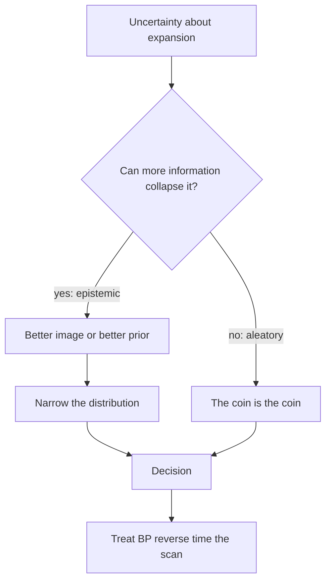
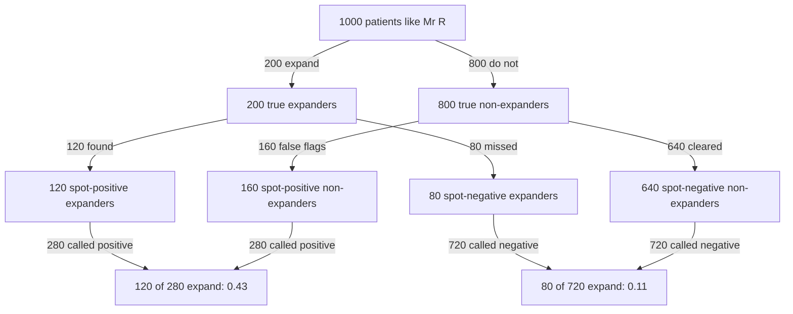
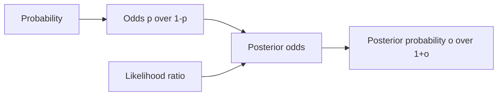

# Probability, Odds, Uncertainty, and the Language of Clinical Reasoning

## Opening

A family stands at the foot of a bed and asks whether the hematoma will grow. You have a 62-year-old man, two hours from onset, systolic pressure 188, a 24 mL deep ICH, and a spot sign that a radiology resident is 70 percent sure is real. You hear yourself say “possible,” then “likely,” then “we should be prepared.” Three words, three different numbers, and a decision about blood pressure, reversal, and a second scan that none of those words can carry.

## Learning objectives

After working this chapter you should be able to:

- Separate probability, odds, likelihood, and belief, and use each word for only one job.
- Translate everyday probability language into numeric ranges, and refuse to counsel with unbound adjectives.
- Distinguish aleatory from epistemic uncertainty, and say which of the two a larger sample can shrink.
- Convert sensitivity and specificity into a likelihood ratio, and run the odds form of Bayes by hand.
- Show, with a 10,000-patient simulation, how base-rate neglect manufactures false certainty.

## Clinical vignette

You are called to the ICU step-down. Mr. R is 62. He was last normal at 18:40. At 20:15 he could not stand. CT and CTA at 20:50 show a 24 mL left putaminal hematoma, no intraventricular blood, CTA spot sign called “probable” by the night resident. INR 1.0. He takes aspirin. Systolic pressure is 188 mm Hg on a nicardipine drip that has not yet bitten. The fellow wants a repeat CT in two hours “because expansion is likely.” The intern has already told the family that expansion is “a real possibility.” The charge nurse asks whether she should hold the next dose of labetalol “if he’s stable, since it might not grow.”

Before any formula, write four sentences:

1. What event, exactly, are we assigning a probability to?
2. Is the uncertainty in that event more like a coin (aleatory) or more like an unread lab (epistemic)?
3. What number would you defend as a pre-test probability of meaningful hematoma expansion in the next six hours, and where did it come from?
4. If the spot sign is treated as a test, what must you know besides “it looks positive”?

A **teaching** literature summary you may use later, not as a protocol: untreated expansion of the kind that changes management occurs in about 20 of 100 similar patients; a true spot sign might raise that into the 40s; a truly negative spot sign might drop it into the teens. Those are teaching numbers. They exist so that the language can be forced to meet arithmetic.

## Four words that are not synonyms

**Probability** is a number in \([0, 1]\) attached to an event or to a parameter. \(P(\text{expansion}) = 0.22\) is a probability. So is \(P(\theta > 0 \mid y)\). The first is about an event in a patient. The second is about a parameter after data. Both are probabilities. They are not the same object.

**Odds** are a ratio of probabilities, \(\frac{p}{1-p}\). Probability 0.22 is odds \(0.22/0.78 \approx 0.28\), or “0.28 to 1,” or “about 2 to 7.” Odds are not more scientific than probabilities. They are the algebraically convenient form of the same information. Bayes’ theorem is a multiplication when you speak odds, and a less friendly fraction when you speak probabilities. That is the only reason we bother.

**Likelihood** is not a synonym for probability, no matter how often a discharge summary uses it that way. In the technical sense used in this book, a likelihood is the probability of the *observed data* viewed as a function of the unknown parameter: \(L(\theta) = p(y \mid \theta)\). Sensitivity is a likelihood statement: among patients who truly have the disease (or the expanding hematoma), the probability of a positive test. It is not the probability of disease given a positive test. Confusing those two is the original sin of diagnostic reasoning.

**Belief** is the informal name for a subjective probability. Calling it a belief does not make it unscientific. Calling it a fact does not make it objective. A calibrated neurologist’s 0.22 and a registry’s 22/100 are both beliefs in the Bayesian sense: they are probability distributions over something unknown, ready to be updated. The difference is how they were built and how easily they can be criticized.

!!! warning "Common Pitfall"
    “The likelihood of expansion is high” is not a sentence this book will accept. Say “the probability of expansion is about 0.4 given the spot sign,” or “the likelihood ratio of a spot sign for expansion is about 3.” If you cannot tell which you meant, you are not ready to counsel.

## Calibration is the moral quality of a probability

A probability is calibrated when events you call 0.20 happen about twenty times in a hundred. Calibration is not the same as discrimination. You can rank patients perfectly by risk and still be miscalibrated — every “0.20” is really a 0.40 — and you can be perfectly calibrated at a single cut point and useless at ranking.

Clinicians are, as a group, overconfident at the extremes and sloppy in the middle. We say “essentially zero” for events that happen 3 percent of the time, and “basically certain” for events that fail 10 percent of the time. We also treat 30 percent and 70 percent as if they were interchangeable synonyms of “possible,” which they are in English and are not in a decision.

The cure is not a personality transplant. It is a habit of keeping score. If you tell ten families that the probability of meaningful ICH expansion is “about one in five,” you should, over a long enough service, see about two expansions. If you see six, your 0.20 is a 0.60 in costume. Bayesian machinery will not save a miscalibrated prior. It will launder it.

Keeping score can be as small as a notebook. Date, event you named, number you said, what happened. After fifty such lines you have the beginning of a calibration plot. After two hundred you have something you could show a fellow. Brier’s score — the mean squared difference between the number you said and the 0/1 outcome — is the formal version of that notebook. You do not need the formal version to start. You need the notebook. Services that refuse the notebook are not being humble about uncertainty. They are refusing to find out whether their adjectives work.

A second, quieter calibration failure is *resolution*: saying 0.30 for everyone in a band that actually runs from 0.10 to 0.55. You can be calibrated at the mean — events you call 0.30 happen 30 percent of the time — and still be useless for the patient whose risk is 0.10, because you never looked at the spot sign, the time, or the volume. Calibration without resolution is a weather service that says “30 percent chance of rain” every day in a climate where it rains 30 percent of days. Bayes updates are how resolution improves. The notebook is how you notice you needed them.

| Phrase said at the bedside | Range a careful listener should hear | Range many patients actually hear | Safer numeric substitute |
|---|---|---|---|
| Unlikely / doubtful | 0.05–0.20 | 0–0.40 | “About 1 in 10” |
| Possible / cannot exclude | 0.15–0.40 | 0.10–0.70 | “Roughly 1 in 4” |
| Real possibility | 0.20–0.50 | anything | Do not use |
| Likely / probable | 0.55–0.80 | 0.40–0.90 | “About 2 in 3” |
| Very likely | 0.80–0.95 | 0.60–1.00 | “About 9 in 10” |
| Almost certain | 0.90–0.99 | 0.70–1.00 | “19 in 20; still not sure” |
| Cannot be ruled out | 0.02–0.25 | often heard as 0.50 | Name the number or do not speak |

The middle column is a **teaching** compromise among several published “words of estimative probability” scales, including the old Sherman Kent table and later medical calibration studies. It is not a hospital policy. The right-hand column is the intervention: natural frequencies, spoken slowly.

!!! tip "Clinical Pearl"
    If a word in the left column would change management depending on which number in the second column you meant, you are not allowed to use the word. Say the number.

## Aleatory and epistemic uncertainty

Two kinds of uncertainty live in the ICH bay, and they ask for different behaviors.

**Aleatory** uncertainty is the residual randomness of a well-specified process. Even if you knew Mr. R’s biology perfectly, hematoma expansion would still be a coin with an unknown but fixed bias. Repeating the next six hours a thousand times in identical patients would still produce a spread. More data about *this* hour will not collapse that spread to a point. You can only estimate the bias more sharply.

**Epistemic** uncertainty is uncertainty about what is already fixed but unknown to you. Does he have a spot sign or not? Is the true expansion probability in patients like him 0.15 or 0.35? Those questions have answers. A better radiologist, a better scan, a larger registry, a more honest prior, will shrink the uncertainty. In the limit of infinite relevant information, epistemic uncertainty goes to zero and only aleatory uncertainty remains.

The distinction is practical. If the dominant uncertainty is epistemic — we do not know whether the spot is real — the next action is information: call the attending radiologist, get a better-timed CTA, look at the raw images. If the dominant uncertainty is aleatory — we are confident the expansion risk is about 0.22 and the remaining scatter is the world — the next action is a decision: treat the blood pressure, reverse what there is to reverse, time the next scan, talk to the family in numbers. Ordering another test to soothe aleatory discomfort is how ICUs accumulate contrast and delay.



Bayesian models encode both. A posterior for \(\pi\) is epistemic: it is your uncertainty about the expansion probability. A posterior predictive draw for the next patient is aleatory plus epistemic: even if you knew \(\pi\), the next hematoma would still expand or not as a Bernoulli(\(\pi\)) toss. Families hear the predictive statement. Investigators report the parameter statement. You need both, and you need to know which one you just said.

!!! note "Mathematical Detail"
    Let \(\pi\) be the expansion probability and \(y_{\text{new}}\) the next patient’s expansion indicator. After data \(y\),

    \[
    p(y_{\text{new}} \mid y) = \int p(y_{\text{new}} \mid \pi)\, p(\pi \mid y)\, d\pi.
    \]

    The inner factor is aleatory. The outer integral averages over epistemic uncertainty. Quoting only \(\hat{\pi}\) as if it were \(P(y_{\text{new}}=1 \mid y)\) ignores the integral. When the posterior of \(\pi\) is wide, the omission is not cosmetic.

## Natural frequencies, then likelihood ratios

Sensitivity and specificity are the wrong interface for the brain. They condition on the truth, which you do not have. Likelihood ratios condition on the data, which you do.

\[
\text{LR}^+ = \frac{\text{sensitivity}}{1 - \text{specificity}}, \qquad
\text{LR}^- = \frac{1 - \text{sensitivity}}{\text{specificity}}.
\]

A **teaching** spot-sign pair of sensitivity 0.60 and specificity 0.80 produces \(\text{LR}^+ = 0.60/0.20 = 3\) and \(\text{LR}^- = 0.40/0.80 = 0.5\). Those two numbers are what you carry to the bedside. They do not require you to remember a 2-by-2 table in the elevator.

Natural frequencies rebuild the same arithmetic for anyone who does not want the formula. Start with 100 patients like Mr. R. **Teaching numbers:** 20 will expand, 80 will not. Of the 20 expanders, the spot sign finds 12 and misses 8. Of the 80 non-expanders, it falsely flags 16 and correctly clears 64. If the spot is called positive you are looking at 12 + 16 = 28 people, of whom 12 expand: about 0.43. If it is called negative you are looking at 8 + 64 = 72 people, of whom 8 expand: about 0.11. The adjectives “likely” and “unlikely” are doing a lot of unearned work if they are applied equally to 0.43 and 0.11.

| Spot-sign result (teaching) | Pre-test P(expand) | LR | Posterior odds | Post-test P(expand) |
|---|---|---|---|---|
| Not yet done | 0.20 | 1 | 0.25 | 0.20 |
| Positive, LR+ = 3 | 0.20 | 3 | 0.75 | 0.43 |
| Negative, LR− = 0.5 | 0.20 | 0.5 | 0.125 | 0.11 |
| Positive, but pre-test 0.05 | 0.05 | 3 | 0.158 | 0.14 |
| Positive, but pre-test 0.50 | 0.50 | 3 | 3.0 | 0.75 |

The last two rows are the chapter’s argument in one glance. The same “positive spot sign” is a 0.14 and a 0.75 depending on who walked into the scanner. Sensitivity never told you that.

## The natural-frequency tree

The 100-patient table is already the right arithmetic. A tree with a count on every edge is the same arithmetic drawn so that a family, a charge nurse, and a tired fellow can walk the path with a finger. Gigerenzer’s point was never that the formula is false. It was that a mind which will not multiply a prior by an LR will still count 120 expanding hematomas among 280 spot-positive people, and will refuse to call 120/280 “likely” in the same breath it calls 80/720 “unlikely,” as if those were neighboring adjectives.

Start with 1,000 patients like Mr. R, not 100. The extra zero does not add information. It makes the misses visible as people rather than as a decimal. **Teaching numbers**, scaled from the 20-in-100 expansion rate and the spot-sign pair already used: 200 will expand, 800 will not. Of the 200 expanders the spot sign finds 120 and misses 80. Of the 800 non-expanders it falsely flags 160 and correctly clears 640. Every edge below is a count. There is no leftover probability hiding in a complement.



Read the tree from the top down once, then from the leaves up. Top down is how the biology happens: first the hematoma either expands or it does not, then the scan is called. Bottom up is how the night actually feels: you are handed a positive spot and you want \(P(\text{expand} \mid +)\). The 280 people with a positive call are \(120 + 160\). The 720 with a negative call are \(80 + 640\). Those two denominators are the only ones that may appear in a counseling sentence after the scan has been read. Sensitivity’s denominator — the 200 expanders — is no longer available to you. That is why quoting 0.60 as if it were a posterior is not a rounding error. It is a walk up the wrong branch.

The same tree is also a calibration instrument. If your service calls the spot “positive” in something like 280 of the next 1,000 similar patients and then sees expansion in something other than about 120 of those 280, one of three things is true: the 0.20 pre-test is wrong for your shop, the **teaching** LR+ of 3 is wrong for your readers, or the event you are scoring is not the event the tree was built on. Reliability is the same claim stated as a frequency: among patients you parked in the “about four in ten” bin, about four in ten expand. A tree that is never compared with an audit is decoration. A tree that is compared with an audit — even a notebook audit of the kind this chapter already demanded — is how a **teaching** LR becomes a local LR.

A short reliability failure is worth naming because it is the one the tree will not save you from. Suppose the night resident’s “probable spot” is a different test from the attending’s “definite spot.” You have drawn one tree and spoken two. The 120/280 leaf belongs to a single, named call. If you mix probable and definite into one positive branch, the 280 is a mixture and the 0.43 is a smear. Draw a second tree, or refuse the adjective, but do not average two tests and call the average a likelihood ratio.

The 1,000-patient frame also blocks a habit that the 100-patient table still permits: rounding 12/28 to “about half” and then counseling as if the posterior were 0.50. One hundred and twenty in 280 is still 0.43. Forty-three in a hundred is the sentence. “About half” is how 0.43 and 0.11 get talked about as if they lived in the same bin.

Keep the tree next to the odds form in the next section. The tree is how you see the 28 percent (now 280 people) that a positive call actually refers to. The odds form is how you compute the same number when the pre-test is 0.05 or 0.50 and you do not want to redraw 1,000 stick figures. They are one engine. If the tree and the multiplication disagree, you have mis-wired an edge, not discovered a deeper theory of probability.

!!! tip "Clinical Pearl"
    Put the tree on the whiteboard before you say a word to the family. Point at the 280 and the 120, or at the 720 and the 80. If you cannot point at a count, you are back to an adjective.

## The odds form of Bayes

Probability form,

\[
P(\theta \mid y) = \frac{P(y \mid \theta)\, P(\theta)}{P(y)},
\]

is the definition. Odds form is the working tool:

\[
\text{posterior odds} = \text{prior odds} \times \text{LR}.
\]

Prior probability 0.20 is prior odds \(0.20/0.80 = 0.25\). Multiply by LR+ = 3 and you have posterior odds 0.75, which convert back by \(p = \frac{o}{1+o} = 0.75/1.75 \approx 0.43\). That is the entire diagnostic engine for a single binary test and a binary state.



Sequential tests multiply LRs if — and this *if* is doing real work — the tests are independent given the state. Chapter 3 is about that *if*. Tonight, notice only that the algebra does not care whether the LR came from a spot sign, a d-dimer, or a trial’s treatment-effect estimate rewritten as a Bayes factor. Information is a multiplier of odds.

A second worked conversion, because the first one always looks easier than the one you do at 04:00. Pre-test 0.08 for aneurysmal SAH in a thunderclap patient who is already improving. Odds \(0.08/0.92 \approx 0.087\). A positive noncontrast CT with a **teaching** LR+ of 8 produces posterior odds \(0.70\), posterior probability \(0.70/1.70 \approx 0.41\). Still not “certain.” A negative CT with a **teaching** LR− of 0.05 produces posterior odds \(0.0043\), posterior probability about 0.004. The same scan, two different LRs, two different sentences. “The CT is 95 percent sensitive” cannot produce either sentence, because it never met the 0.08. If you skip the conversion and say “possible SAH either way,” you have thrown away the only information the scanner was going to give you.

People resist odds because odds feel like racetrack talk. Use whatever language gets the multiplication right. “Eight in a hundred, about one to twelve, times eight is eight to twelve, about forty percent” is ugly and correct. “Highly suggestive” is pretty and empty.

!!! tip "Clinical Pearl"
    Convert to odds, multiply, convert back. If you cannot do it on a scrap of paper, you do not yet understand the scan you are about to quote.

## The language of ICH expansion

Stay inside the vignette long enough to hear how probability talk goes wrong in a specific disease.

The event must be defined. “Expansion” can mean any growth, growth of 6 mL, growth of 33 percent, growth that causes herniation, or growth that would have been prevented by a blood-pressure target. A probability without an event is an adjective. Pick the event that would change the next action. For Mr. R, a defensible teaching event is “hematoma growth of at least 6 mL or 33 percent within 24 hours,” because that is the event most expansion trials counted. It is not the event the family is asking about. They are asking about waking up worse. You owe them both numbers, or an honest admission that you have one and are inferring the other.

Time belongs in the event. Expansion is front-loaded. A probability quoted from a paper that scanned at 24 hours is not the probability that applies at minute 90, and it is not the probability that applies at hour 12. Reusing the same 0.22 at both moments is not conservatism. It is a different model.

The spot sign is not a diagnosis. It is a test with an LR. Calling it “positive” and then saying “expansion is likely” skips the prior and inflates a **teaching** LR of 3 into a rhetorical LR of 20. Conversely, calling a negative spot sign “reassuring” in a patient whose clinical prior is already 0.40 — large, early, anticoagulated — is how people get surprised at 04:00.

Shared decisions inherit the language. “Possible” licenses the intern to under-treat the blood pressure. “Likely” licenses the fellow to over-promise a second scan as if the scan were a therapy. “About 4 in 10 if the spot is real, about 1 in 10 if it is not, and I am only moderately sure the spot is real” is longer, and it is the only sentence that matches the state of knowledge.

!!! warning "Common Pitfall"
    Do not report a single probability when the dominant uncertainty is whether the test is truly positive. Report a mixture: “If the attending confirms the spot, I will move from 0.20 to about 0.40. If the attending kills the call, I will move toward 0.10.” That is not indecision. It is a hierarchical probability.

## A simulation of 10,000 patients, or: watching base-rate neglect fail in public

The following R block builds a **teaching** world in which a disease has prevalence 2 percent, a test is 95 percent sensitive and 95 percent specific, and 10,000 patients walk through. It then compares the true posterior among test-positive patients with the number a base-rate-neglecting mind reports (0.95). The gap is the chapter.

!!! example "R Deep Dive"
    The simulation is a teaching device, not an assay. Change `prevalence` and watch the positive predictive value move while sensitivity stays put. That single experiment is usually enough to retire the habit of quoting 95 percent as a posterior.

```r
# Teaching simulation: base-rate neglect in 10,000 patients.
# Prevalence 2%, sensitivity 95%, specificity 95%. Not a real assay.

set.seed(2026)

n            <- 10000
prevalence   <- 0.02
sensitivity  <- 0.95
specificity  <- 0.95

disease <- rbinom(n, 1, prevalence)
# Test positivity depends on truth
p_pos   <- ifelse(disease == 1, sensitivity, 1 - specificity)
positive <- rbinom(n, 1, p_pos)

tab <- table(disease = disease, test = positive)
print(tab)

# True positive predictive value among those who tested positive
ppv_true <- mean(disease[positive == 1])

# What System 1 reports if it treats sensitivity as a PPV
ppv_naive <- sensitivity

# Odds-form Bayes, for comparison with the Monte Carlo
prior_odds <- prevalence / (1 - prevalence)
lr_pos     <- sensitivity / (1 - specificity)
post_odds  <- prior_odds * lr_pos
ppv_bayes  <- post_odds / (1 + post_odds)

cat("Monte Carlo PPV:          ", round(ppv_true, 3), "\n")
cat("Naive (sens as PPV):      ", round(ppv_naive, 3), "\n")
cat("Odds-form Bayes PPV:      ", round(ppv_bayes, 3), "\n")
cat("Number test-positive:     ", sum(positive), "\n")
cat("Number diseased among +:  ", sum(disease == 1 & positive == 1), "\n")
```

A typical draw produces something near 190 diseased patients, about 180 true positives, about 490 false positives, and a PPV near 0.27. The naive mind said 0.95. The odds form said 0.28 before a single random number was drawn. The simulation is not there to surprise a statistician. It is there to give a resident a table she cannot argue with.

Change `prevalence` to 0.20 and watch the PPV climb toward 0.8. The test did not improve. The prior did. That is the whole of diagnostic Bayes, and it is also the whole of why “95 percent sensitive” is not a counseling sentence.

### For the biostatistician / methodologist

The simulation is a posterior predictive check of a known generative model, which is a luxury you will not have with real patients. Two remarks travel.

First, the PPV is \(P(\theta=1 \mid y=1)\), a posterior probability for a binary parameter. Estimating it by a sample mean among test-positives is frequentist in the simulation and Bayesian in the interpretation. There is no tension. In a real series you would put a Beta prior on the PPV directly, or, better, put priors on prevalence, sensitivity, and specificity and push them through the same odds map. The second route respects the fact that all three inputs are uncertain.

Second, “likelihood” in “likelihood ratio” is a ratio of Bernoulli likelihoods for a single binary observation. The same name applies to a ratio of integrated likelihoods for a whole trial. The numerical habits of this chapter — convert to odds, multiply, convert back — survive that generalization. What does not survive is the pretense that independence is free. Correlated tests, and correlated endpoints, are why later chapters stop multiplying and start modeling.

## Worked solution to the opening vignette

1. **The event.** Meaningful hematoma expansion within 24 hours, defined for teaching as growth of at least 6 mL or 33 percent. Separately, and out loud, the event the family cares about: clinically important worsening attributable to growth. Do not let those two share a pronoun.

2. **Aleatory versus epistemic.** Both are present. Whether *this* hematoma expands, given a known \(\pi\), is aleatory. Uncertainty about \(\pi\), and uncertainty about whether the spot sign is truly present, are epistemic. The fellow’s urge to scan in two hours treats the first kind. The right next move on the second kind is to get the night attending to look at the spot.

3. **A defensible teaching pre-test.** Early, moderate-volume, hypertensive, not anticoagulated: about 0.20, written as odds 1:4. If your own service audits higher, use your audit. If you only have a word, you do not have a prior.

4. **What else the spot sign needs.** An LR, which needs sensitivity and specificity in a population like this one, and an honest read. A **teaching** LR+ of 3 moves 0.20 to about 0.43. A **teaching** LR− of 0.5 moves 0.20 to about 0.11. Neither number is “likely.” Neither is “nothing to worry about.” The intern’s “real possibility” and the fellow’s “likely” are, at best, pointing at two different rows of the table. The nurse’s question about holding labetalol is a utility question and should not be answered with an adjective.

The counseling sentence: “Out of ten people like him, about two will have the hematoma grow in a way that matters. If the spot the resident saw is real, that number becomes about four in ten. If it is not, it becomes about one in ten. I am going to treat the pressure as if we are in the higher band until a better read arrives, because the cost of being wrong that way is lower than the cost of being surprised.” That sentence is longer than “possible.” It is also a decision.

## Exercises

1. Convert the following probabilities to odds, multiply by LR = 4, and convert back: 0.05, 0.20, 0.50, 0.80. Which pre-test is moved across a 0.50 treatment threshold by that LR, and which is not?

2. A colleague says “the likelihood of a good outcome is 40 percent.” Rewrite the sentence three ways, once for each technical meaning (probability of an event, likelihood function, colloquial belief), and mark which rewrite is the one she probably intended.

3. Using the R simulation, set prevalence to 0.001, 0.02, and 0.20, keeping sensitivity and specificity at 0.95. Plot or tabulate the Monte Carlo PPV against the naive 0.95. Write one sentence you could say on rounds about the 0.001 row.

4. Give an ICH example of aleatory uncertainty that a second CT cannot reduce, and an epistemic uncertainty that a second CT can. Which one was the fellow in the vignette trying to buy?

5. Take the phrase table and listen to yourself for a week. Every time you say “possible” or “likely,” write the number you meant. If the number would not fit in the teaching range, the word was a dodge.

6. **Technical.** Show that \(\text{LR}^+ = \frac{P(y=1 \mid \theta=1)}{P(y=1 \mid \theta=0)}\) and that the odds form of Bayes is just Bayes’ theorem with \(P(y)\) cancelled. Then write the same identity for a continuous parameter and a single observation, and name the object you have written (hint: it is a Bayes factor when you integrate, and a likelihood ratio when you do not).

## Further reading

- Gigerenzer G, Edwards A. Simple tools for understanding risks: from innumeracy to insight. *BMJ.* 2003;327(7417):741–744. Natural frequencies as a clinical technology, not a popularization.
- Kent S. Words of estimative probability. *Stud Intell.* 1964;8(4):49–65. The original indictment of unbound adjectives, written for analysts rather than attendings.
- Spiegelhalter DJ. *The Art of Statistics: Learning from Data*. Pelican; 2019. Calibration, communication, and the difference between a parameter and a prediction, in public language.
- Deeks JJ, Altman DG. Diagnostic tests 4: likelihood ratios. *BMJ.* 2004;329(7458):168–169. The shortest correct account of what an LR is for.
- Sox HC, Higgins MC, Owens DK. *Medical Decision Making*. 2nd ed. Wiley-Blackwell; 2013. Probability, odds, and the bedside arithmetic this chapter insists on.
- Hemphill JC 3rd, Greenberg SM, Anderson CS, et al. Guidelines for the management of spontaneous intracerebral hemorrhage. *Stroke.* 2015;46(7):2032–2060. Use for the structure of the clinical problem; do not mine it for unofficial probabilities.
- Gelman A, Hill J, Vehtari A. *Regression and Other Stories*. Cambridge University Press; 2020. The early chapters on probability, inference, and simulation, including the calibration mindset.
- Morgan DJ, Pineles L, Owczarzak J, et al. Accuracy of practitioner estimates of probability of diagnosis before and after testing. *JAMA Intern Med.* 2021;181(6):747–755. Empiric evidence that the profession this book addresses is miscalibrated in exactly the way the chapter describes.

!!! success "Key Takeaway"
    Probability, odds, likelihood, and belief are four jobs. Assign each word one job and the rest of diagnostic reasoning becomes arithmetic. Adjectives are not calibrated; natural frequencies and likelihood ratios are. Aleatory uncertainty is a reason to decide, epistemic uncertainty is a reason to look, and a 95 percent sensitive test in a 2 percent disease is a 28 percent disease. If you cannot say Mr. R’s expansion risk as a number that would survive a 10,000-patient replay, you are not reasoning. You are narrating.
