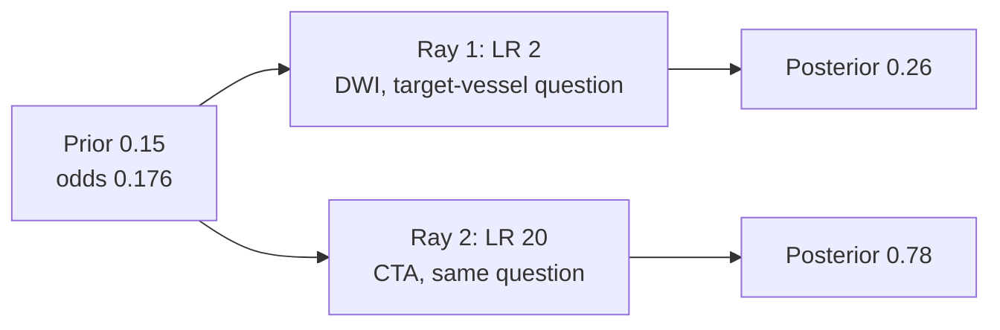
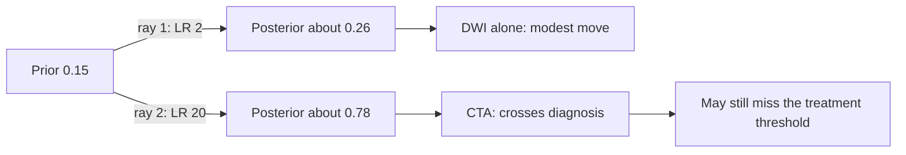
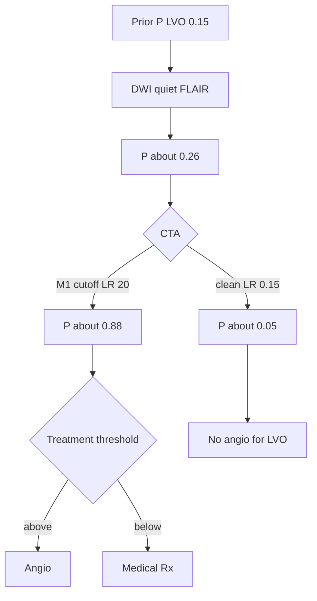
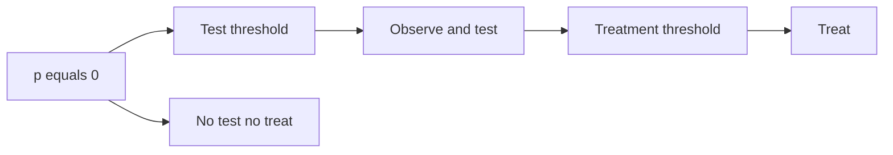

# Bayes’ Theorem as the Formal Engine of Diagnostic and Therapeutic Updating

## Opening

A man is found down. No witness. NIHSS 8. The clock is an interval, not a point. DWI is bright in a cortical patch; FLAIR is almost quiet; CTA is still running. Someone says “treat,” someone says “need the vessel,” someone says “need the last-seen-well.” Bayes’ theorem is the only machine that can take those three sentences in order and return a number you are allowed to compare with a threshold.

## Learning objectives

After working this chapter you should be able to:

- Write Bayes’ theorem in probability form, odds form, and sequential-LR form, and know when each is the right instrument.
- Use a Fagan nomogram in your head: prior probability, LR, posterior probability, without pretending the nomogram is software.
- Update a stroke syndrome with successive, approximately independent tests — DWI, then CTA, then the exam you just repeated — and stop multiplying when independence fails.
- Separate a diagnostic threshold from a treatment threshold, and apply the Pauker–Kassirer logic to both.
- Work a CT-then-LP subarachnoid problem and a last-seen-well-unknown LVO problem with the same algebra.

## Clinical vignette

Ms. K is 61. She was found on the kitchen floor at 07:10 by her sister, who had spoken to her at 22:30 the night before. She is awake, follows some commands, has a mild aphasia and a right pronator drift; NIHSS 8. Glucose 104. Blood pressure 152/78. Noncontrast CT is unremarkable. DWI shows a small but definite left frontal cortical restriction; the FLAIR is nearly silent. CTA is being reconstructed. There is no hemorrhage, no obvious dense vessel. She cannot say when it started. The fellow thinks the DWI/FLAIR mismatch makes her “DAWN-like.” The radiologist thinks the clot, if any, will be distal. The intern asks whether a negative CTA would “rule out” a treatment decision.

Write, before the reconstruction finishes:

1. What is the unknown — occlusion, salvageable tissue, clock time, or net benefit of treatment?
2. In what order will you let the data speak, and what is the prior at the first step?
3. What would a negative CTA do to that prior, and what would a positive CTA do?
4. At what posterior probability of a target vessel *and* of net benefit would you proceed to angiography, and is that one threshold or two?

A **teaching** scaffolding you may use: pre-imaging probability of a large-vessel occlusion in an NIHSS-8 found-down patient, about 0.15; DWI consistent with acute ischemia, LR about 3 for “this is a real acute stroke”; proximal LVO on CTA, LR about 20 for “there is a target”; no LVO on CTA, LR about 0.15 against a target. Those are teaching numbers, not a local protocol.

## Three forms of the same theorem

Probability form is the definition. For a binary state \(\theta \in \{0,1\}\) and data \(y\),

\[
P(\theta = 1 \mid y) = \frac{P(y \mid \theta = 1)\, P(\theta = 1)}{P(y)},
\]

where \(P(y) = P(y \mid \theta = 1)P(\theta = 1) + P(y \mid \theta = 0)P(\theta = 0)\). This is the form to write on a whiteboard when someone asks what you are doing. It is not the form to compute with, because the marginal \(P(y)\) is a nuisance.

Odds form deletes the nuisance:

\[
\frac{P(\theta = 1 \mid y)}{P(\theta = 0 \mid y)} = \frac{P(y \mid \theta = 1)}{P(y \mid \theta = 0)} \times \frac{P(\theta = 1)}{P(\theta = 0)}.
\]

The first factor on the right is the likelihood ratio. The second is the prior odds. Chapter 2 used this once. This chapter uses it as a loop.

Sequential form is the loop written as a product. If \(y_1, y_2, \ldots, y_k\) are independent given \(\theta\),

\[
\text{posterior odds} = \text{prior odds} \times \operatorname{LR}(y_1) \times \operatorname{LR}(y_2) \times \cdots \times \operatorname{LR}(y_k).
\]

Independence given \(\theta\) is the load-bearing phrase. It means: once you know whether the vessel is occluded, the DWI and the CTA do not carry extra shared information. That is approximately true for some pairs and false for others. A dense MCA sign on CT and a cutoff on CTA are not independent given LVO. Multiplying their LRs is double counting, and double counting is how posteriors go to 0.99 without new facts.

!!! note "Mathematical Detail"
    For a continuous parameter the same algebra is

    \[
    p(\theta \mid y) \propto p(y \mid \theta)\, p(\theta),
    \]

    and sequential independent observations multiply likelihoods. A Bayes factor is the continuous analogue of an LR after the parameter has been integrated under two hypotheses. You do not need that object to run a stroke alert. You need it to read a trial. Both are Bayes’ theorem.

## The Fagan nomogram, without the plastic card

A Fagan nomogram is a graphical slide rule for the odds form. A straight line from prior probability through an LR lands on a posterior probability. The intellectual content is a multiplication. The pedagogical content is the *shape*: the same LR moves a mid-range prior a long way and barely nudges a prior that is already 0.02 or already 0.98.

Carry three anchors in your head, all **teaching** anchors:

- LR = 2, 5, 10 raise probability in a rough, memorable way from a pre-test of 0.20 to about 0.33, 0.56, 0.71.
- LR = 0.5, 0.2, 0.1 drop that same 0.20 to about 0.11, 0.05, 0.02.
- An everyday imaging LR of 2–20 will not take a 0.01 prior to a treatment threshold of 0.50 (that move needs an LR near 100). You need either a better prior or a near-pathognomonic test.

That last bullet is why a beautiful CTA does not rescue a silly indication, and why a negative d-dimer does not empty a high-prevalence ward. The nomogram is a picture of base rates with a multiplier. It is not a picture of hope.

A working memory version of the nomogram uses a single anchor you can do without paper. Convert the prior to odds. Round the LR to 2, 5, 10, or their inverses. Multiply. Convert back. For Ms. K, 0.15 is “about 1 to 6.” An LR of 2 makes it “about 1 to 3,” which is 0.25. An LR of 20 then makes it “about 20 to 3,” which is 0.87. You are now within a point of the exact 0.88, and you did it while the reconstruction was spinning. The point of the nomogram was never three-decimal precision. It was to know, before the report arrives, whether this test is *capable* of crossing the threshold you already named. If even an LR of 20 cannot carry your prior across \(p^*\), do not order the test in order to feel busy. Order it only if you will believe a negative as well as a positive, or if someone else needs the picture.

!!! tip "Clinical Pearl"
    If you cannot guess the posterior to one significant figure before you touch a calculator, you do not yet know whether the test was capable of changing the plan. Do the nomogram in your head first. Then compute.

## A Fagan nomogram you can actually read

The plastic card is a pair of vertical axes with a log-odds spine. Left axis: prior probability. Middle: likelihood ratio. Right: posterior probability. A straight edge from a prior through an LR is the odds form of Bayes drawn as a ray. Nothing on the card is more sophisticated than \(o' = o \times \operatorname{LR}\). The reason to draw it, rather than only multiply, is to *see* that the same LR is a long trip in the middle of the probability scale and a shrug at the ends.

Ms. K’s **teaching** numbers make two rays, not a family of them. Prior probability of a proximal target: 0.15. One ray through LR = 2 (the vignette’s modest DWI multiplier for the *target-vessel* question — a cortical DWI lesion makes a proximal occlusion somewhat more likely, far from proof). One ray through LR = 20 (the vignette’s multiplier for a proximal LVO on CTA). Both rays answer the same question — is there a proximal target? — from the same prior, so the nomogram’s geometry is visible before the reconstruction finishes.

Convert once, on paper.

- Prior 0.15 is prior odds \(0.15/0.85 \approx 0.176\).
- Ray 1, LR 2: posterior odds \(0.353\), posterior probability \(0.353/1.353 \approx 0.26\).
- Ray 2, LR 20: posterior odds \(3.53\), posterior probability \(3.53/4.53 \approx 0.78\).

The sequential product in the next section (DWI then CTA) is a third calculation: it multiplies both LRs, and it answers a stacked question. The nomogram’s two rays do not stack. Each ray is “what if this were the only new datum.” That is what the card was for.

Do not read the next picture as a multiplication table. Both rays start at the same prior, 0.15. The numbers 0.26 and 0.78 are those two posteriors, not the posteriors of the 0.30 and 0.70 ticks.



The ticks are not to scale. The log-odds spine of a printed Fagan card is. What you need to carry is the *shape*: from 0.15, an LR of 2 is a move you can feel (0.15 → 0.26) and an LR of 20 is a move that crosses most diagnostic thresholds you would defend for “is there a target?” (0.15 → 0.78) and still may not cross a treatment threshold for “should we puncture *her*?” A third ray, not drawn, is the one the intern wants: an LR large enough to take 0.15 across 0.50 *and* across a high treatment threshold in one step. No CTA produces that ray by itself. The nomogram is how you notice before you order the test in order to feel busy.



Two reading rules, both visible on the sketch.

First, a ray that starts at 0.15 and goes through LR = 1 lands at 0.15. That is not a joke. It is the definition of a useless test, and it is the right picture for a “possible M3” called by a reader you do not trust. Second, the left axis is a *probability*, not a count of symptoms. “NIHSS 8, found down, cortical DWI” is already inside the 0.15. Adding those facts again as if they were a second LR is a second ray you have already spent.

The card also shows, without arithmetic, why Ms. K’s clean-CTA branch and her M1-cutoff branch cannot be averaged into a single “CTA is informative” sentence. One ray goes up. The other, through the vignette’s LR = 0.15 *against* a target, goes down from the same 0.15 prior: odds \(0.176 \times 0.15 \approx 0.026\), probability about 0.026. Those are two posteriors. A nomogram with one ray labeled “the CTA” is a decoration.

Carry the two rays into the sequential section that follows. The temptation to resist: the vignette also quotes an *acute-ischemia* LR of 3 (cortical DWI with a quiet FLAIR, for “is this a real acute stroke?”). If you multiply that LR of 3 by the *vessel* LR of 20 onto the same LVO prior, you have changed the question mid-product. LR = 3 updates “is this a real acute stroke?”; LR = 20 updates “is there a proximal target?” Those are different states. The sequential vessel path in this chapter is prior 0.15, then the modest DWI LR for *target* (ray 1’s LR of 2), then CTA LR 20: 0.15 → 0.26 → 0.88. That is a different object from ray 2 alone (0.15 → 0.78). The card keeps the objects from collapsing into one adjective.

!!! tip "Clinical Pearl"
    Draw the prior tick and the two LR ticks before the report arrives. If even the LR-20 ray cannot reach the threshold you have already named, the test is not a decision tool. It is a picture for someone else.

## Sequential updating: DWI, then CTA, then the exam

Ms. K’s data arrive in time, not in a batch. That is a gift. It lets you see the posterior move, and it lets you stop when the next test cannot cross a threshold.

Start with the **teaching** prior that an NIHSS-8 found-down patient has a treatable proximal occlusion: 0.15, odds \(0.15/0.85 \approx 0.176\).

| Datum (teaching) | What it is evidence *for* | Teaching LR | What it is not |
|---|---|---|---|
| NIHSS 8, found down | Starting prior for proximal LVO | (this *is* the prior) | A coin flip |
| Cortical DWI, quiet FLAIR | Acute ischemia, weakly a target | 2 for a treatable vessel | Proof of M1 occlusion |
| CTA M1 cutoff | A proximal target is present | 20 | Proof that EVT will help *her* |
| CTA clean through M2 | Against a proximal target | 0.15 | Proof there is no medium-vessel occlusion |
| Repeat exam still NIHSS 8 | Stability, a new parameter | Do not multiply | A second independent look at the infarct |
| Dense vessel *and* CTA cutoff | The same clot, twice | Use the better LR | Two experiments |

The DWI lesion with a quiet FLAIR is information that this is an acute ischemic stroke rather than a stroke mimic or an old injury. It is only weak information about a *proximal* occlusion — small cortical DWI can be a perforator or a cleared embolus — so give it a modest **teaching** LR of 2 for “there is a target vessel” (not 10; the image did not show a vessel). Posterior odds \(0.176 \times 2 = 0.353\), posterior probability about 0.26.

CTA reconstruction finishes.

- If there is a clear M1 cutoff, a **teaching** LR of 20 is not theatrical. Posterior odds \(0.353 \times 20 = 7.06\), posterior probability about 0.88 that a target is present. You have crossed any reasonable diagnostic threshold for LVO.
- If the CTA is clean through the M2s, a **teaching** LR of 0.15 against a target (CTA is excellent but not perfect for distal and medium vessels) gives posterior odds \(0.353 \times 0.15 = 0.053\), posterior probability about 0.05. You have crossed a diagnostic threshold the other way.

Now you repeat the exam. She is still NIHSS 8. That is not independent of the DWI. The exam and the DWI are two looks at the same infarct. Multiplying another LR of 2 for “persistent deficit” would pretend you learned something you already used. The right move is to treat the repeated exam as a *check on stability* — a different unknown: is she improving so fast that the remaining expected benefit of endovascular therapy is shrinking? That is a new parameter, and it needs its own prior, not another multiplier on the old one.



!!! warning "Common Pitfall"
    Sequential Bayes is not “add the percentages.” A 0.26 plus a “20-fold test” is not 0.46 and not 5.20. Convert to odds, multiply, convert back. The people who add are the people who then say the posterior is “more than 100 percent.”

## When independence fails

Independence given the state fails in three clinical patterns, and they are all common.

**Shared mechanism.** The hyperdense vessel and the CTA cutoff both read the same clot. The second image is not a second experiment. Use the better of the two LRs, or model them jointly. Do not multiply.

**Shared reader.** One radiologist calling DWI, FLAIR, and CTA will correlate the calls. A “positive mismatch” and a “probable occlusion” from the same tired pair of eyes are not two likelihoods. If the decision is close, a second reader is a real LR; a second adjective from the first reader is not.

**Conditioning on a collider.** You only got the CTA because the DWI was positive. In the *selected* sample of DWI-positive patients, the CTA’s apparent LR is not the LR from an unselected series. This is not a reason to skip the CTA. It is a reason not to import an LR estimated in a different testing sequence without thought.

When independence is implausible, the sequential product is an upper bound on information, not a point estimate. The conservative bedside move is to shrink the extra LRs toward 1. The formal move, later in the book, is a joint model.

## Diagnostic thresholds and treatment thresholds

A posterior is not an action. Pauker and Kassirer’s threshold model is the missing half of Bayes.

Two thresholds, not one:

- The **testing threshold**: the pre-test (or current posterior) above which you obtain the next test and below which you stop.
- The **treatment threshold**: the posterior above which you treat without further testing, because the next test can no longer change the decision or cannot be obtained in time.

They are not equal, and they are not properties of the disease. They are properties of benefits, harms, and test characteristics. In the usual derivation, if \(B\) is the net utility of treating a true positive and \(C\) is the net cost of treating a true negative,

\[
p^* = \frac{C}{C + B}
\]

is the treatment threshold in the no-further-test problem. A cheap, fast, low-risk test (CTA in a stroke alert) pushes the testing threshold down and the treat-without-testing threshold up: you test in a wider band. A slow, risky test (conventional angiogram “just to look”) narrows the band. An irreversible treatment with a bad tail (decompressive craniectomy, some thrombolysis decisions) pushes \(p^*\) up.



For Ms. K there are two stacked problems. The diagnostic threshold is about LVO: when is \(P(\text{LVO} \mid \text{data})\) high enough that the cath lab is the right next test? The treatment threshold is about net benefit of EVT: when is \(P(\text{benefit} > \text{harm} \mid \text{data})\) high enough to puncture? A clean CTA can drop you below the first and end the second. A positive CTA can clear the first and still leave the second open — last-seen-well unknown, NIHSS only 8, a small DWI — because a vessel is not a mandate. Confusing “we found the clot” with “we should pull the clot” is how services overtreat medium-severity, late-window patients and then cite Bayes as an alibi.

| Decision | Unknown | Teaching threshold to cross | What a positive CTA does | What a negative early CT does (SAH story) |
|---|---|---|---|---|
| Obtain the next test | Is more information worth its cost? | Testing threshold, often low if the test is fast and safe | Already obtained; now you have the vessel data | May drop you *below* the LP threshold at hour 3 |
| Treat without further delay | Is \(P(\text{net benefit})\) high enough? | Treatment threshold \(p^* = C/(C+B)\) | Clears diagnosis; may still miss \(p^*\) if expected benefit is small | Not a treatment; it is the absence of a next test |
| Stop | Is \(P(\text{state})\) low enough to live with? | Below the testing threshold | Does not apply | At a prior of 0.10 and LR− of 0.05, posterior ~0.005 |

The third row is the one services forget. Stopping is an action with a utility. A posterior of 0.05 for proximal LVO after a clean CTA is not “indecision.” It is a decision to treat medically and to re-open the question only if the exam or a later image changes the likelihood.

!!! tip "Clinical Pearl"
    Say the two thresholds out loud. “I am 90 percent sure there is a target. I am only 50 percent sure that pulling it will help *her*.” Those can both be true. They license different sentences to the family.

## A second worked circuit: CT then LP for subarachnoid hemorrhage

The same engine, a different hallway.

A 34-year-old with a thunderclap headache, normal neurologic exam, arrived at hour three. Pre-test for aneurysmal SAH, **teaching number**, 0.10 in this story (your shop’s number may be lower; the algebra does not care). Noncontrast CT, modern scanner, read by an attending: sensitivity **teaching** 0.95 at this hour, specificity 0.99. LR− = \((1-0.95)/0.99 \approx 0.05\). Prior odds \(0.10/0.90 \approx 0.111\). Posterior odds after a negative CT: \(0.111 \times 0.05 = 0.0056\). Posterior probability about 0.0055.

Is that below the threshold for LP? It depends on the treatment (really, the *next-test*) threshold. LP is low-yield but not free: pain, false-positive xanthochromia, delay, an incidental aneurysm hunt. Some services, at hour three with an attending CT read, now sit below their LP threshold at a posterior of 0.5 percent. Some do not, because their utility for missed SAH is enormous and their harm for LP is small. Bayes does not pick the threshold. It tells you that you are arguing about utilities, not about whether “CT rules out SAH.”

Move the clock to hour eighteen, drop the **teaching** sensitivity to 0.85, and the LR− becomes 0.15. Same prior, posterior about 0.017. The same service that skipped LP at hour three may now be above its testing threshold. The scan did not become worse metaphysics. Time changed the likelihood.

!!! warning "Common Pitfall"
    “CT is 95 percent sensitive, therefore a negative CT leaves a 5 percent risk” is the sensitivity-as-posterior error from Chapter 1, wearing an SAH badge. The residual risk after a negative CT is a function of the prior *and* the LR−. At a prior of 0.01 it is tiny. At a prior of 0.40 it is not.

## R: a sequential LR updater

The function below is deliberately small. It takes a prior probability and a vector of likelihood ratios, multiplies through on the odds scale, and returns the path of posteriors. It will not stop you from multiplying dependent tests. That is your job.

!!! example "R Deep Dive"
    Run both of Ms. K’s branches and the SAH path in one sitting. If your posteriors do not match the teaching arithmetic to two decimals, you multiplied on the probability scale. Then change only the prior and watch which conclusions are sturdy.

```r
# Teaching utility: sequential Bayes on the odds scale.
# prior_p : prior probability of the state (e.g., LVO, SAH, expansion)
# lrs     : likelihood ratios for successive, conditionally independent data
# Returns the posterior after each step. Does not run MCMC.

set.seed(2026)

update_sequential <- function(prior_p, lrs, labels = NULL) {
  stopifnot(prior_p > 0, prior_p < 1, all(lrs > 0))
  odds <- prior_p / (1 - prior_p)
  path <- data.frame(
    step      = 0,
    label     = "prior",
    lr        = NA_real_,
    odds      = odds,
    prob      = prior_p,
    stringsAsFactors = FALSE
  )
  if (is.null(labels)) labels <- paste0("y", seq_along(lrs))
  for (i in seq_along(lrs)) {
    odds <- odds * lrs[i]
    path <- rbind(path, data.frame(
      step  = i,
      label = labels[i],
      lr    = lrs[i],
      odds  = odds,
      prob  = odds / (1 + odds)
    ))
  }
  rownames(path) <- NULL
  path
}

# Ms. K, teaching numbers: prior 0.15, then DWI, then CTA+
k_pos <- update_sequential(
  prior_p = 0.15,
  lrs     = c(2, 20),
  labels  = c("DWI/FLAIR", "CTA M1")
)
print(k_pos, digits = 3)

# Same prior, clean CTA
k_neg <- update_sequential(
  prior_p = 0.15,
  lrs     = c(2, 0.15),
  labels  = c("DWI/FLAIR", "CTA clean")
)
print(k_neg, digits = 3)

# SAH teaching path: prior 0.10, negative early CT (LR- = 0.05)
sah <- update_sequential(
  prior_p = 0.10,
  lrs     = c(0.05),
  labels  = c("CT neg at 3h")
)
print(sah, digits = 3)
```

Run both of Ms. K’s branches. Confirm that you reproduce, to two decimals, the 0.26 then 0.88 path and the 0.26 then 0.05 path. If you do not, you multiplied on the probability scale. Then change the prior to 0.05 and to 0.40 and watch the CTA-positive posterior stay high while the CTA-negative posterior does not stay equally low. That asymmetry is the nomogram.

### For the biostatistician / methodologist

Two limitations of the product-of-LRs machine deserve names.

First, each LR is itself an estimate, usually from a study with a different spectrum. Putting point LRs in a product treats them as known constants and produces overconfident posteriors. A hierarchical move is to put a distribution on each LR (or on sensitivity and specificity) and push the uncertainty through the same odds map. The bedside version of that move is to quote a range: “CTA multiplies the odds by something like 10 to 30, not by infinity.”

Second, the binary-state model is a convenience. “LVO present” is not the same as “EVT beneficial.” A decision-theoretic treatment uses a utility function on outcomes (mRS, hemorrhage, time) and a posterior over those outcomes, not a posterior over a vessel. The sequential LR engine is then a *diagnostic* submodule inside a larger decision. Chapter 1’s insistence on a threshold is the first half of that larger decision. The second half is expected utility, which this book will not pretend is solved by a positive CTA.

## Worked solution to the opening vignette

1. **The unknown is stacked.** There is a diagnostic unknown (is there a target vessel?) and a therapeutic unknown (conditional on a target, does EVT have net benefit given her clock, her NIHSS, and her small DWI?). Treating them as one word — “she is DAWN-like” — is how a mismatch becomes a mandate. The fellow has also fused two different mismatches: DWI/FLAIR mismatch is the WAKE-UP *thrombolysis* criterion (a surrogate for onset within about 4.5 hours), while DAWN selected *thrombectomy* patients on a clinical–core mismatch. Same word, different likelihoods, different treatments.

2. **Order and prior.** Exam and clock first (they built the 0.15), then DWI/FLAIR (acute ischemia, modest LR for a *target*), then CTA (the actual vessel). The **teaching** prior at the first imaging step is 0.15, not 0.50. Found-down plus NIHSS 8 is not a coin flip for M1 occlusion.

3. **What CTA does.** Positive M1: 0.26 → about 0.88, above any diagnostic threshold you would defend. Clean CTA: 0.26 → about 0.05, below the diagnostic threshold for a proximal target. A distal or medium-vessel occlusion is a different state and needs a different prior and a different treatment threshold; do not recycle the M1 numbers.

4. **One threshold or two.** Two. A posterior of 0.88 for a target clears the lab as a *test* (or as a treatment platform). It does not automatically clear EVT as a *treatment*. Last-seen-well unknown, NIHSS 8, small cortical DWI: the expected benefit is smaller than in an NIHSS-18, witnessed, large-mismatch patient. You can be almost sure there is a clot and still below a treatment threshold if her utilities and her imaging say the brain is not in enough trouble to justify the harm tail. Conversely, you can be at 0.05 for a proximal target and done.

The intern’s question — would a negative CTA “rule out” treatment — has a precise answer. It would rule out *this* treatment aimed at *this* target. It would not rule out thrombolysis if she is still in a clock-defined window, and it would not rule out a later search for a medium-vessel occlusion if the exam worsens. “Rule out” is not a Bayesian verb. “Drop below the threshold for this action” is.

## Exercises

1. Using `update_sequential()`, start at a prior of 0.02 for SAH and apply a **teaching** LR+ of 8 for a positive noncontrast CT. What is the posterior? Would you go to CTA or to LP next, and which threshold are you talking about?

2. A colleague multiplies three LRs of 3, 3, and 3 because “the exam, the DWI, and the story all agree.” Give a one-paragraph reason why the product of 27 is not a likelihood ratio you may use.

3. Draw a Pauker–Kassirer line for alteplase in a mild stroke (NIHSS 3). Mark a testing threshold (do I need perfusion?) and a treatment threshold (do I treat without it?). What happens to those marks if the patient is on apixaban with a last dose three hours ago?

4. Recompute the SAH path at hour eighteen with **teaching** sensitivity 0.85, specificity 0.99, prior 0.10. Compare with the hour-three posterior. Write the sentence you would say to the patient about why the second number licenses an LP the first did not.

5. For Ms. K, invent a medium-vessel occlusion branch: CTA negative for M1/M2 but a possible M3 cutoff, **teaching** LR 3 for a treatable target. Where does the posterior sit, and which threshold is now the live one?

6. **Technical.** Derive \(p^* = C/(C+B)\) from expected utilities of treat versus do-not-treat in a binary-state, no-further-test problem. Then add a test with sensitivity and specificity and write the two inequalities that define the testing band. (Hint only: compare expected utility of testing with that of treating all and treating none.)

## Further reading

- Bayes T, Price R. An essay towards solving a problem in the doctrine of chances. *Philos Trans R Soc Lond.* 1763;53:370–418. The original update rule; you owe it one honest citation.
- Fagan TJ. Letter: Nomogram for Bayes theorem. *N Engl J Med.* 1975;293(5):257. The picture that made the odds form portable.
- Pauker SG, Kassirer JP. The threshold approach to clinical decision making. *N Engl J Med.* 1980;302(20):1109–1117. Diagnostic and treatment thresholds as utilities, not as vibes.
- Sox HC, Higgins MC, Owens DK. *Medical Decision Making*. 2nd ed. Wiley-Blackwell; 2013. Worked sequential diagnosis; still the clearest textbook account.
- Perry JJ, Stiell IG, Sivilotti MLA, et al. Sensitivity of computed tomography performed within six hours of onset of headache for diagnosis of subarachnoid haemorrhage: prospective cohort study. *BMJ.* 2011;343:d4277. The empirical reason the SAH likelihood changes with time; cite the design, not a scraped table.
- Nogueira RG, Jadhav AP, Haussen DC, et al. Thrombectomy 6 to 24 hours after stroke with a mismatch between deficit and infarct. *N Engl J Med.* 2018;378(1):11–21. DAWN as a public design reference for late-window selection, not as a sticker to put on Ms. K.
- Albers GW, Marks MP, Kemp S, et al. Thrombectomy for stroke at 6 to 16 hours with selection by perfusion imaging. *N Engl J Med.* 2018;378(8):708–718. DEFUSE-3; same caveat.
- FDA. Guidance for the Use of Bayesian Statistics in Medical Device Clinical Trials. 2010. Sequential updating as a regulatory object, not only a bedside habit.

!!! success "Key Takeaway"
    Bayes’ theorem is one identity and three instruments: a definition, an odds product, and a sequential loop. The loop is legal only while the data are conditionally independent, and it is useful only when the posterior is compared with a threshold that came from utilities, not from the imaging report. A positive CTA and a negative CTA are two different likelihoods, not two different personalities. Ms. K is not “DAWN-like.” She is a prior, two or three LRs, and two thresholds — and once you can say that sentence, you can run any other diagnostic problem in the building with the same engine.
