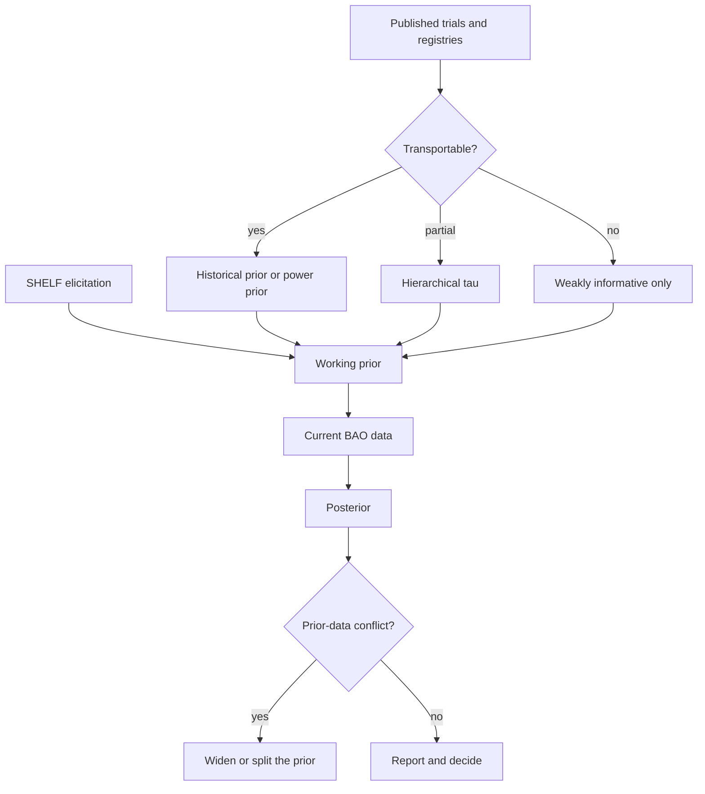
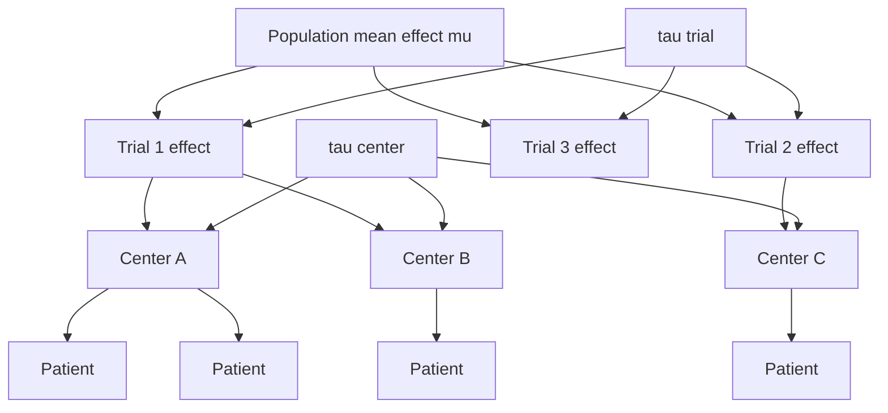

# Priors: Eliciting Clinical Knowledge, Literature, and Hierarchical Structure

## Opening

A 74-year-old with a basilar-artery occlusion has been on the table of a debate for twenty years. Everyone in the room has a prior on whether endovascular therapy helps. Almost no one can write it as a distribution, say where it came from, or notice when the next ten patients should be allowed to move it. That is not a personality problem. It is a missing piece of craft.

## Learning objectives

After working this chapter you should be able to:

- Name the common prior families — informative, weakly informative, skeptical, enthusiastic, hierarchical — and pick one on purpose.
- Elicit a prior from experts in a SHELF-style conversation without laundering a hope into a Beta.
- Use a published control arm or a previous trial as a prior, and say what historical borrowing is doing when you do.
- Recognize prior–data conflict, and know what a default `brms` prior is defending you against.
- Defend, ethically, the use of a skeptical prior in a rare-disease or high-harm setting, including basilar occlusion.

## Clinical vignette

Dr. A is writing a single-center protocol for endovascular therapy in basilar-artery occlusion (BAO). The last decade has produced more light than the two before it, but the room is still split. Dr. A has five colleagues. One treated through every negative-leaning era and “knows” EVT works. One remembers futile recanalizations and locked-in survivors and wants a trial that can still say no. One wants to borrow the anterior-circulation posterior wholesale. One wants a flat prior “so the data can speak.” One asks whether a hierarchical model can let a high-volume center keep its own intercept without pretending the other centers do not exist.

Before any software, write:

1. What parameter is the prior *on* — the log-odds of mRS 0–2 under EVT, a risk difference, a treatment-by-occlusion interaction?
2. What would a skeptical prior look like, in words a family would understand?
3. What published information are you willing to treat as a prior rather than as the current likelihood?
4. If the first twenty patients come in looking better than your prior, how will you know whether that is signal or conflict?

**Teaching** quantities you may use later: untreated functional independence (mRS 0–2) after BAO in a mixed-severity cohort, on the order of 20 percent; a hopeful EVT increment of 10 to 15 absolute points; a skeptical increment centered at 0 with most of its mass inside ±10 points. These are teaching numbers for the craft of prior-writing. They are not a meta-analysis.

## A prior is a model of what the next datum is allowed to move

Chapter 1 treated a pre-test probability as a prior. That was enough for a binary state. Treatment effects, center intercepts, and rare-disease response rates are not binary states. A prior on them is a full distribution: a location (what you think), a scale (how hard you are to move), and a shape (whether you have already ruled out miracles and catastrophes).

The ethical content of a prior is almost entirely in the scale. A tight prior around a favorite number is a way of not running the study. A prior so vague that it puts a third of its mass on cure and a third on slaughter is a way of pretending you have never walked a ward. Weakly informative priors live between those failures. They regularize. They do not answer the scientific question in advance.

!!! tip "Clinical Pearl"
    When someone says “I don’t want to use a prior,” they want to use a flat one. Flat is a prior. It says that a 90-point treatment effect and a 2-point treatment effect were, yesterday, equally plausible. Ask whether they would prescribe on that basis.

## Prior families, in the language of a stroke service

**Informative.** A distribution that encodes substantial external knowledge. A Beta(40, 160) on untreated mRS 0–2 in BAO says you already have 200 patients’ worth of belief at a 20 percent mean. Use it when that belief is real: a registry you trust, a control arm you did not invent. Do not use it when it is a senior person’s reputation.

**Weakly informative.** A distribution that rules out the physically absurd and otherwise stays quiet. On the log-odds scale of a logistic model, a Normal(0, 1.5) or Student-t(3, 0, 2.5) prior on a coefficient is in this family. It says that a change of several logits is possible and a change of twenty logits is not. It is the default this book will reach for when the scientific claim should be carried by the current data.

**Skeptical.** A distribution centered on no effect, tight enough to require real data to overcome. A Normal(0, 0.2) on a log-odds treatment coefficient says you expect the odds ratio near 1 and you will not declare victory because ten patients smiled. Skeptical priors are not nihilism. They are a pre-commitment against overreading small samples, and they are often the ethical prior when the treatment can lock a person in.

**Enthusiastic.** The mirror image: centered on a clinically important benefit, sometimes used as a *sensitivity analysis* to ask whether even a hopeful starting point is beaten down by bad data. An enthusiastic prior is a stress test. It is a poor primary prior for a trial you intend to believe.

**Hierarchical.** A prior on a prior. Center-specific intercepts drawn from a common distribution; trial-specific treatment effects drawn from a population of effects. Hierarchical structure is how you borrow strength without pretending every patient, center, or generation of devices was the same experiment.

| Family | Typical job | Teaching shape on a log-odds treatment effect | Danger if misused |
|---|---|---|---|
| Informative | Bring a registry or previous trial in as knowledge | Normal(0.4, 0.15) | Launders hope or an incomparable population |
| Weakly informative | Regularize; let the current data speak | Normal(0, 1.5) or t(3, 0, 2.5) | Still too wide on tiny samples if tails matter |
| Skeptical | Require evidence to overcome “no effect” | Normal(0, 0.2) | Can delay a real benefit in a rare, grave disease |
| Enthusiastic | Sensitivity analysis; “even if we hoped…” | Normal(0.5, 0.2) | As a primary prior, it is advocacy |
| Hierarchical | Share strength across centers, trials, subgroups | \(\theta_j \sim \operatorname{Normal}(\mu, \tau)\) | Shrinkage can hide a truly different site |

!!! note "Mathematical Detail"
    In a logistic model for functional independence,

    \[
    \operatorname{logit} P(y_i = 1) = \alpha + \beta\, x_{\text{EVT},i} + \ldots
    \]

    a prior \(p(\beta)\) is a statement about the log odds ratio. A Normal(0, 0.2) skeptical prior puts roughly 95 percent of its mass on odds ratios between \(e^{-0.4}\) and \(e^{0.4}\), about 0.67 to 1.5. That is a *clinical* statement: you do not expect a miracle and you do not expect a massacre. Write the implied odds-ratio interval every time you choose a prior on \(\beta\). If you cannot live with the interval, you chose the wrong scale.

## Eliciting priors from experts, briefly and without theater

The Sheffield Elicitation Framework (SHELF) is a structured conversation, not a séance. The version a stroke group can actually finish in an hour looks like this.

1. **Define the quantity.** Not “does EVT work.” A number: the absolute difference in mRS 0–2 at 90 days, in patients with BAO, NIHSS ≥ 10, treated within 12 hours, with modern devices. If two experts are eliciting different quantities, their priors cannot be averaged.

2. **Ask for plausible bounds first**, not for the mean. “Give me a number so low you would be surprised, and a number so high you would be surprised.” Surprise, not impossibility. This anchors the scale before anyone commits to a favorite point.

3. **Ask for a median**, then for a 25th and 75th percentile. People are better at quartiles than at variances.

4. **Show the implied distribution back**, as a picture and as implied counts (“you just said that in 100 such patients, EVT would create between 2 and 18 extra independent walkers”). Experts revise when they see the picture. That revision is the point of elicitation, not a failure of it.

5. **Keep dissent.** If the enthusiastic operator and the skeptical intensivist do not agree, do not average them into a false consensus. Carry two priors into the analysis and report both posteriors. A protocol that cannot survive two honest priors is a protocol that was hoping to hide behind one.

SHELF has more apparatus — chips, tertiles, behavioral versus mathematical aggregation. Use it when the prior will decide whether a rare-disease trial stops. Do not use it to decorate a grant.

Two failure modes dominate local elicitation. The first is the *dominant voice*: the highest-volume operator speaks first, and everyone else’s quartiles migrate. Silent, written judgments collected before discussion, then displayed together, prevent that migration. The second is the *wrong population*: experts elicit a prior for “BAO I would take to the lab,” which is already conditioned on their selection, and the protocol then applies it to “BAO that arrives at the door.” Those are different parameters. The first will look more optimistic, because the hopeless cases have already been removed. Write the inclusion rule on the whiteboard before anyone names a number. If the rule changes, the prior is void and you elicit again. Fifteen extra minutes. Cheaper than a protocol that answers a question you will not enroll.

!!! warning "Common Pitfall"
    Eliciting only a mean (“I think the benefit is 12 points”) produces a point, not a prior. A point prior cannot be updated. It can only be agreed with. Always elicit a width.

## Literature as a prior, and the ethics of historical borrowing

A published control arm is a tempting Beta. A previous randomized trial is a tempting Normal on \(\beta\). Using them as priors is legitimate *and* it is a modeling choice about transportability.

**When borrowing is honest.** The previous patients match on the effect modifiers you actually believe — time, severity, device generation, collateral biology, outcome definition. The previous analysis is not being double-counted as both prior and current likelihood. The borrowed information is down-weighted (power priors, commensurate priors, hierarchical \(\tau\)) so that conflict can still be seen.

**When borrowing is laundering.** The anterior-circulation EVT effect is dropped onto BAO because “stroke is stroke.” A 1990s recanalization series is treated as 200 patients’ worth of modern-device evidence. A positive subgroup from a negative trial is used as an informative prior for the next positive claim. These moves feel Bayesian because they use the word prior. They are, in fact, a way of carrying a conclusion across a transportability gap that the data have not closed.

A power prior multiplies the historical likelihood by a weight \(a_0 \in [0,1]\). At \(a_0 = 1\) you have pooled the eras. At \(a_0 = 0\) you have ignored them. The scientific argument is about \(a_0\), not about whether “Bayes allows borrowing.” Bayes allows anything you put in the integral. The craft is defending the weight.



## Prior–data conflict

Conflict is not a crisis. It is a diagnostic.

You wrote a skeptical Normal(0, 0.2) on the EVT log-odds ratio. The first twenty recanalized BAO patients walk out at a **teaching** 45 percent independence rate against a **teaching** 20 percent baseline. A likelihood that strong will move even a skeptical prior, but it will also leave a trail: posterior predictive checks that look nothing like the prior predictive, a Bayes factor that is trying to tell you the prior and the data want different neighborhoods, a prior-to-posterior shift that is large relative to the prior scale.

Three responses, in order of honesty:

1. **Believe the conflict and widen.** Your skeptical scale was a pre-commitment against noise, not a theological claim. Twenty striking outcomes are not noise. Report the posterior under the pre-specified prior *and* under a weaker one.
2. **Split the model.** The conflict may be telling you the parameter was wrongly defined. Benefit in short-onset, high-NIHSS, recanalized patients is not the same parameter as benefit in unselected BAO. A hierarchical split is more honest than a single \(\beta\) in pain.
3. **Do not silently replace the prior with the data.** That is double dipping. It produces the posterior you wanted and a type I error you can no longer name.

!!! warning "Common Pitfall"
    “The posterior was sensitive to the prior, therefore we report the flat-prior analysis” is not robustness. It is selecting the prior after seeing which one agrees with the claim. Pre-specify the primary prior, and pre-specify the sensitivity priors, including an enthusiastic one. Show them all.

## Default priors in brms, and why they are not a cop-out

`brms` will not let you pretend you have no prior. If you stay silent it still regularizes intercepts and group-level SDs with weakly informative half-t defaults. The factory default for class = "b" (population coefficients) is an improper flat prior. That is not hygiene for a treatment effect, and it fails under separation. Specify scientific coefficients yourself. `prior = NULL` is the flat-coefficient analysis; name it that way.

Defaults are not scientific claims about BAO. They are numerical hygiene. The moment the coefficient *is* the scientific claim — the EVT effect — you specify the prior yourself, in writing, with the implied odds-ratio interval attached.

| Parameter in a logistic mRS 0–2 model | Recommended teaching default | Implied attitude | When to replace it |
|---|---|---|---|
| Intercept \(\alpha\) (on the intercept-adjusted scale `brms` uses) | `student_t(3, 0, 2.5)` | Weakly informative on the log-odds of the outcome at centered covariates | You have a strong registry baseline |
| Treatment coefficient \(\beta_{\text{EVT}}\) | `normal(0, 1)` as a weak default; `normal(0, 0.2)` if skeptical | Weak: large effects allowed. Skeptical: large effects must be earned | Rare disease with grave harm: prefer skeptical |
| Other binary covariates (age band, NIHSS band) | `normal(0, 1)` | A log-odds shift of 2 is already huge | Known strong prognostic factors: informative |
| Center intercepts (varying) | `student_t(3, 0, 2.5)` on \(\tau\) | Some between-center scatter, not infinite | Few centers: \(\tau\) needs a tighter prior |
| Residual / observation | None in Bernoulli | — | Do not add one |

These are **teaching** defaults for this book’s logistic examples. They are aligned in spirit with Gelman’s weakly informative recommendations and with `brms`’s own factory settings. They are not a regulatory submission.

## Ethics of skeptical priors in rare, grave disease

BAO is the teaching case because every ethical tension is lit.

A flat prior in a small BAO series will, on a lucky draw, declare a large benefit. Families will hear that declaration. A service will change its night-time posture. If the draw was luck, you have institutionalized a harmful certainty. A skeptical prior is, in that world, a protection of future patients from your sample-size misfortune.

The other tension is real too. A *too-tight* skeptical prior in a disease with 80 percent devastating outcomes can delay adoption of a therapy that actually works, and the patients who pay are the ones who cannot wait for the next trial. This is not solved by slogans about “letting the data speak.” It is solved by (i) pre-specifying the skeptical scale so that a real effect of plausible size *can* overcome it at a planned \(N\), (ii) committing to hierarchical borrowing from related but not identical evidence (anterior circulation, later generations of devices) at a declared \(a_0\) or \(\tau\), and (iii) reporting the posterior probability of a clinically meaningful benefit, not a p-value against a null nobody believes.

The enthusiastic operator in Dr. A’s room is not the villain. Unwritten enthusiasm is the villain. Write the enthusiastic prior as a sensitivity analysis. If even that prior is crushed by the data, the argument is over. If only the enthusiastic prior survives, you have learned that the claim is prior-driven, which is itself a result.

!!! tip "Clinical Pearl"
    A skeptical prior is an ethical instrument when harm is irreversible and samples are small. It is an ethical failure when it is used, after the fact, to discount a pre-specified benefit you did not want to find.

## Hierarchical structure: trial, center, patient

A single prior on a single \(\beta\) is a story about one population. BAO data do not come that way. They come from patients inside centers inside trials (or inside years of a registry). Hierarchical priors are how you tell the truth about that nesting.



The picture is the model. Patients in the same center share an intercept they have not earned individually. Centers in the same trial share a device generation and a protocol. Trials share a disease and not much else. The \(\tau\) parameters are the prior on how much sharing is allowed. A \(\tau\) near zero is complete pooling. A \(\tau\) that is huge is no pooling. Estimating \(\tau\) is the compromise that makes “our center is different” a testable claim rather than a personality.

Shrinkage is the visible consequence. A small center with a flashy 8/10 independence rate is pulled toward the population mean. That pull feels unfair to the operator who did those ten cases. It is the price of not letting a noisy 80 percent become a legend. If the center *is* truly different — a different selection policy, a different time-to-puncture — the right move is a better covariate, not a demand to turn \(\tau\) off.

## R: a `brms` prior specification for mRS 0–2

The block below specifies, but does not pretend to fit, a logistic model for functional independence after BAO. The treatment coefficient carries an explicit skeptical prior. The rest is weakly informative. Comments record the implied odds-ratio interval. Replace the teaching data frame with your own when you have permission to analyze it.

!!! example "R Deep Dive"
    This is a specification, not a fitted object. Uncomment `brm()` only on data you are allowed to analyze. The scientific content is the `prior()` calls and the two sensitivity twins written underneath them. If a protocol cannot show those three blocks, it does not yet have a prior.

```r
# Teaching specification only. This does not fit a real BAO trial.
# Logistic model for mRS 0-2. Skeptical prior on the EVT coefficient.
# Requires: brms, a data frame `bao` with columns mrs02 (0/1) and evt (0/1),
# plus optional center and nihss.

set.seed(2026)

library(brms)

# Implied OR interval for Normal(0, 0.2): roughly exp(±1.96*0.2) ≈ 0.68 to 1.48
priors_bao <- c(
  prior(student_t(3, 0, 2.5), class = "Intercept"),
  prior(normal(0, 0.2),       class = "b", coef = "evt"),
  prior(normal(0, 1),         class = "b"),
  prior(student_t(3, 0, 2.5), class = "sd")  # if a random intercept is present
)

# Formula with a hierarchical center intercept. Drop (1|center) if one site.
f_bao <- bf(mrs02 ~ evt + scale(nihss) + (1 | center))

# Specification only — do not run unless `bao` exists and is yours to analyze.
# fit_bao <- brm(
#   formula = f_bao,
#   data    = bao,
#   family  = bernoulli(link = "logit"),
#   prior   = priors_bao,
#   seed    = 2026,
#   cores   = 4
# )

print(priors_bao)

# Sensitivity pair you should pre-specify in the same protocol
priors_weak <- c(
  prior(student_t(3, 0, 2.5), class = "Intercept"),
  prior(normal(0, 1),         class = "b", coef = "evt"),
  prior(normal(0, 1),         class = "b")
)
priors_enth <- c(
  prior(student_t(3, 0, 2.5), class = "Intercept"),
  prior(normal(0.4, 0.2),     class = "b", coef = "evt"),  # hopeful OR ~ 1.5
  prior(normal(0, 1),         class = "b")
)
```

Three comments that belong in the protocol, not only in the script. First, `normal(0, 1)` on the remaining coefficients is a weak default, not a claim that NIHSS does not matter; if you have a strong prognostic prior, write it. Second, the enthusiastic and weak priors are for sensitivity, and they are written *before* `bao` is opened. Third, if you do run the model, the quantity to report to Dr. A’s committee is not “the coefficient was significant.” It is \(P(\beta > \log 1.1 \mid y)\) — the posterior probability of at least a 10 percent odds-ratio benefit — under each pre-specified prior.

### For the biostatistician / methodologist

Weakly informative priors on coefficients are a form of penalized likelihood with a proper posterior. That is enough to justify them as defaults. It is not enough to justify them as *identified information* in a sparse logistic model with complete separation. In those cases the prior is doing identifiable work, and you should say so: the posterior mean is a shrinkage estimator, and the implied penalty is part of the scientific claim.

Historical borrowing has a frequentist shadow. A power prior with fixed \(a_0\) inflates the type I error relative to a trial that ignores history, which is exactly the frequentist translation of “you brought information in.” Hierarchical models with a hyperprior on \(\tau\) or on \(a_0\) buy some robustness at the cost of a harder computational and rhetorical life. For a rare-disease protocol, that trade is usually worth it. For a large, self-sufficient trial, it may not be. Choose on purpose.

Prior predictive checks belong in the same commit as the prior. Draw \(\beta\) from `priors_bao`, push it through the logistic, and look at the implied distribution of mRS 0–2 rates under EVT and control. If the prior predictive puts half its mass above 90 percent independence in unselected BAO, you did not write a skeptical prior. You wrote a hope with a small standard deviation.

## Worked solution to the opening vignette

1. **The parameter.** Write a prior on \(\beta\), the log-odds ratio for mRS 0–2 associated with EVT, in a declared population (severity, time, device). A prior on “whether EVT works” is not a prior. If the committee also cares about the untreated baseline, give \(\alpha\) its own informative prior from a registry and do not hide a baseline argument inside \(\beta\).

2. **A skeptical prior a family can hear.** “We are starting from the position that pulling the clot may not change the chance of independence by much, and we will move off that position only if the patients in front of us force us to. In numbers, we begin as if the odds of walking out independently are about the same with or without the procedure, and we will not let a handful of good stories convince us otherwise.” Then show the implied interval, **teaching**: odds ratios roughly 0.7 to 1.5 under Normal(0, 0.2).

3. **What the literature is allowed to be.** Modern randomized BAO evidence, if the committee agrees it is the same parameter, can be a hierarchical neighbor or a power prior with a declared \(a_0\). Anterior-circulation EVT is a different parameter and belongs, at most, in a hierarchical model with a \(\tau\) large enough to let BAO be its own disease. Device-era series from the 2000s are background, not 200 extra patients.

4. **Conflict.** Pre-specify a prior predictive interval for the EVT-arm independence rate. If the first twenty patients fall outside it, do not quietly refit. Report the pre-specified posterior, report the weak-prior posterior, and convene the same five colleagues to decide whether the parameter split (time, recanalization, severity) rather than the prior was wrong. The enthusiastic colleague does not get to replace the primary prior. He does get his sensitivity analysis printed in the same table.

Dr. A’s protocol, in one paragraph: a logistic model for mRS 0–2, hierarchical by center if more than one site, weakly informative priors on nuisance coefficients, a skeptical Normal(0, 0.2) on \(\beta_{\text{EVT}}\) as primary, weak and enthusiastic twins as sensitivity, a power-prior weight on any borrowed trial declared in advance, and a stopping or reporting rule written in posterior probabilities of a clinically meaningful benefit. That protocol can be attacked on its choices. It cannot be attacked for not having any.

## Exercises

1. Translate a Normal(0, 0.4) prior on a log-odds treatment effect into an approximate 95 percent interval on the odds-ratio scale. Is this skeptical, weak, or enthusiastic for EVT in BAO, and why?

2. Elicit, from yourself, a SHELF-style prior on the absolute risk difference for independence in BAO EVT. Write bounds, median, quartiles. Then name the Beta or Normal that roughly matches. What did you discover about your own width?

3. A colleague wants \(a_0 = 1\) for an anterior-circulation trial used as a prior for BAO. Write a six-sentence dissent that does not say “Bayes is subjective.”

4. Using the `priors_bao` block, add an informative prior on the intercept that corresponds to a **teaching** untreated independence rate of about 0.20 with a prior sample size of 50. What `prior()` call did you write, and on which scale?

5. Invent a prior–data conflict: your skeptical prior versus a **teaching** 12/20 independence rate under EVT. What three numbers would you show the committee, and which number are you forbidden to hide?

6. **Technical.** Write the joint prior for a two-level model \(\beta_j \sim \operatorname{Normal}(\mu, \tau)\), \(\mu \sim \operatorname{Normal}(0, 1)\), \(\tau \sim \operatorname{HalfStudentT}(3, 0, 2.5)\). Explain in one paragraph what happens to a single-center \(\beta_j\) as \(\tau \to 0\) and as \(\tau \to \infty\). (Hint only: complete pooling versus no pooling.)

## Further reading

- O’Hagan A, Buck CE, Daneshkhah A, et al. *Uncertain Judgements: Eliciting Experts’ Probabilities*. Wiley; 2006. SHELF in full; steal the conversation design, not the bureaucracy.
- Gelman A, Jakulin A, Pittau MG, Su Y-S. A weakly informative default prior distribution for logistic and other regression models. *Ann Appl Stat.* 2008;2(4):1360–1383. The intellectual parent of the default table above.
- Ibrahim JG, Chen M-H. Power prior distributions for regression models. *Stat Sci.* 2000;15(1):46–60. Historical borrowing with a weight you have to defend.
- Spiegelhalter DJ, Abrams KR, Myles JP. *Bayesian Approaches to Clinical Trials and Health-Care Evaluation*. Wiley; 2004. Skeptical and enthusiastic priors as a designed pair, not as temperaments.
- Bürkner P-C. brms: An R package for Bayesian multilevel models using Stan. *J Stat Softw.* 2017;80(1):1–28. The interface this chapter’s code assumes.
- FDA. Guidance for the Use of Bayesian Statistics in Medical Device Clinical Trials. 2010. What a regulator thinks a prior is allowed to be.
- Liu X, Dai Q, Ye R, et al. Endovascular treatment versus standard medical treatment for vertebrobasilar artery occlusion (BEST): an open-label, randomised controlled trial. *Lancet Neurol.* 2020;19(2):115–122. Public design facts for the BAO debate; do not scrape outcomes into a prior without a transport argument.
- Langezaal LCM, van der Hoeven EJRJ, Mont’Alverne FJA, et al. Endovascular therapy for stroke due to basilar-artery occlusion. *N Engl J Med.* 2021;384(20):1910–1920. BASICS; same caveat, and a reminder that a “neutral” frequentist headline can sit on top of a posterior that is not.

!!! success "Key Takeaway"
    A prior is a distribution you can criticize: a location, a scale, and a provenance. Weakly informative defaults keep the mathematics from falling over; skeptical priors keep small samples from becoming policy; hierarchical priors keep centers and trials from pretending they were one experiment. Literature is usable as a prior only after a transportability argument, and prior–data conflict is a diagnosis, not an excuse to refit in private. Write the primary prior, write its sensitive twins, and write the implied odds-ratio interval in language a family could survive hearing. That is the whole craft.
