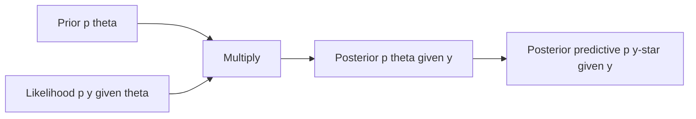
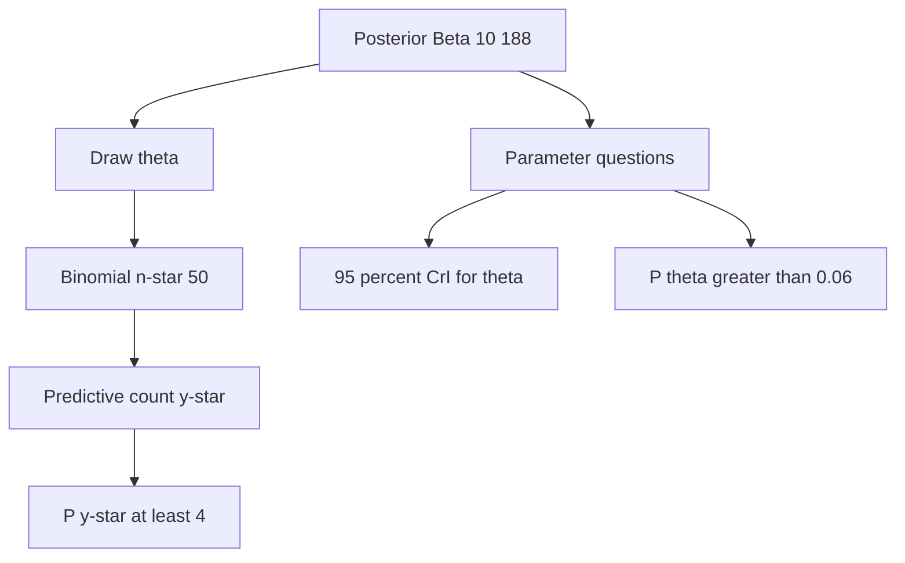

# Likelihoods, Conjugate Models, and Closed-Form Updates

## Opening

The night float slides a printout across the desk: forty-eight consecutive alteplase-treated patients, two with symptomatic intracranial hemorrhage. Quality wants a Bayesian update of the hemorrhage rate before the next credentialing cycle. You already hold a prior. The data have a likelihood. No Markov chain is required, and pretending one is required is a form of statistical theater.

## Learning objectives

After working this chapter you should be able to:

- Write a likelihood for binomial, Poisson, and Gaussian observations and say what each factor is doing to the prior.
- Recognize a conjugate pair, update it by arithmetic, and explain when conjugacy is a teaching device rather than a modeling constraint.
- Compute a closed-form Beta–Binomial posterior for a symptomatic ICH rate after a new case series, and distinguish the posterior from the posterior predictive.
- Produce a posterior predictive distribution for the next \(n^\star\) patients and use it to answer a decision question, not merely a parameter question.
- Translate a conjugate analysis into a `brms` specification so the same problem can later grow random effects or a nonconjugate likelihood.

## Clinical vignette

A comprehensive stroke center has treated 48 patients with intravenous alteplase in the past quarter. Two developed symptomatic intracranial hemorrhage (sICH) by the local operational definition (any PH2 plus a 4-point NIHSS worsening attributed to the bleed). The hospital’s historical prior, assembled from an earlier internal audit plus a skeptical reading of the published tPA literature, is a Beta(\(8\), \(142\)) distribution on the sICH probability \(\theta\). That prior has a mean of about \(5.3\%\) and is equivalent to \(150\) pseudo-observations.

The quality committee asks four questions, in this order:

1. What is the posterior for \(\theta\) after the new series?
2. What is a \(95\%\) equal-tailed credible interval for \(\theta\)?
3. What is the probability that \(\theta\) exceeds \(6\%\), the committee’s internal “review threshold”?
4. If the next quarter treats another \(50\) patients under the same protocol, what is the predictive probability of seeing \(4\) or more sICH events?

Do not fit a sampler yet. Do the arithmetic. Then decide whether the arithmetic is enough.

Before any software, write four sentences of your own: what event \(\theta\) is the probability of; whether the \(48\) patients are exchangeable with the historical series that built the prior; whether the committee asked a parameter question or a predictive question; and what you will refuse to conclude from a posterior mean near \(5\%\).

## Likelihood first, conjugacy second

A likelihood is not a story about how the world generated the data. It is a function of the unknown, evaluated at the data you actually observed. For a sequence of independent Bernoulli trials with common success probability \(\theta\),

\[
p(y \mid \theta) = \theta^{s}(1-\theta)^{n-s},
\]

where \(s\) is the number of events in \(n\) trials. The binomial coefficient \(\binom{n}{s}\) does not depend on \(\theta\) and can be dropped from the posterior; it matters only if you need a proper marginal likelihood. That is the first practical lesson: most of the algebra that frightens residents is a constant with respect to the parameter of interest.

The same discipline applies to counts and continuous measurements. A Poisson likelihood for event counts \(y_i\) with rate \(\lambda\) (or with rate \(\lambda t_i\) if exposure times differ) is

\[
p(y \mid \lambda) = \prod_i \frac{\lambda^{y_i} e^{-\lambda}}{y_i!}.
\]

A Gaussian likelihood for a mean \(\mu\) with known variance \(\sigma^2\) is

\[
p(y \mid \mu) \propto \exp\left(-\frac{n}{2\sigma^2}(\bar y - \mu)^2\right).
\]

Each of these is a statement about how the data *reweight* hypotheses. The prior is the weight you arrived with. The posterior is the weight you leave with. Conjugacy is the special case in which the reweighting stays inside a named family, so the update is a change of hyperparameters rather than a change of functional form.



That diagram is the entire chapter in four boxes. Everything below is bookkeeping and judgment.

## Why conjugacy still matters

Conjugacy has a bad reputation among people who learned Bayesian computation after 2012. The reputation is half earned. Real neurologic data are clustered, censored, missing-not-at-random, and measured with error. A Beta prior on a single proportion cannot represent a network of eight thrombectomy centers with different case-mix. Hamiltonian Monte Carlo exists for a reason, and later chapters use it without apology.

The other half of the reputation is fashion. Closed-form updates remain useful for four independent reasons.

**Speed of thought.** A Beta–Binomial update can be done on a whiteboard during a morbidity conference. If you cannot do the one-parameter problem by hand, you will not notice when the eight-parameter sampler has answered the wrong question.

**Calibration of intuition.** The posterior mean of a Beta(\(a+s\), \(b+n-s\)) is a precision-weighted average of the prior mean and the sample proportion. Seeing that weighted average in arithmetic prepares you to recognize partial pooling when it reappears as a hierarchical model.

**Exact predictive distributions.** The Beta–Binomial predictive, the Gamma–Poisson (negative binomial) predictive, and the Normal–Normal predictive are available in closed form. Posterior predictive checks for simple models should not require a \(4000\)-iteration warmup.

**Reference solutions.** When you later fit the same likelihood in `brms`, the conjugate posterior is the answer key. If the sampler disagrees with the answer key by more than Monte Carlo error, the bug is in the code, not in Bayes’ theorem.

There is a fifth reason that belongs to teaching rather than to production. Residents who first meet Bayes as “Stan plus a forest plot” never learn what a likelihood *is*. They treat the sampler as a black box that emits intervals. Walking through a Beta update forces the factorization \(p(\theta \mid y) \propto p(y \mid \theta)\, p(\theta)\) to become a sentence they can say aloud. That sentence is the only protection against a later, more elaborate model that has quietly changed the likelihood while keeping the same adjective (“Bayesian”).

!!! tip "Clinical Pearl"
    Conjugacy is a computational convenience, not a scientific claim. The scientific claim is the likelihood: independent Bernoulli trials with a stable \(\theta\). If that claim is false — protocol drift, changing case-mix, a new tenecteplase vial size — no conjugate prior will rescue you.

## The Beta–Binomial pair

A Beta(\(a\), \(b\)) density on \(\theta \in (0,1)\) is

\[
p(\theta) = \frac{\Gamma(a+b)}{\Gamma(a)\Gamma(b)}\,\theta^{a-1}(1-\theta)^{b-1}.
\]

Multiply by the binomial likelihood \(\theta^{s}(1-\theta)^{n-s}\) and the posterior is Beta(\(a+s\), \(b+n-s\)). The update rule is addition. Prior successes plus observed successes. Prior failures plus observed failures.

The posterior mean, mode, and variance are

\[
\mathbb{E}[\theta \mid y] = \frac{a+s}{a+b+n}, \qquad
\mathrm{Mode}(\theta \mid y) = \frac{a+s-1}{a+b+n-2}\ (a+s>1),\qquad
\mathrm{Var}(\theta \mid y) = \frac{\tilde a\,\tilde b}{(\tilde a+\tilde b)^2(\tilde a+\tilde b+1)},
\]

where \(\tilde a = a+s\) and \(\tilde b = b+n-s\). The mean is the quantity you quote to a committee. The mode is closer to the MLE when the prior is weak. The variance tells you whether the interval you are about to report is a measurement or a confession of ignorance.

### Teaching numbers for the vignette

Label these as teaching numbers. They are invented for the exercise; they are not an audit of any real hospital.

- Prior: Beta(\(8\), \(142\)). Prior mean \(8/150 = 0.0533\). Prior pseudo-count \(150\).
- Data: \(s = 2\) events in \(n = 48\) patients. Sample proportion \(2/48 = 0.0417\).
- Posterior: Beta(\(10\), \(188\)). Posterior mean \(10/198 = 0.0505\).

The data moved the mean by less than three tenths of a percentage point. That is not a failure of Bayesian updating. It is the prior doing the job it was hired to do. Forty-eight patients with two events are compatible with a wide range of \(\theta\); one hundred fifty pseudo-observations are not easily overthrown by two events.

!!! warning "Common Pitfall"
    Residents often treat a “historical rate of \(6\%\)” as a point-mass prior. A point mass does not update. If the committee’s prior knowledge is worth anything, encode it as a Beta with a finite pseudo-count. If it is worth nothing, say so and use a weakly informative Beta(\(1\), \(1\)) or Beta(\(2\), \(2\)). Do not hide a dogma inside a decimal.

### Credible interval and tail probability

The equal-tailed \(95\%\) credible interval is the \(0.025\) and \(0.975\) quantiles of Beta(\(10\), \(188\)). In R this is `qbeta(c(0.025, 0.975), 10, 188)`, which returns approximately \(0.025\) to \(0.085\) on these teaching numbers. The posterior probability that \(\theta > 0.06\) is `1 - pbeta(0.06, 10, 188)`, approximately \(0.27\).

Notice what you have and have not shown. You have not shown that the hospital is “safe.” You have shown that, under this prior and this likelihood, about one quarter of the posterior mass still sits above the review threshold. A frequentist exact test of \(H_0: \theta = 0.06\) against this sample would produce a large \(p\)-value and a tempting misreading (“no evidence of a problem”). The posterior tail is the quantity the committee actually asked for.

## Predictive distributions are not posteriors

The posterior \(p(\theta \mid y)\) is a distribution over a parameter. The next quarter’s hemorrhage count is a random variable. The object that answers question 4 is the posterior predictive

\[
p(y^\star \mid y) = \int p(y^\star \mid \theta)\, p(\theta \mid y)\, d\theta.
\]

For a Beta–Binomial model with a future sample of size \(n^\star\), the integral is available in closed form:

\[
p(y^\star = k \mid y) = \binom{n^\star}{k} \frac{B(a+s+k,\ b+n-s+n^\star-k)}{B(a+s,\ b+n-s)},
\]

where \(B\) is the beta function. Equivalently, \(\theta \sim \mathrm{Beta}(\tilde a, \tilde b)\) and \(y^\star \mid \theta \sim \mathrm{Binomial}(n^\star, \theta)\). The extra-binomial variance relative to a plug-in binomial at \(\hat\theta\) is the price of not pretending you know \(\theta\).

On the teaching numbers, \(n^\star = 50\), \(\tilde a = 10\), \(\tilde b = 188\). The predictive probability of \(4\) or more events is obtained by summing or, more stably, by simulating \(\theta\) from the posterior and then \(y^\star\) from the binomial. Either way the probability is on the order of \(0.20\) — not rare, not inevitable. That is the number to take to the committee. A point prediction of “\(2.5\) hemorrhages” is a mean, not a plan.



!!! note "Mathematical Detail"
    The Beta–Binomial predictive is overdispersed relative to \(\mathrm{Binomial}(n^\star, \hat\theta)\). The predictive variance is \(n^\star \mu (1-\mu)\bigl(1 + (n^\star-1)\rho\bigr)\), where \(\mu = \tilde a/(\tilde a+\tilde b)\) and \(\rho = 1/(\tilde a+\tilde b+1)\). For \(\tilde a+\tilde b = 198\) and \(n^\star = 50\), the inflation factor is modest but visible. For a rare-disease prior with \(\tilde a+\tilde b = 12\), the inflation dominates. Quoting a binomial interval around a posterior mean is a silent understatement of uncertainty.

## Poisson–Gamma and Normal–Normal

The same arithmetic appears under other names.

### Counts: Gamma prior, Poisson likelihood

If \(y \sim \mathrm{Poisson}(\lambda)\) and \(\lambda \sim \mathrm{Gamma}(\alpha, \beta)\) in the shape-rate parameterization, the posterior is Gamma(\(\alpha + y\), \(\beta + 1\)). For \(n\) independent counts the posterior is Gamma(\(\alpha + \sum y_i\), \(\beta + n\)). If each observation has exposure \(t_i\) (person-years, scanner-hours, door-to-needle opportunities), replace \(n\) by \(\sum t_i\).

This is the natural conjugate model for aneurysmal SAH admissions per month, for decompressive hemicraniectomy counts, or for contrast-extravasation events on a CTA log. The posterior predictive is negative binomial. That fact is why count data in stroke registries look overdispersed the moment you stop conditioning on a known rate.

A teaching walk-through, so the algebra is not left hanging. Prior Gamma(\(4\), \(2\)) on a monthly SAH-transfer rate (mean \(2\), a moderately tight historical claim). One month produces \(y = 5\) transfers. Posterior Gamma(\(9\), \(3\)), mean \(3\). The data moved the mean by a full transfer per month because the prior was worth only two months of pseudo-exposure. The predictive probability of \(6\) or more transfers next month is the negative-binomial tail, not a Poisson tail at \(3\). Quote the tail to the transfer-center coordinator. A mean of \(3\) is a staffing rumor.

### Continuous means: Normal prior, Normal likelihood

If \(y_i \sim \mathrm{N}(\mu, \sigma^2)\) with \(\sigma^2\) known and \(\mu \sim \mathrm{N}(\mu_0, \tau_0^2)\), the posterior is Normal with

\[
\mu_n = \frac{\frac{\mu_0}{\tau_0^2} + \frac{n\bar y}{\sigma^2}}{\frac{1}{\tau_0^2} + \frac{n}{\sigma^2}}, \qquad
\frac{1}{\tau_n^2} = \frac{1}{\tau_0^2} + \frac{n}{\sigma^2}.
\]

Precision adds. The posterior mean is a precision-weighted average of the prior mean and the sample mean. Replace “precision” with “sample size” and you have already understood hierarchical shrinkage. The unknown-variance case (Normal–Inverse-Gamma, or a \(t\) marginal) is the same idea with one extra hyperparameter.

A teaching application: door-to-needle time modeled as approximately Gaussian on the log scale, prior mean \(50\) minutes on the original scale after exponentiation, new month of \(n = 30\) cases with sample mean \(44\) minutes. The posterior mean sits between \(44\) and \(50\), closer to \(44\) as \(n\) grows or as the prior precision falls. Quote the posterior, not the monthly trophy number.

| Pair | Observation | Prior | Posterior update | Predictive family |
| --- | --- | --- | --- | --- |
| Beta–Binomial | \(s\) events in \(n\) trials | Beta(\(a,b\)) | Beta(\(a+s,\ b+n-s\)) | Beta–Binomial |
| Gamma–Poisson | counts \(y_i\), exposures \(t_i\) | Gamma(\(\alpha,\beta\)) shape-rate | Gamma(\(\alpha+\sum y_i,\ \beta+\sum t_i\)) | Negative binomial |
| Normal–Normal | \(y_i\) with known \(\sigma^2\) | \(\mathrm{N}(\mu_0,\tau_0^2)\) | Precision-weighted Normal | Normal, wider than plug-in |

| Object | Answers | Does not answer |
| --- | --- | --- |
| Posterior \(p(\theta\mid y)\) | What we should believe about the rate | How many events next quarter |
| Posterior mean | A point to put in a table | The chance of crossing a threshold |
| Equal-tailed CrI | A central range for \(\theta\) | Whether the next sample will land inside it |
| Posterior predictive \(p(y^\star\mid y)\) | The next sample, with parameter uncertainty folded in | A causal claim about a protocol change |

## Choosing the prior hyperparameters on purpose

A Beta(\(a,b\)) prior has two knobs: location \(a/(a+b)\) and strength \(a+b\). Location is the scientific claim. Strength is how many observations you are willing to pretend you have already seen. Those are different conversations.

A weakly informative default for a rare adverse event is not Beta(\(1,1\)). Uniform on the probability scale puts too much mass near \(50\%\) for a hemorrhage rate that everyone knows is single-digit. A more honest weakly informative choice is Beta(\(2, 38\)) (mean \(5\%\), strength \(40\)) or a Beta squeezed toward small \(\theta\) after a logit-scale Normal prior, which is no longer exactly conjugate. The point of conjugacy is not to forbid better priors. The point is to know what the convenient prior is *saying*.

!!! warning "Common Pitfall"
    Matching a prior mean to a published point estimate and then setting \(a+b = 2\) “to stay vague” is not a compromise. It is a prior that will be overwritten by the first handful of observations, which means you did not use the published estimate at all. If the estimate is trustworthy, give it weight. If it is not, drop the mean as well as the strength.

### For the biostatistician / methodologist

Conjugacy is the statement that the prior belongs to the same exponential family as the likelihood’s conjugate class, so the posterior remains in that family and the log-partition function supplies the marginal likelihood in closed form. For the one-parameter exponential family \(p(y\mid\eta) = h(y)\exp\bigl(\eta T(y) - A(\eta)\bigr)\), a prior \(p(\eta) \propto \exp\bigl(\chi\eta - \nu A(\eta)\bigr)\) is conjugate, and the update is \((\chi,\nu) \mapsto (\chi + T(y),\ \nu+1)\). The Beta, Gamma, and Normal-with-known-variance updates are this template with different sufficient statistics.

Two caveats that matter in clinical work. First, conjugacy is not invariant to reparameterization of scientific interest: a Beta on \(\theta\) is not conjugate for a log-odds estimand if you then layer a logistic regression, and a Gamma on a rate is not conjugate once the rate is \(\exp(x^\top\beta)\). Second, the marginal likelihood \(p(y) = B(a+s,b+n-s)/B(a,b) \times \binom{n}{s}\) is the correct ingredient for a Bayes factor between two Beta priors, but it is not a license to treat prior specification as a model-selection contest on a single hospital’s \(n = 48\). Use the marginal likelihood to compare a small number of pre-specified scientific priors, not to troll the hyperparameter grid.

The `brms` equivalent of the vignette is a binomial generalized linear model with an intercept only and a Beta prior on the inverse-logit intercept, or, more directly, a Beta prior on \(\theta\) itself if you keep the model at the probability scale. The sampler will recover the conjugate posterior up to Monte Carlo error. That recovery is the unit test. Once it passes, you may add a center-level intercept, a time spline, or a different likelihood without changing the scientific question.

## Worked solution to the vignette

Prior Beta(\(8\), \(142\)). Data \(s=2\), \(n=48\). Posterior Beta(\(10\), \(188\)).

1. **Posterior.** Mean \(10/198 \approx 0.0505\). The sample proportion \(0.0417\) pulled the prior mean \(0.0533\) slightly downward. The committee should hear the posterior mean, the prior mean, and the sample proportion in one sentence, so nobody can later claim that “Bayes ignored the two hemorrhages.”
2. **Equal-tailed \(95\%\) CrI.** Approximately \(0.025\) to \(0.085\) (teaching numbers; compute with `qbeta`). The interval still covers the \(6\%\) review threshold. An interval that covers the threshold is not a finding of innocence.
3. **\(P(\theta > 0.06 \mid y)\).** Approximately \(0.27\). If the committee’s decision rule is “review the protocol if this probability exceeds \(0.25\),” the protocol gets reviewed. If the rule is \(0.50\), it does not. The statistician’s job is to report the probability and refuse to invent the threshold after seeing it.
4. **Predictive tail.** Draw \(\theta^{(s)} \sim \mathrm{Beta}(10,188)\), then \(y^{\star(s)} \sim \mathrm{Binomial}(50, \theta^{(s)})\), and count the fraction with \(y^\star \ge 4\). On these teaching numbers the fraction is about 0.26 (plug-in binomial tail at 0.0505 is about 0.24). That is the planning number for next quarter’s quality dashboard. It is larger than the plug-in binomial tail evaluated at \(0.0505\), because the plug-in pretends \(\theta\) is known.

The arithmetic is enough for this vignette. The moment the committee asks whether sICH risk differs by door-to-needle time, by off-hours presentation, or by transferring hospital, conjugacy ends and the next chapter begins.

!!! example "R Deep Dive"
    The block below is copy-paste ready. It does not call Stan. It draws the prior, the likelihood (normalized as a function of \(\theta\)), the posterior, and a posterior predictive histogram for the next \(50\) patients. A `brms` sketch sits in comments so the same problem can be refit when you add covariates.

```r
# Teaching analysis: Beta-Binomial update of a tPA sICH rate
# Teaching numbers only. Not an institutional audit.
# seed used for the posterior predictive draws

set.seed(20260818)

a <- 8; b <- 142          # prior Beta(a, b)
s <- 2; n <- 48           # observed events and trials
a_post <- a + s           # 10
b_post <- b + n - s       # 188

theta_grid <- seq(0.001, 0.20, length.out = 400)

prior_d <- dbeta(theta_grid, a, b)
# Likelihood as a function of theta, normalized for overlay only
lik_raw <- dbinom(s, size = n, prob = theta_grid)
lik_d <- lik_raw / sum(lik_raw) / diff(theta_grid)[1]
post_d <- dbeta(theta_grid, a_post, b_post)

post_mean <- a_post / (a_post + b_post)
cri <- qbeta(c(0.025, 0.975), a_post, b_post)
p_above <- 1 - pbeta(0.06, a_post, b_post)

# Posterior predictive for next n_star patients
n_star <- 50
theta_draw <- rbeta(4000, a_post, b_post)
y_star <- rbinom(4000, size = n_star, prob = theta_draw)
p_ge4 <- mean(y_star >= 4)

library(ggplot2)
library(tidyr)
library(dplyr)

curve_df <- tibble(
  theta = theta_grid,
  Prior = prior_d,
  Likelihood = lik_d,
  Posterior = post_d
) %>%
  pivot_longer(-theta, names_to = "curve", values_to = "density")

p_curves <- ggplot(curve_df, aes(theta, density, color = curve)) +
  geom_line(linewidth = 1) +
  geom_vline(xintercept = 0.06, linetype = 2, linewidth = 0.4) +
  scale_x_continuous(labels = scales::percent_format(accuracy = 1)) +
  labs(
    x = "sICH probability theta",
    y = "Density (likelihood rescaled)",
    color = NULL,
    title = "Beta-Binomial update of an sICH rate",
    subtitle = "Teaching numbers: prior Beta(8, 142), 2 events in 48 patients"
  ) +
  theme_minimal(base_size = 12)

p_pred <- ggplot(tibble(y_star = y_star), aes(y_star)) +
  geom_bar(aes(y = after_stat(prop)), width = 0.9, fill = "grey35") +
  labs(
    x = "Predictive sICH count in next 50 patients",
    y = "Posterior predictive probability",
    title = sprintf("P(Y* >= 4 | data) = %.2f (teaching draws)", p_ge4)
  ) +
  theme_minimal(base_size = 12)

p_curves
p_pred

# brms equivalent (not required for this chapter).
# Recovers the same posterior up to Monte Carlo error when
# the intercept-only binomial model is given a matching prior
# on the probability scale, or a carefully matched prior on
# the intercept. Use this as a unit test before adding terms.
#
# library(brms)
# dat <- data.frame(s = 2, n = 48)
# fit <- brm(
#   s | trials(n) ~ 1,
#   data = dat,
#   family = binomial(),
#   prior = prior(normal(-2.9, 0.4), class = Intercept),
#   seed = 20260818,
#   refresh = 0
# )
```

The dashed vertical line at \(6\%\) is the committee threshold. The predictive bar chart is the object that should appear in the appendix of the quality memo. The commented `brms` block is a bridge, not a requirement. If you run it, compare the posterior mean of \(\mathrm{invlogit}(\beta_0)\) to \(0.0505\). Agreement within a few thousandths is the expected result, not a coincidence.

## When the conjugate model is the wrong model

Independence fails when two hemorrhages occur on the same overnight shift under a single protocol deviation. Exchangeability fails when the \(48\) patients include \(12\) drip-and-ship transfers whose clock starts at a different hospital. The Bernoulli likelihood fails when sICH is ascertained only if a \(24\)-hour scan is performed, and sicker patients are more likely to be scanned. None of these is a reason to abandon Bayes. Each is a reason to write a better likelihood.

A useful personal rule: if you can name the independence assumption in one sentence and defend it in two, use the conjugate update and go home. If you cannot, do not launder the problem through a Beta–Binomial and call the posterior “the Bayesian answer.” The Bayesian answer is whatever posterior belongs to the likelihood you actually believe.

!!! tip "Clinical Pearl"
    A closed-form posterior is a complete answer to a narrow question. Committees often ask a narrow question (“what is our sICH rate?”) when they mean a wide one (“are we hurting people?”). Translate before you update. If the wide question is the real one, you need covariates, a comparison group, or a decision threshold — not a more elaborate prior on a single \(\theta\).

## Exercises

1. **Bedside, same data, different prior.** Repeat the vignette with a skeptical Beta(\(2\), \(18\)) prior (mean \(10\%\), strength \(20\)) and with an enthusiastic Beta(\(2\), \(98\)) prior (mean \(2\%\), strength \(100\)). How much does \(P(\theta > 0.06 \mid y)\) move? Which prior would you be willing to defend in front of a plaintiff expert?

2. **Predictive, not posterior.** Using the original posterior Beta(\(10\), \(188\)), find the smallest \(n^\star\) such that the predictive probability of *zero* sICH events falls below \(0.20\). What operational question does that \(n^\star\) answer?

3. **Poisson–Gamma census.** A teaching NICU logs \(y = 7\) aneurysmal SAH transfers in \(t = 2\) months. Prior on the monthly rate: Gamma(\(4\), \(2\)) shape-rate (mean \(2\) per month). Write the posterior, the posterior mean, and the predictive probability of \(6\) or more transfers next month.

4. **Normal–Normal door-to-needle.** Log door-to-needle times, known \(\sigma = 0.35\) on the log-minute scale, prior \(\mu \sim \mathrm{N}(\log 50,\ 0.15^2)\), \(n = 30\), \(\bar y = \log 44\). Compute the posterior mean of \(\mu\) and the implied posterior median door-to-needle time on the minute scale. Why is the median the quantity to quote?

5. **Unit test against `brms`.** Fit the commented binomial model in the R block (or an intercept-only Beta prior if you reparameterize). Report the Monte Carlo difference between the sampler’s posterior mean of \(\theta\) and the conjugate mean \(10/198\). If the difference exceeds \(0.003\) with \(4000\) post-warmup draws, find the bug before you add a predictor.

6. **Likelihood audit.** The \(48\) patients include \(10\) who received tenecteplase under a standing order written mid-quarter. Is the single-\(\theta\) binomial likelihood still defensible? Write the likelihood you would use instead, even if you do not fit it.

## Further reading

- Gelman A, Carlin JB, Stern HS, Dunson DB, Vehtari A, Rubin DB. *Bayesian Data Analysis*. 3rd ed. CRC Press; 2013. Chapters 2–3 on conjugate families and predictive distributions.
- Spiegelhalter DJ, Abrams KR, Myles JP. *Bayesian Approaches to Clinical Trials and Health-Care Evaluation*. Wiley; 2004. Especially the sections on conjugate beta and normal models for trial monitoring.
- McElreath R. *Statistical Rethinking*. 2nd ed. CRC Press; 2020. Lecture-equivalent chapters on grid approximation and conjugate intuition before MCMC.
- Fink D. A compendium of conjugate priors. Environmental Statistics Group, Montana State University; 1997. A dry, useful catalog of update rules.
- National Institute of Neurological Disorders and Stroke rt-PA Stroke Study Group. Tissue plasminogen activator for acute ischemic stroke. *N Engl J Med*. 1995;333:1581-1587. Public design facts and the classic sICH contrast; do not copy tables.
- U.S. Food and Drug Administration. Guidance for the Use of Bayesian Statistics in Medical Device Clinical Trials. 2010. Prior justification and predictive probability as decision tools.
- Schulz KF, Altman DG, Moher D. CONSORT 2010 statement: updated guidelines for reporting parallel group randomised trials. *BMJ*. 2010;340:c332. Report the analysis you actually performed, conjugate or not.
- Held L, Sabanés Bové D. *Applied Statistical Inference*. Springer; 2014. Compact derivation of exponential-family conjugacy.

!!! success "Key Takeaway"
    A conjugate update is Bayes’ theorem with the integral already solved. For a single proportion, count, or mean, write the likelihood, add the hyperparameters, and quote the posterior *and* the posterior predictive as different objects. The Beta–Binomial arithmetic for an sICH series is a complete answer when independence and a stable \(\theta\) are defensible; it is a unit test when they are not. Learn the arithmetic so that, when you later ask a sampler for a harder posterior, you can tell a correct chain from a decorative one.
