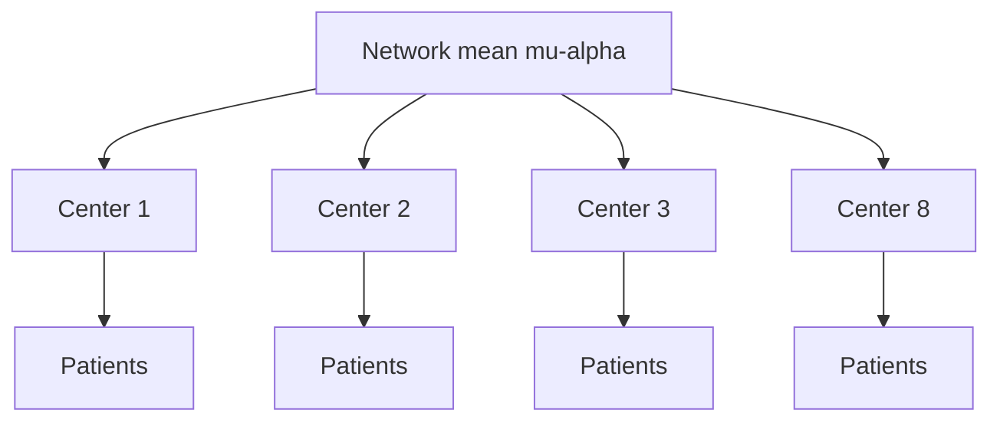
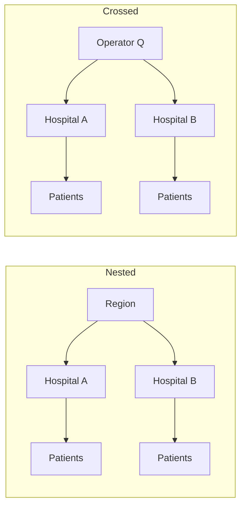

# Hierarchical / Multilevel Models for Patients, Centers, and Trials

## Opening

Eight hospitals in the same stroke network report door-to-needle times. The smallest hospital treated eleven patients last quarter and looks like a miracle. The largest treated two hundred and looks ordinary. Complete pooling would erase the miracle and the ordinary alike. No pooling would put the eleven-patient hospital on a quality slide. Partial pooling is the refusal to do either.

## Learning objectives

After working this chapter you should be able to:

- State the exchangeability assumption that justifies a hierarchical prior, and recognize when centers are *not* exchangeable.
- Contrast complete pooling, no pooling, and partial pooling for a center-level intercept, including the direction and magnitude of shrinkage.
- Write and interpret the `brms` formula `outcome ~ treatment + (1 | center)`, including the implied prior on the center standard deviation.
- Distinguish nested from crossed grouping factors, and choose a formula that matches the sampling design of a multi-center stroke registry or a platform trial.
- Plot center-level intercepts with `tidybayes` and talk about them as adjustments, not as a league table.

## Clinical vignette

A regional endovascular network includes eight centers. Over twelve months the network recorded \(1{,}240\) patients with large-vessel occlusion who underwent EVT. The binary outcome for this teaching analysis is successful reperfusion, TICI 2b/3. A new aspiration catheter was adopted at different times; the treatment indicator is \(1\) if the case used the new catheter and \(0\) otherwise. Center volumes (teaching numbers) are \(410\), \(265\), \(180\), \(140\), \(95\), \(72\), \(48\), and \(30\).

Crude reperfusion proportions range from \(0.61\) at the smallest center to \(0.84\) at a mid-volume center. The network quality committee wants a center-adjusted treatment effect and a list of “outlier centers.” A junior analyst has already fit eight separate logistics and an eighth-as-dummy fixed-effects logistic. Both are wrong in opposite directions. Your job is to write the hierarchical model, say what it shrinks, and refuse the league table if the data cannot support one.

Before any software, write four sentences: (1) what would make these eight centers *not* exchangeable; (2) whether the catheter was adopted in a way that confounds treatment with center; (3) what a ninth hospital should be told to expect; (4) what you will not print, even if a forest plot is requested.

## Three ways to ignore, or not ignore, clustering

Patients treated at the same center share protocols, operators, anesthesia culture, and CT-to-puncture logistics. The observations are not independent. That is not a software inconvenience. It is the scientific structure.

Three default responses exist.

**Complete pooling.** Ignore center. Fit `reperfusion ~ treatment`. Every patient informs a single intercept. The treatment coefficient is a precision-weighted blend of within-center and between-center contrasts, which is not in general the within-center effect you think you are quoting. Center-level confounding (the catheter arrived first at the best centers) is absorbed into the treatment term.

**No pooling.** Fit a separate intercept for each center with no relationship among them, either as eight separate models or as `reperfusion ~ treatment + factor(center)` with a flat prior on each dummy. Small centers get noisy intercepts. The smallest center’s \(0.61\) proportion on \(30\) patients is treated as a fact. Predictions for a ninth center do not exist, because the model has no place to put a new intercept.

**Partial pooling.** Give the center intercepts a common distribution,

\[
\alpha_j \sim \mathrm{Normal}(\mu_\alpha,\ \tau^2), \qquad j = 1,\ldots,J.
\]

Each \(\alpha_j\) is pulled toward \(\mu_\alpha\) with a strength that depends on the center’s sample size and on \(\tau\). \(\tau\) is learned from the data, regularized by a prior. A new center can be predicted by drawing a new \(\alpha_{J+1}\) from the same distribution.



The hierarchy is a statement about similarity, not about causation. Centers are similar enough to share a distribution. They are not identical. That is the entire philosophical content of a random intercept.

Exchangeability is the assumption that, before seeing the outcomes, you would not be willing to put a different prior on center 3 than on center 7. If you *would* — because center 3 is a comprehensive center with 24-hour anesthesia and center 7 is a daytime-only suite — then the intercepts are not exchangeable unconditionally. They may still be exchangeable *after* you condition on a center-level covariate (comprehensive versus primary, on-site anesthesia, academic affiliation). The repair is not to abandon the hierarchy. The repair is to put those covariates in the linear predictor of \(\mu_{\alpha j}\) so that the leftover intercepts are the ones you are willing to treat as draws from a common \(\tau\).

Door-to-needle time is the same model with a Gaussian response. A network that ranks spokes on last quarter’s median DTN is running a no-pooling analysis on a noisy median. Eleven patients can produce a 28-minute median by luck. Partial pooling of a log-DTN mean, with a weakly informative prior on \(\tau\) informed by previous quarters, will pull that 28 toward the network and will widen the interval until the luck is no longer printable. The general principle is identical to the reperfusion logistic; only the family changes.

## Why the two extremes fail in stroke data

Complete pooling fails because stroke care is not a single process that happens to be geographically distributed. Door-to-needle time, anesthetic strategy, and balloon-guide use vary by center more than by patient-level NIHSS. Averaging them produces a treatment effect that no center actually delivers.

No pooling fails because rare events and small samples are the rule, not the exception. A rural spoke with \(30\) EVTs and a \(61\%\) reperfusion rate is compatible with the network mean; it is also compatible with a true problem. Eight separate confidence intervals will declare two or three “outliers” by chance. A hospital executive will then “fix” a center that did not need fixing, which is how quality programs create new harm.

Partial pooling is the compromise that can be written as an estimator. The posterior mean of \(\alpha_j\) is approximately

\[
\hat\alpha_j \approx \frac{n_j/\sigma^2}{n_j/\sigma^2 + 1/\tau^2}\,\bar y_j + \frac{1/\tau^2}{n_j/\sigma^2 + 1/\tau^2}\,\mu_\alpha
\]

in a Gaussian-response sketch, and a logistic analogue with the same shape. The weight on the center’s own data grows with \(n_j\). The weight on the network mean grows as \(\tau\) shrinks. When \(\tau \to 0\), you recover complete pooling. When \(\tau \to \infty\), you recover no pooling. Estimating \(\tau\) lets the data choose a point on that continuum, subject to the prior you placed on \(\tau\).

!!! warning "Common Pitfall"
    Shrinkage is not an accusation that a center is lying. It is the statement that a small sample is a small sample. The \(30\)-patient center is shrunk hardest *because* \(30\) is small, not because the model dislikes rural hospitals. If you do not want that shrinkage, you must defend a no-pooling analysis to a room that understands sampling variation. Most rooms do not.

## The model the vignette actually needs

Let \(y_i = 1\) if patient \(i\) achieved TICI 2b/3, \(x_i = 1\) if the new catheter was used, and \(j[i]\) the center. A starting model is

\[
y_i \sim \mathrm{Bernoulli}(\pi_i), \qquad
\mathrm{logit}(\pi_i) = \alpha_{j[i]} + \beta x_i, \qquad
\alpha_j \sim \mathrm{Normal}(\mu_\alpha,\ \tau^2).
\]

In `brms` this is

```r
reperfusion ~ treatment + (1 | center)
```

with `family = bernoulli()`. The intercept that `brms` reports as `Intercept` is \(\mu_\alpha\) (population-level). The terms `r_center[k, Intercept]` are the deviations \(\alpha_k - \mu_\alpha\), or, depending on the summary you ask for, the center intercepts themselves. Read the documentation for `ranef()` versus `coef()` once and then never confuse them again. `ranef()` is the deviation. `coef()` is the center-specific intercept, \(\mu_\alpha + \alpha_j^{\mathrm{dev}}\).

A weakly informative prior on this scale is not a vague Normal(\(0\), \(10\)) on the intercept. On the logit scale, Normal(\(0\), \(10\)) is a prior that thinks success probabilities near \(0\) or \(1\) are ordinary. For reperfusion, a Normal(\(1.4\), \(0.5\)) on \(\mu_\alpha\) (center near \(80\%\), with room) and a Half-Normal(\(0.5\)) or Exponential(\(2\)) on \(\tau\) are closer to what a stroke neurologist believes before seeing the spreadsheet.

!!! note "Mathematical Detail"
    The joint posterior is \(p(\beta, \mu_\alpha, \tau, \{\alpha_j\} \mid y)\). Integrating the \(\alpha_j\) produces a marginal likelihood in which patients at the same center are correlated. That correlation is not a nuisance parameter to be sandwich-estimated away. It is the quantity that makes a new patient at center \(j\) more predictable than a new patient at a new center. If you only want a robust standard error for \(\beta\), a GEE may suffice. If you want a prediction for center \(9\), or a center-specific intercept, you need the hierarchy.

## Interpreting varying intercepts without building a stadium ranking

A center intercept is a log-odds adjustment after the treatment term. It is not a quality score. It still contains case-mix, anatomy, documentation habits, and luck. The honest use of \(\{\alpha_j\}\) is:

- to absorb clustering so that \(\beta\) is closer to a within-center contrast;
- to predict the next patient at a known center;
- to inspect whether \(\tau\) is large enough that “the network rate” is a fiction.

The dishonest use is a ranked forest plot sent to a newspaper.

If the committee insists on identifying outliers, pre-specify a rule that uses the posterior, not the point estimate. Example: flag a center if \(P(\alpha_j < \mu_\alpha - 0.4 \mid y) > 0.9\), where \(0.4\) on the logit scale is a pre-committed minimum important difference (about \(8\)–\(10\) percentage points near an \(80\%\) baseline). Most centers will not flag. That is a successful analysis.

| Strategy | Formula sketch | Small-center intercept | New center | Treatment effect |
| --- | --- | --- | --- | --- |
| Complete pooling | `y ~ x` | Forced to network mean | Same as everyone | Mixes within- and between-center |
| No pooling | `y ~ x + factor(center)` | Noisy, unshrunk | Undefined | Within-center if there is overlap |
| Partial pooling | `y ~ x + (1 \| center)` | Shrunk toward \(\mu_\alpha\) | Draw from \(\mathrm{N}(\mu_\alpha,\tau^2)\) | Primarily within-center |

| Object in `brms` | Symbol | What to say in conference |
| --- | --- | --- |
| `b_Intercept` | \(\mu_\alpha\) | Network mean log-odds at \(x=0\) |
| `b_treatment` | \(\beta\) | Log-odds ratio for the new catheter, after center intercepts |
| `sd_center__Intercept` | \(\tau\) | How much centers differ after treatment |
| `ranef(...)$center` | \(\alpha_j - \mu_\alpha\) | Center deviation, not a score |
| `coef(...)$center` | \(\alpha_j\) | Center-specific intercept |

## Nested versus crossed

Grouping factors are **nested** when each unit of the inner factor belongs to exactly one unit of the outer factor. Patients nested in centers. Centers nested in regions. The formula `(1 | region/center)` expands to `(1 | region) + (1 | region:center)` and is the right default when the nesting is real.

Grouping factors are **crossed** when the same level of one factor appears inside many levels of the other. Operators who work at two hospitals. A trial protocol used in every center. A year effect shared across the network. The formula is `(1 | center) + (1 | operator)`, not `(1 | center/operator)`, unless each operator truly belongs to one center.

Getting this wrong is not a style error. Nesting an operator inside a center when the operator works at both will invent two fictional people and split their data. Crossing them when they do not travel will estimate a variance component the design cannot identify.

A trial version of the same distinction: patients nested in sites, sites nested in countries, and a device used in every country, is `(1 | country/site)` plus a population-level device term. A platform in which the same control arm is shared across two domains is crossed, not nested, and the formula must say so. Chapter 10 returns to platforms. The modeling moral is already here: draw the boxes before you write the pipes.



!!! tip "Clinical Pearl"
    If you cannot draw the nesting on a napkin, you cannot write the formula. Draw patients, then the smallest cluster they share (operator, shift, center), then the next cluster up. Every box that could have been a different box is a grouping factor. Every box that is merely a property of the patient (age, NIHSS, ASPECTS) is a population-level covariate.

## Adding slopes, carefully

The vignette model gives every center the same treatment effect \(\beta\). That is a strong claim. The more flexible model is

\[
\mathrm{logit}(\pi_i) = \alpha_{j[i]} + \beta_{j[i]} x_i, \qquad
\begin{pmatrix}\alpha_j \\ \beta_j\end{pmatrix}
\sim \mathrm{Normal}\left(
\begin{pmatrix}\mu_\alpha \\ \mu_\beta\end{pmatrix},\ \Sigma\right).
\]

In `brms`: `reperfusion ~ treatment + (treatment | center)`. The \(2\times 2\) covariance \(\Sigma\) includes a correlation between intercept and slope. Centers that already reperfuse at \(90\%\) have less room for a catheter effect; a negative correlation is scientifically plausible.

Do not start here. Eight centers, one of them with \(30\) patients, will not identify a covariance matrix without a tight prior. Fit the intercept-only hierarchy first. Look at \(\tau\). Look at the center deviations. If the committee has a pre-specified reason to expect treatment-effect heterogeneity — a new device that requires a learning curve, a protocol that only some centers adopted faithfully — then add the slope and put a prior on the slope SD that does not allow log-odds ratios of \(\pm 3\) as routine.

A useful diagnostic that does not require the slope model: plot each center’s *within-center* treatment contrast, however noisy, against its volume. If the large centers agree and the small centers scatter around them, the common-\(\beta\) model is doing its job. If the two largest centers disagree by a clinically large amount, \(\tau\) on the intercept will not absorb that, and a common \(\beta\) is a scientific claim you can now see failing. That plot belongs in the appendix whether or not you add `(treatment | center)`.

!!! tip "Clinical Pearl"
    Shrinkage is most aggressive where the quality committee is most excited. The rural spoke with eleven door-to-needle times and a miracle median, the new EVT site with thirty cases and a frightening reperfusion rate — those are the intercepts the model will move. If a meeting cannot tolerate that movement, the meeting is asking for no pooling. Say so, show how wide the unshrunk interval is, and let them choose in public.

### For the biostatistician / methodologist

Two identification remarks. First, the treatment coefficient in `y ~ x + (1 | center)` is identified from *within-center* variation in \(x\) plus whatever between-center information the partial pooling of intercepts does not absorb. If the new catheter is almost perfectly collinear with center (adopted fully in four centers, never in the other four), \(\beta\) is identified mostly by the hierarchical assumption that intercepts are exchangeable, which is then doing causal work it was not hired to do. Check the overlap. A simple cross-tab of treatment by center is more important than the prior on \(\tau\).

Second, the usual “random effects versus fixed effects” debate in econometrics is a debate about the correlation between \(\alpha_j\) and \(x\). If that correlation is the confounding you fear, adding center-level covariates (comprehensive versus primary, academic versus community, on-site anesthesia) or using a Mundlak device — include the center-level mean of \(x\) as a population-level predictor — is more honest than switching to no pooling and declaring victory. Gelman’s observation still stands: the hierarchical model *is* a constrained fixed-effects model. The constraint is the prior on \(\tau\).

A third remark for trialists. A multi-center RCT that randomizes patients within centers is the design for which `(1 | center)` is almost boringly correct. A cluster-randomized trial that randomizes centers needs the treatment term at the correct level and a realistic prior on \(\tau\), because \(\tau\) now governs power. Do not import an ICC from a different outcome. Door-to-needle ICC and 90-day mRS ICC are not interchangeable.

## Worked solution to the vignette

Write the model as Bernoulli with a logit link, a treatment indicator, and a varying intercept for center. Put a weakly informative prior on \(\mu_\alpha\) centered near the known high reperfusion rates of modern EVT series (teaching prior: Normal(\(1.4\), \(0.5\))), a Normal(\(0\), \(0.4\)) prior on \(\beta\) (skeptical of more than a large log-odds shift), and a Half-Normal(\(0.5\)) prior on \(\tau\).

Fit it. Before anyone looks at center ranks, report four numbers:

1. The posterior of \(\beta\), on the odds-ratio scale, with a \(95\%\) credible interval. This is the network-level association after partial pooling of intercepts.
2. The posterior of \(\tau\). If \(\tau\) is around \(0.15\) on the logit scale, centers barely differ. If it is around \(0.6\), “the network rate” is a headline, not a description.
3. A posterior predictive reperfusion rate for a *new* center that has not yet adopted the catheter, obtained by drawing \(\alpha_{\mathrm{new}} \sim \mathrm{Normal}(\mu_\alpha,\tau)\) and inverting the logit. That number is what a ninth hospital should plan on, not the \(0.84\) trophy from the mid-volume center.
4. The shrunk intercepts for the \(n=30\) and \(n=410\) centers. The small center moves toward the network; the large center barely moves. Show that pair and stop. You have taught shrinkage. You have not published a ranking.

If the quality committee still wants outliers, apply the pre-committed posterior-probability rule above. On typical teaching draws with \(\tau \approx 0.25\) and these volumes, the \(n=30\) center with a crude rate of \(0.61\) will shrink into the pack and will not meet a \(P(\alpha_j < \mu_\alpha - 0.4) > 0.9\) criterion. That is the analysis working. The junior analyst’s separate logistic had already printed that center in red.

!!! example "R Deep Dive"
    Simulated teaching data, a full `brms` specification, and a `tidybayes` interval plot of center intercepts. The data are invented. Do not treat the printed object names as results until you run the block.

```r
# Teaching hierarchical logistic: EVT reperfusion by center
# Teaching numbers only. seed for simulation and MCMC.

library(brms)
library(tidybayes)
library(dplyr)
library(ggplot2)

set.seed(20260818)

center_n <- c(410, 265, 180, 140, 95, 72, 48, 30)
J <- length(center_n)
# True teaching parameters (unknown to the fitted model)
mu_alpha <- 1.25          # ~78% at treatment = 0
tau_true <- 0.28
beta_true <- 0.35
alpha_j <- rnorm(J, mu_alpha, tau_true)

dat <- lapply(seq_len(J), function(j) {
  n <- center_n[j]
  treatment <- rbinom(n, 1, 0.45)
  eta <- alpha_j[j] + beta_true * treatment
  data.frame(
    center = factor(paste0("C", j), levels = paste0("C", seq_len(J))),
    treatment = treatment,
    reperfusion = rbinom(n, 1, plogis(eta))
  )
}) %>%
  bind_rows()

priors <- c(
  prior(normal(1.4, 0.5), class = Intercept),
  prior(normal(0, 0.4), class = b, coef = treatment),
  prior(normal(0, 0.5), class = sd)
)

# Specification. Uncomment brm() to sample.
# fit <- brm(
#   reperfusion ~ treatment + (1 | center),
#   data = dat,
#   family = bernoulli(),
#   prior = priors,
#   seed = 20260818,
#   cores = 4,
#   refresh = 0
# )

# After fitting:
# center_draws <- fit %>%
#   spread_draws(b_Intercept, r_center[center, ]) %>%
#   mutate(intercept_j = b_Intercept + r_center)
#
# ggplot(center_draws, aes(y = center, x = plogis(intercept_j))) +
#   stat_pointinterval(.width = c(0.66, 0.95)) +
#   labs(
#     x = "Center intercept on probability scale (treatment = 0)",
#     y = NULL,
#     title = "Partially pooled reperfusion intercepts",
#     subtitle = "Teaching simulation; not a quality ranking"
#   ) +
#   theme_minimal(base_size = 12)
```

The plot, once run, should show narrower intervals at `C1` than at `C8`, and `C8` pulled toward the network more than `C1`. If it does not, check that `center` is a factor and that the formula contains `(1 | center)` rather than `factor(center)`.

Read the plot as a statement about information, not as a ranking. The interval at `C8` is wide because thirty Bernoulli observations cannot pin a logit intercept. The interval at `C1` is narrow because four hundred can. If a quality officer draws a vertical line at \(0.70\) and declares every interval that crosses it “acceptable,” they have reinvented a \(p\)-value for a threshold nobody pre-specified. The plot’s job is to show shrinkage and precision. Caption it that way. Print it without a rank order if the meeting cannot be trusted with one; `tidybayes` will plot in factor-level order, which you should set by volume, not by posterior mean.

## What this model is not

It is not a causal model of the catheter. Treatment was not randomized. Centers that adopted early may be centers that already ran a tighter procedure. Adding `(1 | center)` removes a particular kind of confounding — time-invariant center baseline — and leaves every other kind. Pre-procedure NIHSS, occlusion site, and time from onset still belong in the linear predictor if they are confounders. They belong there as population-level terms, not as additional grouping factors.

It is not a substitute for a trial. Hierarchical observation can generate the prior or the control arm for a subsequent stepped-wedge or cluster-randomized evaluation. It cannot, by itself, license a network-wide device mandate.

It is not automatically better with more grouping factors. `(1 | center) + (1 | operator) + (1 | month)` is a reasonable scientific story and a demanding likelihood. With eight centers and a year of data, month effects and operator effects compete for the same residual. Fit the simpler hierarchy, check it (Chapter 8), and add a factor when you can name the variation it is supposed to capture.

!!! warning "Common Pitfall"
    Reporting `sd_center__Intercept` as “the ICC” without saying on which scale is a standard way to confuse a room. On the logit scale \(\tau^2/(\tau^2 + \pi^2/3)\) is a latent-scale ICC. On the probability scale the ICC depends on the mean. Pick one, name the scale, and do not compare it to an ICC computed from a linear model of door-to-needle minutes.

## Exercises

1. **Bedside interpretation.** Center C8 has a crude reperfusion rate of \(0.61\) on \(30\) patients. After partial pooling its posterior mean intercept corresponds to \(0.74\). A chief of staff asks, “So you think our number is wrong?” Write the six-sentence answer.

2. **Overlap check.** Construct a teaching table in which four centers used the new catheter in \(>90\%\) of cases and four used it in \(<10\%\). What happens to the interpretation of \(\beta\) in `y ~ treatment + (1 | center)`? What term would you add?

3. **Nested formula.** Patients are nested in operators, operators are nested in centers. Write the `brms` formula for a varying intercept at each level, and the formula if operators work at multiple centers.

4. **Prior on \(\tau\).** Refit the teaching model (once you run it) with `prior(exponential(0.1), class = sd)` versus `prior(exponential(4), class = sd)`. Which prior is closer to complete pooling? How would you defend your choice at a network meeting?

5. **Slope or not.** A colleague wants `(treatment | center)` because “centers are different.” There are eight centers. Write the conditions under which you would agree, and the prior you would put on the slope SD.

6. **Prediction.** Using posterior draws of \(\mu_\alpha\) and \(\tau\), write the three-line `tidybayes` pipeline that predicts reperfusion probability for the first twenty patients at a new ninth center, all untreated with the new catheter.

## Further reading

- Gelman A, Hill J. *Data Analysis Using Regression and Multilevel/Hierarchical Models*. Cambridge University Press; 2007. The standard development of partial pooling and varying intercepts.
- McElreath R. *Statistical Rethinking*. 2nd ed. CRC Press; 2020. Chapters on multilevel models and the “monsters” of complete and no pooling.
- Spiegelhalter DJ, Abrams KR, Myles JP. *Bayesian Approaches to Clinical Trials and Health-Care Evaluation*. Wiley; 2004. Institutional variation and shrinkage in health-care profiling.
- Bürkner P-C. brms: An R package for Bayesian multilevel models using Stan. *J Stat Softw*. 2017;80(1):1-28.
- Goldstein H, Spiegelhalter DJ. League tables and their limitations. *J R Stat Soc A*. 1996;159:385-443. Why ranking institutions on noisy outcomes misleads.
- Goyal M et al. Endovascular thrombectomy after large-vessel ischaemic stroke: a meta-analysis of individual patient data from five randomised trials. *Lancet*. 2016;387:1723-1731. Public design facts on multi-center EVT outcomes; do not copy tables.
- U.S. Food and Drug Administration. Guidance for the Use of Bayesian Statistics in Medical Device Clinical Trials. 2010. Hierarchical borrowing across centers and studies.
- CONSORT 2010 extension to cluster randomised trials. Reporting the level at which treatment was assigned.

!!! success "Key Takeaway"
    Partial pooling is the default model for any outcome that is generated inside a center, an operator, or a trial site. Complete pooling pretends the clusters do not exist; no pooling pretends the smallest cluster is a population. The `brms` formula `outcome ~ treatment + (1 | center)` writes the compromise, estimates how large the compromise should be, and gives you predictions for the next center. Use the intercepts to absorb clustering and to predict. Do not use them to print a ranking unless you have a pre-committed posterior-probability rule and a room that understands shrinkage.
