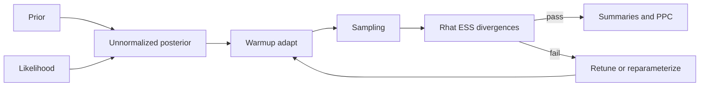
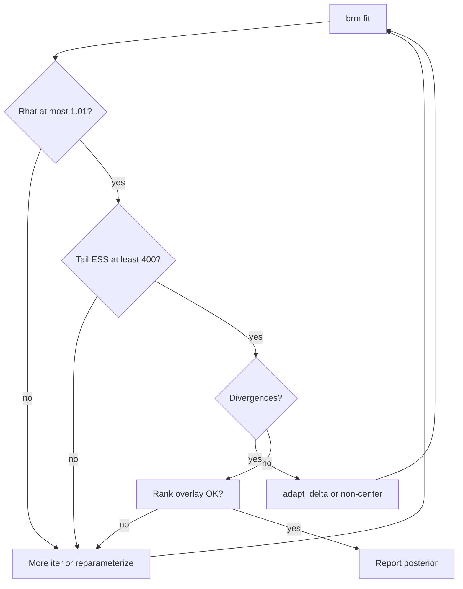

# Computational Bayesian Inference: MCMC, Diagnostics, and Visualization

## Opening

A posterior density plot can be beautiful and false. Four chains can wander through different neighborhoods of the same parameter space, the kernel smoother will still draw a single unimodal curve, and a resident will quote the median to two decimals. The sampler is not an oracle. It is a walking tour. Your job is to decide whether the tour covered the city.

## Learning objectives

After working this chapter you should be able to:

- Explain, without measure theory, what a Markov chain Monte Carlo sample is doing when it “draws from the posterior.”
- Give an operational account of Hamiltonian Monte Carlo and NUTS: why trajectories beat random-walk Metropolis on correlated clinical posteriors.
- Read \(\widehat{R}\), bulk and tail effective sample size, and divergence warnings as clinical-grade quality control, not as software chrome.
- Use `bayesplot` trace and rank overlays to see problems that a density plot conceals.
- Set a seed, increase `adapt_delta` for a reason, and refuse to interpret a pretty density from a broken chain.

## Clinical vignette

You fit a `brms` logistic model for 90-day functional independence (mRS \(0\)–\(2\)) after EVT in \(620\) teaching-data patients, with predictors age, baseline NIHSS, ASPECTS, and onset-to-puncture time. The printed summary shows a treatment-adjacent coefficient — contrast-extravasation on CTA, coded `spot` — with posterior median log-odds \(-0.62\) and a \(95\%\) interval that just excludes zero. The density plot is unimodal and smooth. A fellow is already drafting the abstract.

You have not looked at \(\widehat{R}\), ESS, divergences, or a rank plot. The fellow has set neither a seed nor `control = list(adapt_delta = ...)`. Before anyone writes “independent association with poor outcome,” you will run the diagnostics and decide whether the number exists.

Before opening `bayesplot`, write three sentences: which parameter you are willing to quote in an abstract; what you will do if its tail ESS is under \(400\); and what sentence you will refuse even if every diagnostic passes (hint: “independent association” is a causal claim, and MCMC cannot issue those).

## What MCMC is doing

The posterior \(p(\theta \mid y)\) is a distribution. Except in the conjugate cases of Chapter 5, you cannot write its normalizing constant, and you cannot draw independent samples from it with a standard generator. Markov chain Monte Carlo constructs a dependent sequence \(\theta^{(1)}, \theta^{(2)}, \ldots\) whose *stationary* distribution is the posterior. After a warmup period in which the chain finds the typical set, the subsequent draws are treated as (dependent) samples from \(p(\theta \mid y)\).

Three facts follow, and they are the whole methodology.

**The draws are not independent.** Adjacent HMC draws are usually less correlated than adjacent random-walk Metropolis draws, but they are still correlated. Effective sample size, not the raw draw count, is the currency of posterior precision.

**The beginning of the chain is not a sample from the posterior.** Warmup (adaptation, burn-in) exists to reach stationarity and to tune the integrator. Summaries must drop it. `brms` does this by default. Notebooks that bind warmup and sampling into one object do not.

**Convergence is a property of multiple chains, not of a smooth density.** One chain that has not left a ridge will produce a gorgeous kernel density. Four chains that have not found the same ridge will produce four gorgeous densities that disagree. \(\widehat{R}\) and rank plots exist to make that disagreement visible.

A teaching picture, without a theorem. Imagine the posterior for `(b_spot, b_nihss)` as a long, thin ridge in the plane: patients with a spot sign also tend to have higher NIHSS, so the two coefficients trade off. A random-walk sampler proposes a small disk. Most of that disk hangs off the ridge and is rejected; the occasional accepted step inches along the ridge. After \(4000\) such inches the chain has seen only a corridor, the kernel density looks unimodal, and the interval on `b_spot` is too narrow because the chain never traveled the ridge’s length. HMC’s trajectory is a path *along* the ridge. That is the entire practical difference. You do not need the symplectic argument to refuse the corridor.



That is the workflow. Density plots live in the last box. They are not a diagnostic.

## HMC and NUTS as intuition, not as a course in symplectic geometry

Random-walk Metropolis proposes a small jump, accepts or rejects, and repeats. In a posterior that is a long, thin ridge — the usual geometry once two coefficients trade off, or once a hierarchical \(\tau\) and a set of intercepts fight — most jumps are either off the ridge (rejected) or along it by a tiny step (accepted but useless). You get a slow crawl and an ESS that is a few percent of the nominal draws.

Hamiltonian Monte Carlo treats the current \(\theta\) as a position, draws a momentum, and follows a Hamiltonian trajectory that can travel a long way along the ridge before a Metropolis accept/reject step. The accept/reject exists to correct the discretization error of the leapfrog integrator. When the step size is well tuned, acceptance rates sit near \(0.8\) and the trajectory actually moves.

NUTS, the No-U-Turn Sampler, chooses the trajectory length automatically. It builds a balanced tree of leapfrog steps and stops when the path begins to double back. You do not pick the number of leapfrog steps. You pick, indirectly, how carefully the integrator is tuned, through `adapt_delta`.

You do not need the measure-theoretic construction of the invariant distribution. You need three operational consequences:

1. HMC explores correlated posteriors far more efficiently than random-walk Metropolis. This is why `brms` and Stan use it.
2. The geometry can still break. Neal’s funnel — a hierarchical \(\tau\) near zero with many center intercepts — produces regions where a single step size cannot serve both the neck and the mouth. Divergences are the sampler saying so.
3. Reparameterization (a non-centered hierarchy) is often a better fix than turning `adapt_delta` toward \(1\).

!!! note "Mathematical Detail"
    A divergence is a leapfrog step in which the Hamiltonian error exceeds a threshold, typically because the curvature changed faster than the step size could follow. It is not a warning about your prior’s morality. It is a warning that the numerical trajectory left the region where the integrator is faithful, so the sample in that neighborhood is not a trustworthy draw from the posterior. A handful of divergences in an irrelevant corner can be investigated and sometimes ignored. Divergences in the typical set cannot.

## The numbers that decide whether a posterior exists

### \(\widehat{R}\)

\(\widehat{R}\) compares within-chain and between-chain variance. At \(1.00\) the chains are interchangeable for practical purposes. Vehtari, Gelman, and colleagues recommend treating \(1.01\) as a threshold, not \(1.1\). A coefficient with \(\widehat{R} = 1.07\) and a pretty density is not estimated. It is displayed.

In a `brms` summary, every parameter that you intend to quote — including standard deviations of varying effects and the third standard deviation of a residual correlation matrix — needs \(\widehat{R}\) in range. Do not check only `b_spot`.

### Effective sample size

Bulk ESS describes the middle of the posterior. Tail ESS describes the quantiles you use for intervals. A \(95\%\) credible interval that uses the \(2.5\%\) and \(97.5\%\) sample quantiles is a tail object. If tail ESS is \(80\) on a parameter whose interval just excludes zero, you do not have an interval. You have a suggestion.

A working rule for this book: do not quote a tail interval unless tail ESS exceeds \(400\) for that parameter. Increase `iter` and `warmup`, or reparameterize, until it does. Adding pretty `ggplot` themes does not increase ESS.

ESS is also how you detect a silent parameterization problem. A population-level slope with bulk ESS of \(3500\) and a center-level SD with bulk ESS of \(180\) is not a model that “mostly worked.” The geometry of \(\tau\) is sick, and every center intercept that depends on \(\tau\) is sick with it. Quote neither until the slow parameter is repaired. Hierarchical variances are the usual last-to-mix objects in stroke models; look at them first, not last.

### Divergences and `adapt_delta`

`adapt_delta` is the target acceptance probability during warmup. The default in Stan/`brms` is \(0.8\). Raising it toward \(0.95\) or \(0.99\) shrinks the leapfrog step size, which can remove divergences caused by moderate curvature. It also makes each draw more expensive, and it does not fix a funnel.

Increase `adapt_delta` when:

- a small number of divergences remain after a centered hierarchy that *should* be well identified;
- the model is otherwise simple (no tight funnel, no discrete parameters smuggled in).

Do not increase `adapt_delta` when:

- hundreds of iterations diverge;
- \(\widehat{R}\) is already bad;
- the model is a hierarchical variance near zero with many group levels.

In the last case, switch to a non-centered parameterization. `brms` already writes varying effects in the non-centered form; there is no `noncentered` argument to `brm()`. If divergences persist, tighten the prior on \(\tau\) to something you actually believe, or simplify the grouping structure.

### Max treedepth

A treedepth warning means NUTS hit its maximum tree size before a U-turn. The draws are not automatically invalid, but they are inefficient. Increasing `max_treedepth` from \(10\) to \(12\) is legitimate. It is also a hint that the posterior geometry is awkward and that a different parameterization may be cheaper than a deeper tree.

| Diagnostic | Pass | Fail | First move |
| --- | --- | --- | --- |
| \(\widehat{R}\) | \(\le 1.01\) on quoted parameters | \(> 1.01\) | More iter, better inits, reparameterize |
| Bulk ESS | \(\gtrsim 400\) per quoted parameter | Tens to low hundreds | More sampling iterations |
| Tail ESS | \(\gtrsim 400\) if you quote \(95\%\) intervals | Tails thinner than bulk | More iter; check parameterization |
| Divergences | Zero, or a documented handful away from the typical set | Any in the region you summarize | `adapt_delta`, then non-center, then change the model |
| Treedepth | Rare warnings | Frequent | Raise `max_treedepth`; inspect geometry |
| Seed | Set and recorded | Session-dependent | `seed =` in `brm()` and in the script |

| Plot | What it can show | What it cannot show |
| --- | --- | --- |
| Kernel density | Shape, after you trust the chain | Convergence |
| `mcmc_trace` | Stuck chains, slow mixing, leftover warmup | Whether the typical set is complete |
| `mcmc_rank_overlay` | Chains that miss a region another chain finds | Scientific correctness of the likelihood |
| Pairs plot | Funnels, banana correlations, divergence clusters | Calibration of predictions |

## Trace plots and rank plots

A trace plot is time on the \(x\)-axis and the parameter on the \(y\)-axis, one line per chain. After warmup, you want four hairy caterpillars occupying the same band. You do not want a random walk that has not forgotten its starting value. You do not want one chain parked at \(-2\) while the others oscillate around \(0\).

Rank plots are the more sensitive modern default. For each chain, replace draws by their ranks in the *pooled* set of draws and histogram those ranks. If the chains are interchangeable, each histogram is close to uniform. If one chain never visited the right tail, its rank histogram is depleted on the right and another chain’s is enriched. `bayesplot::mcmc_rank_overlay()` makes this comparison unavoidable.

!!! warning "Common Pitfall"
    Interpreting a pretty density from a broken chain is the characteristic computational malpractice of applied Bayesian work. The density estimator does not know about \(\widehat{R}\). It will happily smooth four disagreeing chains into one authoritative hill. If you show a density, show the rank plot in the appendix. If you cannot be bothered to look at the rank plot, you are not ready to look at the density.

A teaching failure mode, so the warning has a face. Chain 1 and chain 2 explore `b_spot` near \(-0.6\). Chain 3 spends the first half of sampling near \(+0.4\) and then jumps. Chain 4 never leaves \(+0.2\). The pooled kernel density is unimodal at \(-0.3\) with a thick right shoulder — the shape of a “soft” finding. The printed \(95\%\) ETI just includes zero, or just excludes it, depending on how much of chain 3’s jump you keep. \(\widehat{R}\) on `b_spot` is \(1.08\). The fellow’s abstract has already chosen the prettier of the two intervals. The correct next sentence is not a scientific one. It is “this posterior does not exist yet.”

## Seeds, cores, and the appearance of reproducibility

`brm(..., seed = 20260818)` seeds the Stan run. It does not seed the R session that built the data, the `set.seed()` that simulated a teaching outcome, or the operating-system-level thread schedule in every `cores = 4` configuration. Reproducibility is a property of the script, not of a single argument.

A reproducible teaching or clinical-analysis script:

1. sets `set.seed()` before any simulation or data split;
2. passes the same integer to `brm(seed = ...)`;
3. records the `brms` and `cmdstanr` (or `rstan`) versions;
4. avoids `refresh` chatter in the published appendix but keeps the `stanfit` object.

Two runs on two laptops may still differ in the low digits if the linear-algebra libraries differ. They should not differ in the scientific conclusion. If they do, ESS was too small or the geometry was unstable.

Initialization deserves one paragraph because it produces a characteristic false emergency. Default `brms` inits are random in a small ball around zero on the unconstrained scale. A logistic intercept initialized at \(0\) is a \(50\%\) probability, which is a long way from a \(6\%\) ICH rate. Warmup usually walks there. If you instead initialize a hierarchical \(\tau\) at a huge value, or pin all center intercepts to the same number in a funnel, warmup can fail in public. Random inits plus four chains are the default because they make that failure visible as \(\widehat{R}\). A single chain started at the MLE can look converged and still be sitting in one mode of a multimodal posterior. Use four chains. Do not “help” them by starting them all at the same clever place unless you are debugging.

!!! tip "Clinical Pearl"
    When a journal asks for “the” posterior median, give the seed, the iteration counts, and the ESS with it. A median quoted to three decimals from a chain with tail ESS \(120\) is a type of false precision that peer review still rewards. Do not participate.

## Worked solution to the vignette

Do not read the density. Pull the summary. Four chains exist so that you can distrust them. A single pretty density is the thing you are not allowed to start with.

On a healthy fit of this size (\(620\) patients, four continuous predictors plus an intercept, Bernoulli likelihood), you expect \(\widehat{R} \le 1.01\) on every population-level coefficient, bulk ESS in the thousands if you took \(4000\) post-warmup draws, and zero divergences. The spot-sign coefficient’s interval is then a real object, and you may discuss it as an association in an observational teaching dataset.

If instead you see \(\widehat{R} = 1.04\) on `b_spot`, tail ESS \(180\), and \(14\) divergences, the abstract is not written. The interval that “just excludes zero” is exactly the kind of interval that flips when a chain is allowed to finish its job. Practical moves, in order:

1. Confirm the seed is set so the next run is comparable.
2. Inspect `mcmc_trace(fit, pars = "b_spot")` and `mcmc_rank_overlay(fit, pars = "b_spot")`. A rank histogram that is a “U” or a spike is a failed chain, not a scientific finding.
3. If traces look stationary but ESS is low, double `iter` (and keep warmup at half, or at \(1000\), as you prefer).
4. If divergences exist, look at a pairs plot of `b_spot` against any hierarchical SDs. Raise `adapt_delta` to \(0.95\) only if the model is otherwise simple.
5. If the design actually includes center intercepts — it should, after Chapter 6 — and the funnel is visible, use the non-centered parameterization and a tighter prior on \(\tau\).

Only after the diagnostics pass do you return to the fellow’s sentence. Even then the sentence is “in this observational teaching sample, after adjusting for age, NIHSS, ASPECTS, and time, the posterior probability of a negative association between spot sign and independence is high.” It is not “spot sign independently predicts poor outcome.” Diagnostics certify the computation. They do not certify the causal claim.

A computational appendix, if the analysis is ever written up, should contain the seed, the iteration and warmup counts, the number of chains, `adapt_delta`, the worst \(\widehat{R}\), the smallest tail ESS among quoted parameters, the divergence count, and the `brms` / Stan versions. That paragraph is not decoration. It is how a reader decides whether your interval is an interval. Journals that strip it are asking you to take their word. Put it back in the supplement.

!!! tip "Clinical Pearl"
    If a coauthor wants the density in the main figure and the rank plot “somewhere,” the rank plot is the main figure and the density is the decoration. Swap them. A meeting that can read a caterpillar can read a forest plot. A meeting that can only read a smoothed hill is the meeting that will quote a broken chain.



!!! example "R Deep Dive"
    A complete `brms` skeleton for the vignette, plus the two `bayesplot` calls that should precede any density. The data frame is assumed to exist; the block does not invent a fitted posterior.

```r
# Teaching MCMC workflow: 90-day independence after EVT
# Teaching analysis skeleton. Diagnostics before densities.
# seed must be set in brm() and in any data-prep above this block.

library(brms)
library(bayesplot)
library(ggplot2)

# Expected columns in evtdat (teaching names):
# independent (0/1), age, nihss, aspects, otp_min, spot (0/1)
# optional: center, if you include (1 | center)

priors <- c(
  prior(normal(0, 1.5), class = Intercept),
  prior(normal(0, 0.5), class = b),
  prior(normal(0, 0.5), class = sd)
)

# fit <- brm(
#   independent ~ spot + age + nihss + aspects + otp_min + (1 | center),
#   data = evtdat,
#   family = bernoulli(),
#   prior = priors,
#   seed = 20260818,
#   iter = 4000,
#   warmup = 1000,
#   chains = 4,
#   cores = 4,
#   control = list(adapt_delta = 0.9),
#   refresh = 0
# )

# After a successful compile-and-sample:
# summary(fit)
# np <- nuts_params(fit)
# mcmc_trace(fit, pars = c("b_spot", "b_nihss", "sd_center__Intercept")) +
#   labs(title = "Traces after warmup (teaching fit)")
# mcmc_rank_overlay(fit, pars = c("b_spot", "b_nihss", "sd_center__Intercept")) +
#   labs(title = "Rank histograms should look uniform")
# mcmc_nuts_divergence(np, log_posterior(fit))
# color_scheme_set("darkgray")
# mcmc_areas(fit, pars = "b_spot", prob = 0.95)  # only after diagnostics pass
```

Uncomment from the top. Read `summary(fit)` before `mcmc_areas()`. If you change `adapt_delta`, change it because of a documented divergence count, and record the count in the appendix. A silent `adapt_delta = 0.99` in a published script is a confession that the geometry was hard and an omission of how hard.

### For the biostatistician / methodologist

The split-\(\widehat{R}\) of Vehtari et al. (2021) folds each chain, computes rank-normalized \(\widehat{R}\), and is the statistic `brms` prints. The older Gelman–Rubin \(\widehat{R}\) can miss a slow drift that is shared across chains. Do not reimplement a 1992 version and declare victory.

ESS in Stan is a rank-normalized, split-chain estimate that separately reports bulk and tail. The tail ESS at \(5\%\) and \(95\%\) is the relevant one for a \(90\%\) interval; for a \(95\%\) interval you are still using information farther out than the bulk ESS describes. Importance-sampling diagnostics (Pareto \(k\)) belong to leave-one-out (Chapter 8), not to MCMC convergence, but a large Pareto \(k\) and a failing \(\widehat{R}\) often share a cause: a posterior with a heavy tail or a weakly identified direction.

Centered versus non-centered parameterization is a statement about the geometry of \((\tau, \{\alpha_j\})\). The centered form \(\alpha_j \sim \mathrm{N}(\mu, \tau^2)\) is efficient when \(\tau\) is large and the groups are informative. The non-centered form \(\alpha_j = \mu + \tau z_j\), \(z_j \sim \mathrm{N}(0,1)\) is efficient when \(\tau\) is small. `brms` chooses non-centered by default for varying intercepts because clinical hierarchies often have modest \(\tau\). If you have many groups and a large, well-identified \(\tau\), a centered parameterization can raise ESS. That is an advanced switch, not a default.

Parallel chains on `cores = 4` do not multiply ESS by four if the bottleneck is within-chain autocorrelation. They multiply wall-clock throughput and they make \(\widehat{R}\) computable. Both are necessary. Neither replaces a model whose posterior is almost unidentified.

## Exercises

1. **Bedside refusal.** A fellow shows you a unimodal density for an odds ratio and a caption that says “\(4000\) iterations.” List the six questions you ask before you let the density into a slide deck.

2. **\(\widehat{R}\) arithmetic, conceptually.** Chain A lives near \(-0.1\), chain B near \(-1.1\), both with small within-chain variance. Why is the pooled density unimodal-looking after a wide kernel, and why is \(\widehat{R}\) nevertheless large?

3. **adapt_delta policy.** You have \(3\) divergences in \(4000\) post-warmup draws of an intercept-only logistic, and \(240\) divergences in a eight-center hierarchical logistic with \(\tau\) posterior piled near zero. Write the different next step for each.

4. **ESS and a knife-edge interval.** Tail ESS for `b_spot` is \(220\). The \(95\%\) central interval is \((-1.18, -0.02)\). What do you tell the fellow who wants to write “statistically significant”? What change in the computation would make you willing to discuss the interval at all?

5. **Rank plot literacy.** Sketch (in words) the rank overlay you expect from four well-mixed chains, and the overlay you expect when chain 3 never visits the left tail of `b_spot`. Which paper figure would you put in the supplement?

6. **Reproducibility audit.** A coauthor cannot reproduce your posterior median of \(-0.62\). The script has no `set.seed`, `brm(seed = )` is missing, `cores = 4`, and the data-cleaning order depends on `dplyr` group keys. Write the repair list.

## Further reading

- Vehtari A, Gelman A, Simpson D, Carpenter B, Bürkner P-C. Rank-normalization, folding, and localization: An improved \(\widehat{R}\) for assessing convergence of MCMC. *Bayesian Analysis*. 2021;16:667-718.
- Betancourt M. A conceptual introduction to Hamiltonian Monte Carlo. arXiv:1701.02434. Geometry, typical sets, and why divergences mean what they mean.
- Gelman A, Carlin JB, Stern HS, Dunson DB, Vehtari A, Rubin DB. *Bayesian Data Analysis*. 3rd ed. CRC Press; 2013. Chapter 11 on MCMC and Chapter 12 on HMC.
- McElreath R. *Statistical Rethinking*. 2nd ed. CRC Press; 2020. Computational chapters that keep the geometry attached to a scientific model.
- Gabry J, Simpson D, Vehtari A, Betancourt M, Gelman A. Visualization in Bayesian workflow. *J R Stat Soc A*. 2019;182:389-402. Rank plots, PPC, and the argument against density-first reporting.
- Bürkner P-C. brms: An R package for Bayesian multilevel models using Stan. *J Stat Softw*. 2017;80(1):1-28.
- Stan Development Team. *Stan Reference Manual*, current release. Adaptation, `adapt_delta`, and treedepth.
- U.S. Food and Drug Administration. Guidance for the Use of Bayesian Statistics in Medical Device Clinical Trials. 2010. Computational documentation as part of a credible analysis package.

!!! success "Key Takeaway"
    MCMC is a dependent tour of the posterior, not a proof that the posterior has been obtained. HMC/NUTS makes the tour efficient on the ridged geometries that clinical models actually have; it does not make diagnostics optional. \(\widehat{R}\), bulk and tail ESS, divergences, traces, and rank overlays are the quality-control panel. A smooth density from a broken chain is a typesetting accident. Set a seed, read the panel, repair the geometry or the iteration budget, and only then quote a number that a fellow may put in an abstract.
