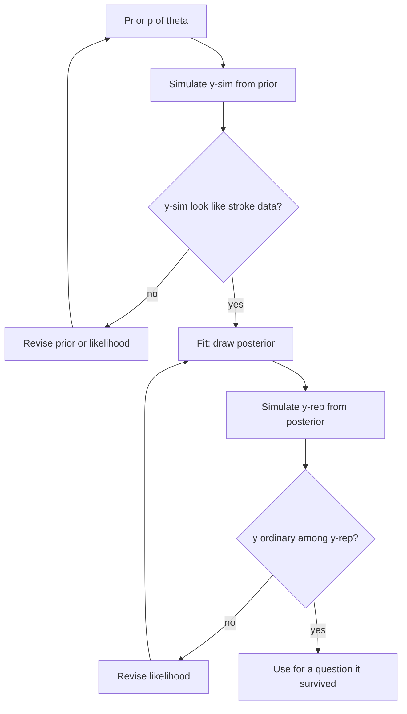
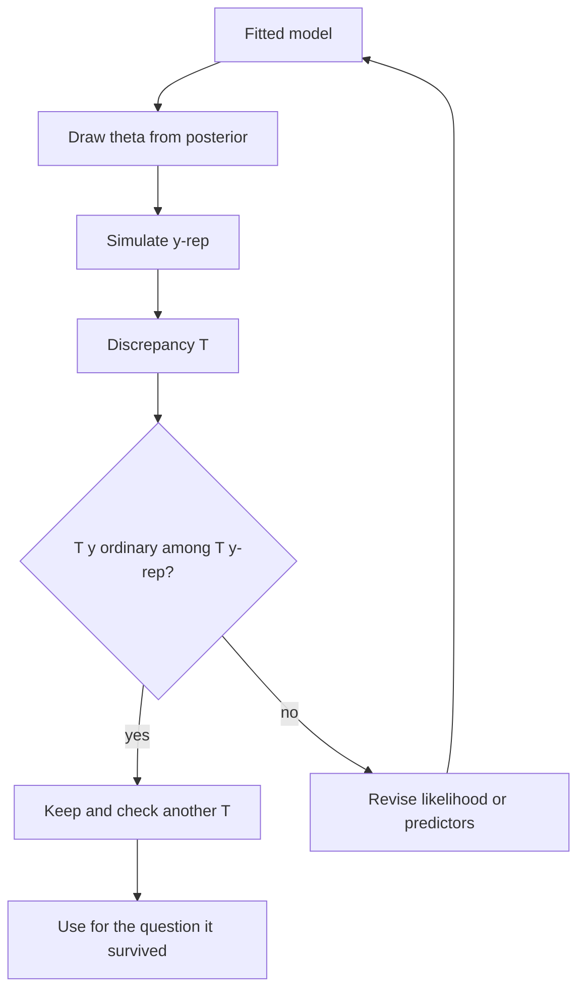
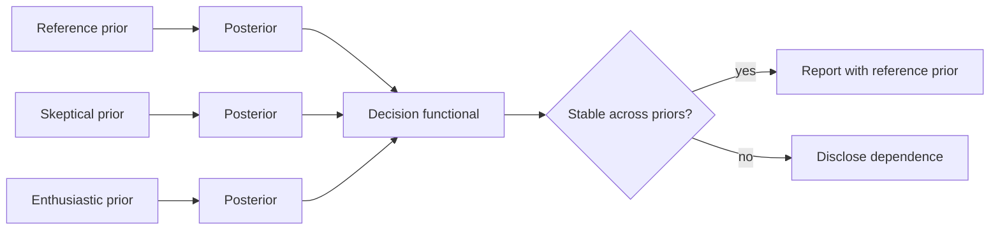

# Model Checking, Posterior Predictive Checks, Calibration, and Sensitivity to Priors

## Opening

A sampler that has converged is a sampler that has found *a* posterior. It is not a sampler that has found the posterior of a model worth using. You can have \(\widehat{R} = 1.00\), four beautiful rank plots, and a likelihood that cannot produce the hemorrhage counts you actually observed. Diagnostics certify the tour. Model checking asks whether the city on the map is the city you live in.

## Learning objectives

After working this chapter you should be able to:

- Design and read a posterior predictive check (PPC) for a binary stroke outcome, including the “leftover” checks that a single bar plot of \(y\) versus \(y^{\mathrm{rep}}\) will miss.
- Use PSIS-LOO and WAIC as comparative tools, and recognize when a large Pareto \(k\) makes the comparison itself untrustworthy.
- Draw a calibration plot from posterior predictive draws and say what calibration means for a probability of mRS \(0\)–\(2\).
- Run a planned prior-sensitivity analysis (skeptical versus enthusiastic) and report how much a decision-relevant probability moved.
- Treat checking as a loop — not as a \(p\)-value to pass — and revise the likelihood rather than the narrative when the check fails.

## Clinical vignette

A teaching dataset contains \(400\) patients treated with intravenous thrombolysis. The outcome is any radiographic ICH at \(24\) hours (binary). Predictors available at decision time are age, baseline NIHSS, systolic blood pressure, glucose, and an indicator for anticoagulant use. You fit a `brms` Bernoulli logit model with weakly informative priors and a linear main-effects specification. MCMC diagnostics from Chapter 7 all pass.

The hospital wants two things: a probability of ICH for the next patient, to be shown on a dashboard, and a statement that the model is “validated.” A fellow has already run `pp_check(fit)` with the default density overlay, noted that the two bars for \(0\) and \(1\) roughly match, and declared the model calibrated.

You will refuse that declaration. You will specify the checks that a binary stroke model actually needs, compute LOO, compare a skeptical prior to an enthusiastic one on the anticoagulant coefficient, and only then decide whether the dashboard may go live — as a teaching tool, not as institutional policy.

Before any plot, write the checks in words: the strata you will slice on, the discrepancy each slice is meant to catch, the functional of the anticoagulant coefficient you will test for prior sensitivity, and the sentence you will put on the dashboard if the top calibration bin fails. A check invented after seeing `pp_check` is not a check. It is a revision in costume.

## Prior predictive checks

A posterior predictive check asks whether the fitted model can reproduce the data it has already seen. A prior predictive check asks a more embarrassing question, and it asks it *before* the sampler is allowed to claim anything: can the model, using only the prior and the likelihood, produce data sets that a stroke meeting would recognize as possible? If it cannot, you are about to spend four chains fitting a story that was already impossible.

Gelman’s workflow is not “fit, then decorate with `pp_check`.” It is: write the prior, simulate from it, look at the simulations, revise the prior or the likelihood, *then* sample, *then* do the posterior checks this chapter spends most of its pages on. The prior predictive distribution is

\[
p(y^{\mathrm{sim}}) = \int p(y^{\mathrm{sim}} \mid \theta)\, p(\theta)\, d\theta,
\]

which is the posterior predictive with the prior in place of the posterior. The discrepancy functions can be the same ones you will use later — overall ICH rate, rate in the anticoagulant slice, rate in the top NIHSS band — and they should be. A check you invent only after seeing the posterior is not a check of the prior.

For the vignette’s Bernoulli ICH model the cheapest prior predictive is a Beta-binomial on the intercept alone. A **teaching** prior \(\pi \sim \operatorname{Beta}(4, 60)\) says the ICH rate is near 6 percent and that you have seen the equivalent of 64 imaginary patients. Draw \(\pi\), then draw 400 Bernoulli trials, 4,000 times. If those 400-patient data sets routinely produce 80 hemorrhages, or routinely produce one, the intercept prior is a cartoon. If they routinely produce something like 10 to 45 (the central 90 percent runs from roughly 8 to 49, centered near 25), the prior is in the world the fellow thinks she works in.

```r
# Prior predictive ICH counts in 400 tPA patients, before any MCMC.
# Teaching prior: Beta(4, 60), mean 0.0625. Not a protocol prior.

set.seed(20260818)
pi_prior <- rbeta(4000, 4, 60)
y_prior  <- rbinom(4000, size = 400, prob = pi_prior)
quantile(y_prior, c(0.05, 0.50, 0.95))
mean(y_prior / 400)

# brms analogue, once the formula exists:
# fit_prior <- brm(
#   ich ~ ac + age + nihss + sbp + glucose,
#   data = tpa_ich,
#   family = bernoulli(),
#   prior = priors_ref,
#   sample_prior = "only",
#   seed = 20260818,
#   refresh = 0
# )
# pp_check(fit_prior, type = "bars")
```

The `sample_prior = "only"` path is the one to keep when the linear predictor is no longer an intercept. It pushes the whole prior — intercept, slopes, any random effects — through the same design matrix the posterior will later see. That is the point. A \(\operatorname{Normal}(0, 0.8)\) on the anticoagulant coefficient looks modest on paper and can still, combined with a sloppy intercept, produce prior-predictive ICH rates of 40 percent in the anticoagulated slice. You want to see that *before* the dashboard meeting, not after a colleague asks why the prior-predictive mean in that slice is four times any trial you have read.



The two diamonds are not the same test. The left diamond can fail while the right one passes: a wild prior that the likelihood then overwhelms will look fine after MCMC and still be a model you should not have signed. The right diamond can fail while the left one passes: a reasonable prior and a likelihood that cannot make NIHSS do any work. Running only `pp_check(fit)` after a passing \(\widehat{R}\) is how the second failure is caught late and the first failure is never caught at all.

A prior predictive check is also the right place to discover that the *event definition* is the problem. If your prior on any-radiographic-ICH is a 6 percent Beta and the file you are about to fit used PH2-only, the simulations will look too bloody and the repair is not a tighter prior. It is a sentence in the data dictionary. That is a cheaper discovery at the prior-predictive step than at the dashboard launch.

Write the prior-predictive strata down with the leftover strata, before either plot exists. Overall rate, anticoagulant slice, top NIHSS band: three numbers, three implied ranges under the prior. If you cannot say what range would make you revise, you are not checking. You are browsing. The fellow who declared the model calibrated from a default density overlay skipped this step and the next one. The rest of the chapter is the next one. Do not skip this one to get there faster.

!!! warning "Common Pitfall"
    `pp_check` on a model fitted with `sample_prior = "yes"` still plots the *posterior* predictive unless you ask for the prior. The argument you want is `sample_prior = "only"` on the fit. Plotting the posterior and calling it a prior check is how a silent likelihood gets a character reference.

## Posterior predictive checks are the first honesty test

The posterior predictive distribution of a replicated data set is

\[
p(y^{\mathrm{rep}} \mid y) = \int p(y^{\mathrm{rep}} \mid \theta)\, p(\theta \mid y)\, d\theta.
\]

A PPC draws \(\theta^{(s)}\) from the posterior, then \(y^{\mathrm{rep}(s)}\) from the sampling model, and asks whether the observed \(y\) looks like an ordinary draw from that cloud. If it does not, the model is wrong in a way that matters for prediction. If it does, the model is not thereby true. It is merely not embarrassed by that particular discrepancy function.

For a binary outcome the default `pp_check` density overlay is nearly useless. The observed \(y\) is a pair of spikes at \(0\) and \(1\). The replicated \(y\) is also a pair of spikes. Matching the overall event rate is the weakest possible test; even a model that ignores every predictor will pass it if the intercept is free.

Useful PPCs for a binary ICH or mRS model use *structured* discrepancy functions:

- event rate within pre-specified slices (NIHSS \(0\)–\(8\), \(9\)–\(15\), \(\ge 16\); age bands; anticoagulant yes/no);
- the mean predicted probability versus the observed rate in those slices (a calibration check);
- the distribution of the *sum* of events, if the scientific claim is about a count in the next \(100\) patients;
- residuals or leftover predictive checks after conditioning on the linear predictor.



The loop is the method. A single passing plot is not a validation certificate.

!!! warning "Common Pitfall"
    “The PPC looked fine” often means “I plotted the marginal of \(y\).” A thrombolysis model that predicts a \(6\%\) ICH rate overall and a \(6\%\) rate in every NIHSS band is a model that has not used NIHSS. It will pass a marginal PPC and fail the moment you stratify. Stratify on purpose. Write the strata down before you fit.

## Leftover predictive checks for binary stroke outcomes

A leftover predictive check asks whether, *after* accounting for the fitted linear predictor, leftover structure remains. One practical version:

1. Compute, for each patient, the posterior mean predicted probability \(\hat\pi_i\).
2. Bin patients by \(\hat\pi_i\) (deciles, or clinically rounded bins: \(<2\%\), \(2\)–\(5\%\), \(5\)–\(10\%\), \(>10\%\)).
3. In each bin, compare the observed event rate to the distribution of replicated event rates from \(y^{\mathrm{rep}}\).

If the highest-risk bin systematically shows more hemorrhages than the replications, the model is under-dispersed or missing an interaction (anticoagulant \(\times\) systolic pressure, for example). If the lowest-risk bin shows fewer events than any replication, the model is over-predicting harm in the patients you were hoping to treat.

Another leftover check: residual association with a variable you *did not* include. Time of day, transferring hospital, sex. If `pp_check` sliced by off-hours presentation shows a discrepancy, the linear predictor is incomplete for prediction, whether or not you believe off-hours is causal.

Gabry, Simpson, Vehtari, Betancourt, and Gelman’s visualization paper is the right mental model: the check should be a graph you can argue about in a stroke meeting, not a Bayesian \(p\)-value filed in a supplement.

A concrete leftover table, so the idea is not left as a slogan. Suppose you cut \(\hat\pi_i\) into four ordered bins at the cohort’s own quantile-style boundaries, containing \(160\), \(120\), \(80\), and \(40\) patients, with observed ICH counts (teaching numbers) of \(4\), \(6\), \(5\), and \(10\). The model’s posterior-mean predictions in those bins are \(5.1\), \(5.8\), \(4.4\), and \(3.9\). The top bin — forty patients, ten bleeds, prediction \(3.9\) — is the embarrassment. The \(95\%\) posterior predictive band for that bin runs from about \(1\) to \(8\) events and does not cover \(10\); the predictive probability of ten or more is about \(0.004\). That is a failed check. It is also localized: the first three bins are compatible with the replications. A Brier score averaged over all \(400\) patients will bury the failure under the well-behaved majority. Do not average. Show the bins.

The same leftover idea applies to a variable you left out. Split `y_rep` by off-hours presentation. If nights systematically produce more ICH than any replication, the linear predictor is missing a shift effect, a staffing effect, or a case-mix effect that travels with the clock. You do not have to believe nights *cause* hemorrhage to accept that a dashboard used at 02:00 is miscalibrated.

!!! tip "Clinical Pearl"
    For mRS \(0\)–\(2\) or ICH, plot calibration in the units the meeting uses — percentages, not log-odds. A model that is well calibrated from \(4\%\) to \(8\%\) and wild above \(20\%\) may still be usable for the modal tPA candidate. It is not usable for the anticoagulated 88-year-old with NIHSS \(22\). Say so. Do not average the two problems into a single Brier score and call the model “adequate.”

## LOO, WAIC, and the temptation to crown a winner

Widely applicable information criteria (WAIC) and leave-one-out cross-validation estimated by Pareto-smoothed importance sampling (PSIS-LOO) estimate out-of-sample predictive density. In `loo`, you extract pointwise log-likelihoods from a `brms` fit and compare two models by the difference in expected log predictive density (ELPD) and its standard error.

Use them to compare a small set of pre-specified models: main effects versus one planned interaction; linear NIHSS versus a spline; with versus without center intercepts. Do not use them to tour every subset of predictors. A LOO bake-off over \(20\) specifications is stepwise regression with a holier name.

Pareto \(k\) diagnostics are not optional. Vehtari’s current thresholds: \(k < 0.5\) is comfortable; \(0.5 \le k \le 0.7\) is a watch list (the PSIS estimate is still used, but that point is influential); \(k > 0.7\) is a patient whose omission changes the posterior enough that the importance-sampling estimate is unstable. In a stroke file that patient is often the rare disaster — the fatal PH2, the 28-year-old with a dissection. Those are exactly the patients a predictive model must not quietly drop. If several \(k\) exceed \(0.7\), refit with exact LOO for those points (`loo` can do this by calling the model again) or simplify the model until the approximation holds. Do not treat \(0.5\) as a hard fail; do not treat \(0.7\) as a suggestion.

| Tool | Estimates | Trust when | Do not use to |
| --- | --- | --- | --- |
| Marginal PPC of \(y\) | Overall event rate | You already know the intercept works | Claim calibration |
| Stratified PPC | Slice-specific rates | Slices were pre-specified | Hunt for a passing slice |
| Calibration plot | Predicted vs observed in bins of \(\hat\pi\) | Bins have enough events | Certify individual probabilities |
| PSIS-LOO / WAIC | Comparative out-of-sample ELPD | Pareto \(k\) are small | Search a predictor space |
| Prior sensitivity | Movement of a decision probability | Priors were written down first | Pick the prior that “wins” |

| Prior stance on an anticoagulant log-odds coefficient | Teaching prior | Scientific meaning |
| --- | --- | --- |
| Weakly informative | Normal(\(0\), \(0.8\)) | Effects larger than a large OR are unusual, not impossible |
| Skeptical | Normal(\(0\), \(0.3\)) | Doubts a large independent association after NIHSS and age |
| Enthusiastic | Normal(\(0.8\), \(0.3\)) | Expects a harmful association, modest residual uncertainty |
| Dogmatic | Point mass at \(0.8\) | Not a prior you can update; a prejudice |

## Calibration is a property of a claimed probability

A predicted probability \(\hat\pi\) is calibrated if, among patients with \(\hat\pi \approx 0.10\), about one in ten bleeds. Calibration is not discrimination. A model can rank patients perfectly and still say \(30\%\) when the world says \(10\%\). Dashboards display probabilities. Dashboards need calibration.

A Bayesian calibration plot uses the posterior, not a point estimate:

- for each draw \(\theta^{(s)}\), compute \(\pi_i^{(s)}\);
- bin patients by the posterior-mean \(\hat\pi_i\), or, more honestly, show a band over draws;
- plot observed rate against predicted, with a posterior predictive band for the observed rate under the model.

If the band misses the observed rate in the top bin, the dashboard must not show that bin’s probabilities without a disclaimer. Recalibration (a second-stage logistic of \(y\) on \(\mathrm{logit}(\hat\pi)\)) is a patch. It can make a dashboard less dangerous. It does not fix a missing interaction.

Two calibration failures have different repairs. **Calibration in the large** fails when the average predicted probability is not the overall event rate — the intercept is wrong, or the prior on the intercept was stronger than the sample. **Calibration slope** fails when low-risk patients are over-predicted and high-risk patients are under-predicted, or the reverse — the linear predictor is too flat or too steep, often because a strong risk factor was omitted or because a nonlinear NIHSS effect was forced through a single coefficient. The top-bin failure in the leftover table is a slope-and-interaction problem, not an intercept problem. Recalibrating the intercept will not fix it. Adding `ac:sbp` or a spline on NIHSS might. Look at the graph before you touch the intercept.

!!! note "Mathematical Detail"
    The Brier score \(\frac{1}{n}\sum_i (y_i - \hat\pi_i)^2\) decomposes into calibration and refinement. A posterior predictive analogue replaces \(\hat\pi_i\) with draws and yields a distribution. Quoting a single Brier number from the posterior mean is acceptable as a summary; quoting it without the calibration plot is how models with a useful ranking and a useless intercept reach production. Reliability diagrams are the graph; the Brier score is the footnote.

## Sensitivity to priors is a planned experiment

Priors are part of the model. Changing them changes the posterior. The question is whether a *decision-relevant functional* — \(P(\beta_{\mathrm{ac}} > 0 \mid y)\), or the predictive ICH probability for a concrete patient — moves enough to change the decision.

A sensitivity analysis that deserves the name is specified before the first fit:

1. a reference weakly informative prior;
2. a skeptical prior that regularizes the coefficient of greatest political interest toward zero;
3. an enthusiastic prior that encodes the literature’s more alarmed reading;
4. a pre-declared rule: if \(P(\beta_{\mathrm{ac}} > 0 \mid y)\) stays above \(0.90\) under all three, report robustness; if it crosses a decision threshold, report the dependence and do not hide it in a supplement.

What is not a sensitivity analysis: refitting with `prior = NULL` (factory defaults: weakly informative intercept and SDs, flat coefficients — name it the flat-coefficient fit, not neutrality), or widening every Normal to \(\sigma = 10\) and calling the result “objective.”



### For the biostatistician / methodologist

Raw importance weights lose a finite variance as \(k\) approaches \(0.5\). PSIS smoothing keeps the estimate usable up to about \(0.7\); beyond that, refit those points exactly. Exact leave-one-out for the offending \(i\), or \(K\)-fold with a structure that respects clustering, is the repair. For hierarchical models, *leave-one-patient-out* and *leave-one-center-out* answer different questions. A dashboard for the next patient at an *existing* center wants the former (or a pointwise LOO that conditions on the already-estimated \(\alpha_j\)). A claim about a new hospital wants the latter, and ordinary `loo(fit)` will be too optimistic.

Prior-posterior overlap plots are useful and insufficient. Complete overlap means the likelihood was silent; that is a finding about identifiability, not a finding about robustness. Complete separation means the prior was left behind; that is acceptable if the prior was weakly informative and the sample is large, and unacceptable if the prior encoded a safety constraint you still believe. The sensitivity experiment above is about a functional, not about a pretty overlay.

A note on “Bayesian \(p\)-values” from PPCs. \(P\bigl(T(y^{\mathrm{rep}}) \ge T(y) \mid y\bigr)\) is a useful descriptive number when \(T\) is pre-specified. It is not a Type I error rate, it is not uniformly distributed under a well-specified model in general (the posterior has already seen \(y\)), and it should not be thresholded at \(0.05\) to decide publication. Use the graph.

## Worked solution to the vignette

The fellow’s default `pp_check` is discarded as a validation claim. The analysis proceeds in a fixed order.

**MCMC first.** Confirm \(\widehat{R}\), ESS, and divergences as in Chapter 7. A failed chain does not get a PPC.

**Marginal and stratified PPCs.** `pp_check(fit, type = "bars")` confirms that the overall ICH rate is recoverable — a low bar. Then `pp_check` or a hand-built `tidybayes` plot sliced by anticoagulant use and by NIHSS band. Teaching expectation: a main-effects logit will roughly match the middle NIHSS band and may under-predict ICH in the anticoagulant-plus-high-NIHSS corner, because that corner is an interaction the specification forbade.

**Calibration plot.** Bin posterior-mean \(\hat\pi_i\) into four clinically named bins, not ten empty deciles. Plot observed rates with posterior predictive bands. If the top bin’s observed rate sits above the band, the dashboard may not display individual probabilities above that bin’s edge.

**LOO.** Compare the main-effects model to one pre-specified alternative: `ich ~ ... + ac * sbp` or a spline on NIHSS. Report ELPD difference and its SE. Inspect Pareto \(k\). If the two or three worst \(k\) are the fatal PH2 cases, refit those points exactly before declaring a winner.

**Prior sensitivity.** Refit with the skeptical and enthusiastic priors on the anticoagulant coefficient from the table. Compute \(P(\beta_{\mathrm{ac}} > 0 \mid y)\) and the posterior predictive ICH probability for a concrete teaching patient (age \(78\), NIHSS \(14\), SBP \(180\), glucose \(160\), anticoagulant yes). If that patient’s predictive mean moves from \(0.11\) to \(0.16\) across priors, the dashboard must show a range or must show the reference prior with a sentence about sensitivity. It must not show \(0.13\) as a fact of nature.

**Decision.** The model may be used as a *teaching* display of how a probability is built, with the calibration plot on the same screen as the number. It is not “validated.” No single observational ICH model is validated by one `pp_check` and a passing \(\widehat{R}\).

!!! example "R Deep Dive"
    A self-contained teaching pipeline: fit, `pp_check`, `loo`, and a prior-versus-posterior overlay on the anticoagulant coefficient. Uncomment the `brm()` calls to sample.

```r
# Teaching model checks: radiographic ICH after tPA
# Teaching pipeline. Diagnostics assumed already passed.
# seed used for any simulation and for brm().

library(brms)
library(loo)
library(bayesplot)
library(dplyr)
library(ggplot2)
library(tidybayes)

set.seed(20260818)

# Expected columns in tpa_ich (teaching names):
# ich (0/1), age, nihss, sbp, glucose, ac (0/1 anticoagulant)

priors_ref <- c(
  prior(normal(-2.5, 0.8), class = Intercept),
  prior(normal(0, 0.5), class = b),
  prior(normal(0, 0.8), class = b, coef = ac)
)

priors_skep <- c(
  prior(normal(-2.5, 0.8), class = Intercept),
  prior(normal(0, 0.5), class = b),
  prior(normal(0, 0.3), class = b, coef = ac)
)
priors_enth <- c(
  prior(normal(-2.5, 0.8), class = Intercept),
  prior(normal(0, 0.5), class = b),
  prior(normal(0.8, 0.3), class = b, coef = ac)
)

# fit_ref <- brm(
#   ich ~ ac + age + nihss + sbp + glucose,
#   data = tpa_ich,
#   family = bernoulli(),
#   prior = priors_ref,
#   seed = 20260818,
#   iter = 4000,
#   warmup = 1000,
#   chains = 4,
#   cores = 4,
#   refresh = 0
# )
# fit_skep <- update(fit_ref, prior = priors_skep, seed = 20260818)

# PPCs: marginal bars are necessary and insufficient
# pp_check(fit_ref, type = "bars")
# pp_check(fit_ref, type = "bars_grouped", group = "ac")

# LOO comparison against a planned interaction
# fit_int <- update(fit_ref, formula. = . ~ . + ac:sbp, seed = 20260818)
# loo_ref <- loo(fit_ref)
# loo_int <- loo(fit_int)
# loo_compare(loo_ref, loo_int)
# plot(loo_ref)  # Pareto k

# Prior vs posterior overlay for the anticoagulant coefficient
# draws <- fit_ref %>%
#   gather_draws(b_ac) %>%
#   mutate(source = "Posterior")
# prior_draw <- tibble(source = "Prior", .value = rnorm(4000, 0, 0.8))
# bind_rows(draws %>% select(source, .value), prior_draw) %>%
#   ggplot(aes(.value, color = source, fill = source)) +
#   geom_density(alpha = 0.25) +
#   labs(
#     x = "Log-odds coefficient for anticoagulant",
#     y = "Density",
#     title = "Prior-posterior overlay (teaching fit)"
#   ) +
#   theme_minimal(base_size = 12)
```

Read the grouped `pp_check` before the LOO table. Read the Pareto \(k\) plot before the ELPD difference. Read the prior-posterior overlay as a statement about how much the sample moved that coefficient, not as a statement that the prior was “right.”

## Revising without fishing

When a check fails, the revision should be the revision you would have written in the protocol if you had imagined the failure. Missing interaction of anticoagulant and pressure: add that interaction if it was a pre-specified scientific alternative. Weird leftover association with center: add `(1 | center)` and accept that you should have started there. A single patient with a huge Pareto \(k\): report the influence, do not delete the row to clean the diagnostic.

What you do not do is walk through ten residual plots, add the one that fixes the most embarrassing bin, and then present the final `pp_check` as confirmatory. That is the garden of forking checks. The honest write-up shows the failed check and the pre-justified revision.

The check–revise loop has a stopping rule, or it becomes a second career. Stop when (i) the pre-specified checks pass, or (ii) a pre-specified alternative model has been fitted and still fails, in which case you report the failure and restrict the dashboard to the region that was calibrated, or (iii) you have learned that the outcome definition or the ascertainment process is the problem, which is not a modeling revision. “One more interaction” is not a stopping rule. It is how a 400-patient ICH file acquires twelve coefficients and a LOO that can no longer be trusted.

!!! warning "Common Pitfall"
    Calling a model “externally validated” because LOO is better than a competitor on the same file is a category error. LOO is internal, pointwise, and optimistic for clustered data. External validation is a new hospital, a new year, or a prospectively registered cohort. TRIPOD distinguishes these. So should you.

## Exercises

1. **Bedside dashboard.** A predicted ICH probability of \(0.07\) appears on a screen. Name three checks that must have passed before you would let a resident quote that number to a family, and one check that is still missing even then.

2. **Design a leftover check.** Write the exact strata and the discrepancy function you would use for a binary mRS \(0\)–\(2\) model after EVT, if you are worried the model ignores ASPECTS at the low end.

3. **Pareto \(k\).** Three patients have \(k > 0.7\). All three had fatal PH2. What does exact LOO for those three points tell you that deleting them would conceal?

4. **Sensitivity arithmetic.** Under the reference prior, \(P(\beta_{\mathrm{ac}} > 0 \mid y) = 0.94\). Under the skeptical prior, \(0.78\). The protocol said “treat the association as established if this probability exceeds \(0.90\) under all pre-specified priors.” What do you report, in four sentences?

5. **LOO versus a spline.** ELPD difference for a NIHSS spline versus linear NIHSS is \(+2.1\) with SE \(3.4\). A colleague calls this “evidence for nonlinearity.” Rewrite the sentence.

6. **Calibration binning.** You have \(25\) ICH events in \(400\) patients. Why are ten deciles the wrong bins, and what four bins would you defend at a methods conference?

## Further reading

- Gelman A, Carlin JB, Stern HS, Dunson DB, Vehtari A, Rubin DB. *Bayesian Data Analysis*. 3rd ed. CRC Press; 2013. Chapter 6 on posterior predictive checking.
- Gabry J, Simpson D, Vehtari A, Betancourt M, Gelman A. Visualization in Bayesian workflow. *J R Stat Soc A*. 2019;182:389-402.
- Vehtari A, Gelman A, Gabry J. Practical Bayesian model evaluation using leave-one-out cross-validation and WAIC. *Stat Comput*. 2017;27:1413-1432.
- Vehtari A, Simpson D, Gelman A, Yao Y, Gabry J. Pareto smoothed importance sampling. *J Mach Learn Res*. 2024;25:1-58.
- McElreath R. *Statistical Rethinking*. 2nd ed. CRC Press; 2020. Model comparison without treating WAIC as a trophy.
- Collins GS, Reitsma JB, Altman DG, Moons KGM. Transparent reporting of a multivariable prediction model for individual prognosis or diagnosis (TRIPOD). *Ann Intern Med*. 2015;162:55-63.
- Bossuyt PM, Reitsma JB, Bruns DE, et al. STARD 2015: an updated list of essential items for reporting diagnostic accuracy studies. *BMJ*. 2015;351:h5527. Relevant once a predicted probability is used as a test.
- U.S. Food and Drug Administration. Guidance for the Use of Bayesian Statistics in Medical Device Clinical Trials. 2010. Prior sensitivity as a planned analysis.

!!! success "Key Takeaway"
    Convergence is necessary and not sufficient. A binary stroke model is checked by stratified PPCs, a calibration plot in clinical units, LOO with Pareto \(k\) taken seriously, and a pre-specified prior-sensitivity experiment on the functional you will actually use. Default `pp_check` bars that match the event rate are a beginning, not a validation. When a check fails, revise the likelihood you would have pre-specified, show the failure, and do not launder the revision into a confirmatory figure. Dashboards display probabilities; only calibrated, sensitivity-tested probabilities deserve a screen.
