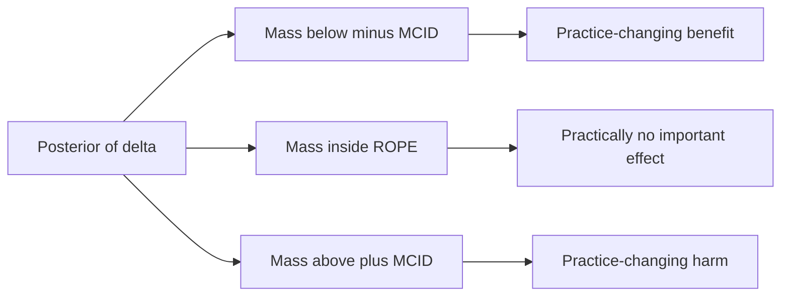
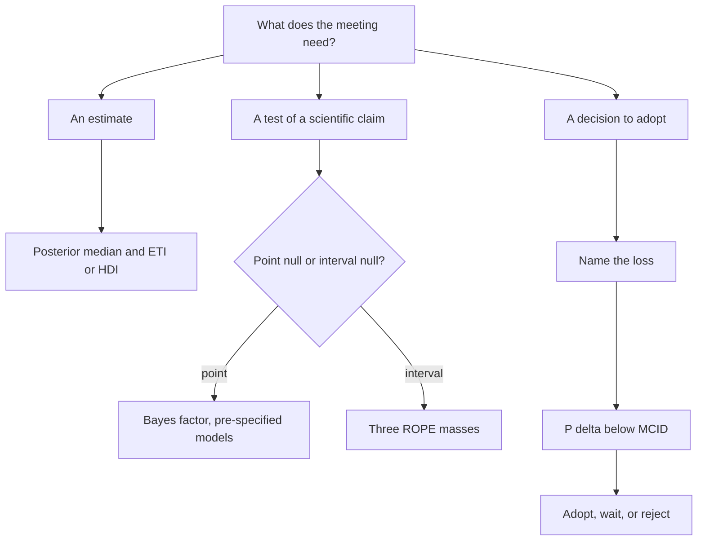

# Estimation, Credible Intervals, Hypothesis Testing, ROPE, and Bayes Factors

## Opening

A credible interval that excludes zero is not a little \(p\)-value. A Bayes factor of four is not a discovery. The posterior probability that a treatment helps is not a license to give it. Estimation, testing, and deciding are three different jobs. Neurology keeps collapsing them because journals pay for stars and committees pay for thresholds. This chapter refuses the collapse.

## Learning objectives

After working this chapter you should be able to:

- Distinguish a Bayesian credible interval from a frequentist confidence interval in what each conditions on, and distinguish a highest-density interval from an equal-tailed interval in what each optimizes.
- Compute and interpret \(P(\text{benefit} \mid y)\), and refuse to treat it as a \(p\)-value with the inequality flipped.
- Place a region of practical equivalence (ROPE) on a minimum clinically important difference for mRS or NIHSS, and report the posterior mass inside, below, and above that region.
- Say when a Bayes factor is the right tool (comparing two pre-specified scientific models) and when it is a costume for a point-null ritual.
- Choose, in a given clinical problem, whether the deliverable is an estimate, a test, or a decision, and not all three at once.

## Clinical vignette

A teaching randomized trial compares standard medical care to a new neuroprotective adjunct given before EVT. The primary estimand is the difference in mean 24-hour NIHSS change (adjunct minus control). Negative numbers favor the adjunct. The protocol’s minimum clinically important difference (MCID), written down before the first enrollment, is \(2\) points on the NIHSS: effects smaller than \(2\) points in absolute value will not change practice at this network, because the drug has cost, infusion time, and a known hypotensive signal.

You have a posterior for the mean difference \(\delta\), obtained from a `brms` Gaussian model with baseline NIHSS as a covariate and a weakly informative prior on \(\delta\). Teaching summaries: posterior median \(\delta = -1.4\), \(95\%\) equal-tailed credible interval \((-2.8, -0.03)\). Under the Normal stand-in used later in the chapter the HDI coincides with the ETI; they are not two different intervals. The frequentist analysis that a colleague ran in parallel produces \(p \approx 0.046\) for a test of \(\delta = 0\).

The sponsor wants to write “statistically significant benefit.” The network wants to know whether to add the drug to the EVT bundle. Those are different sentences. Produce the interval, the posterior probability of benefit, the ROPE masses, and a Bayes factor against a point null — then say which of those objects, if any, answers the network.

Before any computation, write four commitments: the estimand in NIHSS points; the MCID and who agreed to it; whether the meeting is asking for an estimate, a test, or a decision; and the sentence you will refuse to sign (the sponsor’s sentence is the obvious candidate). A ROPE chosen after seeing \(\hat\delta = -1.4\) is not a ROPE. It is a verdict.

## Credible intervals are statements about the parameter, after the data

A \(95\%\) posterior credible interval \(C(y)\) satisfies

\[
P\bigl(\theta \in C(y) \mid y\bigr) = 0.95.
\]

The probability is in the parameter, given the observed sample and the prior. A \(95\%\) frequentist confidence interval \(C_{\mathrm{freq}}(Y)\) is a random set, before the data, with the property that \(P\bigl(\theta \in C_{\mathrm{freq}}(Y) \mid \theta\bigr) = 0.95\) under repeated sampling (and under the coverage derivation you actually used). After the data, the frequentist interval either contains \(\theta\) or it does not. The number \(95\%\) does not migrate onto the realized interval without extra argument.

In large samples with weak priors the two numerical intervals often agree. Agreement of numbers is not agreement of meaning. When you tell a family or a DSMB that “there is a \(95\%\) probability the mean NIHSS difference lies between \(-2.8\) and \(-0.03\),” you are speaking Bayesian. Say so. When you tell them the interval was constructed by a procedure that covers \(95\%\) of the time, you are speaking frequentist. Also say so. Do not swap the scripts.

### HDI versus ETI

The equal-tailed interval (ETI) is the \(2.5\%\) and \(97.5\%\) posterior quantiles. It puts \(2.5\%\) of the posterior mass in each tail. It is invariant to monotone transformation in the sense that the quantile maps with the parameter: the ETI for \(\theta\) transforms to the ETI for \(g(\theta)\) if \(g\) is increasing.

The highest-density interval (HDI) is the shortest interval containing \(95\%\) of the posterior mass. For a unimodal symmetric posterior, HDI and ETI coincide. For a skewed posterior — a variance, an odds ratio, a hierarchical \(\tau\) — the HDI excludes a sliver of a long tail and includes more of the dense side. That is attractive as a summary of *where the mass is*. It is less attractive if your audience thinks in quantiles, and it does not transform cleanly: the HDI for \(\theta\) is not the transform of the HDI for \(\mathrm{logit}(\theta)\).

Practical rule for this book. Use ETI as the default in tables. Use HDI when the posterior is clearly skewed and the scientific object is the parameter on its natural scale (a rate, a variance). Never report both as if they were two independent confirmations. They are two summaries of one posterior.

!!! warning "Common Pitfall"
    “The \(95\%\) HDI just excluded zero” is the Bayesian costume of \(p < 0.05\). If zero is not a privileged scientific value — and for an NIHSS difference, a \(0.05\)-point effect is not different from zero in any practice-changing way — the edge of an interval around zero is the wrong theater. Use a ROPE.

## \(P(\text{benefit})\) is a posterior probability, not a flipped \(p\)

Define benefit, for this trial, as \(\delta < 0\) (adjunct better on the signed NIHSS change). Then

\[
P(\text{benefit} \mid y) = P(\delta < 0 \mid y)
\]

is the posterior mass to the left of zero. On the teaching numbers this will be large — \(0.97\) or so — because the interval barely excluded zero and the posterior is roughly symmetric.

A two-sided frequentist \(p\)-value is \(P\bigl(\text{data as or more extreme than observed} \mid \delta = 0\bigr)\). It is not \(1 - P(\text{benefit} \mid y)\). It is not \(P(\delta = 0 \mid y)\). The teaching pair \(p \approx 0.046\) and \(P(\delta < 0 \mid y) \approx 0.98\) will be misquoted as “the Bayesian analysis agrees.” It does not agree. It answers a different question, and it answers it only after a prior has been paid.

\(P(\text{benefit} \mid y)\) is the right object when the decision is asymmetric and zero is genuinely the boundary of interest: a cheap, non-toxic intervention where any benefit on the signed scale is welcome. It is the wrong object when effects smaller than an MCID are not worth the harm. Then the right probability is \(P(\delta < -2 \mid y)\), or the three ROPE masses below.

!!! tip "Clinical Pearl"
    Families ask “will this help?” They do not ask “is the mean difference exactly zero?” Translate their question into a posterior probability on a region, with the region named in NIHSS points or in the chance of walking independently, not in the chance of beating a point null. If you cannot name the region, you are not ready to quote a probability.

## ROPE: make “practically null” a scientific interval

A region of practical equivalence is an interval on the parameter that you have committed to treat as equivalent to no *important* effect. For the vignette,

\[
\mathrm{ROPE} = (-2,\ 2)
\]

on the NIHSS-difference scale. The number \(2\) is not a statistical constant. It is a clinical claim: smaller average shifts will not change the EVT bundle, given this drug’s cost and hypotension signal. A different drug, or a different network, may choose \(1\). Write the number down in the protocol. Do not choose it after seeing \(\hat\delta = -1.4\).

The posterior is then partitioned into three masses:

- \(P(\delta < -2 \mid y)\): practice-changing benefit;
- \(P(\delta \in (-2, 2) \mid y)\): practically equivalent to no important effect;
- \(P(\delta > 2 \mid y)\): practice-changing harm.

Kruschke’s decision rule — accept practical equivalence if the entire \(95\%\) HDI sits inside the ROPE; reject it if the entire HDI sits outside — is one possible rule. It is not mandatory. Reporting the three masses is mandatory. A teaching posterior centered at \(-1.4\) with a \(95\%\) ETI of \((-2.8, -0.03)\) will typically put a large mass inside the ROPE and a smaller mass in the benefit tail. That is the scientific result: probable directionally negative, not yet a practice-changing mean.

For ordinal mRS the ROPE belongs on a pre-specified estimand: a difference in the probability of mRS \(0\)–\(2\), or a common odds ratio in a proportional-odds model, or a utility-weighted mRS. A ROPE of \((-0.03,\ 0.03)\) on the risk difference for independence is a different claim from a ROPE of \((0.9,\ 1.1)\) on an odds ratio. Do not import an NIHSS ROPE onto an odds ratio and hope the units forgive you.



How is an MCID chosen without becoming a post-hoc weapon? Three sources, in order of honesty. First, a pre-trial clinician panel that is asked, “How many NIHSS points would change whether you add this infusion to a 2 a.m. EVT?” — not “how many points would look good in *Neurology*.” Second, the harm side of the same drug: if hypotension sufficient to delay puncture occurs in a teaching \(8\%\) of adjunct-treated patients, the benefit has to clear that expected harm, which is a decision-analytic MCID, not a round number. Third, precedent from trials the network already treats as practice-changing; those precedents are usually larger than two NIHSS points, which is useful discipline. What is not a source: the standard error of the current trial. An MCID that shrinks when \(n\) grows is a \(p\)-value in costume.



## Bayes factors: when they earn their keep

A Bayes factor comparing models \(M_0\) and \(M_1\) is

\[
\mathrm{BF}_{10} = \frac{p(y \mid M_1)}{p(y \mid M_0)} = \frac{p(M_1 \mid y)}{p(M_0 \mid y)} \Big/ \frac{p(M_1)}{p(M_0)}.
\]

It is the factor by which the data update the model odds. It is not a posterior probability. A \(\mathrm{BF}_{10} = 4\) with prior odds \(1:1\) yields posterior odds \(4:1\), hence \(P(M_1 \mid y) = 0.80\). The same Bayes factor with prior odds \(1:10\) yields posterior odds \(0.4:1\). Quoting the factor without the prior odds is how a modest likelihood ratio becomes a press release.

Bayes factors earn their keep when:

- the two models are scientifically real (a point-null *mechanism* versus a signed effect; a hierarchical model versus complete pooling);
- the priors under each model are proper and were written down first;
- you need the *relative* evidence, not a posterior probability on a region of a single model.

They do not earn their keep when:

- \(M_0\) is \(\delta = 0\) because a journal prefers stars, not because anyone believes the drug’s effect is a Dirac mass;
- the prior under \(M_1\) is a wide Normal that wastes mass on NIHSS differences of \(15\) points, which punishes \(M_1\) for reasons unrelated to the data (the Lindley–Jeffreys paradox in applied clothing);
- you have already committed to estimation-plus-ROPE and are adding a Bayes factor as extra garnish.

Savage–Dickey is a convenient computation for a nested point null: \(\mathrm{BF}_{01} = p(\delta = 0 \mid y) / p(\delta = 0)\) when the prior is continuous and \(M_1\) nests \(M_0\). It is only as honest as the height of the prior at zero. A very flat prior makes \(M_0\) look good. That is not a property of the data.

!!! note "Mathematical Detail"
    The marginal likelihood \(p(y \mid M) = \int p(y \mid \theta, M)\, p(\theta \mid M)\, d\theta\) averages the likelihood over the prior, not over the posterior. A prior that is even slightly wrong in the tails can dominate the integral. This is why bridge sampling or a carefully parameterized `bridgesampling` call on a `brms` fit can return a Bayes factor that is more sensitive to the prior than any posterior median is. If your scientific claim is about \(\delta\) under one model, compute \(P(\delta \in A \mid y)\) under that model. Do not launder the claim through a marginal likelihood you have not inspected.

## Estimation, testing, deciding

These are not three names for one computation.

**Estimate** when the meeting needs a magnitude: how large is the NIHSS shift, how uncertain, in which direction. Deliver a posterior median and an ETI, on the scale of the estimand, with the prior named.

**Test** when two scientific stories compete and only one can be true enough to keep: a point-null mechanism, a ROPE-null of practical equivalence, a comparison of two pre-specified likelihoods. Deliver ROPE masses or a Bayes factor, not both unless you can say why.

**Decide** when an action will be taken: adopt the adjunct, wait for more data, reject it. Deliver the posterior probability that the effect clears the MCID, or an explicit expected-utility calculation. A decision needs a loss. If nobody will name the loss, you are still in estimation, and “statistically significant” is not a decision rule.

The vignette’s sponsor is asking you to test. The network is asking you to decide. The posterior median is the estimate both of them will ignore if you do not put it first.

Bedside communication follows the same fork. A family asking “will this help him?” is asking for a predictive probability of a patient-level event (walk independently, go home), not for \(P(\delta < 0 \mid y)\). That predictive probability is Chapter 5’s object, now with covariates. A DSMB asking “is the mean effect past our MCID?” is asking for a ROPE mass. A journal asking “was it significant?” is asking you to join a ritual. Answer the family and the DSMB. Decline the ritual, or answer it in a sentence that names the point null as the uninteresting hypothesis it is.

| Frequentist object | Rough Bayesian counterpart | Do not treat as equal |
| --- | --- | --- |
| Point estimate \(\hat\theta\) | Posterior mean / median / mode | Different loss functions |
| \(95\%\) CI | \(95\%\) CrI (ETI or HDI) | Conditioning is different |
| Two-sided \(p\) for \(H_0: \theta = 0\) | \(P(\theta > 0 \mid y)\) or a BF against a point null | Different questions |
| Equivalence test (TOST) | Posterior mass inside a ROPE | Different operating characteristics |
| Power | Predictive probability of a successful trial | Power conditions on a fixed \(\theta\) |
| Type I error | Not a posterior quantity | Requires a sampling plan |

| Question | Object to compute | Object to refuse |
| --- | --- | --- |
| How large is the effect? | Posterior median and ETI | A star |
| Did we beat zero? | \(P(\delta < 0 \mid y)\), if zero is the boundary | A Bayes factor nobody pre-specified |
| Did we beat the MCID? | \(P(\delta < -\mathrm{MCID} \mid y)\) and ROPE masses | An HDI that “just misses” \(-2\) |
| Which of two models is better supported? | Bayes factor with named priors | A LOO bake-off over twenty fits |
| Should we adopt the drug? | Decision probability under a named loss | Any of the above, alone |

## Worked solution to the vignette

Quote the estimate first. On the teaching posterior, the mean NIHSS difference is about \(-1.4\) points, \(95\%\) ETI \((-2.8, -0.03)\). The adjunct is probably better than control on this scale. The magnitude sits below the network’s MCID of \(2\) points.

Quote \(P(\delta < 0 \mid y)\) second, as a directional probability, not as a discovery. Teaching value: approximately \(0.98\). This is compatible with a frequentist \(p \approx 0.046\) in direction and incompatible with it in meaning. Write both sentences.

Quote the ROPE masses third. With \(\mathrm{ROPE} = (-2, 2)\) and a posterior centered at \(-1.4\) with the stated width, most of the mass will lie inside the ROPE, a minority in \((-\infty, -2)\), and almost none above \(+2\). (Compute them from draws; do not eyeball.) The honest summary: directional benefit is probable; practice-changing benefit, as this network defined it, is not established.

Quote a Bayes factor only if the protocol asked for one. Against a point null \(\delta = 0\) with, say, a Normal(\(0\), \(3^2\)) prior under the alternative (an NIHSS SD of \(3\) is a teaching choice, not a default), the Savage–Dickey factor will be modest — evidence against the point null, not a license to adopt. If the protocol did not ask, omit it. Adding it now is garnish.

The sponsor’s sentence (“statistically significant benefit”) is refused. The interval excludes zero; the ROPE does not exclude the practically null region. The network’s sentence is: do not add the drug to the bundle on this endpoint; a larger trial or a different estimand (utility-weighted mRS at 90 days) would be required to meet the MCID the network itself wrote down.

!!! example "R Deep Dive"
    Posterior summaries with `posterior` / `tidybayes`, plus an explicit ROPE calculation on teaching draws. The `brms` fit is shown as a specification; the ROPE arithmetic is done on simulated draws so the block runs without Stan.

```r
# Teaching estimation and ROPE: NIHSS difference, adjunct vs control
# Teaching numbers. seed for the stand-in posterior draws.
# Replace the rnorm() stand-in with as_draws_df(fit) after brm().

library(posterior)
library(tidybayes)
library(dplyr)
library(ggplot2)

set.seed(20260818)

# Stand-in posterior draws for delta (adjunct minus control), NIHSS points.
# After a real fit, use:
#   draws <- as_draws_df(fit) %>% transmute(delta = b_adjunct)
delta <- rnorm(4000, mean = -1.4, sd = 0.70)

rope_lo <- -2
rope_hi <-  2

summ <- tibble(delta = delta) %>%
  summarise(
    median = median(delta),
    eti_lo = quantile(delta, 0.025),
    eti_hi = quantile(delta, 0.975),
    hdi = list(tidybayes::hdi(delta, .width = 0.95)),
    p_benefit = mean(delta < 0),
    p_mcid = mean(delta < rope_lo),
    p_rope = mean(delta > rope_lo & delta < rope_hi),
    p_harm = mean(delta > rope_hi)
  )

summ

# brms specification that would have produced a real posterior
# library(brms)
# priors <- c(
#   prior(normal(0, 4), class = Intercept),
#   prior(normal(0, 3), class = b, coef = adjunct),
#   prior(normal(0, 1), class = b, coef = nihss0),
#   prior(exponential(0.3), class = sigma)
# )
# fit <- brm(
#   nihss_change ~ adjunct + nihss0,
#   data = neuroprot,
#   family = gaussian(),
#   prior = priors,
#   seed = 20260818,
#   iter = 4000,
#   warmup = 1000,
#   chains = 4,
#   cores = 4,
#   refresh = 0
# )

tibble(delta = delta) %>%
  ggplot(aes(delta)) +
  geom_histogram(aes(y = after_stat(density)), bins = 40, fill = "grey35") +
  geom_vline(xintercept = c(rope_lo, rope_hi), linetype = 2) +
  geom_vline(xintercept = 0, linetype = 3) +
  labs(
    x = "Mean NIHSS difference (adjunct minus control)",
    y = "Posterior density",
    title = "Teaching posterior with ROPE (-2, 2)",
    subtitle = "Dashed: MCID bounds. Dotted: point null."
  ) +
  theme_minimal(base_size = 12)
```

The dashed lines are the decision. The dotted line is the ritual. Report the masses between the dashed lines before anyone mentions \(p \approx 0.046\).

### For the biostatistician / methodologist

HDI computation on discrete or multimodal posteriors is not unique; `tidybayes::hdi` returns the shortest covering interval and will silently pick one mode if you do not look. For a mixture (a spike-and-slab, or a hierarchical prediction that has not concentrated), plot the density before quoting a single HDI.

ROPE decision rules have frequentist operating characteristics that depend on the prior, the sample size, and the width of the ROPE. They are not TOST. If a regulator asks for Type I error, you must simulate the whole decision rule, including the prior, under a point null or under the ROPE boundary. FDA Bayesian device guidance is explicit that operating characteristics are part of the design, not an insult to the posterior.

Bayes factors between nested linear models with default \(g\)-priors are a different literature (Zellner, Liang, Rouder). They can be used for variable inclusion. They should not be used, uncritically, as a substitute for a ROPE on a treatment effect whose scale is clinically defined. Inclusion of a covariate and importance of a treatment are not the same problem.

Finally, \(P(\delta < 0 \mid y)\) under a symmetric prior and a symmetric likelihood is a monotone function of the usual \(z\) statistic. That monotonicity is why people think the Bayesian probability “agrees with \(p\).” The agreement breaks as soon as the prior is informative, the likelihood is skewed, or the hypothesis is a ROPE rather than a point. Those are the usual clinical conditions. Do not teach the special case as the rule.

## Exercises

1. **Bedside translation.** A family hears “\(97\%\) probability of benefit” and “the average improvement was \(1.4\) NIHSS points, and we said we needed \(2\).” Write the paragraph you say next, without using the words posterior, interval, or significant.

2. **HDI versus ETI.** A posterior for an odds ratio is right-skewed: ETI \((0.92, 2.40)\), HDI \((0.80, 2.15)\). Which do you put in the abstract, and why? What happens if you instead report both on the log-odds scale?

3. **ROPE construction.** For a 90-day mRS \(0\)–\(2\) risk difference in a mild-stroke trial, defend a ROPE of \((-0.02, 0.02)\) or reject it. What cost and harm information would change your width?

4. **Bayes factor restraint.** A colleague computes \(\mathrm{BF}_{01} = 4\) for the vignette — “evidence for no effect” — using a Normal(\(0\), \(20^2\)) prior under \(M_1\). Why is this factor hard to interpret, and what prior would you have demanded in the protocol?

5. **Map the objects.** Using the table above, assign each of the following to estimate / test / decide: a DSMB futility look; a label claim that the drug “improves NIHSS”; a grant progress report; a shared decision with a single eligible patient.

6. **Compute.** Using the R block’s teaching draws (or a fresh `rnorm(4000, -1.4, 0.70)`), report \(P(\delta < 0)\), \(P(\delta < -2)\), and the ROPE mass. If \(P(\delta < -2)\) is below \(0.25\), write the one-sentence recommendation to the network.

## Further reading

- Gelman A, Carlin JB, Stern HS, Dunson DB, Vehtari A, Rubin DB. *Bayesian Data Analysis*. 3rd ed. CRC Press; 2013. Chapters 4 and 5 on estimation and model comparison.
- Kruschke JK. Rejecting or accepting parameter values in Bayesian estimation. *Adv Methods Pract Psychol Sci*. 2018;1:270-280. ROPE as an explicit interval null.
- Wagenmakers E-J, Lodewyckx T, Kuriyal H, Grasman R. Bayesian hypothesis testing for psychologists: A tutorial on the Savage–Dickey method. *Cogn Psychol*. 2010;60:158-189. Use for the computation; do not import the point-null habit uncritically.
- Spiegelhalter DJ, Abrams KR, Myles JP. *Bayesian Approaches to Clinical Trials and Health-Care Evaluation*. Wiley; 2004. Predictive probability, decision, and monitoring.
- Sox HC, Higgins MC, Owens DK. *Medical Decision Making*. 2nd ed. Wiley-Blackwell; 2013. Thresholds, loss, and why a probability is not a decision.
- Wasserstein RL, Lazar NA. The ASA’s statement on \(p\)-values. *Am Stat*. 2016;70:129-133. What a \(p\)-value is not; still the right warning label.
- U.S. Food and Drug Administration. Guidance for the Use of Bayesian Statistics in Medical Device Clinical Trials. 2010. Success criteria, ROPE-like margins, and operating characteristics.
- CONSORT 2010 statement. Estimands, intervals, and the reporting of the analysis you pre-specified.

!!! success "Key Takeaway"
    A credible interval answers a magnitude question after the data; a confidence interval answers a coverage question before them. \(P(\text{benefit})\) is a posterior probability on a region you must name; it is not a flipped \(p\). A ROPE turns “practically no effect” into a clinical interval and splits the posterior into benefit, equivalence, and harm. Bayes factors compare pre-specified models; they are not a mandatory garnish on an estimation problem. Decide whether the meeting needs an estimate, a test, or a decision, compute only that object, and do not let a star on \(\delta = 0\) adopt a drug whose posterior still lives inside the MCID you wrote down yourself.
