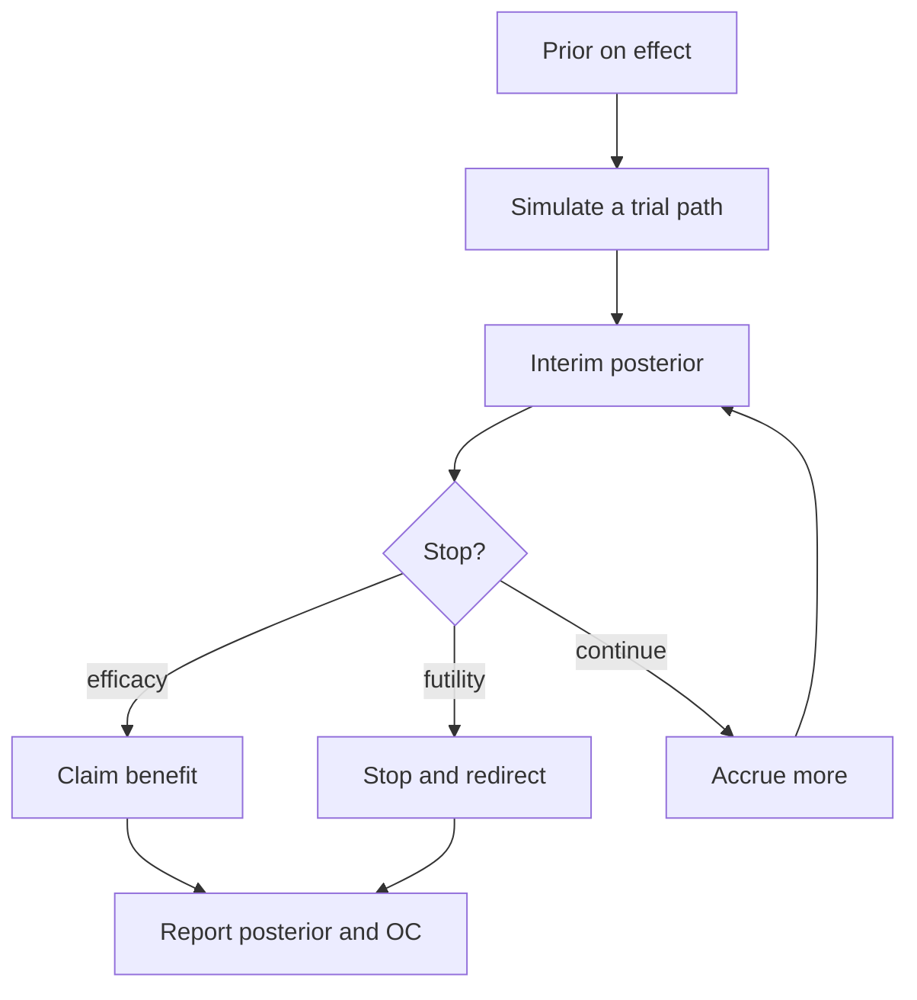
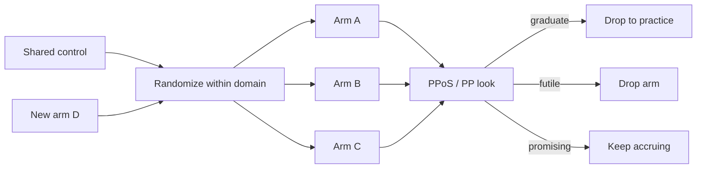

# Bayesian Sample Size, Sequential Analysis, and Adaptive / Platform Designs

## Opening

The trial coordinator wants a number. A single \(n\). The DSMB wants a rule for looking early without “spending alpha.” The sponsor wants to know whether a rare-disease program is even feasible. None of those requests is a statistical question until you name the decision it is supposed to serve: start, stop, drop an arm, add an arm, or keep accruing because the current posterior is still too wide to act. Sample size is not a property of a formula. It is a property of a decision under uncertainty.

## Learning objectives

After working this chapter you should be able to:

- Distinguish frequentist power at a point alternative from Bayesian assurance (expected power) and say when each number is the honest one to quote.
- Write a posterior-probability stopping rule and a predictive-probability-of-success (PPoS) rule, and explain why they answer different questions.
- Sketch a platform trial in the I-SPY / REMAP-CAP spirit and map the same machinery onto a stroke or neuro-ICU question.
- State what Bayesian sequential monitoring does *and does not* buy you with respect to multiplicity and type I error.
- Implement a Monte Carlo sample-size calculation for a Beta–Binomial success probability.

## Clinical vignette

A regional academic consortium wants a randomized trial of adjunctive second-line immunotherapy versus standard first-line care in anti-LGI1 encephalitis. The disease is rare: the three participating centers together see perhaps 18–24 new cases a year that would meet proposed eligibility. The proposed primary endpoint is “good functional recovery,” defined for teaching purposes as modified Rankin Scale (mRS) 0–2 at 6 months *or* return to the patient’s pre-morbid occupational baseline, whichever is more favorable. Historical observational series — **teaching numbers, not a meta-analysis of the literature** — suggest that under current care the success probability sits somewhere near 0.45, with honest uncertainty spanning 0.30 to 0.60. The investigative therapy is hoped to raise that probability by an absolute 20 points. A senior colleague asks for “80% power.” A junior colleague asks whether you can stop at \(n = 40\) if the first looks are spectacular. The rare-disease advocate on the steering committee asks whether a platform that can add the next antibody-defined encephalitis cohort later would be more ethical than a one-and-done two-arm trial.

Do not compute yet. Write down, in one sentence each: (1) what “success” means for a future patient, (2) what would make you stop for futility, and (3) what information you would need before you would let a later, different autoantibody cohort share this control arm.

## Fixed \(n\) is a special case of a sequential decision

Classical sample-size formulae assume a single look, a point null, a point alternative, and a type I / type II pair that someone else chose. Those assumptions are not wrong. They are a *policy*: we will pretend \(\theta\) equals \(\theta_{\text{alt}}\), we will pretend we look once, and we will pretend that a two-sided \(p < 0.05\) is the only decision that matters. Neurology trials violate every clause. Patients accrue slowly. The interesting effect is not a point. The DSMB will look. The clinically actionable contrast is often a threshold on a posterior probability, not a \(p\)-value.

The general principle is older than any particular software: choose the smallest experiment such that, averaging over the uncertainty you actually have, the decision you intend to make will be correct often enough to justify the cost in patients, time, and opportunity. That sentence is the definition of a Bayesian sample-size problem. Power at a point is the special case in which the prior on the treatment effect is a spike at \(\theta_{\text{alt}}\) and the decision rule is a frequentist test.



The loop is the design. The sample size is whatever that loop usually stops at.

## Power, assurance, and the prior you are willing to defend

Frequentist power is

\[
\text{Power}(\theta) = \Pr\bigl(\text{reject } H_0 \mid \theta\bigr).
\]

It is a function, not a number. Quoting “80% power” always smuggles in a \(\theta\). In a binary-outcome encephalitis trial, \(\theta\) might be the difference in success probabilities \(\delta = p_1 - p_0\). Power at \(\delta = 0.20\) can be 80% while power at \(\delta = 0.08\) — a difference many clinicians would still call worthwhile — is 25%. Patients and funders experience the average of that curve, not its value at the most optimistic slide in the grant.

Assurance, also called expected power or Bayesian average power, integrates the power curve against a design prior \(\pi(\theta)\):

\[
\text{Assurance} = \int \text{Power}(\theta)\, \pi(\theta)\, d\theta = \Pr\bigl(\text{reject } H_0\bigr),
\]

where the probability is now joint over data *and* parameter. If your design prior is a spike, assurance collapses to power. If your design prior is the same skeptical distribution you would use to analyze the trial, assurance is often much lower than the grant’s power number, and that is information, not a defect.

Two priors can and often should differ. The *design prior* encodes the uncertainty used to plan: “we think the success rate on control is around 0.45 but we would not be shocked by 0.30 or 0.60.” The *analysis prior* is what will appear in the primary posterior: often flatter, sometimes weakly informative around a null increment, sometimes a skeptical prior that puts mass near \(\delta = 0\). Using an enthusiastic design prior and a skeptical analysis prior is conservative and usually honest. Using the reverse is how protocols acquire 90% power on paper and 40% assurance in the world.

!!! warning "Common Pitfall"
    Do not report assurance computed under an enthusiastic design prior as if it were power at a clinically minimal effect. Reviewers who know the difference will treat the number as marketing. State the prior, plot the power curve, and give assurance as a second number.

A compact way to talk to a DSMB or a rare-disease steering committee is a small table of *operating characteristics* (OC) under a handful of truths, plus one row that averages them. Teaching numbers for a two-arm binary trial with 1:1 randomization and a posterior-probability success rule \(P(\delta > 0 \mid y) > 0.975\):

| Assumed true \(\delta\) | Approx. power / stop-for-efficacy rate | Typical stopping \(n\) (both arms) | Comment |
| --- | ---: | ---: | --- |
| 0.00 | 0.03–0.05 | 80 (max) | Type I under this rule and these looks |
| 0.08 | 0.28 | 70 | Minimal interesting effect |
| 0.20 | 0.78 | 52 | Hoped-for effect |
| Design prior (mixture) | Assurance 0.51 | 58 | The number patients actually face |

Those cells are **teaching numbers** generated from the kind of Monte Carlo you will write below. They are not results from any published encephalitis trial. The qualitative lesson is stable: if the hoped-for effect is in the right tail of a defensible prior, assurance sits well below power-at-the-hope, and adaptive stopping buys you more on the typical \(n\) than on the assurance itself.

## Posterior-probability stopping

A posterior-probability (PP) rule is a threshold on a statement clinicians already speak:

- **Efficacy:** stop and claim benefit if \(P(\delta > \delta_0 \mid y_{1:t}) > \eta\), for example \(\delta_0 = 0\) and \(\eta = 0.975\).
- **Futility:** stop and abandon if \(P(\delta > \delta_0 \mid y_{1:t}) < \varepsilon\), for example \(\varepsilon = 0.10\).
- **Continue:** otherwise accrue to the next look, or to a pre-declared maximum \(N\).

The threshold \(\delta_0\) is a *clinical* object. For thrombolysis or EVT it might be a 3-month utility-weighted mRS increment. For a rare encephalitis trial it might be “any improvement over current care,” \(\delta_0 = 0\), or a more demanding “worth the infection risk,” \(\delta_0 = 0.10\). Changing \(\delta_0\) changes the meaning of the trial more than changing \(\eta\) from 0.97 to 0.98.

PP rules are not automatically calibrated to a 5% type I error. If you look every 10 patients and stop at \(\eta = 0.95\), you will claim benefit under a true null more often than 5% of the time. The posterior at each look is still a correct posterior for that look. What inflates is the *trial-wise* false-positive rate of the *decision procedure*. Those are different sentences. Regulators, and any DSMB that has been burned, care about both.

!!! tip "Clinical Pearl"
    When a colleague says “Bayesian trials can look as often as they want,” translate: the posterior does not require an alpha-spending function to remain a posterior. The *claim* still has an operating characteristic, and that OC is established by simulation, not by rhetoric.

## Predictive probability of success

Predictive probability of success answers a different question: if we continue this trial along a stated path — to the next look, or to maximum \(N\), or through a remaining sequence of adaptive decisions — what is the probability that the *eventual* analysis will meet the success criterion?

Let \(y_{\text{obs}}\) be the data so far and \(y_{\text{fut}}\) the yet-unseen data. Let \(S\) be the event that the final posterior (or the final frequentist test, if that is how the protocol is written) crosses the success bar. Then

\[
\text{PPoS} = P\bigl(S \mid y_{\text{obs}}\bigr) = \int P\bigl(S \mid y_{\text{obs}}, y_{\text{fut}}\bigr)\, p(y_{\text{fut}} \mid y_{\text{obs}})\, dy_{\text{fut}}.
\]

The inner probability is usually 0 or 1 once \(y_{\text{fut}}\) is filled in; the outer integral is a posterior predictive average. PPoS is the right number for *continuation* decisions. A trial can have a current posterior mean that looks promising and a PPoS of 12%, because almost no plausible future sample will push the posterior over a strict bar. Conversely, a trial can sit just short of \(\eta\) with a PPoS of 80%, because a modest amount of additional data will almost surely finish the job.

Goldilocks designs (Broglio, Connor, Berry) use this idea to pick a sample size that is neither too small (PPoS still miserable, posterior still too wide) nor too large (the decision is already made). Accrual continues while PPoS lives in a middle band; the trial stops for success, for futility, or at a cap. The name is a joke. The structure is a sequential decision problem with an explicit cost of another patient.

!!! note "Mathematical Detail"
    PPoS is not the posterior probability of a positive effect. It is the posterior predictive probability of a *future decision*. If the success criterion is \(P(\delta > 0 \mid y_{\text{all}}) > 0.975\), then PPoS can be small even when \(P(\delta > 0 \mid y_{\text{obs}}) = 0.90\). Quoting the two numbers as if they were interchangeable is the most common communication failure at a Bayesian DSMB.

A second teaching table, still with invented looks at an encephalitis trial, shows why both numbers belong in the closed session:

| Look (\(n\) per arm) | Successes Tx / Ctrl | \(P(\delta > 0 \mid y)\) | PPoS to \(N=40\) per arm | Action under a Goldilocks rule |
| --- | --- | ---: | ---: | --- |
| 10 / 10 | 7 / 4 | 0.89 | 0.41 | Continue (middle band) |
| 20 / 20 | 14 / 8 | 0.96 | 0.71 | Continue; efficacy close |
| 20 / 20 | 9 / 9 | 0.50 | 0.06 | Stop for futility |
| 30 / 30 | 22 / 12 | 0.991 | — | Stop for efficacy |

Again: **teaching numbers**. The pattern is what you carry to the next protocol. Early noisy leads have mediocre PPoS. Clear mid-trial nulls have tiny PPoS. Spectacular late leads have already crossed the PP bar.

## Platform trials, arm drop, arm add

A two-arm fixed trial asks one question and then dissolves the infrastructure. A platform trial keeps the infrastructure and lets the questions change. I-SPY 2 did this in neoadjuvant breast cancer: shared controls, biomarker signatures, response-adaptive randomization, graduation or dropping of arms against a predictive-probability bar. REMAP-CAP did it in severe pneumonia and then in COVID-19: multiple domains (antibiotics, steroids, antivirals, immunomodulation), response-adaptive randomization, and the ability to add a domain when the science moved. The general principle is not “oncology” or “ICU.” It is *perpetual* learning with a shared control and pre-declared rules for membership in the experiment.

Stroke and neuro-ICU are structurally well suited to the same skeleton. Large-vessel occlusion care already has a shared control pathway (alteplase or tenecteplase, EVT yes/no, blood-pressure target, hemicraniectomy threshold). Intracerebral hemorrhage already has competing tactics (intensive lowering of blood pressure, reversal strategy, minimally invasive evacuation, intensive care bundles). Antibody-mediated encephalitis has a natural biomarker partition: LGI1, CASPR2, NMDAR, AMPAR, and the next antigen the lab will name next year. A one-and-done LGI1 trial that cannot accept a CASPR2 arm without a new IND and a new control group will waste the most expensive thing in rare-disease research, which is a running network.



Several design choices are not optional if the platform is to remain interpretable.

**Shared control.** Borrowing control information across time requires a model for drift. A simple hierarchical exchangeable model on control rates is a start. A time-smoothed control (random walk or spline on the logit) is more honest when supportive care is improving. If you are not willing to model drift, do not borrow ancient controls.

**Response-adaptive randomization (RAR).** Shifting allocation toward the arm that is winning reduces the number of patients assigned to inferior arms. It also complicates estimation and can starve a slowly accruing but eventually superior arm. In a rare encephalitis network, simple equal randomization with drop/add often dominates clever RAR because the binding constraint is total eligible patients, not the allocation ratio.

**Domains versus arms.** REMAP-CAP’s domain structure — independently randomizing steroids and antivirals, say — is a factorial in sequential clothing. Interactions must be declared. In a neuro-ICU platform, “BP target” and “evacuation strategy” are not independent scientific questions; the protocol should say so.

**Graduation.** An arm that crosses a high PP or PPoS threshold can be declared standard and become the new control. That is the ethical point of a platform. It is also the inferential point at which you must freeze a primary analysis for that comparison, or you will keep moving the goalposts.

!!! tip "Clinical Pearl"
    The scientific unit of a platform is the *comparison*, not the protocol number. Write the statistical analysis plan per comparison, with a pre-declared control, a pre-declared estimand, and a pre-declared rule for what happens to that comparison when a new arm arrives.

## Multiplicity in Bayesian sequential monitoring

There is a true statement and a false statement that share vocabulary.

True: the posterior \(p(\theta \mid y_{1:t})\) is the posterior given the data observed so far. Optional stopping that depends on the data does not, by itself, invalidate Bayes’ theorem. If you report the posterior and the stopping rule, a Bayesian reader can interpret the result.

False: therefore type I error is a non-issue, you may use \(\eta = 0.95\) at every weekly look, and a platform with twelve arms needs no further thought about false graduation.

The false statement confuses a coherent posterior with a calibrated decision procedure. A decision procedure has operating characteristics under stated truths, including the global null that no arm works. Those OC depend on how often you look, how many arms you compare to the same control, whether you use a hierarchical shrinkage model, and whether “success” is defined marginally or jointly.

Pragmatic rules that keep both camps in the room:

1. **Simulate the exact design**, including every look, every drop/add rule, and the analysis prior, under a null, under a single-active-arm alternative, and under a design prior. Report type I, power/assurance, expected \(n\), and expected duration.
2. **Harden the efficacy bar** when you look often. \(\eta = 0.992\) at each look can be calibrated to a trial-wise one-sided 2.5% false-positive rate for a given look schedule; \(\eta = 0.95\) usually cannot.
3. **Shrink across arms** in a platform. A hierarchical model on treatment increments, or a spike-and-slab, is the Bayesian answer to many-arm multiplicity. It is not automatic type I control, but it is the right bias–variance trade.
4. **Separate confirmation from learning.** An arm that graduates on a PPoS rule can be required to pass a locked, non-adaptive analysis on a pre-declared cohort — the platform analogue of a phase III.

FDA’s Bayesian device guidance and the later adaptive-design guidance both reduce to this: show the OC. Neurology investigators who treat simulation as a regulatory tax rather than as part of the design will write protocols that neither camp trusts.

### For the biostatistician / methodologist

Let \(p_0, p_1\) be arm-wise success probabilities with independent Beta analysis priors, \(p_k \sim \operatorname{Beta}(a_k, b_k)\). After \(s_k\) successes in \(n_k\) trials the posterior is \(\operatorname{Beta}(a_k + s_k, b_k + n_k - s_k)\). The posterior probability \(P(p_1 > p_0 \mid y)\) is available in closed form as a finite sum or by direct Monte Carlo from the two Betas. Predictive success counts are Beta–Binomial. A design-stage Monte Carlo therefore needs no MCMC: draw \((p_0, p_1)\) from the design prior, draw the sequential data, apply the PP / PPoS rule, and tally decisions.

PPoS to a fixed maximum \(N\) is, for each posterior draw of \((p_0, p_1)\), the probability that the remaining Beta–Binomial counts push the final \(P(p_1 > p_0 \mid y_{\text{all}})\) over \(\eta\). Nested Monte Carlo is enough at design stage. At an interim analysis you can replace the outer draw with the current posterior.

Goldilocks and platform rules are the same algorithm with a richer state: current arms, current allocation probabilities, current time-trend model for control. The computational cost is still simulation, not a new theory of sequential analysis. What *is* a theory question is the estimand after RAR and after a control that has itself been replaced mid-platform. Write the estimand first — a pairwise increment against a contemporaneous control, or a time-averaged increment against a smoothed control — and only then write the stopping rule.

Frequentist sequential boundaries (O’Brien–Fleming, Pocock, error-spending) can be recast as time-varying \(\eta_t\). Doing so is sometimes the shortest path through a regulatory conversation. It does not make the design “less Bayesian.” It makes the OC transparent.

## R: Monte Carlo sample size for a Beta–Binomial success probability

The encephalitis vignette is a single-arm feasibility question before it is a two-arm trial: how many patients do we need before \(P(p > 0.45 \mid y)\) is usually large, if the design prior thinks \(p\) is near 0.65? The code below does not fit a `brms` model; the conjugate structure is the model. It is copy-paste ready.

```r
# Beta-Binomial assurance and typical n for a single-arm success probability.
# Teaching calculation for an anti-LGI1 encephalitis feasibility cohort.
# Design prior: p ~ Beta(6.5, 3.5)  (mean 0.65, wide).
# Analysis prior: p ~ Beta(1, 1).
# Success: P(p > 0.45 | y) > 0.90.
# Looks: every 10 patients from 20 to 80.

set.seed(20260818)

design_a <- 6.5
design_b <- 3.5
analysis_a <- 1
analysis_b <- 1
p0 <- 0.45
eta <- 0.90
looks <- seq(20, 80, by = 10)
n_sims <- 4000

# Posterior probability P(p > p0 | s, n) under a Beta analysis prior.
pp_gt <- function(s, n, a = analysis_a, b = analysis_b, thresh = p0) {
  stats::pbeta(thresh, a + s, b + n - s, lower.tail = FALSE)
}

one_path <- function() {
  p <- stats::rbeta(1, design_a, design_b)
  y <- stats::rbinom(max(looks), size = 1, prob = p)
  stop_n <- NA_integer_
  stop_pp <- NA_real_
  for (n in looks) {
    s <- sum(y[seq_len(n)])
    pp <- pp_gt(s, n)
    if (pp > eta) {
      stop_n <- n
      stop_pp <- pp
      break
    }
  }
  if (is.na(stop_n)) {
    n <- max(looks)
    s <- sum(y)
    stop_n <- n
    stop_pp <- pp_gt(s, n)
  }
  c(p = p, stop_n = stop_n, stop_pp = stop_pp, success = as.numeric(stop_pp > eta))
}

draws <- replicate(n_sims, one_path())
assurance <- mean(draws["success", ])
mean_n <- mean(draws["stop_n", ])
q_n <- stats::quantile(draws["stop_n", ], c(0.1, 0.5, 0.9))

assurance
mean_n
q_n

# Power at a point alternative, for the grant table.
power_at <- function(p_true, n = 60, n_sims = 4000) {
  s <- stats::rbinom(n_sims, size = n, prob = p_true)
  mean(pp_gt(s, n) > eta)
}
c(p065 = power_at(0.65), p055 = power_at(0.55), p045 = power_at(0.45))
```

Run it before you quote a number in a protocol. Change the design prior until a skeptical colleague will sign the paragraph that describes it. If assurance at a feasible maximum \(N\) is 0.40, the honest next sentence is not “we will use a more optimistic prior.” It is “this question is not answerable in a two-year, three-center, single-arm cohort,” which is how platforms earn their keep.

!!! example "R Deep Dive"
    The two-arm version replaces one Beta with two, replaces `pp_gt` with the Monte Carlo probability that a draw from \(\operatorname{Beta}(a_1+s_1, b_1+n_1-s_1)\) exceeds a draw from the control posterior, and accumulates patients in pairs. PPoS is a nested loop: for each current posterior draw, simulate the remaining patients to \(N\) and ask whether the final PP exceeds \(\eta\). A few thousand outer and a few hundred inner draws are enough to design; use more at a live interim.

## Worked solution to the opening vignette

**(1) What success means.** For a future patient, success is a 6-month outcome worth the incremental infection and hospitalization risk of second-line immunotherapy: mRS 0–2 *or* return to pre-morbid occupation. That is an estimand, not a convenience composite. Write it so that a site investigator can assign it without a central committee on every case, then audit a sample.

**(2) When to stop for futility.** Not when the posterior mean increment is “small.” Stop when PPoS to the feasible maximum \(N\) — say 80 randomized patients over four years, the realistic ceiling of three centers — falls below a pre-declared bar such as 0.10 for the event \(P(\delta > 0 \mid y_N) > 0.975\). A PP rule of \(P(\delta > 0 \mid y) < 0.10\) is an acceptable simpler cousin if you simulate it and accept its OC. Do not stop for futility at \(n = 20\) on a noisy tie; the table above is the warning.

**(3) Sharing a control with a later autoantibody cohort.** Only with a written model for non-exchangeability. LGI1 and NMDAR encephalitis do not share a natural history, an age distribution, or a background success rate. A platform can still share *infrastructure*, DSMB, and outcome adjudication. Sharing *control patients* requires either a stratified control (separate \(p_0\) by antigen, with hierarchical shrinkage if — and only if — you believe in partial exchangeability) or no sharing at all. The ethical argument for a platform here is the next antigen, not a free lunch in the likelihood.

On sample size: quote both power at \(\delta = 0.20\) and assurance under a design prior that puts the control rate at \(\operatorname{Beta}(9, 11)\) (mean 0.45) and the increment at a truncated distribution with mean 0.15 and a hard lower bound of −0.05. If that assurance is near 50% at the feasible \(N\), the design is a pilot that will graduate to a platform or die at a PPoS look, not a definitive two-arm trial. Say so in the protocol. Rare-disease trials that pretend to be phase III consume the world’s eligible patients and still do not answer the question.

!!! warning "Common Pitfall"
    Do not “rescue” a low-assurance rare-disease trial by switching the primary endpoint after seeing the first twenty outcomes, or by adding a historical control series without a drift model. Both maneuvers have a name in the literature. Neither is a sample-size strategy.

## Exercises

1. **Bedside.** A DSMB closed session shows \(P(\delta > 0 \mid y) = 0.93\) and PPoS to maximum \(N\) of 0.18. A voting member says, “We are almost there; continue.” Write the one-paragraph counterargument, as if you were the unblinded statistician.

2. **Design prior.** Using the R block, replace the design prior with \(\operatorname{Beta}(3, 3)\) (mean 0.5, very wide) and with \(\operatorname{Beta}(20, 11)\) (mean 0.65, tight). How does assurance at a maximum of 80 move? Which prior would you be willing to defend in an encephalitis grant, and why?

3. **Calibration.** Keep the analysis prior uniform and the success rule \(P(p > 0.45 \mid y) > 0.90\). Estimate the stop-for-efficacy rate when the true \(p = 0.45\). That number is a type I analogue. What happens if you look every 5 patients instead of every 10?

4. **Platform ethics.** Sketch a two-domain neuro-ICU platform: domain 1 is systolic BP target after ICH (two arms), domain 2 is reversal strategy for anticoagulant-associated ICH (three arms). Where do you expect an interaction, and how does that change randomization and reporting?

5. **Estimand.** A Goldilocks design stops at random \(n\). The sponsor wants a single reported treatment-effect estimate. Contrast (a) the posterior at the stopping time, (b) a bias-adjusted frequentist estimator, and (c) a pre-declared posterior under a skeptical analysis prior. Which one belongs in the abstract, and which one belongs in the supplement?

6. **Historical controls.** You are offered 40 historical LGI1 patients with a 0.42 success rate as an extra control arm. List three mechanisms that would make those 40 non-exchangeable with next year’s concurrent controls, and name one prior (power, commensurate, MAP) you would use if you borrowed at all.

## Further reading

- O’Hagan A, Stevens JW, Campbell MJ. Assurance in clinical trial design. *Pharmaceutical Statistics*. 2005;4:187–201.
- Broglio KR, Connor JT, Berry SM. Not too big, not too small: a goldilocks approach to sample size selection. *Journal of Biopharmaceutical Statistics*. 2014;24:685–705.
- Berry SM, Carlin BP, Lee JJ, Müller P. *Bayesian Adaptive Methods for Clinical Trials*. Boca Raton: CRC Press; 2010.
- Saville BR, Berry SM. Efficiencies of platform clinical trials: a vision of the future. *Clinical Trials*. 2016;13:358–366.
- Adaptive Platform Trials Coalition. Adaptive platform trials: definition, design, conduct and reporting considerations. *Nature Reviews Drug Discovery*. 2019;18:797–807.
- U.S. Food and Drug Administration. *Guidance for the Use of Bayesian Statistics in Medical Device Clinical Trials*. 2010. See also FDA. *Adaptive Design Clinical Trials for Drugs and Biologics Guidance*. 2019.
- Spiegelhalter DJ, Abrams KR, Myles JP. *Bayesian Approaches to Clinical Trials and Health-Care Evaluation*. Chichester: Wiley; 2004.
- Angus DC et al. The REMAP-CAP (Randomized Embedded Multifactorial Adaptive Platform for Community-acquired Pneumonia) study. *Annals of the American Thoracic Society*. 2020;17:879–891. For the oncology ancestor: Barker AD et al. I-SPY 2: an adaptive breast cancer trial design in the setting of neoadjuvant chemotherapy. *Clinical Pharmacology & Therapeutics*. 2009;86:97–100.

!!! success "Key Takeaway"
    Sample size is the expected stopping time of a decision rule, not the output of a power calculator. Assurance averages power over a design prior you must be willing to defend; posterior-probability thresholds decide *now*; predictive probability of success decides whether *continuing* is worth the next patient. Platforms — I-SPY and REMAP-CAP translated to stroke, ICH, and antibody-defined encephalitis — are how rare and fast-moving questions share a control without pretending those controls are immortal. None of this exempts you from simulating type I error, power, and expected \(n\). The posterior is coherent at every look. The claim you attach to it is a procedure, and procedures have operating characteristics.
