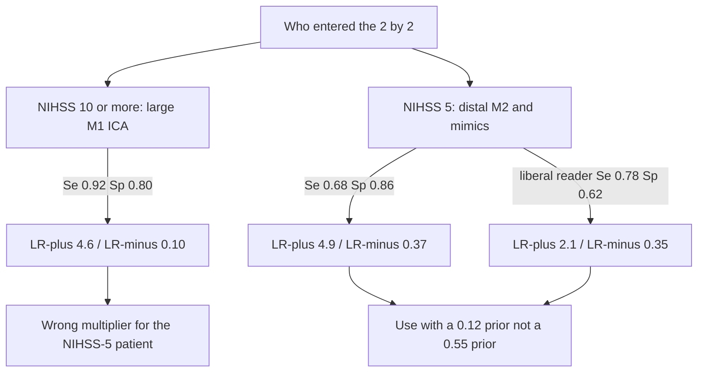
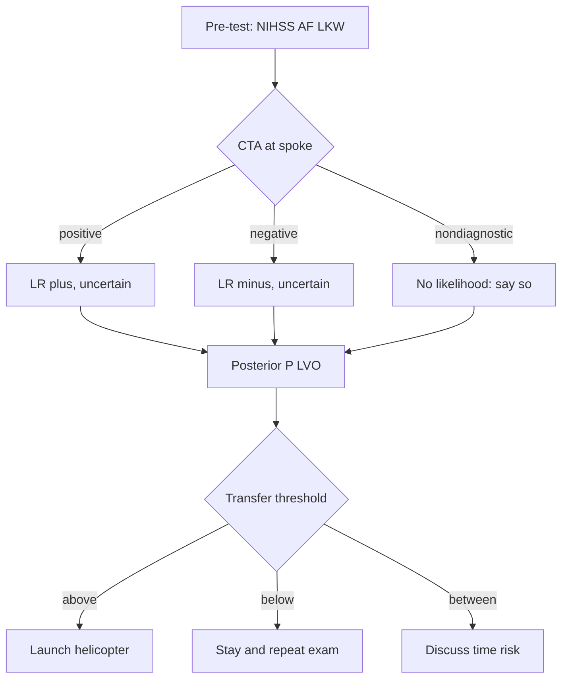
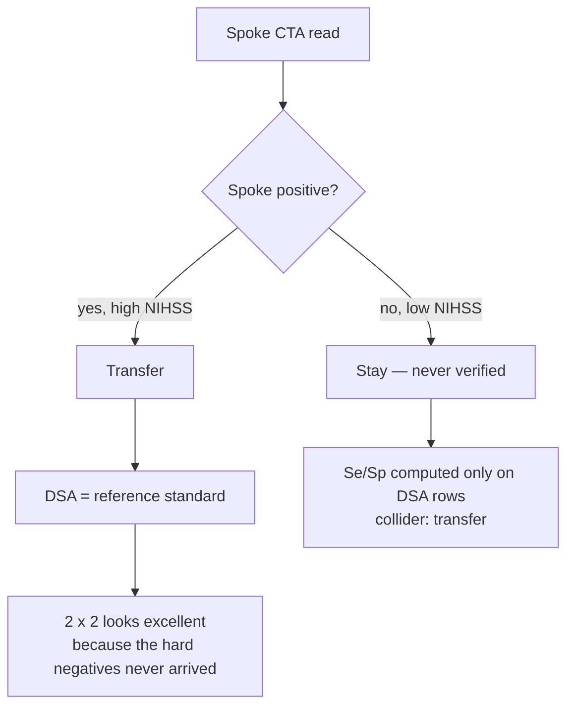
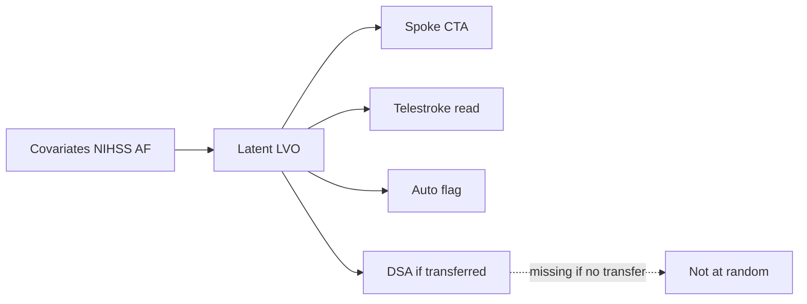

# Bayesian Approaches to Diagnostic Accuracy, ROC, and Continuous Markers

## Opening

A telestroke physician is staring at a CTA that a night-shift resident called “probably an M1.” The receiving comprehensive center is 90 minutes by air. The prior probability of a large-vessel occlusion, given this NIHSS and this last-known-well, is not 50%. Sensitivity is not a single number printed on a vendor slide. Specificity is not independent of who reads the scan. The decision to launch the helicopter is a threshold on a posterior, and the scan is a likelihood that has its own uncertainty.

## Learning objectives

After working this chapter you should be able to:

- Treat sensitivity and specificity as unknown quantities with posteriors, not as fixed handbook constants.
- Specify a Beta or binomial model for a single study and a hierarchical model for a multi-center diagnostic study.
- Put a posterior on an ROC curve and on AUC for a continuous or ordinal marker (D-dimer analogue, serum NfL, ASPECTS).
- Recognize when the reference standard is missing or imperfect and sketch a latent-class model rather than pretending DSA was done on everyone.
- Read a diagnostic paper with a STARD mindset: who was enrolled, who got the index test, who got the reference, and what was done with the indeterminate scans.

## Clinical vignette

You cover a spoke hospital by video. A 71-year-old with atrial fibrillation, last known well 3.5 hours ago, has an NIHSS of 12 (forced gaze, aphasia, right arm drift). Non-contrast CT is unremarkable. The spoke CT angiogram is read locally as “possible left M2 cutoff; M1 patent.” Your own read, on lossy pixels, is “probable distal M1.” There is no on-site radiologist who regularly reads LVO studies. DSA at the hub is the reference standard you wish you had; you will not have it unless you transfer. The helicopter is on standby. The family wants a number: “How sure are you that this is a large-vessel occlusion worth transferring for?”

**Teaching numbers for the local CTA-for-LVO pathway**, labeled as such and not taken from any one trial: among the last 80 transferred patients who went to DSA, 52 had an LVO (ICA, M1, or proximal M2) and 28 did not. Spoke CTA, using the local overnight read, was positive in 46 of the 52 LVO cases and in 6 of the 28 without LVO. Your own telestroke reads on the same 80, locked before DSA, were positive in 48 of 52 and in 8 of 28. The spoke’s pre-transfer population is not the DSA population: many NIHSS 3–5 patients are never sent. Serum NfL is not available in time. ASPECTS on the non-contrast CT is 9.

Before any model, write three quantities on paper: the prior probability of LVO in *this* patient, the likelihood ratio of the spoke read, and the action that would change if the posterior moved from 0.70 to 0.40.

## Sensitivity and specificity are random

Sensitivity is \(P(\text{test}^+ \mid \text{disease})\). Specificity is \(P(\text{test}^- \mid \text{no disease})\). Both are probabilities, so both are parameters, so both have posteriors once you have counts. The widespread habit of quoting “CTA is 96% sensitive for LVO” is a point estimate wearing a lab coat. It hides the study’s case mix, the definition of LVO, the reader, and the width of the interval.

Given a single 2 × 2 table the conjugate analysis is immediate. Let \(s\) be true positives out of \(n_D\) diseased patients and \(r\) be true negatives out of \(n_{\overline{D}}\) non-diseased. With independent analysis priors \(\operatorname{Se} \sim \operatorname{Beta}(a_s, b_s)\) and \(\operatorname{Sp} \sim \operatorname{Beta}(a_r, b_r)\),

\[
\operatorname{Se} \mid \text{data} \sim \operatorname{Beta}(a_s + s,\ b_s + n_D - s), \qquad
\operatorname{Sp} \mid \text{data} \sim \operatorname{Beta}(a_r + r,\ b_r + n_{\overline{D}} - r).
\]

A uniform prior is \(\operatorname{Beta}(1,1)\). A weakly informative prior that shrinks a small study toward “better than a coin, worse than magic,” for example \(\operatorname{Beta}(4,2)\) on each, is often more honest than uniformity when \(n_D = 12\). The posterior for the positive likelihood ratio \(\operatorname{LR}^+ = \operatorname{Se}/(1-\operatorname{Sp})\) does not have a named distribution you should memorize; draw from the two Betas and form the ratio.

Bayes at the bedside is then the same move as in Chapter 2:

\[
\frac{P(D \mid +)}{P(\overline{D} \mid +)} = \operatorname{LR}^+ \times \frac{P(D)}{P(\overline{D})}.
\]

What changes in this chapter is that \(\operatorname{LR}^+\) is itself uncertain, and that \(P(D)\) is not the prevalence in a published CTA series. It is *this* patient’s pre-test probability, built from NIHSS, last-known-well, atrial fibrillation, and the fact that someone already thought the scan was worth doing.

!!! tip "Clinical Pearl"
    Separate the population that generated the 2 × 2 table from the patient in front of you. A CTA series restricted to NIHSS ≥ 10 will overstate the pre-test probability for a telestroke NIHSS 5, and may also overstate sensitivity if subtle M2 occlusions never entered the series.

The vignette’s spoke-read table, under uniform priors, gives \(\operatorname{Se} \sim \operatorname{Beta}(47, 7)\) and \(\operatorname{Sp} \sim \operatorname{Beta}(23, 7)\). Those posteriors have means near 0.87 and 0.77 and are not interchangeable with “87% and 77%.” Draw them. The implied posterior on \(\operatorname{LR}^+\) is wide. Combined with a pre-test probability of, say, 0.55 in this NIHSS-12 / AF patient — a **teaching prior**, not a published calibration — the posterior probability of LVO after a positive spoke read sits in a band, not on a point. That band is what you discuss with the family, not a single percentage pulled from a review article.

| Reader (teaching 2 × 2) | TP / \(n_D\) | TN / \(n_{\overline{D}}\) | Posterior mean Se (uniform) | Posterior mean Sp (uniform) |
| --- | ---: | ---: | ---: | ---: |
| Spoke overnight | 46 / 52 | 22 / 28 | 0.87 | 0.77 |
| Telestroke over-read | 48 / 52 | 20 / 28 | 0.91 | 0.70 |
| Both called positive | — | — | not a third test | not independent |

The last row is the reminder. Two reads of one CTA are repeated measurements, not two assays. If you need a single likelihood ratio for the pair, model the agreement, or pick the read that will actually drive the transfer and put a reader random effect on it.

## Spectrum bias: Se/Sp are not portable constants

Ransohoff and Feinstein named the error; telestroke lives it. Sensitivity and specificity are not properties of a scanner. They are properties of a scanner *in a spectrum of disease and non-disease*. Change who is enrolled and you change both numbers, and you change the likelihood ratio you are about to multiply by the wrong prior.

The **teaching** pathway in the vignette is already a selected spectrum: 80 patients who were transferred and then catheterized. NIHSS 12 with gaze and aphasia is inside that spectrum. NIHSS 5 with a drifting arm and a questionable M2 is not. A CTA series built on NIHSS \(\ge 10\) is enriched for long-segment M1 and ICA occlusions — lesions a night reader can see — and depleted of short M2 cutoffs, reconstituted distal clots, and the mimic-heavy left tail of the NIHSS. Sensitivity estimated in that series is the sensitivity for the lesions that series admitted. It is not the sensitivity for the lesion you are afraid of missing in an NIHSS-5 patient who may never have been sent.

Specificity moves too, and not always in the same direction. A high-NIHSS cohort has few hemiplegic mimics and many true occlusions; false positives are expensive in the denominator of specificity. A low-NIHSS spoke cohort is full of seizures, migraines, and small-vessel syndromes that a liberal overnight reader will call “possible M2.” Specificity falls. A conservative reader who almost never calls an M2 will raise specificity and drop sensitivity. The LR+ that leaves that shop is not the LR+ on the vendor slide, and it is not the LR+ from the NIHSS \(\ge 10\) hub series.

So the CTA likelihood ratio estimated among NIHSS \(\ge 10\) transfers is the wrong multiplier for an NIHSS-5 activation. It is the wrong multiplier twice: the test is a different test (different lesion mix, different reader behavior), and the prior it will be asked to update is a different prior (Chapter 2’s last two rows). Using one published LR for both patients is how a service launches helicopters it cannot justify and withholds launches it should not.

Teaching arithmetic, labeled as such. Suppose the NIHSS \(\ge 10\) DSA series gives Se \(0.92\), Sp \(0.80\), so \(\operatorname{LR}^+ = 4.6\) and \(\operatorname{LR}^- = 0.10\). In a milder spectrum the same overnight call is Se \(0.68\), Sp \(0.86\), so \(\operatorname{LR}^+ = 4.9\) — almost the same multiplier, which is a coincidence you must not rely on — while \(\operatorname{LR}^- = 0.37\). The negative CTA, not the positive one, is where spectrum bias usually bites in mild stroke: a “clean” read that was excellent at clearing large M1s is mediocre at clearing a possible M3, and an LR− of 0.37 applied to a pre-test of 0.12 leaves a posterior near 0.048, whereas the borrowed LR− of 0.10 would have talked you down to 0.013. Those two posteriors sit on opposite sides of some hubs’ stay-and-repeat threshold.

A second **teaching** pair, so the coincidence does not comfort you. Same high-severity Se/Sp, but now a liberal spoke reader in the mild spectrum: Se \(0.78\), Sp \(0.62\), \(\operatorname{LR}^+ = 2.1\). Applied to a pre-test of 0.12 the posterior is 0.22, not the 0.39 you would have quoted from the NIHSS \(\ge 10\) LR+ of 4.6. The helicopter decision at 0.22 and at 0.39 is not the same sentence to the family.



Two practical moves follow, and neither is “find a better point estimate.” First, stratify the 2 × 2 by the same cuts you use to build the prior — NIHSS band, last-known-well, atrial fibrillation — and put a Beta on each slice, or a hierarchical model that lets Se/Sp vary with severity (the next section). Second, when you have only the severe-spectrum paper, shrink the borrowed LR toward 1 for the mild patient and say so. That is not theatrical humility. It is refusing to treat a selected M1 series as a constant of nature.

The vignette’s family question is an NIHSS-12 question. Do not answer it with an NIHSS-5 disclaimer, and do not answer the next, milder activation with this vignette’s 0.55 prior and this vignette’s spoke LR. Spectrum bias is the habit of recycling both. STARD already asked who was enrolled. Spectrum bias is what happens when you ignore the answer and still multiply.

!!! warning "Common Pitfall"
    Importing an LR from an NIHSS \(\ge 10\) CTA-for-LVO paper and applying it to a telestroke NIHSS 5 is not conservative. It is a change of both the prior and the test, hidden inside one familiar number.

## Hierarchical models for multi-center diagnostic studies

A single 2 × 2 table is a start. A telestroke network is not a single table. Each spoke has a different scanner, a different overnight reader, a different habit of calling “possible M2,” and a different threshold for launching transfer. Sensitivity and specificity vary. Ignoring that variation and pooling the raw counts produces intervals that are too narrow and a point estimate that describes no actual hospital.

A minimal hierarchical model on the logit scale is

\[
\begin{aligned}
s_j &\sim \operatorname{Binomial}(n_{D,j},\ \operatorname{Se}_j), \\
\operatorname{logit}(\operatorname{Se}_j) &= \mu_s + u_j, \qquad u_j \sim \mathcal{N}(0, \tau_s^2),
\end{aligned}
\]

and the same structure for specificity, with its own \(\mu_r, \tau_r\), and preferably a correlation between \(u_j\) and the specificity random effect. Threshold effects predict that correlation: a liberal spoke that calls every maybe-M2 positive will raise sensitivity and lower specificity together.

Priors on \(\tau_s\) and \(\tau_r\) are not decoration. With five spokes they are weakly identified. A half-normal or half-Cauchy prior that expects between-spoke SDs of 0.3–0.6 on the logit scale is a starting point, not a law. The quantity you report for *this* spoke is the spoke-level posterior, partially pooled. The quantity you report for a *new* spoke is the posterior predictive of a new \(u_j\). Those are different widths. Networks that quote only the pooled \(\mu_s\) will be surprised when the next spoke comes online.



!!! warning "Common Pitfall"
    Do not drop indeterminate CTAs from the 2 × 2 table. An unreadable scan is a result. STARD asks you to report how many were uninterpretable and to analyze them as a third category or as “not positive.” A sensitivity computed only on pretty scans describes a test you do not have at 02:00.

## ROC, AUC, and continuous markers

Many of the markers that actually change neurologic decisions are not binary. D-dimer (the PE/DVT analogue; in stroke, think “a lab that moves a threshold”), serum neurofilament light (NfL) as a marker of axonal injury, ASPECTS as an ordinal 0–10 CT score, NIHSS itself. For a continuous or ordinal marker \(T\) and disease \(D\), each threshold \(c\) induces a sensitivity and a specificity. The ROC curve is the plot of \(\operatorname{Se}(c)\) against \(1 - \operatorname{Sp}(c)\). The area under that curve is

\[
\operatorname{AUC} = P(T_D > T_{\overline{D}}),
\]

the probability that a randomly chosen diseased patient has a higher marker than a randomly chosen non-diseased patient (with a tie-breaking convention for ordinal scores).

A Bayesian analysis can take several forms, in increasing commitment:

1. **Threshold-wise Betas.** Pick the clinically used cut (ASPECTS ≤ 5, NfL above a lab’s 95th percentile, D-dimer above 500 ng/mL). Reduce to the previous section. Honest, limited.
2. **Two-group sampling models.** Model \(T \mid D = 1\) and \(T \mid D = 0\) as, say, log-normal or Student-\(t\), put priors on the parameters, and induce a posterior on the entire ROC and on AUC. Good when the marker is continuous and the two densities are plausible.
3. **Ordinal regression.** For ASPECTS or an imaging score, a cumulative logit or probit model for \(T\) given \(D\) (and given covariates such as time from onset and scanner vendor) produces a ROC that respects the discrete support.
4. **Direct AUC models.** Rank-based or placement-value models put a posterior on AUC without a full density for \(T\). Useful when you do not trust a parametric shape.

Uncertainty on AUC is the point. An AUC of 0.78 with a 95% credible interval of 0.61 to 0.90 is not “good discrimination.” It is “we have not yet distinguished this marker from a coin in a sample this size,” or at best “promising and unstable.” Neurology papers that report a point AUC from a derivation cohort of 40 patients, then pick the Youden cut, then report Se/Sp at that cut as if they were pre-declared, have spent the same data three times. A posterior does not make that maneuver honest. A pre-declared cut, or a fully reported ROC-with-bands, does.

| Marker (teaching frame) | Natural scale | Typical clinical cut | What the ROC is being asked to do |
| --- | --- | --- | --- |
| Spoke CTA read | Binary / three-level | Positive vs not | Rule *in* LVO for transfer |
| ASPECTS | Ordinal 0–10 | historically ≥ 6 for EVT eligibility; ≤ 5 marks large core | Quantify completed infarct, not a standalone futility veto |
| Serum NfL | Continuous, ng/L, right-skewed | Lab 95th percentile or a modeled threshold | Separate recent axonal injury from mimics |
| D-dimer analogue | Continuous | Rule-out cut at high sensitivity | Send home vs image (PE logic; same math) |

!!! note "Mathematical Detail"
    If \(T \mid D=1 \sim \mathcal{N}(\mu_1, \sigma_1^2)\) and \(T \mid D=0 \sim \mathcal{N}(\mu_0, \sigma_0^2)\), then
    \(\operatorname{AUC} = \Phi\bigl((\mu_1 - \mu_0)/\sqrt{\sigma_1^2 + \sigma_0^2}\bigr)\).
    Draw \((\mu, \sigma)\) from the posterior and you have a posterior for AUC. The binormal model is a workhorse. It is also wrong in the tails, which is exactly where rule-out cuts live. Check a posterior predictive histogram of \(T\) before you trust a claimed 98% sensitivity.

For ASPECTS specifically, treat the score as ordinal, not as a number with a linear meaning. The step from 10 to 9 is not the step from 6 to 5. A cumulative model with disease as a covariate, and with time-to-CT as a second covariate, will show you that “ASPECTS 6” at 90 minutes is not “ASPECTS 6” at 8 hours. That is a clinical fact the likelihood should be allowed to express.

## No gold standard: latent class, not wishful DSA

The vignette’s reference standard is DSA, and only transferred patients get DSA. That is verification bias. It is also a missing-data problem. If you compute Se/Sp only in the DSA subset, you are conditioning on a collider: transfer. Spoke-positive, high-NIHSS patients are over-represented. Spoke-negative, low-NIHSS patients never appear. Sensitivity is flattered; specificity is untrustworthy.



Two honest responses:

**Imperfect-but-observed reference.** Use a composite (DSA if done; otherwise expert consensus plus 24-hour clinical course plus follow-up imaging) and *model its error* rather than calling it truth. That is an errors-in-variables problem on the disease label.

**Latent class.** Disease status \(D_i\) is a latent Bernoulli with prevalence \(\pi\) (possibly a function of NIHSS). Each test \(k\) — spoke CTA, telestroke over-read, automated LVO flag, later DSA in a subset — is a fallible indicator with its own Se/Sp, optionally dependent within class (Dendukuri–Joseph). The likelihood is the mixture

\[
P(\mathbf{t}_i) = \pi \prod_k P(t_{ik} \mid D_i = 1) + (1-\pi) \prod_k P(t_{ik} \mid D_i = 0)
\]

under conditional independence, or the analogous expression with a copula or a random reader effect if you do not believe independence. Hui and Walter showed that two tests in two populations with different prevalences can identify Se/Sp without a gold standard. Bayesian latent-class models extend that identification with priors and with more tests.

Latent class does not create truth. It creates a coherent story about unobserved class membership that can be checked against the subset who *did* get DSA, against 24-hour infarct territory, and against whether the patient improved after EVT. If the latent “LVO” class does not line up with those external anchors, the model is a clustering algorithm wearing a diagnostic badge.



!!! warning "Common Pitfall"
    A latent-class model that assumes conditional independence of spoke CTA and the telestroke over-read of the *same* pixels will overstate the information in the pair. They share the image. Put a reader-level or image-level random effect in, or treat the over-read as a second read of one test, not as a second test.

## A STARD mindset

STARD 2015 is a reporting guideline, not a model. It is also a checklist for whether you should believe anyone’s Se/Sp, including your own. Read a diagnostic accuracy paper — or write one — asking:

- Was the study cohort consecutive telestroke activations, or a convenience sample of pretty scans?
- Did everyone get the index test and the reference, and if not, was verification related to the index result?
- Were readers blinded to the reference, and was the reference blinded to the index?
- How were indeterminates handled?
- Was the cut pre-declared, or chosen to maximize Youden on the same data?
- Is there a pre-test probability, or only Se/Sp floating in space?

TRIPOD, for prediction models, is the sibling document when the “test” is a score (a telestroke LVO prediction score, an NfL-plus-age rule). The Bayesian contribution is not a new checklist item. It is refusing to report a point Se, a point cut, and a point AUC as if the sample were the population.

### For the biostatistician / methodologist

The Beta / binomial model is the Bernoulli GLM with a logit link and no covariates. In `brms` that is `family = bernoulli()` or, on grouped counts, `family = binomial()`. A Beta regression (`family = Beta()`) is the wrong default for a 2 × 2 table: you do not observe a continuous proportion for each patient. Beta regression becomes relevant when the *unit* is a center-level proportion already aggregated, or when you model AUC estimates across studies. For a multi-center 2 × 2, prefer the binomial GLM with a varying intercept on spoke.

ROC uncertainty from a binormal or bigamma model is a derived quantity: generate posterior predicted \(T\) for a diseased and a non-diseased patient and compute the pairwise order, or use the closed-form \(\Phi\) expression when you trust normality. For ordinal ASPECTS, `family = cumulative()` with disease as a predictor yields category probabilities; Se and Sp at each cut are sums of those probabilities.

Identification in latent-class models is fragile. Label switching (the “diseased” class flipping) is a real Stan/brms problem; constrain \(\pi\) or constrain \(\operatorname{Se} > 1 - \operatorname{Sp}\) for at least one test. Dependence between tests within class is the usual source of overconfident Se/Sp. A probit latent-variable representation with a residual correlation is the standard repair.

## R: posterior of sensitivity and specificity

The block fits a joint binomial model for Se and Sp on the vignette’s spoke-read counts, using `brms`, and plots the posterior in the Se–Sp plane. The two-row teaching table is in the chunk; the `brm()` call will sample if you run it.

```r
# Posterior of spoke-CTA Se and Sp from the telestroke teaching table.
# 52 LVO: 46 TP, 6 FN.  28 no LVO: 6 FP, 22 TN.
# Weakly informative priors on the intercepts: Normal(1, 1) on the logit,
# i.e. a gentle push toward Se, Sp > 0.5 without pretending we know the vendor slide.

set.seed(20260818)

library(brms)
library(tidybayes)
library(ggplot2)
library(dplyr)

dx <- data.frame(
  k    = c(46, 22),
  n    = c(52, 28),
  stat = c("Se", "Sp")
)

priors <- c(
  prior(normal(1, 1), class = "Intercept"),
  prior(normal(0, 0.5), class = "b")
)

# Two-row teaching table. Run locally to fill fit_dx (seconds).
fit_dx <- brm(
  k | trials(n) ~ stat,
  data = dx,
  family = binomial(),
  prior = priors,
  seed = 20260818,
  refresh = 0
)

# Posterior draws of Se and Sp (statSe is the intercept; statSp = intercept + b).
post <- fit_dx %>%
  spread_draws(b_Intercept, b_statSp) %>%
  mutate(
    Se = plogis(b_Intercept),
    Sp = plogis(b_Intercept + b_statSp),
    LRplus = Se / (1 - Sp)
  )

ggplot(post, aes(Se, Sp)) +
  geom_density_2d_filled(alpha = 0.85, show.legend = FALSE) +
  geom_point(
    data = summarise(post, Se = median(Se), Sp = median(Sp)),
    color = "white", size = 2
  ) +
  coord_equal(xlim = c(0.6, 1), ylim = c(0.5, 1)) +
  labs(
    x = "Sensitivity",
    y = "Specificity",
    title = "Posterior of spoke CTA (teaching counts)"
  ) +
  theme_minimal()

# Use the same draws for a bedside posterior.
# Teaching pre-test of 0.55 for the NIHSS-12 AF patient:
pre <- 0.55
post %>%
  mutate(
    odds   = (pre / (1 - pre)) * LRplus,
    p_lvo  = odds / (1 + odds)
  ) %>%
  median_qi(p_lvo, .width = c(0.5, 0.95))
```

The last block is the family conversation, in numbers: a posterior distribution on *this* patient’s LVO probability after a positive spoke read, with the uncertainty in Se and Sp left in. If you instead plug in point estimates, you will quote a single 0.8-something and have nowhere to put the night-shift reader.

!!! example "R Deep Dive"
    To add a second reader (your telestroke over-read), stack the counts with a `reader` factor and a `stat:reader` interaction, or move to patient-level Bernoulli rows with a reader random effect. To add spokes, give each spoke its own rows and `(stat | spoke)`. The plot then becomes a fan of spoke-level Se–Sp clouds around a pooled center.

## Worked solution to the opening vignette

**Prior.** This is not a screening patient. NIHSS 12 with gaze and aphasia, atrial fibrillation, 3.5 hours from last known well, already selected for CTA. A teaching pre-test of 0.50–0.60 for LVO (ICA/M1/proximal M2) is defensible; 0.20 is base-rate neglect; 0.90 is anchoring on the most vivid syndrome. Use 0.55 as the working number and state that it would be lower at NIHSS 6.

**Likelihood.** The spoke overnight read, on the teaching table, is a test with posterior mean Se near 0.87 and Sp near 0.77 under a uniform prior — and wider, more skeptical intervals under a weakly informative prior or once you admit between-spoke variation. A “possible M2, patent M1” is not even a clean positive. Treat it as a weak positive or as a third category. Your own over-read (“probable distal M1”) is not independent of the pixels the resident already called abnormal. It is a second read, correlated, slightly more sensitive and slightly less specific in the teaching table (48/52 and 20/28). The likelihood ratio of the *pair* is not the product of the two LR\(^+\).

**Decision.** Transfer for possible EVT is the action. The relevant threshold is not 0.50. It is the probability at which the expected harm of a futile launch (cost, weather risk, denying the helicopter to someone else, false hope) equals the expected harm of a missed LVO (untreated ischemia). For most hubs that threshold sits well below 0.50; a posterior of 0.40 still launches. A posterior of 0.15, after a truly negative high-quality CTA, stays. The family question “how sure are you?” should be answered with a range that includes reader uncertainty — “more likely than not, not a sure thing; the scan is consistent with a treatable occlusion, and waiting for a perfect read is the one option that is definitely harmful.”

ASPECTS 9 at 3.5 hours does not lower the LVO probability much; it lowers the probability of *futile* reperfusion. That is a different parameter. Do not fold it into Se/Sp of CTA.

If you later analyze the network, do not compute Se/Sp only among the 80 who reached DSA. Use the spoke’s full activation cohort, treat non-transfer as missing-not-at-random, and put a latent class or a selection model on LVO. The 80-row table is a biased likelihood.

## Exercises

1. **Bedside.** Recalculate, by Monte Carlo from the two Betas, the posterior LVO probability for the vignette patient if you treat the spoke read as negative rather than weakly positive. At what pre-test would you still launch?

2. **Verification bias.** Suppose 40 additional spoke-negative, NIHSS 4–7 patients were never transferred. Invent a plausible range for how many of those 40 had LVO (teaching numbers). How does including them as unverified negatives move Sp, and in which direction is the DSA-only Sp biased?

3. **ASPECTS ROC.** Sketch, without fitting, why an AUC for ASPECTS as a predictor of “mRS 0–2 after EVT” is a different object from an AUC for ASPECTS as a predictor of LVO. Which one belongs in a transfer decision?

4. **Hierarchical Se.** Five spokes have Se point estimates of 0.95, 0.91, 0.88, 0.80, and 0.72, each from 20–40 DSA-confirmed cases. Why is the pooled raw Se the wrong number to quote for the fifth spoke, and what prior on \(\tau_s\) would you defend?

5. **STARD audit.** Take any published CTA-for-LVO paper you have on your hard drive. Score it against four STARD items: consecutive enrollment, indeterminates, blinding, and pre-declared cut. Do not use this textbook as a source of those data.

6. **Latent class.** Write the complete-data likelihood for two binary tests and a latent \(D\), then count parameters against the degrees of freedom in the observed \(2\times 2\) table and explain why the single-population model is under-identified even with conditional independence (five parameters, three degrees of freedom). What second population, in a telestroke network, would supply the Hui–Walter contrast?

## Further reading

- Bossuyt PM et al. STARD 2015: an updated list of essential items for reporting diagnostic accuracy studies. *BMJ*. 2015;351:h5527.
- Pepe MS. *The Statistical Evaluation of Medical Tests for Classification and Prediction*. Oxford: Oxford University Press; 2003.
- Zhou XH, Obuchowski NA, McClish DK. *Statistical Methods in Diagnostic Medicine*. 2nd ed. Hoboken: Wiley; 2011.
- Hui SL, Walter SD. Estimating the error rates of diagnostic tests. *Biometrics*. 1980;36:167–171.
- Dendukuri N, Joseph L. Bayesian approaches to modeling the conditional dependence between multiple diagnostic tests. *Biometrics*. 2001;57:158–167.
- Collins GS et al. TRIPOD+AI statement: updated guidance for reporting clinical prediction models. *BMJ*. 2024;385:e078378. (Companion to the original TRIPOD statement, *Ann Intern Med* / *BMJ* 2015.)
- Gelman A, Carlin JB, Stern HS, Dunson DB, Vehtari A, Rubin DB. *Bayesian Data Analysis*. 3rd ed. Boca Raton: CRC Press; 2013. Chapters on hierarchical models and posterior predictive checks.
- Sox HC, Higgins MC, Owens DK. *Medical Decision Making*. 2nd ed. Chichester: Wiley-Blackwell; 2013. For thresholds and likelihood ratios at the bedside.

!!! success "Key Takeaway"
    Sensitivity and specificity are parameters. Give them posteriors, and when centers or readers differ, give them a hierarchy. An ROC and an AUC without uncertainty are marketing; a continuous marker (NfL, a D-dimer analogue, ASPECTS) earns a curve with bands and a pre-declared cut. When DSA is missing by design, the honest model is latent class or selection, not a 2 × 2 table on the transferred subset. STARD is the habit of saying who was scanned, who was verified, and what happened to the unreadable study. The helicopter launches on a posterior, not on a vendor’s point estimate.
