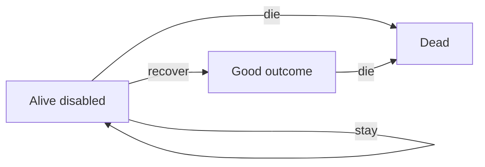
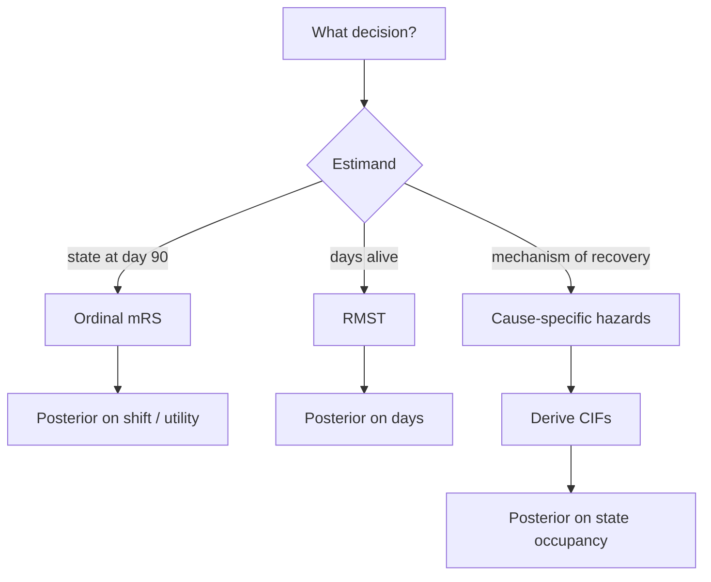

# Survival, Competing Risks, and Time-to-Event Models the Bayesian Way

## Opening

A 62-year-old with a 28 mL deep ICH is alive at 48 hours. The family asks two different questions as if they were one: “Will he walk?” and “Will he die?” Death closes the path to walking. Walking is not the complement of death. A Kaplan–Meier curve for “time to good outcome” that censors the dead at the moment of death is answering a question no family asked and no bedside neurologist should use.

## Learning objectives

After working this chapter you should be able to:

- Write the likelihood contribution of an event and of a right-censored observation, and say what you are assuming when you censor.
- Distinguish a cause-specific hazard from a cumulative incidence function, and refuse 1 − KM when death competes.
- Choose an estimand for ICH and reperfusion trials: ordinal mRS at a fixed day, time to a good outcome, or restricted mean time in a state.
- Specify a `brms` survival or ordinal model with weakly informative priors, and say what `s(time)` is doing if you use it.
- Explain restricted mean survival (or restricted mean time alive and independent) as a clinically reportable functional of the same posterior.

## Clinical vignette

Four patients occupy the neuro-ICU board at 07:00. All have spontaneous ICH. All have a pre-morbid mRS of 0–1. Teaching numbers only:

| ID | Age | Volume (mL) | Location | Spot sign | Status at day 7 | Status at day 90 |
| --- | ---: | ---: | --- | --- | --- | --- |
| A | 54 | 12 | Lobar | No | Alive, mRS 3 | Alive, mRS 2 |
| B | 78 | 48 | Deep | Yes | Dead, day 3 | Dead |
| C | 66 | 22 | Deep | No | Alive, mRS 5 | Alive, mRS 4 |
| D | 71 | 18 | Lobar | No | Alive, mRS 4 | Lost after day 40, last mRS 3 |

A resident proposes “time to mRS ≤ 2” as the primary endpoint of a small investigator-initiated trial of intensive blood-pressure control, with death censored. A fellow proposes a day-90 ordinal mRS shift. A visiting intensivist proposes 30-day mortality. The PI asks you which question the family of patient B is asking, and which model would have used B’s data without pretending B might still walk.

Do not fit anything yet. Name the state each patient occupies at day 90, name the states they can never re-enter, and say whether patient D is a survival problem, an ordinal problem, or both.

## Censoring is a likelihood statement

A time-to-event observation is a pair \((t_i, \delta_i)\): a time and an indicator that the event of interest was seen. If \(\delta_i = 1\), the density \(f(t_i \mid \theta)\) enters the likelihood. If \(\delta_i = 0\), the survivor function \(S(t_i \mid \theta) = P(T > t_i \mid \theta)\) enters instead. That is the entire mystery of right-censoring, and it is already Bayesian once \(\theta\) has a prior:

\[
p(\theta \mid \text{data}) \propto p(\theta) \prod_i f(t_i \mid \theta)^{\delta_i} S(t_i \mid \theta)^{1-\delta_i}.
\]

The move is valid when censoring is non-informative: knowing that the observation stopped at \(t_i\) without the event tells you nothing more about \(\theta\) than \(T > t_i\). Administrative censoring at day 90 in a locked trial is the clean case. Loss to follow-up because a patient was doing poorly and left the health system is not clean. Death, when the event of interest is “good recovery,” is not censoring at all. Death is a competing event.

Neurology generates all three. A DEFUSE-3-style late-window EVT follow-up that ends at 90 days administratively censors those still alive and disabled. A patient who moves states and stops returning calls is missingness with a likely outcome dependence. A patient who dies of withdrawal of life-sustaining therapy after ICH has left the risk set for independent ambulation permanently.

!!! warning "Common Pitfall"
    Censoring a competing event treats the dead as if they were still at risk in some hypothetical world where death had been prevented and the recovery process were otherwise unchanged. That world is not a sensitivity analysis. It is a different causal question, and it is almost never the one on the consent form.

Hazard and survival are two faces of one distribution. The hazard \(h(t) = f(t)/S(t)\) is the instantaneous rate among those still at risk. The cumulative hazard \(H(t) = \int_0^t h(u)\,du\) satisfies \(S(t) = \exp(-H(t))\) when there is a single event type. Clinicians think in \(S(t)\) (“what fraction are still alive at day 30”). Models are often written in \(h(t)\) because covariates act more simply there. A Bayesian analysis can report either, or both, as posterior functionals. It cannot make a poorly chosen event definition coherent.

## Competing death after ICH

After intracerebral hemorrhage the absorbing state that dominates early time is death, often after a decision to withdraw. The event families care about later is a functional state: walking, returning home, mRS ≤ 2 or ≤ 3. Those events are not defined on the dead. The right language is a multi-state process.



Two hazards leave “alive and disabled”: a recovery hazard and a death hazard. The *cause-specific hazard* for recovery is the instantaneous rate of recovery among those still alive and disabled. It is the right object if you are modeling the mechanism of hematoma-evacuation or of a neuroprotectant that is supposed to speed recovery. It is the wrong object to quote as “the probability of walking by day 90,” because that probability also depends on how many people die first.

The *cumulative incidence function* (CIF) for recovery is

\[
F_{\text{good}}(t) = \int_0^t S_{\text{all}}(u)\, h_{\text{good}}(u)\, du,
\]

where \(S_{\text{all}}\) is the probability of still being in the starting state. The CIF for death is the sibling integral with \(h_{\text{death}}\). They add to \(1 - P(\text{still disabled at } t)\). The Kaplan–Meier estimator that censors deaths, then plots \(1 - \widehat{S}_{\text{good}}(t)\), estimates a quantity larger than the CIF. In ICH, where early death is common, the overstatement is not a rounding error.

Fine and Gray’s subdistribution hazard is a third object: the hazard of the CIF treated as if it belonged to a single improper distribution. It is popular because it takes covariates in a Cox-like way and aims at the CIF. It is also easy to misread. A Bayesian multi-state model that estimates both cause-specific hazards, then *derives* the CIFs as functionals, is usually easier to explain to a DSMB and to a family: here is the death rate, here is the recovery rate among survivors, here is the implied probability of each state at day 90.

Teaching numbers, not a trial result. In a hypothetical 200-patient deep-ICH cohort, 30-day death is 0.28, day-90 mRS 0–2 among those still alive is 0.31, and the day-90 CIF of mRS 0–2 is therefore about \(0.31 \times (1-0.28) \approx 0.22\) if no further deaths occur between day 30 and 90 — plus a small correction for later deaths and later recoveries. Quoting “31% good outcome” without saying “among survivors” is how competing risks become a communication error rather than a modeling error.

Withdrawal of life-sustaining therapy sits inside the death CIF and is not a nuisance to be coded away. It is a decision that uses the same scans and the same predicted mRS that the trial is trying to change. A treatment that makes the 24-hour CT look better will, in some ICUs, reduce withdrawals and thereby change who remains at risk to recover. That path is neither purely a treatment effect on tissue nor purely confounding. Name it in the SAP. A cause-specific recovery hazard that ignores it will attribute extra walkers to biology when some of them are extra survivors of a changed goals-of-care conversation. The CIF of independent ambulation still answers the family. The decomposition into “fewer deaths” versus “faster recovery among survivors” is what the mechanism people need, and it is a pair of cause-specific hazards, not a single Cox model with death censored.

!!! tip "Clinical Pearl"
    When you write a note, use state occupancy: “At 90 days I expect about 1 in 5 similar patients to be walking independently, about 1 in 3 to have died, and the rest to be alive and dependent.” That sentence *is* a set of CIFs. It is not a hazard ratio.

## Ordinal mRS versus time to a good outcome

The modified Rankin Scale at a fixed calendar day — 30, 90, 180 — is the native estimand of most acute stroke trials. It is a snapshot of state occupancy. It does not require you to define when a patient “became” an mRS 2. It does handle death, because death is mRS 6. An ordinal model (cumulative logit, adjacent-category, or a utility-weighted linear model) on day-90 mRS is therefore already a competing-risk analysis in disguise: the worst category is the competing event.

Time-to-good-outcome is a different estimand. It asks *when* the good state was entered, and it is attractive when you believe a treatment works by accelerating recovery rather than by changing the day-90 snapshot. It is also how you get into trouble. Patients fluctuate. An mRS 2 at day 14 who is an mRS 4 at day 90 has not “had the event.” Death before a good outcome is a competitor. Assessment times are coarse (discharge, day 30, day 90), so the “time” is interval-censored.

Neither estimand is more Bayesian than the other. The Bayesian question is whether the posterior you will show the PI is a posterior on the thing the trial was funded to change.

| Estimand | Handles death by | Uses timing | Typical `brms` family | When it matches the clinical question |
| --- | --- | --- | --- | --- |
| Day-90 ordinal mRS | mRS 6 is a category | No | `cumulative()` | Most acute stroke / ICH trials |
| 30-day mortality | It *is* the event | Coarse | `bernoulli()` or `cox()` | ICU trials where early death dominates |
| Time to mRS ≤ 2 | Must compete, not censor | Yes | `cox()`, `weibull()`, multi-state | Recovery-speed claims |
| RMST / restricted mean time independent | Functional of \(S(t)\) or of state occupancy | Yes | derived from a survival or multi-state fit | When a mean number of days is the decision scale |

Restricted mean survival time to a horizon \(\tau\), \(\operatorname{RMST}(\tau) = \int_0^\tau S(t)\,dt\), is the expected days alive out of the next \(\tau\). Restricted mean time alive and independent is the same integral of the CIF of the good state, or equivalently the expected days spent in that state before \(\tau\). Families understand days. Hazard ratios do not convert to days without a baseline hazard. A posterior on RMST *is* that conversion.

!!! note "Mathematical Detail"
    Under a proportional-hazards model \(h(t \mid x) = h_0(t)\, e^{x\beta}\), the survival function is \(S(t \mid x) = \exp\bigl(-e^{x\beta} H_0(t)\bigr)\). RMST is a nonlinear functional of \((\beta, H_0)\). Draws from the joint posterior give you a posterior for RMST and for contrasts of RMST. Proportional hazards can hold on the hazard-ratio scale and still produce time-varying RMST contrasts; that is not a contradiction.

Public landmark trials illustrate the design choice without supplying this chapter any private numbers. NINDS and the early alteplase program used a fixed-day functional scale. INTERACT-2 used ordinal mRS. STICH asked a surgical question with a prognosis-adjusted functional outcome. DAWN and DEFUSE-3 used 90-day utility-weighted or ordinal mRS in a late window, not time-to-reperfusion-success. Those choices were estimand choices. A Bayesian re-analysis can change the prior and the model; it should not silently change the estimand unless the paper says so.

## Models you can actually fit

Parametric survival (`exponential`, `weibull`, `lognormal`, `gamma` in `brms`) puts a full distribution on \(T\) and makes RMST and predicted survival curves cheap. The cost is the shape. Weibull hazards are monotone. If the ICH death hazard peaks at day 2 and then falls, while the recovery hazard rises after week 1, a single Weibull for a composite event is the wrong shape.

The Cox family in `brms` (`family = cox()`) leaves the baseline semi-parametric and puts the prior on the log hazard ratio. Use it when the hazard ratio *is* the estimand you are willing to defend, and derive survival curves only if you are also modeling or estimating the baseline. A spline on time, `s(time)`, in a piecewise-exponential or GAM-style hazard, is the middle path: flexible baseline, still a full likelihood, still a posterior on RMST.

What `s(time)` is doing, said without the GAM vocabulary: the log-hazard is allowed to bend as the clock runs, instead of being forced through a Weibull monotone or a Cox unspecified-but-not-plotted baseline. After ICH the death hazard is high on night 1, lower by the end of week 1, and then a second, quieter rise appears when withdrawal decisions accumulate. A spline can follow that. A single shape parameter cannot. The price is a smoothness prior (in `brms`, the default spline penalty) and the obligation to plot the posterior hazard, not only the coefficient on `treat`. If the spline on time interacts with treatment — `s(time) + treat + s(time, by = treat)` in a Poisson person-time expansion — you have given up proportional hazards on purpose. That is often the scientifically honest ICH model. It is also how you stop quoting a single hazard ratio that never held.

A categorical or multinomial family is the discrete-time cousin of the same idea. At each visit (day 7, day 30, day 90) the patient occupies one of {dead, dependent, independent}. `family = categorical()` on that state, with a lagged state and a treatment indicator, is a discrete multi-state model. It uses the coarse assessment schedule you actually have. It does not invent a continuous event time between discharge and the day-90 clinic. For many investigator-initiated ICH trials it is a better primary analysis than a Cox model on an imputed “day the patient became an mRS 2.”

Ordinal mRS at a fixed day remains the workhorse. `family = cumulative(link = "logit")` is the proportional-odds model. Relax proportionality with category-specific effects if the treatment is expected to move death more than it moves mRS 1 versus 2 — a plausible ICH pattern. Weakly informative priors on the intercepts (the cutpoints) and a \(\operatorname{Normal}(0, 1)\) or \(\operatorname{Normal}(0, 0.5)\) prior on a log-odds treatment effect are enough to regularize a small trial without pretending you already know the answer.



### For the biostatistician / methodologist

Informative censoring is a missing-data problem. A joint model for the longitudinal disability process and the dropout / death process is the fully Bayesian response; a simpler sensitivity analysis tilts the censored patients toward worse states and asks whether the treatment contrast survives. Withdrawal of life-sustaining therapy is not just another cause of death. It is a decision that depends on predicted outcome, so it is a collider and a mediator. Conditioning on it, or treating it as an ordinary competing event without a care-preference covariate, will distort any treatment effect that itself changes perceived prognosis.

Interval censoring for coarse mRS schedules is native in a multi-state likelihood (the transition occurred somewhere between two visits) and awkward in a Cox partial likelihood. If you insist on time-to-mRS ≤ 2, use the interval. Do not impute the midpoint and then pretend the times are exact.

For RMST contrasts in `brms`, the clean path is posterior predicted survival curves on a time grid, trapezoidal integration to \(\tau\), and `tidybayes` summaries of the integrated draws. Do not convert a posterior hazard ratio into an RMST contrast with a formula that assumes an exponential baseline you did not fit.

## R: a survival specification and an ordinal specification

Two copy-paste specifications on a teaching data frame. Neither call is assumed to have been run.

```r
# Teaching ICH cohort: time to death (competing event) and day-90 ordinal mRS.
# Columns (invented): days, death, mrs90 (0-6), volume, age, treat (0/1).
# Weakly informative priors. Seed fixed. Specification only.

set.seed(20260818)

library(brms)
library(tidybayes)
library(dplyr)

# --- 1. Weibull model for time to death (cause-specific, recoveries ignored here)
priors_surv <- c(
  prior(normal(0, 1), class = "b"),
  prior(normal(4, 1), class = "Intercept"),
  prior(exponential(1), class = "shape")
)

fit_death <- brm(
  days | cens(1 - death) ~ treat + scale(volume) + scale(age),
  data    = ich_teach,          # you supply the teaching frame
  family  = weibull(),
  prior   = priors_surv,
  seed    = 20260818,
  refresh = 0
)

# RMST to day 90 from posterior predicted S(t), trapezoid on a grid.
# After fit_death has been sampled:
# t_grid <- 1:90
# nd <- data.frame(treat = c(0, 1), volume = 24, age = 66)
# S_draws <- posterior_epred(fit_death, newdata = nd, dpar = "mu")  # then convert
# via the Weibull survival function with posterior shape. Prefer a dedicated
# predictive survival helper if you have one; the point is: RMST is a functional
# of the same draws, not a second model.

# --- 2. Day-90 ordinal mRS, death = 6, proportional odds
priors_ord <- c(
  prior(normal(0, 0.5), class = "b"),
  prior(normal(0, 1.5), class = "Intercept")
)

fit_mrs <- brm(
  mrs90 ~ treat + scale(volume) + scale(age),
  data    = ich_teach,
  family  = cumulative(link = "logit"),
  prior   = priors_ord,
  seed    = 20260818,
  refresh = 0
)

# Common-odds ratio for treat, and posterior state probabilities at means:
# fit_mrs %>%
#   spread_draws(b_treat) %>%
#   median_qi(or = exp(b_treat))
```

The Weibull block answers “how does treatment change the death hazard, and therefore days alive out of 90?” The ordinal block answers “how does treatment change the day-90 state, death included as 6?” They will not agree numerically. They should not. If the trial’s consent form promised a better chance of walking, the ordinal (or a CIF of mRS ≤ 2) is the primary, and the death model is a safety and mechanism secondary. If the trial is an ICU bundle whose only realistic win is fewer early deaths, reverse that.

!!! example "R Deep Dive"
    A piecewise-exponential hazard with `s(time)` can be written by cutting follow-up into intervals, expanding to person-time, and using a Poisson GLM with an offset and a spline on interval midpoint — the classical Bayesian GAM survival trick. In current `brms`, `family = cox()` plus posterior draws of the baseline is the shorter path when you do not need a fully parametric RMST. For two competing events, stack the cause-specific models or fit a multinomial multi-state likelihood; do not run a single Cox model that censors the other cause and then present 1 − KM.

## Worked solution to the opening vignette

**States at day 90.** A occupies “good / independent” (mRS 2). B occupies “dead,” entered on day 3, and will never occupy a good state. C occupies “alive and dependent” (mRS 4). D occupies “last seen alive and dependent, then censored” — a survival-style missingness problem *and* an ordinal missing-outcome problem. D is not a time-to-good-outcome event.

**What the family of B is asking.** They are not asking for a hazard of walking in a world where B did not die. They are asking why he died and what would have changed the death path. B’s datum for a time-to-mRS ≤ 2 analysis is a competing event, not a censored observation. B’s datum for a day-90 ordinal analysis is mRS 6. Both uses are legitimate. Censoring B in a Kaplan–Meier of “time to walking” is not.

**Resident versus fellow versus intensivist.** The resident’s endpoint, with death censored, answers a mechanistic question about recovery speed among people who do not die, and answers it badly if withdrawal of care is related to the blood-pressure protocol. The fellow’s ordinal shift answers the snapshot the field already knows how to regulate and meta-analyze. The intensivist’s 30-day mortality answers an ICU question and will miss a treatment that trades a little early death for a lot of late independence — or the reverse. For a small BP trial, lock the ordinal day-90 mRS as primary, report the CIF of death and of mRS 0–2 as co-secondary, and do not let 1 − KM into the abstract.

**Patient D.** Use D as right-censored at day 40 in any death model. In the ordinal model, D is missing mRS-90. Multiple imputation under a joint model, or a likelihood that treats day-40 mRS 3 as an intermediate state with a transition model to day 90, beats dropping D or last-observation-carried-forward to mRS 3.

!!! tip "Clinical Pearl"
    If you can report only one number from an ICH time-to-event analysis, report day-90 state occupancy with uncertainty: dead, dependent, independent. Everything else — hazard ratios, RMST, ordinal odds — should be a commentary on that triad.

## Exercises

1. **Bedside.** Rewrite the resident’s proposed primary endpoint so that death is no longer censored, without switching all the way to a day-90 ordinal snapshot. Name the estimand you just wrote.

2. **Likelihood.** Patient D is last seen at day 40 with mRS 3. Write the likelihood contribution of D in (a) a Cox model for death, (b) a Cox model for time to mRS ≤ 2 that treats death as a competitor (not a censor), and (c) an ordinal model for day-90 mRS with D missing.

3. **1 − KM.** Using the teaching sketch (30-day death 0.28, good outcome among survivors 0.31), compute the day-90 CIF of good outcome under the further teaching assumption that no one recovers before day 30 and no one dies after day 30. What number would a death-censored 1 − KM be tempted to report?

4. **Priors.** In the ordinal `brms` specification, change the treatment prior from \(\operatorname{Normal}(0, 0.5)\) to \(\operatorname{Normal}(0, 3)\) on the log-odds scale. What scientific claim about ICH blood-pressure trials does the wider prior encode, and when would you accept it?

5. **RMST.** A Weibull posterior (teaching numbers) gives mean log-time of 3.8 on control and 4.1 on treatment, common shape 1.2, time in days. Without integrating, say whether RMST to 30 days or to 180 days will show the larger absolute contrast, and why the horizon is a clinical choice.

6. **Withdrawal.** Intensive BP control makes early scans look better, which makes families less likely to withdraw. Sketch, in one paragraph, how that path confounds a cause-specific recovery hazard even if BP has no direct effect on tissue.

## Further reading

- Cox DR. Regression models and life-tables. *Journal of the Royal Statistical Society, Series B*. 1972;34:187–220.
- Fine JP, Gray RJ. A proportional hazards model for the subdistribution of a competing risk. *Journal of the American Statistical Association*. 1999;94:496–509.
- Austin PC, Lee DS, Fine JP. Introduction to the analysis of survival data in the presence of competing risks. *Circulation*. 2016;133:601–609.
- Andersen PK, Keiding N. Interpretability and importance of functionals in competing risks and multistate models. *Statistics in Medicine*. 2012;31:1074–1088.
- Royston P, Parmar MKB. Restricted mean survival time: an alternative to the hazard ratio for the design and analysis of randomized trials with a time-to-event outcome. *BMC Medical Research Methodology*. 2013;13:152.
- Bürkner PC. brms: an R package for Bayesian multilevel models using Stan. *Journal of Statistical Software*. 2017;80(1):1–28.
- Anderson CS et al. Rapid blood-pressure lowering in patients with acute intracerebral hemorrhage (INTERACT2). *New England Journal of Medicine*. 2013;368:2355–2365. Design facts only; do not copy tables.
- Mendelow AD et al. Early surgery versus initial conservative treatment in patients with spontaneous supratentorial intracerebral haematomas in the STICH trial. *Lancet*. 2005;365:387–397. Design facts only.

!!! success "Key Takeaway"
    A censored observation contributes \(S(t)\); an event contributes \(f(t)\). Death after ICH is not censoring of recovery — it is a competing state — and 1 − KM for “time to good outcome” answers a question families do not ask. Choose the estimand first: ordinal mRS at a locked day, cause-specific hazards with derived CIFs, or restricted mean time in a state. `brms` will fit the Weibull, the Cox, or the cumulative logit; it will not choose the estimand. Report state occupancy with uncertainty, and treat every other summary as a translation of that posterior.
