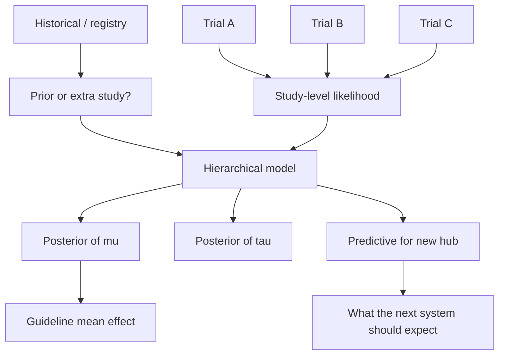
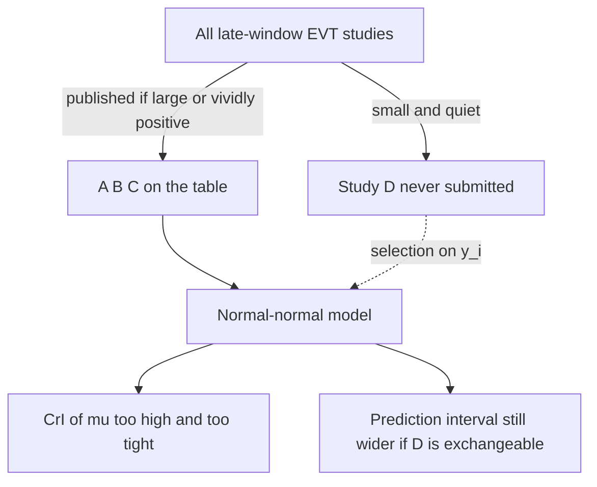
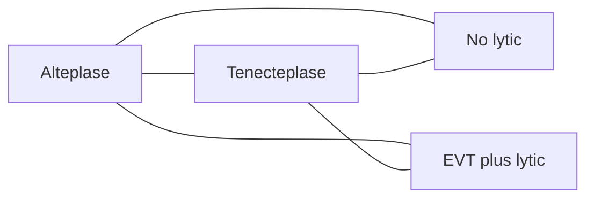
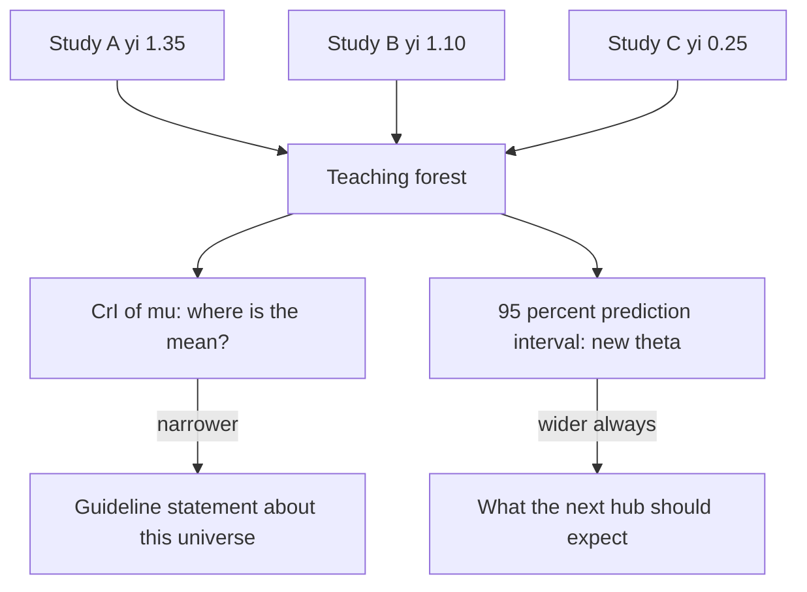

# Bayesian Meta-Analysis and Evidence Synthesis

## Opening

Two late-window endovascular trials changed practice. A third study, smaller, noisier, and differently selected, did not. A guideline committee wants a single number. A skeptic wants to know what will happen when the next registry opens in a health system that never ran a trial. Those are not the same functional of the same model. Pooling is easy. Saying what the pool is for is the work.

## Learning objectives

After working this chapter you should be able to:

- Write a random-effects meta-analysis as a hierarchical model and choose a prior for \(\tau\) you can defend with few studies.
- Report a credible interval for the mean effect *and* a prediction interval for a new study, and know which one a guideline should use.
- Handle rare-event syntheses without continuity corrections that manufacture association or hide it.
- Sketch a network meta-analysis and name the consistency assumption you are buying.
- Build a historical-control prior (MAP, power, commensurate) without laundering a drifted standard of care into “extra \(N\).”

## Clinical vignette

A stroke-network journal club is synthesizing evidence on EVT in the late window (roughly 6–24 hours) among patients selected by mismatch imaging. Three published randomized trials are on the table. **Teaching numbers only** — invented log-odds ratios for “mRS 0–2 at 90 days,” not the copyrighted counts from DAWN, DEFUSE-3, or any later study:

| Study (teaching label) | Selection sketch | log-OR \(\hat\theta_i\) | SE | \(n\) (approx.) |
| --- | --- | ---: | ---: | ---: |
| A | Clinical-core mismatch, later window | 1.35 | 0.38 | 200 |
| B | Perfusion mismatch, later window | 1.10 | 0.32 | 180 |
| C | Broader imaging, mixed window | 0.25 | 0.40 | 150 |

A fourth, single-arm registry from a regional system reports a 90-day independent outcome of 0.41 on EVT and wants to be “included.” A committee member asks for a pooled odds ratio with a 95% interval. Another asks whether a new hub that cannot run RAPID software should expect the same effect. A methodologist asks whether you will use a half-Cauchy or a half-normal on \(\tau\), and whether study C should be in the same exchangeability class as A and B.

Write, before any model: the estimand (whose odds ratio?), the exchangeability judgment for C, and whether the registry is a fourth study or a historical-control prior for a future trial.

## The random-effects model is already Bayesian

Study \(i\) reports an estimate \(y_i\) with (assumed known) standard error \(s_i\). The random-effects model is

\[
\begin{aligned}
y_i \mid \theta_i &\sim \mathcal{N}(\theta_i,\ s_i^2), \\
\theta_i \mid \mu, \tau &\sim \mathcal{N}(\mu,\ \tau^2).
\end{aligned}
\]

\(\mu\) is the mean of the distribution from which study-specific true effects are drawn. \(\tau\) is the between-study standard deviation on the same scale as \(y_i\). A fixed-effect (common-effect) analysis is the special case \(\tau = 0\). Frequentist random-effects methods (DerSimonian–Laird, REML, Hartung–Knapp) estimate \(\tau\) and then, often, pretend the estimate was known. With three late-window EVT studies that pretense is the whole problem. \(\tau\) is barely identified. Its point estimate is a noisy function of three residuals. Plug-in intervals for \(\mu\) are too narrow, and the prediction interval for a new \(\theta_{\text{new}}\) is fantasy.

A Bayesian analysis puts a prior on \(\mu\) and a prior on \(\tau\), and reports the posterior of both, and of \(\theta_{\text{new}}\). That is the entire methodological upgrade, and it is enough to change what a guideline should print.

The likelihood piece \(y_i \mid \theta_i \sim \mathcal{N}(\theta_i, s_i^2)\) is already an approximation: a log-odds ratio with a delta-method SE. It is a good approximation when cell counts are not small. It is a bad approximation when they are. Then go back to the 2 × 2 tables and use a binomial likelihood. Do not “fix” a rare-event table by adding 0.5 to every cell and then feeding the doctored log-OR to the normal model.



## Priors on \(\tau\), and why they matter more than the prior on \(\mu\)

With many studies, the likelihood for \(\tau\) dominates almost any reasonable prior. With three, the prior *is* a large part of the posterior. That is not a reason to use an improper flat prior on \(\tau\). A flat prior on a standard deviation puts too much mass on enormous heterogeneity and can pull \(\mu\) toward a bizarrely uncertain mean. It is a reason to name the prior in clinical units.

On a log-odds-ratio scale, \(\tau = 0.2\) is modest heterogeneity (study ORs wander by a factor of about \(e^{0.4} \approx 1.5\) between a lower and an upper typical study). \(\tau = 0.5\) is substantial. \(\tau = 1.0\) means the studies barely share a question. A half-normal prior, \(\tau \sim \operatorname{HalfNormal}(0, 0.5)\), puts most mass on small-to-moderate heterogeneity and still allows \(\tau > 1\). A half-Cauchy, \(\tau \sim \operatorname{HalfCauchy}(0, 0.5)\), has a heavier tail and is the Gelman-style default many of us reach for first. Neither is “noninformative.” Both must be run as a pair. If the posterior of \(\mu\) changes in a decision-relevant way when you swap them, you do not have enough studies to pretend the synthesis is prior-robust. You have a structured narrative review with a hierarchical decoration.

A weakly informative prior on \(\mu\), \(\mu \sim \operatorname{Normal}(0, 1)\) on the log-OR scale, already says that pooled odds ratios of 20 are not what you expect in a reperfusion trial. Tighten it only if you are doing a skeptical analysis. Do not tighten it to smuggle the answer you wanted from studies A and B past study C.

!!! warning "Common Pitfall"
    Do not choose the \(\tau\) prior after seeing which one makes \(I^2\) look tidy. Pre-declare a small set (half-normal 0.5, half-Cauchy 0.5, and a tighter half-normal 0.2 as a sensitivity) and show all three posteriors of \(\mu\) and of \(\theta_{\text{new}}\). Heterogeneity you refuse to look at is still in the data.

Teaching-scale intuition for the vignette, not a fitted result: A and B are close; C is smaller. Under a tight \(\tau\) prior the pooled \(\mu\) will sit near 1.0 and C will look like an outlier to be shrunk upward. Under a loose \(\tau\) prior the pooled \(\mu\) will drift down and widen, and C will be allowed to be its own \(\theta_C\). The scientific question is whether C’s broader imaging and mixed window put it in the same exchangeability class. That is not a test of \(\tau\). That is a protocol sentence.

## Credible intervals and prediction intervals

The 95% credible interval for \(\mu\) answers: given these studies and this model, where is the *mean* of the study-effect distribution? The 95% prediction interval for \(\theta_{\text{new}} \sim \mathcal{N}(\mu, \tau^2)\) answers: where is the true effect in a *new* study (or a new health system) drawn from the same distribution?

Guidelines consistently print the first and clinicians consistently need the second. A late-window EVT pooled log-OR whose credible interval excludes 0 can coexist with a prediction interval that includes 0, if \(\tau\) is not negligible. That is not a failed meta-analysis. That is the analysis telling you that the next hub — different imaging pipeline, different door-to-puncture, different willingness to treat large cores — is not a draw from a spike at \(\mu\).

Higgins, Thompson, and Spiegelhalter’s re-evaluation of random-effects meta-analysis is the piece to hand a committee that wants only \(\hat\mu \pm 1.96\,\widehat{\mathrm{SE}}\). The prediction interval is not an optional forest-plot flourish. It is the posterior that corresponds to “what should *we* expect?”

| Posterior functional | Question it answers | Wrong use |
| --- | --- | --- |
| Posterior of \(\mu\) | Mean effect in this universe of studies | Predicting the next hub |
| Posterior of \(\theta_i\) | Shrunk effect of study \(i\) | Replacing the published trial result in a press release |
| Posterior of \(\theta_{\text{new}}\) | Effect in an exchangeable new study | Treating a non-exchangeable system as exchangeable |
| Posterior of \(\tau\) | How unalike the questions were | A yes/no “heterogeneity present” stamp |

!!! tip "Clinical Pearl"
    When a colleague says “the meta-analysis was significant,” ask whether they mean the interval for \(\mu\) or the prediction interval, and whether study C was judged exchangeable *before* the forest plot was drawn. Significance is not a functional of this model.

## Rare events, continuity corrections, and why Bayes is not a patch

Zero cells appear constantly in neurology: symptomatic intracranial hemorrhage after lytic therapy, decompressive-craniectomy deaths in a small hemisphere-infarct series, anaphylaxis after a monoclonal. The Woolf-formula log-OR is undefined. The classical repair — add 0.5 to every cell of every 2 × 2, or only to the zero cells — is not a prior. It is an edit of the data. Sweeting, Sutton, and Lambert showed that the edit can bias toward or away from the null depending on which tables you touch and how unbalanced the arms are.

The Bayesian repair is to keep the binomial likelihood and put a prior on the log-odds (or on the two probabilities). A weakly informative prior on the log-OR, \(\operatorname{Normal}(0, 1)\) or the more skeptical \(\operatorname{Normal}(0, 0.5)\), regularizes empty cells without inventing half-events. A hierarchical prior on control-arm log-odds, plus a hierarchical prior on the log-OR, is the random-effects version. You can still report a posterior median OR and a 95% credible interval. You cannot still pretend a continuity-corrected inverse-variance forest plot was “the conservative analysis.”

If events are rare *and* studies are few *and* \(\tau\) is unknown, no method will give you a precise answer. The honest posterior will be wide. That is the result.

## Publication bias and small-study selection

The three teaching trials on the table were published. That is already a selection model, and it is not the hierarchical model you just wrote. Small studies with noisy log-odds ratios near zero are less likely to be written up, less likely to clear a stroke journal, and less likely to be in the folder a guideline committee opens. Large, early, vividly positive trials are more likely to be in that folder twice. The random-effects likelihood \(y_i \mid \theta_i \sim \mathcal{N}(\theta_i, s_i^2)\) conditions on the studies you see. It does not model the studies you do not.

Small-study selection is the usual mechanism. A 40-patient late-window series with an estimated log-OR of 1.4 and an SE of 0.7 is a better career move than the same series with a log-OR of 0.1. The selection is on the *estimate*, not on the true \(\theta_i\). That induces a relationship between \(s_i\) and \(y_i\) that the exchangeable normal-normal model reads as heterogeneity or as a larger \(\mu\). A funnel plot is the picture: SE (or \(1/\mathrm{SE}\)) on one axis, effect on the other. Asymmetry is a clue, not a diagnosis. True heterogeneity that happens to track study size — later, broader, smaller studies of a more mixed population, which is exactly study C — looks like publication bias. Publication bias looks like heterogeneity. A committee that “corrects” one with a trim-and-fill algorithm has edited the data and renamed the edit a sensitivity analysis.

Bayesian selection models (Copas-style, or a weight that is a function of the \(p\)-value or of \(y_i/s_i\)) put the missingness on the page. They need a prior on how savage the selection was. That prior is not identified from three published trials. With three late-window studies you can say: “if a small negative study is missing, \(\mu\) moves by about this much,” and you can show the move. You cannot retrieve the missing study from the posterior of \(\tau\).

Teaching sketch, not a retrieval. Add an imagined unpublished study D: log-OR \(0.05\), SE \(0.55\), \(n \approx 80\), broader imaging, never submitted because the interval crossed 1. Under the half-normal \(\tau\) prior already on the table, including D as if it had been found drops the posterior median of \(\mu\) and widens the prediction interval for \(\theta_{\text{new}}\) enough that a hub without trial-grade imaging should notice. That is the direction of the bias you are trying to bound. It is not a number to put in a forest plot labeled “adjusted.”

What you owe the committee is narrower and more honest.

- Search, and say what you searched. PRISMA is the reporting skeleton; it does not fill empty cells.
- Pre-declare whether small single-center series are eligible. If they are, they need a design-type increment or their own \(\tau\), not a seat next to A and B.
- Show a funnel, even with three points, as a *warning label*, not as a test. Three points will not reject Egger. They will show you that C is the small, low one.
- Report the posterior of \(\mu\) and of \(\theta_{\text{new}}\) with C in and with C out. If a hypothetical missing D of the size above would flip a recommendation, write that sentence. Do not wait for a software package to “adjust” D into existence.



The prediction interval is not a cure for publication bias. It is the interval that at least admits the next study may look like C, or like D. The credible interval for \(\mu\) is the interval that pretends the published mean is the mean of the universe you care about. When selection has eaten the left tail, both intervals are centered too high; the prediction interval is at least wide enough to be embarrassed.

!!! warning "Common Pitfall"
    Trim-and-fill, fail-safe \(N\), and a significant Egger test are not a prior on missing studies. They are recipes that can manufacture a fifth point and then treat it as data. If you cannot write the selection mechanism, do not “correct” the forest. Bound it.

## Network meta-analysis, sketched

Pairwise meta-analysis compares A versus B where A-versus-B trials exist. Network meta-analysis (NMA) uses the whole graph: A versus B, B versus C, A versus C, and every multi-arm trial, to estimate every contrast. The identifying assumption is *consistency*: the direct A-versus-C contrast equals the indirect contrast constructed from A-versus-B and B-versus-C. In notation, \(\theta_{AC} = \theta_{AB} + \theta_{BC}\).

Stroke supplies natural networks: alteplase versus tenecteplase versus no lytic, with EVT on or off the table; intensive versus guideline BP lowering versus a third target; one hematoma-evacuation device versus another versus medical care. Consistency fails when the trials that compare A to B enroll a different population than the trials that compare B to C — the late-window EVT analogue is “mismatch-selected” versus “ASPECTS-selected” versus “unselected.” A Bayesian NMA makes the consistency assumption a set of deterministic constraints on the mean effects (or a hierarchical relaxation, “inconsistency models”). It does not test the assumption into truth.



Do not run an NMA because a software tutorial exists. Run one when the decision is a choice among more than two options and you are willing to defend consistency in writing. Report each contrast with its own prediction interval. Report the probability that each option is best only if you also report that those probabilities are a razor-thin function of \(\tau\) and of which trials you judged exchangeable.

### For the biostatistician / methodologist

The `brms` formula `yi | se(sei) ~ 1 + (1 | study)` is the normal-normal model with a varying intercept whose SD is \(\tau\). The `| se(sei)` term is a known measurement error, not a residual to be estimated; do not also estimate `sigma` unless you intend a different model. Prior choice is `prior(normal(0, 1), class = "Intercept")` for \(\mu\) and `prior(normal(0, 0.5), class = "sd")` (or a half-Cauchy) for \(\tau\).

A binomial meta-analysis is cleaner when you have the tables: `s | trials(n) ~ treat + (treat | study)` with a binomial family, which is the exact likelihood version of a random-effects log-OR model (and estimates control-arm variation as well). Rare events belong here.

Meta-analytic predictive (MAP) priors for historical controls (Neuenschwander, Capkun-Niggli, Branson, Spiegelhalter) are the predictive distribution of a new control logit from a hierarchical model of past controls. A robustified MAP (mixture with a vague component) is the standard hedge against prior-data conflict. A power prior raises the historical likelihood to \(a \in (0,1)\). A commensurate prior lets the current-study parameter shrink toward the historical one with a variance the current data can inflate. All three are ways of saying “these old patients are partly exchangeable.” None of them repairs a control series collected under a different standard of care.

## Borrowing from historical controls

The registry in the vignette is the temptation. Forty, or four hundred, observational EVT patients with a 0.41 good-outcome rate look like free information. Sometimes they are. More often they are a drifted control: better devices, faster times, different imaging gates, different withdrawal-of-care culture. Putting them in the forest plot as study D with a made-up SE is the worst option. Using them as a MAP prior for the *control* arm of a future randomized trial, with a robust mixture so that conflict can discount them, is the option that has a literature.

The general principle is the same as in the platform-trial chapter: borrowing is a model for non-exchangeability, not a gift of sample size. If you cannot write the model, do not borrow.

!!! note "Mathematical Detail"
    A MAP prior from \(K\) historical controls is \(p(\theta^\star \mid y_{\text{hist}}) = \int \mathcal{N}(\theta^\star \mid \mu, \tau^2)\, p(\mu, \tau \mid y_{\text{hist}})\, d\mu\, d\tau\). It is usually multimodal after robustification, \(0.8\,\widehat{\mathrm{MAP}} + 0.2\,\operatorname{Normal}(0, 2^2)\) or similar on the logit. The current trial’s control likelihood multiplies this prior. If the current control rate sits in the vague component, the historical data are automatically down-weighted. That automatic behavior is the point of the mixture.

## IPD versus aggregate: the HERMES problem

HERMES — the Highly Effective Reperfusion evaluated in Multiple Endovascular Stroke Trials collaboration — is the public design fact this section needs, not a table of numbers. Five early EVT trials shared a contrast (endovascular therapy versus medical care), a horizon (90-day function), and enough common covariates that an individual-patient-data (IPD) synthesis was thinkable. The published IPD paper is a landmark. It is also a standing rebuke to anyone who thinks a three-row aggregate forest of log-ORs answers the same questions.

Aggregate meta-analysis, which is what the `yi | se(sei)` model in this chapter is, sees one number per study. It can estimate \(\mu\) and \(\tau\). It can, if you are reckless and have more studies than we do, put a study-level covariate — mean NIHSS, mean time to puncture, percent mismatch-selected — on \(\mu_i\). That last move is ecological. The slope of *study-mean* NIHSS on *study-level* log-OR is not the within-patient treatment-by-NIHSS interaction. Study C can have a lower mean NIHSS *and* a broader imaging gate *and* a slower door-to-puncture; the aggregate regression will not tell you which modifier moved \(\theta_C\). HERMES-style IPD can. That is the HERMES problem, stated as a method: the questions a guideline actually asks — does the benefit persist in the elderly, in mild NIHSS, in large cores, at hour seven — are interaction questions. Interactions live in patients. They do not live in study means.

IPD is not magic. It is a hierarchical model with a likelihood at the person level,

\[
y_{ij} \mid \theta_{ij} \sim f(\theta_{ij}), \qquad
g(\theta_{ij}) = \alpha_j + x_{ij}\beta + z_{ij}\gamma_j,
\]

with study intercepts \(\alpha_j\) and, if you believe them, study-specific slopes \(\gamma_j\) around a mean interaction. Exchangeability claims move from “studies A, B, C are draws from one \(\mu\)” to “patients are draws from study-specific risks that share slopes.” You still have to defend the second sentence. A trial that enrolled only mismatch-selected patients cannot, by IPD alchemy, tell you the effect in unselected ones. What IPD *can* do is stop you from reading C’s smaller log-OR as “EVT fails when NIHSS is lower” when C’s patients are also later and less selected.

Two syntheses, one **teaching** contrast. Aggregate: studies A, B, C as in the vignette table, posterior of \(\mu\) on the log-OR scale, and a 95% prediction interval for a new study. IPD (imagined, not extracted): the same three trials with patient-level mRS, treatment, NIHSS, time, and age. The IPD model can report a treatment effect at NIHSS 8 and at NIHSS 18, with a posterior on the interaction. The aggregate model can report only that the study with the broader mix looked smaller. If those two sentences would license different offers of late-window EVT at a hub that sees NIHSS 8, you do not have an aggregate question. You have an IPD question, and the published summary statistics will not grow the missing rows.

The forest you owe a committee, even when you have only aggregate data, already distinguishes the two intervals this chapter has been insisting on. The diamond for \(\mu\) is the mean of the study-effect distribution. The bar for \(\theta_{\text{new}}\) is a draw from \(\mathcal{N}(\mu, \tau^2)\) after \(\mu\) and \(\tau\) have been integrated.



HERMES, as a design, could shrink that prediction bar by explaining \(\tau\) with patient-level covariates. An aggregate forest cannot. Printing only the diamond is how a guideline tells a new hub to expect \(\mu\) and then acts surprised when the hub, which is a new study, lands nearer C.

Do not lift HERMES counts, odds ratios, or figures into this chapter. Extract \(y_i, s_i\) from the primary papers if a real committee is waiting. Use the IPD if you have it and you can name the interactions in advance. Use the aggregate model if you do not, and then do not answer interaction questions with study-level slopes. The R forest in the next section draws both the `pooled mu` row and the `new study` row on purpose. Look at both. The first is \(\operatorname{CrI}(\mu)\). The second is the prediction interval.

!!! tip "Clinical Pearl"
    When a colleague says “HERMES showed the benefit is consistent across subgroups,” ask whether they mean the IPD interaction posteriors or a row of aggregate boxes that all sit on the same side of 1. Consistency of sign is not a flat interaction. The next patient is not a study mean.

## R: a `brms` meta-analysis and a forest-style plot

Teaching log-ORs from the vignette. Specification plus a `tidybayes` forest. The `brm()` call is not assumed to have been run.

```r
# Bayesian random-effects meta-analysis of teaching late-window EVT log-ORs.
# Model: yi | se(sei) ~ 1 + (1 | study)
# Priors: mu ~ Normal(0, 1); tau ~ HalfNormal(0, 0.5).
# Seed fixed. Specification only until you sample.

set.seed(20260818)

library(brms)
library(tidybayes)
library(ggplot2)
library(dplyr)

evt_teach <- data.frame(
  study = c("A_clinical_mismatch", "B_perfusion_mismatch", "C_broader_imaging"),
  yi    = c(1.35, 1.10, 0.25),
  sei   = c(0.38, 0.32, 0.40)
)

priors_ma <- c(
  prior(normal(0, 1), class = "Intercept"),
  prior(normal(0, 0.5), class = "sd")
)

fit_ma <- brm(
  yi | se(sei) ~ 1 + (1 | study),
  data    = evt_teach,
  family  = gaussian(),
  prior   = priors_ma,
  seed    = 20260818,
  refresh = 0
)

# Study-specific shrunk effects, pooled mu, and a new-study prediction.
study_draws <- fit_ma %>%
  spread_draws(b_Intercept, r_study[study, ], sd_study__Intercept) %>%
  mutate(
    theta_i   = b_Intercept + r_study,
    theta_new = rnorm(n(), mean = b_Intercept, sd = sd_study__Intercept),
    or_i      = exp(theta_i),
    or_mu     = exp(b_Intercept),
    or_new    = exp(theta_new)
  )

forest_df <- bind_rows(
  study_draws %>% median_qi(or_i, .width = 0.95) %>%
    transmute(label = study, or = or_i, .lower, .upper, kind = "study"),
  study_draws %>% median_qi(or_mu, .width = 0.95) %>%
    transmute(label = "pooled mu", or = or_mu, .lower, .upper, kind = "mean"),
  study_draws %>% median_qi(or_new, .width = 0.95) %>%
    transmute(label = "new study", or = or_new, .lower, .upper, kind = "pred")
)

ggplot(forest_df, aes(or, label, xmin = .lower, xmax = .upper, color = kind)) +
  geom_vline(xintercept = 1, linetype = 2) +
  geom_pointrange() +
  scale_x_log10() +
  labs(
    x = "Odds ratio for mRS 0-2 (teaching synthesis)",
    y = NULL,
    color = NULL,
    title = "Posterior forest: studies, mean, prediction"
  ) +
  theme_minimal()
```

The row labeled `new study` is the one the hub that cannot run the trial’s imaging pipeline should stare at. If that interval covers 1 under a defensible \(\tau\) prior, the mean effect can still be “significantly positive” and the next system still should not bank on it.

!!! example "R Deep Dive"
    Sensitivity: refit with `prior(cauchy(0, 0.5), class = "sd")` and with study C removed. Bind the three `or_mu` and `or_new` posteriors and plot them as overlapping densities. If dropping C moves \(\mu\) more than swapping the \(\tau\) prior, your exchangeability judgment is doing more work than your prior — which is as it should be, and which should be a sentence in the paper, not a silent omission of C.

## Worked solution to the opening vignette

**Estimand.** The committee’s “pooled odds ratio” must name a population and a contrast: the log-OR for day-90 mRS 0–2, EVT versus medical care, among patients who would have been eligible for *some* late-window mismatch trial. That is \(\mu\) in an exchangeability class you have to define. It is not “the effect of EVT in the late window in nature.”

**Study C.** C is not automatically exchangeable with A and B. Broader imaging and a mixed window are exactly the modifiers that late-window science spent a decade taking seriously. Pre-declare two syntheses: a primary restricted to mismatch-selected trials (A, B, and any later cousin), and a secondary that includes C with a larger expected \(\tau\). Do not let a heterogeneity statistic make that choice after the forest plot is drawn. If you include C in one class, the prediction interval — not the interval for \(\mu\) — is what you owe the hub with sloppy imaging.

**The registry.** It is not a fourth randomized study. It has no concurrent medical-care arm that is exchangeable with the trial controls, and its 0.41 good-outcome rate confounds selection, device generation, and care-withdrawal culture. Use it, if at all, as a MAP prior for the EVT *arm* of a future trial or as an external benchmark for state occupancy, robustified so that conflict can discount it. Do not drop it into `evt_teach` with a homemade SE.

**What to print.** Print the posterior of \(\mu\) under the pre-declared primary class and the pre-declared \(\tau\) prior, the same posterior under the sensitivity priors, and the prediction interval for a new mismatch-selected system. Hand the guideline the prediction interval. Hand the press the sentence: “These teaching numbers are a worked example; the published trials must be re-extracted from their papers before anyone updates practice.”

DAWN and DEFUSE-3, as publicly described, were both late-window, mismatch-selected, EVT-versus-medical-care randomized trials with 90-day functional primaries. That shared skeleton is why a hierarchical synthesis is even thinkable. It is not why their results may be copied into this chapter. Extract your own \(y_i, s_i\) from the primary papers if you are doing this for a real committee.

!!! warning "Common Pitfall"
    A network that “includes observational evidence” by treating propensity-weighted log-ORs as just another \(y_i\) with a slightly larger \(s_i\) inherits every unmeasured-confounding problem those weights did not fix, then hides it under a random effect. If you must mix designs, put a design-type increment in the mean and a separate \(\tau\), or keep the observational evidence in the prior, not in the likelihood.

## Exercises

1. **Bedside.** A new hub asks whether they should offer late-window EVT without perfusion software. Using only the distinction between \(\mu\) and \(\theta_{\text{new}}\), write the six-sentence answer.

2. **\(\tau\) prior.** Using the R block, write down (without necessarily running) what you expect to happen to the posterior of \(\tau\) and of \(\theta_{\text{new}}\) if you replace the three SEs with one-tenth of their values. When the likelihood for \(\tau\) is that sharp, does the half-Cauchy versus half-normal debate still matter?

3. **Rare events.** A teaching pair of 2 × 2 tables for symptomatic ICH: 0/90 versus 3/92, and 1/40 versus 1/41. Compute a continuity-corrected log-OR by hand for the first table (add 0.5 to each cell). Then write the binomial likelihood you would rather use. Which number would you not put in a forest plot?

4. **Exchangeability.** Propose a covariate — imaging gate, window, core-volume cap — to put on \(\mu_i = \mu + x_i\beta + u_i\) so that C can stay in the model without being forced toward A and B. What prior on \(\beta\) keeps you from fitting noise with three studies?

5. **Historical controls.** Write a two-component robust MAP prior for a medical-care control logit, in words a DSMB will tolerate. What current-trial observation would make the vague component take over?

6. **NMA consistency.** In a three-node network (alteplase, tenecteplase, no lytic) the indirect tenecteplase-versus-alteplase contrast disagrees with the direct one. Name two clinical reasons that would *not* be fixed by a larger \(\tau\), and say whether you would drop a node or add an inconsistency parameter.

## Further reading

- Higgins JPT, Thompson SG, Spiegelhalter DJ. A re-evaluation of random-effects meta-analysis. *Journal of the Royal Statistical Society, Series A*. 2009;172:137–159.
- Gelman A. Prior distributions for variance parameters in hierarchical models (comment on article by Browne and Draper). *Bayesian Analysis*. 2006;1:515–534.
- Sutton AJ, Abrams KR. Bayesian methods in meta-analysis and evidence synthesis. *Statistical Methods in Medical Research*. 2001;10:277–303.
- Sweeting MJ, Sutton AJ, Lambert PC. What to add to nothing? Use and avoidance of continuity corrections in meta-analysis of sparse data. *Statistics in Medicine*. 2004;23:1351–1375.
- Dias S, Welton NJ, Sutton AJ, Ades AE. *NICE DSU Technical Support Document 2: A Generalised Linear Modelling Framework for Pairwise and Network Meta-Analysis of Randomised Controlled Trials*. 2011 (updated).
- Neuenschwander B, Capkun-Niggli G, Branson M, Spiegelhalter DJ. Summarizing historical information on controls in clinical trials. *Clinical Trials*. 2010;7:5–18.
- Page MJ et al. The PRISMA 2020 statement: an updated guideline for reporting systematic reviews. *BMJ*. 2021;372:n71.
- Nogueira RG et al. Thrombectomy 6 to 24 hours after stroke with a mismatch between deficit and infarct (DAWN). *New England Journal of Medicine*. 2018;378:11–21. Albers GW et al. Thrombectomy for stroke at 6 to 16 hours with selection by perfusion imaging (DEFUSE 3). *New England Journal of Medicine*. 2018;378:708–718. Public design facts only; extract your own numbers from the papers.

!!! success "Key Takeaway"
    A meta-analysis is a hierarchical model, not a weighted average with a heterogeneity footnote. The prior on \(\tau\) is part of the result when studies are few; show more than one. Print the prediction interval next to the interval for \(\mu\), and use the former when a new system wants to know what will happen to them. Rare events keep their binomial likelihood; continuity corrections are data edits. Networks and historical controls are exchangeability claims — write them down, robustify them, and refuse to launder a drifted registry into a fourth trial. The late-window EVT story is a teaching skeleton; any real synthesis starts from extracted tables, not from memory of the headlines.
