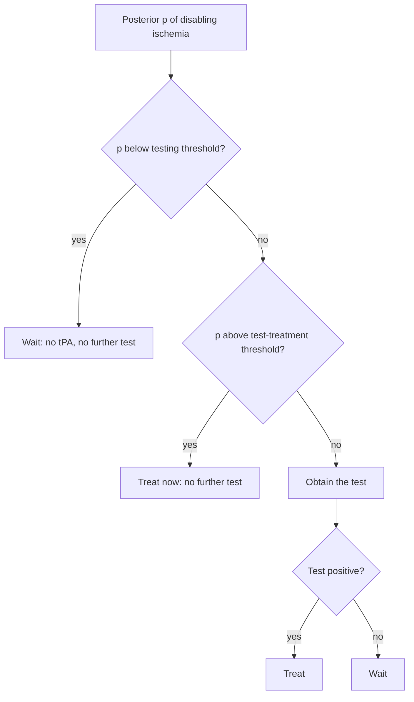
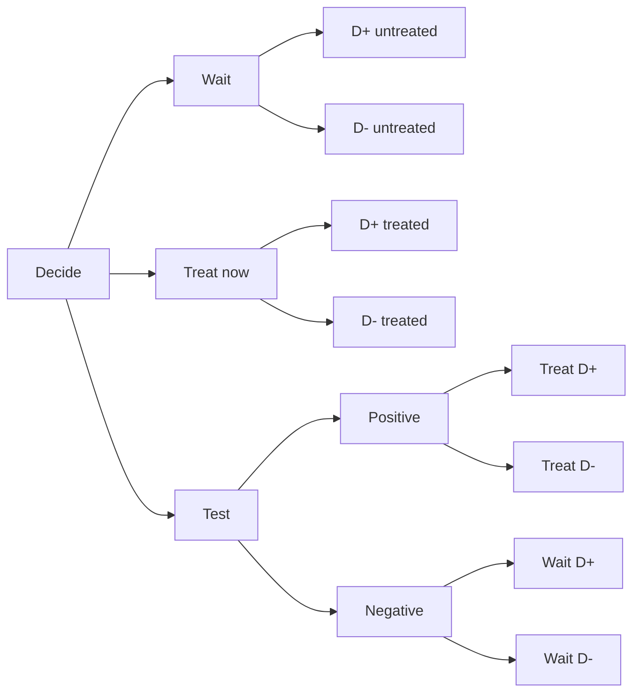

# Decision Theory, Utilities, Loss Functions, and Treatment Thresholds

## Opening

A 58-year-old editor arrives 70 minutes after sudden word-finding failure. She names one of three objects, repeats with paraphasias, and cannot read the sentence on the card. Strength, vision, and gait are intact. The clock is running on alteplase. You do not need a new trial in this moment. You need a decision rule that can live with an uncertain diagnosis, an uncertain benefit, a concrete harm, and a patient whose idea of a life worth protecting is not the same as the next person's.

## Learning objectives

After working this chapter you should be able to:

- State the expected-utility rule and write a loss function as the negative of a utility.
- Derive the treatment threshold from harm and benefit, and interpret it as a harm/benefit ratio.
- Compute Pauker–Kassirer testing and test-treatment thresholds for a dichotomous test, with and without a test risk.
- Sketch a QALY without pretending it is a bedside number, and name the settings in which formal quantification should stop.
- Build a three-action tree (wait / test / treat) and defend a choice under teaching utilities.

## Clinical vignette

A right-handed 58-year-old magazine editor is last known well 70 minutes ago. Blood pressure is 148/82 mm Hg. Glucose is 118 mg/dL. There is no hemorrhage on noncontrast CT. CTA shows no large-vessel occlusion. NIHSS is 4, driven entirely by aphasia: she says “pen” for a watch, cannot repeat a clause, and writes a sentence that trails into neologisms. She lives alone, supports herself by editing, and has no advance directive on file. Her sister, reached by phone, says “she would rather risk a bleed than lose language.” The electronic record flags “mild stroke — consider not treating.”

You have three actions before the 4.5-hour window closes: treat now with intravenous thrombolysis, wait without a further test, or obtain a perfusion study that will take 25 minutes and may or may not reclassify the tissue. The sister’s sentence is a preference. It is not yet a utility.

Pause here. Write down, in any units you like, what you would count as the benefit of treating a true disabling aphasia, the harm of treating a stroke mimic or a stroke that would have recovered, and the harm of delaying treatment for a test. Do not look ahead. The formal solution is later; the point of the pause is to notice how much of the decision is already a number you have not written down.

## Decisions are expected utilities, whether or not you write the integral

Every action \(a\) you can take at a bedside meets an unknown state \(\theta\): true disabling ischemia or not, hemorrhage or not, language that will return or not. A utility function \(U(a, \theta)\) scores the consequence. The Bayesian decision rule is not a slogan. It is the instruction to choose

\[
a^{\star} = \arg\max_{a} \mathbb{E}\bigl[U(a, \theta) \mid \text{data}\bigr]
   = \arg\max_{a} \int U(a, \theta)\, p(\theta \mid \text{data})\, d\theta.
\]

If you prefer to talk about loss, set \(L(a, \theta) = -U(a, \theta)\) and minimize expected loss. Nothing moral changes when the sign flips. What changes is the honesty of \(U\). A utility that treats “NIHSS 4” as uniformly mild is already a policy, and a bad one if the four points are language in a person whose work is language.

Clinicians already maximize something. They maximize a tacit utility that mixes mortality, disability, regret, lawsuit fear, and the last similar case they remember. Decision theory does not invent the maximization. It forces the ingredients onto the page so that a harm/benefit argument can be checked, shared, and revised.

!!! tip "Clinical Pearl"
    If you cannot name the state that would make you change your mind, you do not yet have a decision problem. You have a habit. Aphasia that would end a career is a different state from a fleeting dysarthria that will be gone at 24 hours. Thresholds follow states, not NIHSS bins.

## Utilities, losses, and the two mistakes that are not symmetric

Write a 2-by-2 of actions and truth for the binary problem “disabling ischemia, treat or not.”

|  | Disease present (\(D+\)) | Disease absent (\(D-\)) |
| --- | --- | --- |
| Treat | \(U_{TP}\) | \(U_{FP}\) |
| Do not treat | \(U_{FN}\) | \(U_{TN}\) |

Two differences do almost all of the work.

- Benefit of treating the sick: \(B = U_{TP} - U_{FN}\).
- Harm of treating the well: \(H = U_{TN} - U_{FP}\).

\(B\) is what you hope to buy. \(H\) is what you spend on the people who never needed the drug. They are not the same coin. Treating a true disabling aphasia and restoring a work life is not the moral inverse of causing a symptomatic hemorrhage in a mimic. The arithmetic will add them anyway. That is a feature of expected utility, not a proof that the two mistakes feel the same to the person in the stretcher.

A 0–1 loss, which scores every error as 1 and every correct action as 0, recovers the familiar “pick the more probable class” rule. Medicine almost never has 0–1 loss. A missed basilar occlusion is not the same loss as an unnecessary CTA. If you use 0–1 loss at the bedside, you have decided, quietly, that false positives and false negatives are interchangeable. They are not.

!!! warning "Common Pitfall"
    Do not import a utility from a cost-effectiveness paper and treat it as this patient’s utility. Published QALY weights are averages over other people, other ages, and other elicitation methods. They are starting priors for a conversation, not vital signs.

## The treatment threshold is a harm/benefit ratio

Suppose no further test is available. You will either treat now or wait. Expected utilities as a function of the probability of disease \(p = P(D+ \mid \text{data})\) are straight lines.

\[
\begin{aligned}
EU(\text{treat}) &= p\, U_{TP} + (1-p)\, U_{FP}, \\
EU(\text{wait})  &= p\, U_{FN} + (1-p)\, U_{TN}.
\end{aligned}
\]

They cross at the treatment threshold

\[
p_{Rx}^{\star} = \frac{H}{H + B} = \frac{1}{1 + B/H}.
\]

Treat when the posterior exceeds \(p_{Rx}^{\star}\); wait when it does not. If benefit is ten times harm, you treat at a 9% probability. If harm equals benefit, you treat only above 50%. If harm is four times benefit — a harsh but conceivable ratio when the only plausible gain is a small language increment and the hemorrhage is disabling — you treat only above 80%.

This is the same threshold that appears, in other clothes, as a likelihood-ratio cutoff and as the slope of a decision curve. It is not a property of alteplase. It is a property of the utilities you assigned to alteplase in this person.

!!! note "Mathematical Detail"
    The threshold depends only on the *difference* in utility between treating and not treating, in each truth state. Adding 10 utiles to every cell leaves \(p_{Rx}^{\star}\) unchanged. You can therefore set \(U_{TN} = 1\) and \(U_{FN} = 0\) without loss of generality and spend your elicitation effort on \(B\) and \(H\). Absolute utilities matter for QALYs and for comparing programs across diseases. Ratios suffice for a single treat-or-not decision.

## Pauker–Kassirer: when a test sits between waiting and treating

Pauker and Kassirer (1980) added a third action: obtain a dichotomous test with sensitivity \(Se\) and specificity \(Sp\), then treat if the test is positive. The test itself may carry a disutility \(R\) (time, contrast, radiation, or the simple fact that minutes of penumbra are not free). Two new thresholds appear.

**Testing threshold** \(T_t\). Below it, even a positive test would not justify treatment, or the test risk swamps the information. Wait.

**Test–treatment threshold** \(T_{tt}\). Above it, even a negative test would not justify withholding treatment. Treat without testing.

Between them, test, then act on the result.

\[
T_t = \frac{(1-Sp)\, H + R}{(1-Sp)\, H + Se\cdot B}, \qquad
T_{tt} = \frac{Sp\cdot H - R}{Sp\cdot H + (1-Se)\, B}.
\]

If \(R = 0\), these collapse to the cleaner pair

\[
T_t = \frac{(1-Sp)\, H}{(1-Sp)\, H + Se\cdot B}, \qquad
T_{tt} = \frac{Sp\cdot H}{Sp\cdot H + (1-Se)\, B}.
\]

A perfect test (\(Se = Sp = 1\), \(R = 0\)) drives \(T_t\) to 0 and \(T_{tt}\) to 1: you always test, because the test is free and decisive. A useless test (\(Se + Sp = 1\)) makes the testing interval vanish. A dangerous test (\(R\) large) can make \(T_t > T_{tt}\), which is the model’s way of saying “do not buy this test.”



The same logic as a decision tree, with the three actions written as branches rather than as a flowchart, is worth drawing once by hand. The numbers on the branches are probabilities. The numbers on the leaves are utilities. The value of a node is the probability-weighted utility of its children. You roll the tree back from the leaves to the root and pick the branch with the higher value. That is all of finite decision theory.



## A table of the formulas you will actually use

| Quantity | Formula | Reads as |
| --- | --- | --- |
| Benefit \(B\) | \(U_{TP} - U_{FN}\) | What treating the sick is worth |
| Harm \(H\) | \(U_{TN} - U_{FP}\) | What treating the well costs |
| Treatment threshold | \(H / (H+B)\) | Posterior at which treat = wait |
| Harm/benefit form | \(1 / (1 + B/H)\) | Same threshold, ratio first |
| Testing threshold, \(R=0\) | \((1-Sp)H / [(1-Sp)H + Se\, B]\) | Floor of the testing zone |
| Test–treatment, \(R=0\) | \(Sp\, H / [Sp\, H + (1-Se)B]\) | Ceiling of the testing zone |
| Testing threshold, with \(R\) | \([(1-Sp)H + R] / [(1-Sp)H + Se\, B]\) | Floor, test not free |
| Test–treatment, with \(R\) | \([Sp\, H - R] / [Sp\, H + (1-Se)B]\) | Ceiling, test not free |
| No-testing condition | \(T_t \ge T_{tt}\) | Test is not worth buying |

Keep the table next to the tree. The formulas are the rolled-back tree in closed form.

Rollback with the teaching utilities is worth doing once so the formulas stop feeling like a spell. At a posterior \(p = 0.55\), with \(B = 0.40\) and \(H = 0.30\),

\[
EU(\text{treat}) = 0.55\cdot 0.80 + 0.45\cdot 0.70 = 0.755, \qquad
EU(\text{wait}) = 0.55\cdot 0.40 + 0.45\cdot 1.00 = 0.670.
\]

Treat beats wait by 0.085 utiles. The test, with \(Se = 0.80\), \(Sp = 0.70\), \(R = 0.02\), produces a positive result with probability \(p\cdot Se + (1-p)(1-Sp) = 0.575\). Conditional on a positive result the posterior is 0.77, which is above \(p_{Rx}^{\star}\); conditional on a negative result it is 0.26, which is below. The test-then-act utility is therefore the probability-weighted mix of treat-at-0.77 and wait-at-0.26, minus \(R\). That mix lands between 0.755 and 0.670 and, in this teaching arithmetic, slightly below treat-now once the delay is paid. The closed-form \(T_{tt} \approx 0.60\) had already said this: at \(p = 0.55\) you are still inside the testing interval on a zero-\(R\) calculation and just below it once \(R\) is real. Rollback and formula agree. When they do not, you have mis-wired a branch.

## Harm/benefit ratios are easier to elicit than utiles

Asking a patient, a sister, or yourself “how many utiles is recovered syntax?” is a bad question. Asking “how many unnecessary hemorrhages would you accept to prevent one permanently lost language life?” is a better one. That ratio is \(B/H\), and it plugs directly into \(p_{Rx}^{\star} = 1/(1+B/H)\).

Elicitation still fails in predictable ways. People overweight the first harm you mention. They refuse to trade at all when the harm is a bleed they can picture and the benefit is a probability they cannot. They give different ratios if you frame the question as lives saved rather than hemorrhages caused. Dual-process psychology is not a footnote here. System 1 supplies a vivid bleed; System 2 has to keep the denominator in view.

For teaching, use a short menu of ratios rather than a false precision.

| Stated trade | \(B/H\) | Treatment threshold | Clinical reading |
| --- | --- | --- | --- |
| Accept 1 harm to gain 10 benefits | 10 | 0.09 | Treat at modest probability |
| Accept 1 harm to gain 4 benefits | 4 | 0.20 | Typical “effective care” range |
| Accept 1 harm to gain 1 benefit | 1 | 0.50 | Coin-flip indifference |
| Accept 4 harms to gain 1 benefit | 0.25 | 0.80 | Treat only if nearly sure |
| Refuse any harm | \(0\) | 1.00 | Never treat |

The sister on the phone said she would rather risk a bleed than lose language. That is at least the first row, and maybe stronger. The electronic-record banner that says “mild stroke — consider not treating” is implicitly a much higher threshold. The conflict is not about the CT. It is about \(B/H\).

!!! tip "Clinical Pearl"
    When two competent clinicians disagree about thrombolysis in mild aphasia, ask which number they are fighting over: the probability of disabling ischemia, the size of \(B\), or the size of \(H\). Disagreement about the posterior is a Bayesian updating problem. Disagreement about \(B/H\) is a values problem. Mixing them produces circular arguments and delayed doors.

## QALYs, sketched carefully, then put back on the shelf

A quality-adjusted life year multiplies time by a health-state weight on \([0, 1]\), with dead at 0 and a reference “full health” at 1. A year with a residual moderate aphasia weighted 0.7 is 0.7 QALYs. Discounting, usually at 3% per year in North American reference cases, shrinks distant years. Incremental cost-effectiveness then divides extra cost by extra QALYs.

This is a coherent way to compare programs across diseases when a payer must allocate a budget. It is a clumsy way to decide on alteplase at 70 minutes. Several limitations are not optional footnotes.

Weights depend on who is asked (patients with aphasia often rate residual language better than healthy proxies do) and on the elicitation method (time trade-off, standard gamble, and discrete-choice experiments do not agree). Ceiling effects crush small but decisive increments: the difference between “cannot return to editing” and “can edit with effort” may vanish in a generic stroke weight. Average weights hide the editor. Discounting is a social choice, not a physiological fact. And the QALY is silent on distribution: a gain of 0.05 QALYs in 100 people is not the same moral object as a gain of 5 QALYs in one person, even when the totals match.

Use QALYs when the decision is a policy, the time horizon is years, and the alternative uses of the money are real. Do not use them as a way to avoid talking to the sister.

!!! warning "Common Pitfall"
    A common slide in grand rounds shows a published incremental cost-effectiveness ratio for thrombolysis and then treats that ratio as a reason to give, or withhold, the drug in the next patient. Cost-effectiveness can justify stocking alteplase. It cannot tell you whether *this* aphasia is worth *this* hemorrhage risk under *these* preferences.

## When not to over-quantify

Formal thresholds earn their keep when the action is irreversible, the harm and benefit are both large, and the posterior sits near the threshold. They waste time, and they can launder a preference as if it were a calculation, when any of the following hold.

The utilities are not stable under reasonable re-elicitation. The model of the state is wrong (you are thresholding “stroke vs mimic” when the live distinction is “disabling vs nondisabling language”). The test you are pricing will not return in time to change the action. The patient has already stated a lexicographic preference — “I will not accept a hemorrhage for a chance at a small language gain” — which is a corner of the utility space, not a ratio you should sand down. Or the uncertainty that matters is structural (is this a stroke at all?) rather than parametric (is \(p\) 0.22 or 0.28?).

Decision theory is a discipline for making the hidden numbers speak. It is not a requirement that every number be spoken to three decimals at 3 a.m.

### For the biostatistician / methodologist

Expected utility is linear in the posterior. That is why a single threshold exists for a binary action and a binary state. The moment the loss is not a function of a binary state — ordinal mRS, time-to-recanalization, a joint distribution over hemorrhage and independence — the “threshold” becomes a surface in a higher-dimensional posterior. You can still compute the expected utility of each action by integrating the loss against the posterior you actually have. You cannot, in general, collapse that integral back to a single probability of “disease.”

If utilities themselves are uncertain, put a prior on \(U\) and take the expectation jointly,

\[
EU(a) = \iint U(a, \theta)\, p(\theta \mid \text{data})\, p(U \mid \text{elicitation})\, d\theta\, dU,
\]

or, more honestly, report the decision as a function of \(B/H\) and let the reader move. Sensitivity to the utility prior is often larger than sensitivity to the disease prior. A paper that perturbs the disease model and freezes a point-utility is answering the smaller question.

Loss functions used in estimation (squared error, LINEX, 0–1) are not automatically the right loss for treatment choice. Squared-error posterior means are optimal for reporting a location. They are not optimal for deciding whether to lyse. Keep the inferential loss and the decision loss in separate compartments unless you have a reason to couple them.

## Teaching utilities for the vignette

The following numbers are **teaching utilities**, not trial results and not this patient’s values. They exist so that the arithmetic can be seen.

Set \(U_{TN} = 1.00\) (no treatment, no disease: residual full language), \(U_{FN} = 0.40\) (no treatment, true disabling aphasia: persistent editorial unemployment), \(U_{TP} = 0.80\) (treatment given, true disease: partial recovery of working language), \(U_{FP} = 0.70\) (treatment given, no disease: small hemorrhage or hemorrhage scare that still leaves language intact). Then

\[
B = 0.80 - 0.40 = 0.40, \qquad H = 1.00 - 0.70 = 0.30, \qquad
p_{Rx}^{\star} = \frac{0.30}{0.70} \approx 0.43.
\]

A perfusion study, for teaching, has \(Se = 0.80\), \(Sp = 0.70\), and a delay-and-contrast disutility \(R = 0.02\). Then

\[
T_t \approx 0.22, \qquad T_{tt} \approx 0.60.
\]

If your posterior that this is *disabling* ischemia — not “any stroke,” disabling ischemia — is 0.55, you are inside the testing interval. If it is 0.75, you treat without waiting for perfusion. If it is 0.15, you wait. The sister’s stronger \(B/H\) lowers every threshold. The banner’s milder view of aphasia raises them.

!!! example "R Deep Dive"
    The block below computes the three thresholds from utilities and from a harm/benefit ratio. It does not fit a model. It makes the arithmetic reusable at a desk, not at a console in the CT bay.

```r
# Teaching calculation: Pauker-Kassirer thresholds from utilities.
# Seed unused; this is arithmetic, not a fit. Educational numbers only.
set.seed(14)

U_tp <- 0.80  # treat, disease
U_fn <- 0.40  # wait,  disease
U_tn <- 1.00  # wait,  no disease
U_fp <- 0.70  # treat, no disease

B <- U_tp - U_fn
H <- U_tn - U_fp
p_rx <- H / (H + B)

Se <- 0.80
Sp <- 0.70
R  <- 0.02

T_t  <- ((1 - Sp) * H + R) / ((1 - Sp) * H + Se * B)
T_tt <- (Sp * H - R) / (Sp * H + (1 - Se) * B)

ratio_grid <- c(10, 4, 1, 0.25)
threshold_from_ratio <- 1 / (1 + ratio_grid)

data.frame(
  quantity = c("benefit_B", "harm_H", "treat_threshold",
               "testing_threshold", "test_treat_threshold"),
  value    = round(c(B, H, p_rx, T_t, T_tt), 3)
)

data.frame(
  B_over_H          = ratio_grid,
  treat_threshold   = round(threshold_from_ratio, 3)
)
```

If you later want a posterior for \(p\) itself, a Beta–Binomial or a `brms` Bernoulli model with a weakly informative prior on the intercept is the inferential step. The threshold is then applied to draws, not to a point estimate: the decision is the action that wins on the majority of posterior draws, or, better, the action with highest average utility across draws. Those two procedures agree for a binary action and a linear utility; they part when the loss is asymmetric in a more interesting way.

```r
# Optional: posterior expected utility from a toy Bernoulli model.
# Specification only; do not treat printed output as a fitted result.
# library(brms)
# fit_p <- brm(
#   disabling ~ 1,
#   data = data.frame(disabling = c(1L, 1L, 0L, 1L, 0L)),
#   family = bernoulli(),
#   prior = prior(normal(0, 1.5), class = "Intercept"),
#   seed = 14, chains = 4, iter = 2000, refresh = 0
# )
```

## Worked solution to the opening vignette

The live distinction is not “stroke versus mimic.” CTA is already negative for a target of endovascular therapy, the clock is inside the window, and the CT has excluded blood. The live distinction is whether this aphasia is a disabling ischemic syndrome whose expected language benefit exceeds the expected harm of thrombolysis.

Using the teaching utilities, \(p_{Rx}^{\star} \approx 0.43\). A reasonable pre-perfusion posterior that a 70-minute isolated aphasia of this density is disabling ischemia is well above that — call it 0.6 to 0.8 as a teaching range, not a claim about this patient. That range sits above \(T_{tt} \approx 0.60\) at the high end and inside the testing interval at the low end. The sister’s stated preference raises \(B/H\) and therefore lowers both \(T_{tt}\) and \(p_{Rx}^{\star}\). The delay \(R\) of a perfusion study is not zero: 25 minutes is a real fraction of the remaining window.

The banner “mild stroke — consider not treating” is a threshold imported from a different utility, one that scores NIHSS 4 as near-harmless. It is the wrong utility for an editor whose deficit is language. The decision theory does not compel a single action in a textbook. It compels a clean argument: name \(B\), name \(H\), name \(p\), and notice that a preference-sensitive aphasia with a sister speaking for a high \(B/H\) does not belong under a “mild, do not treat” default.

Educational discussion only. This is not a protocol and not advice for any real person.

!!! success "Key Takeaway"
    The treatment threshold is \(H/(H+B)\). Everything else in this chapter is that fraction with a test and a clock attached.

## Exercises

1. A colleague says “I only lyse mild stroke if I am 90% sure.” What \(B/H\) does that statement encode? Is it closer to the sister or to the banner?
2. Recompute \(T_t\) and \(T_{tt}\) with \(R = 0\) and with \(R = 0.08\). At what test risk does the testing interval disappear for the teaching \(Se\), \(Sp\), \(B\), and \(H\)?
3. Replace the binary state with three states: mimic, nondisabling ischemia, disabling ischemia. Sketch the decision tree. Why is there no longer a single probability threshold?
4. Elicit a \(B/H\) from a nonclinical colleague using two frames: “hemorrhages per language life saved” and “chance of language recovery you would forgo to avoid a bleed.” Do the ratios match?
5. Using the `brms` specification in the deep dive, write the Monte Carlo estimate of \(EU(\text{treat}) - EU(\text{wait})\) as a mean over posterior draws of \(p\). When does the sign of that mean disagree with the sign of \(EU\) at the posterior mean of \(p\)?
6. Hint for the appendix: the no-testing condition \(T_t \ge T_{tt}\) is an inequality in \(R\). Solve it.

## Further reading

- Pauker SG, Kassirer JP. The threshold approach to clinical decision making. *N Engl J Med.* 1980;302(20):1109–1117.
- Sox HC, Higgins MC, Owens DK. *Medical Decision Making.* 2nd ed. Chichester: Wiley-Blackwell; 2013.
- Hunink MGM, Weinstein MC, Wittenberg E, et al. *Decision Making in Health and Medicine: Integrating Evidence and Values.* 2nd ed. Cambridge: Cambridge University Press; 2014.
- Weinstein MC, Torrance G, McGuire A. QALYs: the basics. *Value Health.* 2009;12(suppl 1):S5–S9.
- von Neumann J, Morgenstern O. *Theory of Games and Economic Behavior.* Princeton: Princeton University Press; 1944.
- National Institute of Neurological Disorders and Stroke rt-PA Stroke Study Group. Tissue plasminogen activator for acute ischemic stroke. *N Engl J Med.* 1995;333(24):1581–1587.
- Emberson J, Lees KR, Lyden P, et al. Effect of treatment delay, age, and stroke severity on the effects of intravenous thrombolysis with alteplase for acute ischaemic stroke: a meta-analysis of individual patient data from randomised trials. *Lancet.* 2014;384(9958):1929–1935.
- Khatri P, Kleindorfer DO, Devlin T, et al. Effect of alteplase vs aspirin on functional outcome for patients with acute ischemic stroke and minor nondisabling neurologic deficits: the PRISMS randomized clinical trial. *JAMA.* 2018;320(2):156–166.

!!! success "Key Takeaway"
    Expected utility is the grammar of treat, test, and wait. The only numbers the grammar needs for a binary decision are a posterior, a benefit of treating the sick, and a harm of treating the well. Pauker–Kassirer intervals tell you when a test is worth the minutes it consumes. QALYs are a policy instrument, not a vital sign. When the utilities will not sit still, stop quantifying and name the preference. The mild-aphasia argument is almost never about the scan; it is about whose \(B/H\) is in charge.
