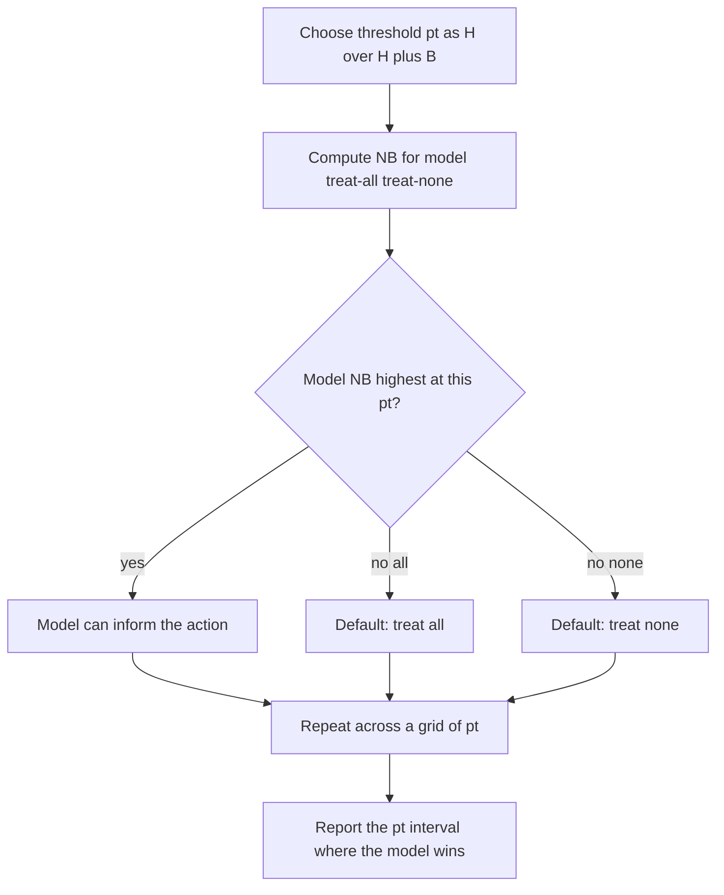
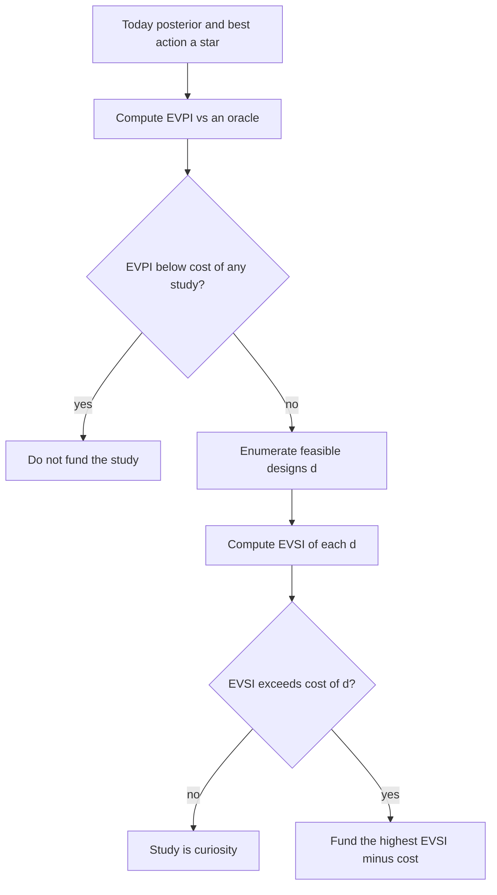

# Decision Curve Analysis, Net Benefit, and Value of Information

## Opening

A new MRI marker is said to “predict hemorrhagic transformation after thrombolysis.” The AUC is 0.81. The laboratory wants a prospective study. The stroke service wants to know whether the marker would change a single dose of alteplase. Those are different questions. Discrimination answers the first poorly and the second not at all. Net benefit and value of information exist because a better ROC is not a reason to build a better test.

## Learning objectives

After working this chapter you should be able to:

- Write Vickers net benefit at a threshold probability and interpret treat-all and treat-none as competing strategies.
- Explain why a decision curve can reject a model that an ROC accepts.
- Distinguish expected value of perfect information (EVPI) from expected value of sample information (EVSI) in a stroke-imaging setting.
- Decide, with a teaching calculation, when a more accurate biomarker is not worth collecting.
- Read a decision curve as a family of harm/benefit ratios rather than as a new kind of p-value.

## Clinical vignette

A 71-year-old man is 110 minutes from last known well with a right hemiparesis and mild dysarthria. NIHSS is 7. Noncontrast CT is clean. CTA shows a distal M2 cutoff. The fellow has just heard a talk on a permeability marker, call it \(\kappa\), that is supposed to identify people whose hemorrhage risk under alteplase is high. In the talk, \(\kappa\) had sensitivity 0.70 and specificity 0.75 for later parenchymal hematoma, and an AUC of 0.81 against a clinical score that sat at 0.68. The scanner can acquire \(\kappa\) in 12 extra minutes. The fellow asks, “Should we get it before we lyse?”

You do not have this man’s \(\kappa\). You have a claim about a marker, a delay, and a decision that will be made with or without the claim. Before any formula, write two sentences. First: at what hemorrhage probability would you withhold alteplase in an otherwise eligible NIHSS 7? Second: if \(\kappa\) cannot move you across that line, what exactly is the scan for?

## Net benefit is expected utility with a unit that clinicians will tolerate

Recall the treatment threshold from the previous chapter: \(p_{Rx}^{\star} = H/(H+B)\). Rearranged, the odds form is

\[
\frac{p_{Rx}^{\star}}{1 - p_{Rx}^{\star}} = \frac{H}{B}.
\]

Vickers and Elkin (2006) used that identity to put a simple unit on the expected utility of a prediction model. Count true positives and false positives at a chosen threshold probability \(p_t\), divide by sample size \(n\), and write

\[
NB(p_t) = \frac{TP}{n} - \frac{FP}{n}\cdot\frac{p_t}{1-p_t}.
\]

The first term is the fraction of the population correctly singled out for treatment. The second term charges each false positive a price equal to the harm/benefit odds at \(p_t\). Net benefit is therefore the expected utility of the model, scaled so that one true positive is worth one unit and one false positive is worth \(p_t/(1-p_t)\) units. If you would withhold treatment only when hemorrhage is at least 20% likely, you have announced \(p_t = 0.20\) and a charge of \(1:4\) against each false alarm.

Two default strategies must appear on every plot.

- **Treat none.** \(NB = 0\) at every \(p_t\). No true positives, no false positives.
- **Treat all.** \(NB(p_t) = \pi - (1-\pi)\, p_t/(1-p_t)\), where \(\pi\) is the outcome prevalence. You harvest every true case and you pay the false-positive price on everyone else.

A model has value at \(p_t\) only if its net benefit exceeds both defaults. That single requirement does more work than an AUC.

!!! tip "Clinical Pearl"
    Ask the person who quotes an AUC to name the threshold probability at which they would act. If they cannot, they have not specified a decision, and the AUC is being asked to do a job it was not built for.

## Decision curves versus ROC curves

An ROC curve plots sensitivity against 1 − specificity as a threshold on a score slides. It is a statement about ranking. It does not know the prevalence. It does not know \(H/B\). Two models can share an AUC and disagree, at the only threshold you care about, on the number of people harmed.

A decision curve plots \(NB(p_t)\) against \(p_t\). Prevalence is inside the counts. Harm/benefit is inside the price \(p_t/(1-p_t)\). The horizontal axis is not an operating point on a score. It is a family of utility ratios. Reading a decision curve is reading, “For every harm/benefit ratio in this interval, does the model beat treat-all and treat-none?”

Several failures become visible that an ROC conceals.

The model can beat the clinical score on AUC and lose on net benefit at the thresholds where alteplase is actually withheld. The model can have a handsome curve in a case-control sample and a worthless curve once \(\pi\) falls to the 5–10% hemorrhage rates of a treated ischemic-stroke cohort. The model can look useful at \(p_t = 0.01\) (a ratio almost no stroke clinician endorses) and useless at \(p_t = 0.15\) (a ratio many will at least discuss). And treat-all can dominate a “good” model across the whole interval that matters, which is the curve’s way of saying you should stop building the test and just treat.

!!! warning "Common Pitfall"
    Do not cherry-pick the threshold where your model’s curve peaks and call that “the” net benefit. The honest report is the interval of \(p_t\) on which the model is the best of the three strategies. If that interval does not intersect the thresholds clinicians will actually use, the model is a paper.

## A teaching decision curve, described before it is drawn

Imagine a cohort of 1,000 thrombolysis-eligible patients. Teaching prevalence of later parenchymal hematoma is 6% (60 events). Three strategies are compared for the decision “withhold alteplase if predicted hemorrhage risk exceeds \(p_t\).”

- Treat none: withhold from everyone. Net benefit of *withholding* is not the usual NB of *treating*; keep the action clear. In the standard DCA orientation we evaluate the model as a detector of the event that would change the default. Here the default in an eligible patient is to treat, and the model is being asked to find the people in whom treating is the mistake. That orientation must be stated or the axes lie.
- Treat all (give alteplase to everyone eligible).
- Withhold according to a clinical score.
- Withhold according to \(\kappa\).

On a well-behaved teaching curve the following pattern appears. At very low \(p_t\) (you would withhold for almost any hemorrhage risk), treat-all-withhold — that is, treat none with alteplase — wins, because you have announced that harm is cheap to avoid and benefit is expensive to chase. At high \(p_t\) (you withhold only if hemorrhage is nearly certain), giving alteplase to everyone wins, because you have announced that you will tolerate many hemorrhages per benefit. In a middle band, a model can rise above both defaults. The question that matters for \(\kappa\) is whether that middle band includes the fellow’s number from the vignette.



| Strategy at a given \(p_t\) | Net benefit | Wins when |
| --- | --- | --- |
| Treat none | 0 | Harm dominates at this ratio |
| Treat all | \(\pi - (1-\pi)p_t/(1-p_t)\) | Benefit dominates; model adds nothing |
| Model | \(TP/n - (FP/n)\, p_t/(1-p_t)\) | Ranking plus calibration beat both defaults |
| Unusable model | below both defaults | You have an ROC without a decision |

A second table, with **teaching counts** at \(p_t = 0.15\) in the 1,000-person cohort, shows the arithmetic without pretending these are trial results.

| Rule at \(p_t = 0.15\) | TP | FP | NB | Versus treat-all |
| --- | --- | --- | --- | --- |
| Treat none | 0 | 0 | 0.000 | worse if treat-all is positive |
| Treat all | 60 | 940 | \(0.060 - 0.940\cdot 0.176 \approx -0.106\) | reference |
| Clinical score | 30 | 120 | \(0.030 - 0.120\cdot 0.176 \approx 0.009\) | better than both defaults |
| Marker \(\kappa\) | 42 | 180 | \(0.042 - 0.180\cdot 0.176 \approx 0.010\) | barely above the score |

Teaching numbers. At this one threshold \(\kappa\) buys about one extra net true positive per 1,000 people relative to the clinical score. Whether 12 minutes of magnet time is worth that increment is not a property of the AUC.

The orientation of the curve is easy to get backwards, and getting it backwards is how a service ends up quoting a handsome net benefit for a test it should not have ordered. Standard published decision curves usually evaluate a model that *detects the event you would treat*. Alteplase’s default, in an eligible patient, is the opposite: you treat the ischemia, and you would change course only if a hemorrhage prediction were dire enough. A curve that treats “any later hematoma” as the event, and “withhold” as the positive action, is a curve about *exceptions* to a default. Report that orientation in the figure legend. A reader who assumes the usual “detect-and-treat” orientation will think treat-all’s negative net benefit means “never give alteplase,” which is the opposite of the clinical default at NIHSS 7.

!!! note "Mathematical Detail"
    Net benefit can be rewritten in terms of sensitivity, specificity, and prevalence:

    \[
    NB = Se\cdot\pi - (1-Sp)\,(1-\pi)\,\frac{p_t}{1-p_t}.
    \]

    Calibration matters because the threshold is applied to a *predicted probability*, not to an arbitrary score. A model that ranks well but outputs 0.40 when the risk is 0.10 will withhold in the wrong people. Decision curves on miscalibrated predictions are not a minor technicality; they are the curve you would actually use.

## Value of information: is a better test worth the study?

Decision curves ask whether a *current* model beats simple defaults. Value of information asks whether *reducing uncertainty* in a parameter — a hazard ratio, a sensitivity, a prevalence — is worth the cost of the study that would reduce it.

Let \(a^{\star}\) be the action that maximizes expected utility under today’s posterior. Let \(a(\theta)\) be the action you would choose if you knew the parameter \(\theta\). The expected value of perfect information is

\[
EVPI = \mathbb{E}\bigl[U(a(\theta), \theta)\bigr] - U\bigl(a^{\star}\bigr).
\]

It is the most you should pay, in utility units, for an oracle that revealed \(\theta\) before you acted. If EVPI is smaller than the expected harm of waiting for any realistic study — minutes of untreated ischemia, dollars, or both — you should stop. No finite study can be worth more than the oracle.

The expected value of sample information for a study of design \(d\) is smaller:

\[
EVSI(d) = \mathbb{E}_{y_d}\Bigl[\max_a \mathbb{E}\bigl[U(a,\theta)\mid y_d\bigr]\Bigr] - U(a^{\star}).
\]

You imagine the data you do not yet have, update, re-choose, and average the gain. EVSI rises with sample size and with how much the decision is sitting on a knife edge. It is near zero when you are already far from the threshold, or when the study will not measure the parameter the decision actually uses.

For the permeability marker, \(\theta\) might be the likelihood ratio of \(\kappa\) for hemorrhage, or the delay-adjusted benefit of alteplase in NIHSS 7 M2 occlusions. A 400-person “validation” that re-estimates an AUC without ever recording whether anyone’s treatment changed has an EVSI near zero for the fellow’s question, whatever it does for a methods paper.

A teaching calculation makes the size of EVPI concrete. Suppose, under today’s posterior, you will give alteplase. The expected utility of that default is 0.70 utiles on a made-up 0–1 scale. If an oracle revealed the true hemorrhage probability and you switched only when that probability exceeded your \(p_t\), the expected utility of the oracle policy would be 0.71. Then \(EVPI = 0.01\) utile. If one utile is “one extra independent survivor in this decision,” you should not pay more than a hundredth of a survivor — in minutes, dollars, or contrast — to learn the truth. Most imaging add-ons cost more than that in delayed reperfusion alone. The number is teaching, but the comparison is the method: put EVPI and the cost of the scan in the same unit before you argue about the AUC.



!!! warning "Common Pitfall"
    A grant that promises to “reduce uncertainty” without naming the decision that uncertainty threatens is not a value-of-information calculation. It is a mood. EVPI and EVSI are defined relative to an action and a utility. No action, no value.

## When a better test is not worth it

Four situations recur in stroke imaging.

The default action is already correct on both sides of any plausible likelihood ratio. If you would give alteplase to this man whether \(\kappa\) is high or low, \(\kappa\) is theater.

The test consumes the resource the treatment needs. Twelve minutes at 110 minutes from onset is not a laboratory fee. It is a slice of the benefit you are trying to protect. In the notation of the last chapter, \(R\) can erase the testing interval even when \(Se\) and \(Sp\) look adult.

The outcome the test predicts is not the outcome the utility cares about. Predicting any radiographic hemorrhage is not the same as predicting a hemorrhage that would have made you withhold. A marker of petechiae can have a superb ROC for petechiae and a net benefit of zero for the decision.

The residual uncertainty is not in the marker. It is in the utility. If the fellow cannot say whether a 10% hemorrhage risk is above or below threshold, no sharper \(\kappa\) will settle the case. That is a shared-decision problem, not an imaging problem.

!!! tip "Clinical Pearl"
    Before you order the extra sequence, complete this sentence: “If the marker is positive I will ____; if it is negative I will ____.” If both blanks hold the same verb, cancel the sequence.

### For the biostatistician / methodologist

Net benefit at a fixed \(p_t\) is a sample mean. It has a variance, and the variance is not trivial when events are rare. Bootstrap the pairs \((y_i, \hat{p}_i)\), recompute \(NB(p_t)\), and draw the pointwise interval on the curve. Do not report a curve that kisses treat-all inside a confidence band the width of the effect.

Standard DCA treats \(p_t\) as known. A fully Bayesian version draws utilities, draws parameters, and reports the posterior probability that the model is the best strategy at each \(p_t\). That probability is often more honest than a crisp winner. It also makes the connection to VOI immediate: EVPI is the expected utility gap between the oracle and the current best action, estimated from the same draws.

EVSI for a nonlinear model usually needs a nested Monte Carlo or a regression approximation (Strong, Oakley, Brennan). Brute force — simulate studies, refit `brms`, re-decide — is acceptable for teaching and for small designs. It is not acceptable as a silent \(O(n^2)\) loop in a grant appendix. Write the nested structure down.

When the “test” is a continuous marker, the decision curve already contains the value of using the marker *as currently estimated*. EVSI answers a different question: the value of *learning the marker’s properties more precisely*. Do not quote a decision curve as if it were an EVSI.

## Teaching plot and a synthetic curve in R

The plot you should be able to sketch on a board has \(p_t\) on \([0.01, 0.40]\), net benefit on a vertical axis that is allowed to go negative, a horizontal line at 0 (treat none), a descending line (treat all), and two model curves. Annotate the interval where the candidate model is on top. If you cannot see that interval without a magnifying glass, the marker is not a clinical contribution.

```r
# Synthetic decision curve for a teaching hemorrhage marker.
# Educational numbers only. Not a clinical result.
# Requires ggplot2. Seed fixed for the synthetic cohort.
set.seed(15)
library(ggplot2)
library(dplyr)
library(tidyr)

n      <- 1000
pi_h   <- 0.06
y      <- rbinom(n, 1, pi_h)

# Latent risk and two miscalibrated-but-ranked scores
linpred <- qlogis(pi_h) + 1.3 * y + rnorm(n, 0, 1.0)
p_clin  <- plogis(linpred - 0.4)               # clinical score
p_kappa <- plogis(linpred + 0.3 * y - 0.1)     # marker kappa

nb_at <- function(y, p_hat, pt) {
  treat <- as.integer(p_hat >= pt)
  tp <- mean(treat == 1 & y == 1)
  fp <- mean(treat == 1 & y == 0)
  tp - fp * pt / (1 - pt)
}

grid <- seq(0.02, 0.40, by = 0.01)
curve_df <- lapply(grid, function(pt) {
  data.frame(
    pt = pt,
    treat_none  = 0,
    treat_all   = mean(y) - mean(1 - y) * pt / (1 - pt),
    clinical    = nb_at(y, p_clin, pt),
    kappa       = nb_at(y, p_kappa, pt)
  )
}) |>
  bind_rows() |>
  tidyr::pivot_longer(-pt, names_to = "strategy", values_to = "nb")

# ggplot of the synthetic decision curve — copy-paste ready
p <- ggplot(curve_df, aes(pt, nb, color = strategy)) +
  geom_line(linewidth = 1) +
  geom_hline(yintercept = 0, linetype = 3) +
  labs(
    x = "Threshold probability pt",
    y = "Net benefit",
    title = "Teaching decision curve (synthetic hemorrhage marker)"
  ) +
  theme_minimal()
print(p)

# Optional Bayesian model for predicted risk, specification only.
# library(brms)
# fit_risk <- brm(
#   y ~ scale(p_kappa),
#   data = data.frame(y = y, p_kappa = p_kappa),
#   family = bernoulli(),
#   prior = c(prior(normal(0, 1.5), class = "Intercept"),
#             prior(normal(0, 1),   class = "b")),
#   seed = 15, chains = 4, iter = 2000, refresh = 0
# )
```

The commented `ggplot` is the figure. The commented `brms` block is the inferential engine you would use if the predicted risks themselves needed a posterior. Neither is a claim about permeability imaging.

!!! example "R Deep Dive"
    If you un-comment the plot, read it left to right. Where treat-all (or treat-none) is the top line, a grant to refine \(\kappa\) has to justify itself with EVSI, not with a slightly higher AUC. Where \(\kappa\) is the top line, report the width of that interval in \(p_t\) and in the implied \(B/H\).

## Worked solution to the opening vignette

The fellow asked whether to acquire \(\kappa\) before alteplase. That is a Pauker–Kassirer question dressed as an imaging question.

First, name \(p_t\). For an otherwise eligible NIHSS 7 at 110 minutes, most services still treat at hemorrhage probabilities well above the 6% teaching base rate. A clinician who would withhold only above 15–20% has announced that treat-all (give the drug) is the default. In the teaching table, treat-all at \(p_t = 0.15\) has *negative* net benefit as a hemorrhage-detection strategy — which is expected, because we have oriented the curve around finding hemorrhages, while the clinical default is to accept the base-rate hemorrhage in exchange for the ischemic benefit. The relevant comparison is therefore not “does \(\kappa\) beat treat-none at detecting blood” but “does a positive \(\kappa\) move this man across the withhold threshold, after a 12-minute delay.”

Second, look at the increment. Teaching counts gave \(\kappa\) a net-benefit edge of about 0.001 over a clinical score at \(p_t = 0.15\): one extra net true positive per 1,000 people. Even if those counts were real, they do not pay for a delay that consumes a sliver of alteplase’s time-dependent benefit in a man who is already a treatment candidate.

Third, apply the VOI test. The decision is not sitting on a knife edge. The man is eligible, the occlusion is distal but the deficit is real, and nothing about a marker with teaching sensitivity 0.70 will flip a default that was not already trembling. EVPI for the marker’s likelihood ratio, in this single decision, is small. EVSI of a 12-minute scan is smaller. EVSI of a 400-person AUC study that does not record changed actions is smaller still.

So: do not get \(\kappa\) before lysing this man. If the laboratory wants a study, design one whose primary output is a changed decision or a measured EVSI, not another ROC. Educational discussion only — not a protocol.

!!! success "Key Takeaway"
    An AUC cannot authorize a test. A decision curve can reject one. EVPI can reject the study that would have built the next one.

## Exercises

1. Using \(NB = Se\,\pi - (1-Sp)(1-\pi)\, p_t/(1-p_t)\), find the smallest sensitivity that lets \(\kappa\) beat treat-none at \(p_t = 0.20\) when \(\pi = 0.06\) and \(Sp = 0.75\).
2. Redraw the teaching curve after dropping prevalence from 0.06 to 0.02. Which strategy dies first?
3. A grant proposes \(n = 200\) to re-estimate the AUC of \(\kappa\). Write one sentence that explains why that design can have a near-zero EVSI for the fellow’s decision.
4. Show that treat-all net benefit crosses zero at \(p_t = \pi\). What does that crossing mean in harm/benefit language?
5. Bootstrap the synthetic cohort in the R block and sketch (by hand is enough) a confidence band around the \(\kappa\) curve. Where does the band include treat-none?
6. Hint for the appendix: express EVPI for a binary action as the expected utility of regret. When is regret identically zero?

## Further reading

- Vickers AJ, Elkin EB. Decision curve analysis: a novel method for evaluating prediction models. *Med Decis Making.* 2006;26(6):565–574.
- Vickers AJ, Van Calster B, Steyerberg EW. Net benefit approaches to the evaluation of prediction models, molecular markers, and diagnostic tests. *BMJ.* 2016;352:i6.
- Van Calster B, Wynants L, Verbeek JFM, et al. Reporting and interpreting decision curve analysis: a guide for investigators. *Eur Urol.* 2018;74(6):796–804.
- Kerr KF, Brown MD, Zhu K, Janes H. Assessing the clinical impact of risk prediction models with decision curves: guidance for correct interpretation and appropriate use. *J Clin Oncol.* 2016;34(21):2534–2540.
- Claxton K. The irrelevance of inference: a decision-making approach to the stochastic evaluation of health care technologies. *J Health Econ.* 1999;18(3):341–364.
- Ades AE, Lu G, Claxton K. Expected value of sample information calculations in medical decision modeling. *Med Decis Making.* 2004;24(2):207–227.
- Spiegelhalter DJ, Abrams KR, Myles JP. *Bayesian Approaches to Clinical Trials and Health-Care Evaluation.* Chichester: Wiley; 2004.
- Strong M, Oakley JE, Brennan A. Estimating multiparameter partial expected value of perfect information from a probabilistic sensitivity analysis sample. *Med Decis Making.* 2014;34(3):311–326.

!!! success "Key Takeaway"
    Net benefit converts a harm/benefit ratio into a unit you can plot. Treat-all and treat-none are not straw men; they are the strategies already running on the ward. A model earns a place on the ward only on the interval of thresholds where it beats both. Value of information asks a harder question still: whether learning more would change the action enough to pay for the learning. When the default is stable, the marker is sharp, and the clock is running, the correct study is no study and the correct scan is no extra scan.
