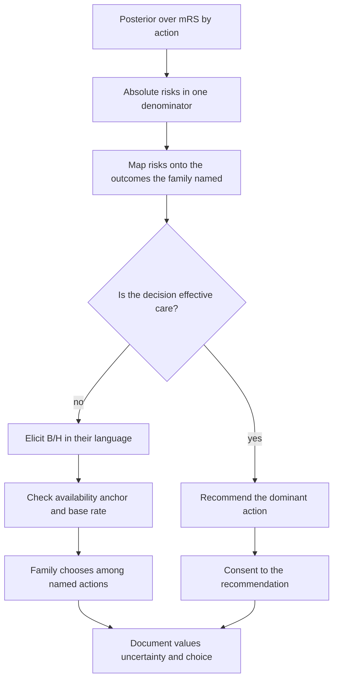
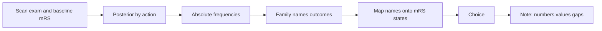

# From Posterior Distributions to Bedside Decisions and Shared Decision-Making

## Opening

An 89-year-old woman has a left M1 occlusion and a prestroke modified Rankin score of 3. The DAWN and DEFUSE-3 photographs on the workroom wall were not taken of her. You have a posterior over outcomes with and without endovascular therapy. She has a daughter in the room and a life that already includes a cane, a home aide, and a fierce wish to keep recognizing faces. The posterior will not speak. You have to.

## Learning objectives

After working this chapter you should be able to:

- Translate a posterior over an ordinal outcome into a short set of absolute risks a family can use.
- Distinguish preference-sensitive care from effective care, and say which one this chapter’s vignette is.
- Name the dual-process traps that distort bedside numbers, and a countermeasure for each.
- Use an icon array as a concept, not as a decoration, and document uncertainty without dumping a credible interval on a daughter.
- Walk a shared-decision pathway from posterior to a recorded choice.

## Clinical vignette

An 89-year-old woman is last known well 9 hours ago. She was found down at breakfast. NIHSS is 18: gaze preference, global aphasia, right hemiplegia. Noncontrast CT shows an ASPECTS of 7. CTA shows a left M1 cutoff. CT perfusion, for teaching, shows a small estimated core and a large penumbra. She lives with a daughter, walks with a cane, needs help to bathe, and was independent for meals and recognition of family — prestroke mRS 3. No written directive. The daughter says, “She did not want to be a vegetable. She also did not want to miss my son’s wedding in October.”

A **teaching posterior**, not a trial result and not a prediction for this woman, is sitting on a scrap of paper from a model the service uses for education:

| 90-day mRS | Probability without EVT | Probability with EVT |
| --- | --- | --- |
| 0–2 | 0.04 | 0.11 |
| 3 | 0.18 | 0.24 |
| 4 | 0.22 | 0.20 |
| 5 | 0.16 | 0.12 |
| 6 | 0.40 | 0.33 |

Prestroke mRS is 3. Functional independence as the trials defined it is not her baseline. The daughter is waiting. Write, in ordinary sentences and without the table, what you would say in the next ninety seconds. Then write what you would put in the chart. They will not be the same paragraph.

## A posterior is not a sentence

The object you computed — or borrowed from a model — is a distribution \(p(\text{mRS} \mid \text{data}, \text{treatment})\). Families do not need the distribution. They need a small number of *absolute* statements that preserve the shape of the distribution and the contrast between actions.

Absolute risk: “Without the procedure, about 22 in 100 people like her get back to the cane-and-help life she already has. With it, about 35 in 100. Death is about 40 versus 33 per 100.”
Absolute difference: “That is about 7 extra people in 100.”
Harm in the same unit: “About 7 fewer deaths in 100, and a smaller shift out of bedbound states, with a risk of vessel injury and a risk that we do something painful for no gain.”
Baseline: “She started at a 3. A 3 is a life she already knows. A 4 or a 5 is not.”

Relative risks (“almost three times as likely to be independent”) are true and unkind. They inflate a change from 4% to 11% into a story of transformation. Number needed to treat is a reciprocal of an absolute difference and belongs in a journal club, not in the first sentence to a daughter. Posterior means of a latent score are not speakable at all.

!!! tip "Clinical Pearl"
    Lead with the outcome the family named, in absolute numbers, for both actions. This daughter named two outcomes: “vegetable” (mRS 5, and perhaps 4) and “present at a wedding” (alive, recognizing, not crushed by the transfer). If your first sentence is about mRS 0–2, you are answering a trial’s question, not hers.

## Icon arrays, conceptually

An icon array is a grid of 100 (or 1,000) marks. Some are filled for the event. Two arrays, one per action, show the absolute contrast without arithmetic. The concept matters more than the software.

Use the same denominator in both arrays. Fill the events the family cares about, not only the trial primary endpoint. Keep dead visible; hiding mRS 6 in a footnote is a form of spin. Do not use three colors for five states unless you have already collapsed the states with the family. And do not hand a daughter a plot of 100 faces while the interventionalist is gowned. The array is for the conversation you can actually have. A verbal array — “picture 100 people; 40 do not survive without this, 33 with it” — is an icon array that does not require a printer.

The array is also a check on you. If you cannot fill it from the posterior, you do not understand the posterior well enough to counsel.

A second conceptual use is comparison of *collapsed* states. The daughter named unaware survival and presence at a wedding. Collapse mRS 5 with, if she agrees, the worst of mRS 4; collapse mRS 0–3 into “back to a life she would recognize,” or keep 3 separate if the cane-and-aide life is the one she is defending. Draw two arrays with those two or three fills. The trial’s mRS 0–2 column can stay on the scrap of paper. Icon arrays fail when they force a family to care about a cut-point a steering committee chose in 2016.

!!! warning "Common Pitfall"
    Survival curves, raincloud plots, and fan charts are for colleagues. A daughter under time pressure needs frequencies, one denominator, and the two or three states she has already told you she fears. Visual sophistication is not transparency.

## Preference-sensitive care versus effective care

Wennberg’s distinction is the right one at this bedside.

**Effective care** has a dominant action under any utility a reasonable person would bring. Antibiotics for bacterial meningitis. Glucose for hypoglycemia. In stroke, alteplase for a disabling deficit inside the early window in a person who meets standard criteria is close to this pole for many utilities, which is why services use defaults.

**Preference-sensitive care** has a threshold that moves when \(B/H\) moves. The evidence can be strong and the decision still belong to the patient. Endovascular therapy in the late window for an 89-year-old with prestroke mRS 3 is preference-sensitive even if a model says the posterior mean of mRS shifts by 0.4 points. Her baseline is already the trial’s “bad” outcome. Her plausible gains are a higher chance of returning to *her* 3, a lower chance of 5 or 6, and a non-zero chance of a futile, painful procedure.

DAWN and DEFUSE-3 demonstrated a large effect of EVT in selected patients with mismatch who were ineligible for the earlier trials’ clocks. Those papers do not erase prestroke disability, age, or the wedding in October. Extrapolating a posterior from a trial’s sampling frame into this woman’s frame is a Bayesian act. Pretending the extrapolation is unnecessary is a frequentist costume.

| Feature | Effective care | Preference-sensitive care |
| --- | --- | --- |
| Threshold vs posterior | Posterior sits far above any reasonable \(p_{Rx}^{\star}\) | Posterior and threshold overlap |
| Role of family values | Confirm no hidden lexicographic refusal | Determine the action |
| Default | Offer and recommend | Offer and do not pretend there is one recommendation |
| Documentation | Criteria met; consent | Values named; alternatives named; uncertainty named |
| Failure mode | Under-treatment | Substituting the physician’s \(B/H\) for the patient’s |

!!! tip "Clinical Pearl"
    If you hear yourself saying “the data show she should have this,” you have collapsed a preference-sensitive decision into effective care. The data show a posterior. “Should” is a utility.

## Dual-process traps at the bedside

System 1 is fast, narrative, and already in the room. System 2 is the posterior. The traps are specific.

**Availability.** The last 89-year-old who did badly after EVT occupies more space than the teaching table. Countermeasure: put the table, or the verbal array, between you and the last case before you speak.

**Anchoring.** NIHSS 18 and “found down” anchor on catastrophe. Prestroke mRS 3 is the correct anchor for what “good” means. Countermeasure: say the prestroke state first.

**Base-rate neglect.** Mismatch pictures look like a reason. The base rate of death in octogenarians with NIHSS 18 is still the largest number on the scrap of paper. Countermeasure: speak the death row before the mismatch.

**Outcome bias, in advance.** The daughter will judge you by the mRS at 90 days. You must judge the decision by the information you have now. Countermeasure: document the posterior and the values, not only the choice.

**Identifiability.** One identified elder in the bed outweighs 100 unidentified icons. That is not a moral failure. It is a reason to keep the icons short and spoken, not a reason to abandon them.

**Affect substitution.** “Vegetable” and “wedding” are affect-laden and legitimate. They become a trap only when they erase the middle states. Countermeasure: name mRS 3 and 4 explicitly. A woman who already lives at 3 may accept 3 and reject 4. That is a precise preference, not a mood.



## What the conversation actually sounds like

A usable script is short. It is not a disclosure dump.

“She has a clot in a large artery on the left. That is why she cannot speak or move the right side. We can try to pull the clot out, or we can care for her without that procedure.”

“I want to be honest about the numbers we have. They are not a promise about her. In people something like this, without the procedure, about 40 in 100 do not survive three months. With it, about 33 in 100. A few more, maybe 7 in 100, get back to walking as they did before. Some are left needing full care either way.”

“You said she did not want to be kept alive without knowing people, and she did not want to miss the wedding. Those point in different directions. The procedure raises the chance she is alive in October and raises the chance she is herself. It also means a late-night transfer, a puncture, and a chance we do all of that and she is no better.”

Then stop. The next words should be the daughter’s.

Shared decision-making is not a vote, not a menu, and not an abdication. You still own the medical facts, the transport problem, and the duty not to offer a procedure that cannot serve any value she has named. She (through a surrogate) owns the weighting of those values. If the daughter says “do everything,” that is not yet a value; it is a panic phrase. Ask which of the two named wishes — unaware survival versus the wedding — should break the tie if they conflict. If she says “I cannot decide,” offer a recommendation *as a disclosed utility*: “Given what you said she wanted, I would try to open the vessel.” That is still shared. What is not shared is “the scan shows we have to.”

Time is short. You do not need a twenty-minute values history. You need two named outcomes, one contrast in frequencies, and a pause. Services that wait for a perfect conversation get a default — usually the interventionalist’s default — dressed up as consent.

Notice what the script refused to do. It did not say “the prior was weakly informative.” It did not say “statistically significant.” It did not offer a 95% credible interval. It did not hide death. It did not claim the teaching posterior was *her* posterior.

!!! warning "Common Pitfall"
    “There is a chance” and “we cannot be sure” are true of every action, including inaction. They do not communicate a posterior. If you cannot put a frequency in the sentence, you are soothing, not informing.

## Documenting uncertainty

The chart is a letter to the next clinician and to your future self at 90 days. It should contain four things.

The posterior you used, in absolute frequencies, with the action contrast. “Teaching model: death 40% vs 33%; return to prestroke function 18% vs 24%” is enough. A full table is better.

The values the family named, in their words. “Did not want to be a vegetable. Wanted a chance to attend a grandson’s wedding.” Do not translate these into mRS until you have written the words.

The action chosen, and the actions declined.

The uncertainty you could not quantify. “Extrapolated from late-window mismatch trials that largely excluded prestroke mRS 3. Age 89. No written directive.” That sentence is not a hedge. It is the most Bayesian object in the note.

| Note element | Weak version | Strong version |
| --- | --- | --- |
| Evidence | “EVT indicated by DAWN criteria” | “Mismatch present; prestroke mRS 3 outside the trial frame” |
| Numbers | “May benefit” | “Teaching absolute risks: death 40% vs 33%; mRS 3 18% vs 24%” |
| Values | “Family understands risks” | “Priority: avoid unaware survival; secondary: alive in October” |
| Uncertainty | “Prognosis guarded” | “Wide posterior; model not trained on prestroke mRS 3 at age 89” |
| Decision | “Consent obtained” | “Daughter chose EVT after the contrast above; no written directive” |

Do not write “uninformative prior” in a clinical note. Do not write “probability of benefit \(p = 0.72\)” without saying benefit of what. Do not copy a model output you cannot explain at 3 a.m.



### For the biostatistician / methodologist

!!! note "Mathematical Detail"
    The spoken frequency “40 in 100 die without the procedure” is not the posterior mean of a latent score. It is the posterior predictive probability \(P(\text{mRS}=6 \mid \text{data}, a=\text{medical})\), which already integrates parameter uncertainty. Quoting a 95% interval around that frequency is optional at the bedside and mandatory in the note if the interval is wide enough to change the named values. An 80% interval that runs from 28 to 52 deaths per 100 is a reason to say “the model is not sure,” not a reason to pick the midpoint and move on.

The bedside object is not \(\mathbb{E}[\text{mRS}]\). It is a set of posterior predictive probabilities

\[
P(\text{mRS} \in A \mid \text{data}, a) = \int P(\text{mRS} \in A \mid \theta, a)\, p(\theta \mid \text{data})\, d\theta
\]

for a few action-relevant sets \(A\): death, return to prestroke state, unaware survival. Compute them from draws. Then stop. Averaging mRS as if it were interval data and handing the mean to a family is a category error: the loss is not squared error, and the scale is not linear.

If the model was trained on prestroke mRS 0–1, the posterior for an mRS 3 patient is a transport problem. State the transport assumptions (conditional exchangeability given age, NIHSS, ASPECTS, time, mismatch) or refuse the number. A weakly informative prior inside the original sampling frame does not license extrapolation. Hierarchical partial pooling across baseline-disability strata is the honest architecture; a single dummy-variable shift is a hope.

Shared decision-making does not require a full utility elicitation. A pairwise contrast is enough: which of two outcome lotteries the decision-maker prefers. That choice reveals a region of \(B/H\), not a point. Report the decision as consistent with that region.

Surrogates add a second Bayesian problem. The daughter’s words are data about the patient’s utility, not the utility itself. They are noisy, motivated, and collected under time pressure. Treat them as a likelihood over a small set of value hypotheses (“avoids unaware survival,” “maximizes chance of the wedding,” “lexicographic refusal of procedures”) and do not pretend you have identified a point utility. When the surrogate’s own grief and the patient’s known character diverge, say so in the note. The law will tell you who decides. The note should tell you *whose values* were used.

```r
# Teaching: turn posterior draws of ordinal probabilities into
# bedside frequencies. Educational draws only. Seed fixed.
set.seed(16)
library(dplyr)

# Columns are mRS 0-2, 3, 4, 5, 6. Rows are posterior draws.
# These are synthetic Dirichlet draws around the teaching table,
# not output from a fitted trial model.
dirichlet <- function(alpha) {
  g <- rgamma(length(alpha), shape = alpha, rate = 1)
  g / sum(g)
}

S <- 4000
p_med  <- t(replicate(S, dirichlet(c(4, 18, 22, 16, 40))))
p_evt  <- t(replicate(S, dirichlet(c(11, 24, 20, 12, 33))))
colnames(p_med) <- colnames(p_evt) <- c("mRS02", "mRS3", "mRS4", "mRS5", "mRS6")

summarise_state <- function(p, label) {
  q <- 100 * quantile(p[, "mRS6"], c(0.1, 0.9))
  data.frame(
    action            = label,
    death_per_100     = 100 * mean(p[, "mRS6"]),
    back_to_3_per_100 = 100 * mean(p[, "mRS3"]),
    unaware_5_per_100 = 100 * mean(p[, "mRS5"]),
    death_p10         = unname(q[1]),
    death_p90         = unname(q[2])
  )
}

# Point frequencies for the spoken array
round(colMeans(p_med) * 100, 1)
round(colMeans(p_evt) * 100, 1)
summarise_state(p_med, "medical")
summarise_state(p_evt, "EVT")

# Contrast the daughter named: alive and not mRS 5
alive_aware_med <- 1 - p_med[, "mRS6"] - p_med[, "mRS5"]
alive_aware_evt <- 1 - p_evt[, "mRS6"] - p_evt[, "mRS5"]
c(
  med = mean(alive_aware_med),
  evt = mean(alive_aware_evt),
  diff = mean(alive_aware_evt - alive_aware_med)
)

# Specification only: an ordinal model you might actually fit.
# library(brms)
# fit_mrs <- brm(
#   mrs ~ evt + age + nihss + aspecs + prestroke,
#   data = stroke_df,
#   family = cumulative("logit"),
#   prior = c(prior(normal(0, 1), class = "b"),
#             prior(normal(0, 1.5), class = "Intercept")),
#   seed = 16, chains = 4, iter = 2000, refresh = 0
# )
```

!!! example "R Deep Dive"
    The Dirichlet cloud is a way to keep the spoken frequencies from hardening into false precision. If the 80% interval for the death contrast includes zero, say “the model is not sure death is lower” rather than “death falls from 40 to 33.” The daughter can tolerate a blurred contrast. She cannot tolerate a fake sharp one.

## Worked solution to the opening vignette

The ninety-second speech is the script above, with one addition: prestroke mRS 3 is the reference, not mRS 0–2. “Getting back to how she was — cane, help to bathe, knows the family — is the success I am talking about. Walking as if this never happened is unlikely either way.”

The decision is preference-sensitive. EVT is not mandated by the mismatch picture. It is an offer whose value depends on whether “a higher chance of the life she has, and of being at the wedding, at the price of a procedure that may not work” matches what she would have chosen. The daughter is a surrogate, not the patient. Ask what the *patient* would have said, not what the daughter wants for herself.

The chart should record the teaching frequencies, the two named values, the extrapolation (age, prestroke mRS 3, late window), and the choice. If the daughter asks you what you would do, answer as a values question: “If she were my parent and those were her two wishes, I would try to open the vessel, knowing we may fail.” That is a disclosed utility, not an order.

Educational discussion only. Invented vignette. Not a recommendation for any real person.

!!! success "Key Takeaway"
    The posterior becomes a decision only after it is turned into absolute risks for the outcomes the patient already named.

## Exercises

1. Rewrite the teaching table as two spoken icon arrays of 100 people. Which states did you collapse, and why?
2. A colleague says “DAWN-positive, we take her.” Identify the effective-care error in that sentence.
3. Using the R draws, estimate the posterior probability that EVT raises the chance of being alive and not mRS 5. How would you say that probability to the daughter without saying “posterior probability”?
4. The daughter asks for “the best-case and worst-case.” What two quantiles do you bring, and which states sit in each?
5. Draft a six-line chart note that would still make sense to you at 90 days if the outcome is mRS 5.
6. Hint for the appendix: show that leading with the relative risk of mRS 0–2 is equivalent to a utility that ignores every state the daughter named.

## Further reading

- Elwyn G, Frosch D, Thomson R, et al. Shared decision making: a model for clinical practice. *J Gen Intern Med.* 2012;27(10):1361–1367.
- Stiggelbout AM, Van der Weijden T, De Wit MPT, et al. Shared decision making: really putting patients at the centre of healthcare. *BMJ.* 2012;344:e256.
- Gigerenzer G, Edwards A. Simple tools for understanding risks: from innumeracy to insight. *BMJ.* 2003;327(7417):741–744.
- Wennberg JE. *Tracking Medicine: A Researcher’s Quest to Understand Health Care.* Oxford: Oxford University Press; 2010.
- Kahneman D. *Thinking, Fast and Slow.* New York: Farrar, Straus and Giroux; 2011.
- Nogueira RG, Jadhav AP, Haussen DC, et al. Thrombectomy 6 to 24 hours after stroke with a mismatch between deficit and infarct. *N Engl J Med.* 2018;378(1):11–21.
- Albers GW, Marks MP, Kemp S, et al. Thrombectomy for stroke at 6 to 16 hours with selection by perfusion imaging. *N Engl J Med.* 2018;378(8):708–718.
- Spatz ES, Krumholz HM, Moulton BW. The new era of informed consent: getting to a reasonable-patient standard through shared decision making. *JAMA.* 2016;315(19):2063–2064.

!!! success "Key Takeaway"
    A bedside decision is a posterior plus a utility plus a conversation. Speak absolute frequencies for the states the family named. Treat late-window EVT in an 89-year-old with prestroke mRS 3 as preference-sensitive care, even when the scan is beautiful. Watch for availability, anchoring, and base-rate neglect; they will write the first draft of your counsel if you let them. Document the numbers, the words, the gaps, and the choice. The model does not come to the bedside. You do.
