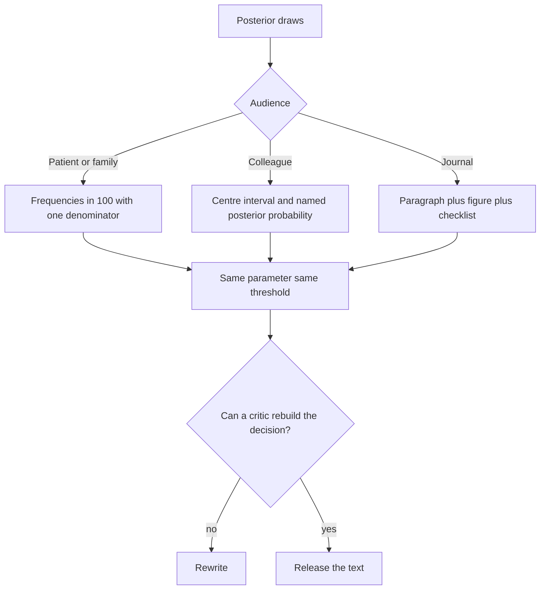
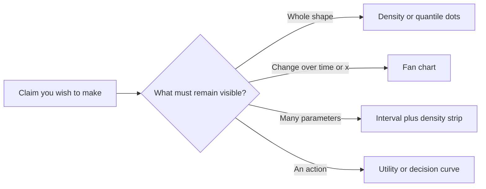

# Communicating Uncertainty to Patients, Colleagues, and Journals

## Opening

A posterior that never leaves the server has not entered medicine. The same distribution must become a sentence for a family, a paragraph for a colleague, and a methods-plus-results block for a journal, without changing its meaning. Most of the damage in Bayesian clinical science is not in the sampler. It is in the translation.

## Learning objectives

After working this chapter you should be able to:

- Choose words or numbers according to the audience, and know when words alone are malpractice.
- Report a posterior in a paper so that a reader can rebuild the decision, not merely admire a density.
- Apply a reporting checklist drawn from CONSORT, the Sung/ROBUST items, and BARG, and refuse the sentence “the prior was uninformative, so the result is objective.”
- Recognize common spin in Bayesian clinical papers.
- Match a visual encoding — fan chart, distribution plot, interval — to a claim.

## Clinical vignette

You are the statistical coauthor on a single-arm Bayesian trial of a late-window reperfusion adjunct. The pre-specified success rule was \(P(\theta > 0.40 \mid y) > 0.95\), where \(\theta\) is the probability of 90-day mRS 0–2. You used a Beta(8, 12) prior, mean 0.40, to encode a skeptical 40% success rate. The trial stopped at \(n = 62\) with 31 successes. The posterior is Beta(39, 43). Posterior mean 0.48; 95% equal-tailed interval 0.37 to 0.58; posterior probability of \(\theta > 0.40\) is 0.93. The success rule was not met.

The principal investigator drafts the abstract: “The prior was uninformative. Bayesian analysis demonstrated a clinically meaningful benefit (posterior mean 48%).” The journal is a clinical neurology weekly. The PI also wants a tweet. A family of a future candidate will read the hospital press release.

Write three texts of no more than 80 words each: one for the abstract, one for the tweet, one for a clinic pamphlet. Then stop. The rest of the chapter is the reason those three texts are not allowed to say different things.

## Words versus numbers

Words for uncertainty — possible, likely, rare, cannot exclude — do not have agreed numerical anchors. “Likely” in a radiologist’s mouth is not “likely” in a daughter’s. Gigerenzer’s program is still the right default: frequencies with a common denominator, for patients and for most colleagues.

Numbers without words fail too. A credible interval dumped into a results section does not tell the reader whether the interval is equal-tailed or highest-posterior-density, whether the parameter is on the probability scale or the log-odds scale, or whether the decision rule used the interval at all. The discipline is *paired* reporting: a number, a unit, a parameter name, and one clause of interpretation that does not overreach.

For patients: “In 100 people like those we studied, we expect between 37 and 58 to be independent at three months. We had hoped to be quite sure the number was above 40. We are not that sure.”
For colleagues: “Posterior mean 0.48; 95% ET interval 0.37–0.58; \(P(\theta > 0.40 \mid y) = 0.93\); pre-specified threshold 0.95; prior Beta(8, 12).”
For journals: those colleague numbers, plus the prior justification, the operating characteristics of the stopping rule, and a sensitivity table.

Colleagues are the audience most often given the worst of both worlds: too technical for a family, too vague for a methods reviewer. Sign-out, a radiology huddle, and a journal club each need a different slice of the same posterior. At sign-out, give the decision functional and whether it fired: “Pre-specified \(P(\theta > 0.40) > 0.95\) not met; we are at 0.93; do not write ‘positive trial’ in the discharge summary.” In a huddle, give the absolute risks that change a scan or a procedure. In journal club, give the prior, the operating characteristics, and one alternate-prior posterior. If you use three different \(\theta\)s in those three rooms, you have created three papers.

!!! tip "Clinical Pearl"
    If a sentence still works after you delete every number, it is not a results sentence. It is a press release.

## How to write a posterior in a paper

A complete posterior report, in running text, has six parts. They can occupy one paragraph.

1. **Parameter.** What \(\theta\) is, in clinical units. Not “the treatment effect.” The probability of mRS 0–2 at 90 days under the adjunct, or the log odds ratio versus a historical control, named as such.
2. **Prior.** Family, hyperparameters, implied mean and interval, and *why*. “Beta(8, 12), mean 0.40, to encode a skeptical historical rate” is a prior. “Weakly informative” is a mood.
3. **Likelihood and model.** Bernoulli, ordinal, time-to-event; any hierarchical pieces; any borrowing.
4. **Posterior summaries.** A centre (mean or median, named), an interval (rule named: ET or HPD), and the posterior probability of the *pre-specified* region of interest.
5. **Decision rule, and whether it fired.** If the design was Bayesian, the design is part of the result.
6. **Sensitivity.** At least one alternate prior, chosen because a reasonable skeptic would hold it, not because it leaves the conclusion intact.

Teaching paragraph for the vignette:

“The primary parameter \(\theta\) was the 90-day mRS 0–2 probability under the adjunct. A Beta(8, 12) prior (mean 0.40) encoded a skeptical historical rate. With 31 successes in 62 patients the posterior was Beta(39, 43): mean 0.48, 95% equal-tailed interval 0.37 to 0.58, \(P(\theta > 0.40 \mid y) = 0.93\). The pre-specified success rule required this probability to exceed 0.95 and was not met. Under a flatter Beta(1, 1) prior the posterior probability is 0.96; under a more skeptical Beta(16, 24) it is 0.88.”

That paragraph can be audited. The PI’s draft cannot.

!!! warning "Common Pitfall"
    Do not report only \(P(\theta > 0 \mid y)\) for a parameter that was never going to be negative, or only a Bayes factor that was not the design’s decision rule. Report the functional of the posterior that the protocol said would decide, then any extras.

## Reporting families: CONSORT, Sung/ROBUST, BARG

There is no single “CONSORT-Bayesian” statute that replaces CONSORT. What people mean by that label, and by neighbouring labels such as ROSES-BA or “BAYESIAN reporting,” is a *stack*. CONSORT (now the 2025 statement) still governs randomised trials. The Adaptive designs CONSORT Extension (ACE) governs designs that can stop or tilt, which is where most Bayesian stroke trials live. Sung and colleagues (2005) published a seven-item set for Bayes used in clinical studies — later discussed as ROBUST, and in some teaching notes grouped with related Bayes-in-clinical-studies checklists under names such as ROSES-BA. Kruschke’s Bayesian Analysis Reporting Guidelines (BARG, 2021) are the modern general-purpose “how to write a posterior” standard. Ferreira and colleagues (2020) wrote the clinician-facing companion: what a service chief must be able to extract from a Bayesian RCT. FDA’s 2010 device guidance governs priors as design objects when the product is a device. TRIPOD governs prediction models. Use the stack, not a rival church.

The Sung items, which every Bayesian clinical paper should still satisfy even if BARG is also used, are prior specification, justification of the prior, sensitivity to the prior, the statistical model, the posterior (not only a point), the software, and the limitations of the Bayesian choices. BARG adds visualization of the full posterior, MCMC diagnostics and effective sample size, and an explicit decision rule. ACE adds the timing and effect of adaptations. If you can tick those three layers, you have done what “CONSORT-Bayesian / ROSES-BA / BAYESIAN reporting” is trying to name.

| Source | What it insists on | Typical gap if ignored |
| --- | --- | --- |
| CONSORT 2025 | Design, randomization, outcomes, harms, open science | A Bayesian trial that hides the frequentist skeleton |
| ACE (adaptive CONSORT) | Pre-specified adaptations, timing, and effect on inference | Unplanned looks dressed as Bayesian updating |
| Sung 2005 / ROBUST | Prior, justification, sensitivity, model, posterior, software, limitations | “We used Bayesian methods” as a single clause |
| BARG (Kruschke 2021) | Full posterior visualization, effective sample size, diagnostics, decision rule | A mean and an interval with no density and no MCMC audit |
| Ferreira 2020 | What a clinician must be able to read from a Bayesian RCT | A correct paper that a service chief cannot interpret |
| FDA device guidance | Prior as a design object, operating characteristics, borrowing rules | Historical borrowing that cannot be unpacked |
| TRIPOD family | Model specification, validation, transport | A posterior predictive plot offered as external validity |

A teaching checklist you can paste into a cover letter follows. It is a union of the items above, not a new standard. Mark each row before submission.

| Checklist item | Where it lives | Done? |
| --- | --- | --- |
| Named parameter in clinical units | Methods, first sentence of results |  |
| Prior family, hyperparameters, implied mean and 95% mass | Methods |  |
| Justification of the prior (historical, skeptical, regularization) | Methods |  |
| Pre-specified decision functional and threshold | Design |  |
| Software, seed, chain count, diagnostics, ESS | Methods or supplement |  |
| Posterior centre, interval type, and \(P(\theta \in \text{ROI} \mid y)\) | Results |  |
| Sensitivity to at least one credible alternate prior | Results or supplement |  |
| Operating characteristics of the stopping rule | Design / supplement |  |
| Visualization of the full posterior, not only an interval | Figure |  |
| Limitations of borrowing, transport, and utility | Discussion |  |
| Absolute risks for the outcomes a reader would act on | Results |  |
| No claim that a flat prior made the analysis objective | Entire manuscript |  |

!!! note "Mathematical Detail"
    A prior with a large variance is not “uninformative” on the scale that matters. A logistic intercept prior \(N(0, 10^2)\) is nearly a point mass on probabilities near 0 and 1. A Beta(1, 1) prior is uniform on a probability and aggressive on a log-odds. Report the prior on the scale of the decision, not only on the scale of the sampler.

## What not to say

Several sentences should die in draft.

“The prior was uninformative, so the result is objective.” Objectivity, if the word means anything here, is a property of a procedure that a critic can audit. A flat prior is a choice. It encodes a belief about the parameter, often a foolish one. State the choice.

“The credible interval does not include the null, therefore the effect is real.” A 95% interval that excludes zero is a statement about posterior mass. It is not a license to drop the rest of the distribution, the prior, or the utility.

“Bayesian analysis confirmed the frequentist result.” If both analyses were done, report both, including where they disagree. Confirmation rhetoric is spin.

“The posterior probability of benefit was 0.96” when “benefit” was \(\theta > 0\) for an odds ratio whose clinically relevant threshold is 1.2. Name the threshold.

“Patients were more likely to improve” as the only results sentence, with the numbers in a supplement. That is the PI’s draft.

“Weakly informative priors were used” without the actual `prior()` calls. Weakly informative is a design attitude. It is not a prior.

!!! warning "Common Pitfall"
    Spin in Bayesian papers has a local dialect. It uses posterior probabilities as if they were *p*-values with better branding, hides the prior in a supplement, and treats a successful borrowing from historical controls as if it were new randomization. Read your discussion once with the prior deleted. If the claims still stand in the same tone, you have over-claimed.

## Visual encodings that keep the distribution alive

An interval is a two-number compression of a function. Sometimes that is enough. Often it is not, especially when the loss is asymmetric or the decision threshold sits inside the interval.

**Distribution plots** (densities, histograms of draws, or quantile-dot plots) show the whole posterior. They are the default for a single parameter in a paper. Superimpose the prior, the decision threshold, and the region of interest.

**Fan charts** (nested intervals over time or over a covariate) show how uncertainty moves. They are the right object for a predictive trajectory: mRS probabilities by age, or a sequential posterior as the trial accrues. Draw 50%, 80%, and 95% fans, and say so.

**Forest-style posterior intervals** work for many parameters if each interval is accompanied by a density strip or a point whose size is not pretending to be a frequentist weight.

**Decision plots** — net benefit, expected utility versus \(B/H\), posterior probability that a named action is optimal — belong in papers whose claim is a recommendation, not only a parameter.

What not to draw: a normal-looking density when the posterior is skewed; a bar chart of posterior means without intervals; a three-dimensional surface that cannot be read in print; a prior-posterior pair with different axis limits.

A useful test for any figure: cover the caption and ask a colleague which parameter, which prior, and which threshold are on the page. If they cannot answer, the figure is a decoration. Fan charts fail this test when the nested ribbons are unlabeled; density plots fail it when the x-axis is `b_Intercept` on the logit scale and the paper’s claim is a probability; interval forests fail it when “the effect” is an odds ratio and the plotted number is a risk difference. Match the encoding to the sentence it is supposed to support, then print the sentence in the caption.





### For the biostatistician / methodologist

Communication is part of the loss. If the published functional of the posterior is not the functional the design used, the operating characteristics you computed no longer apply. Write the reporting functional into the protocol.

When you have MCMC draws \(\{\theta^{(s)}\}\), every number in the paper should be a named functional \(T(\{\theta^{(s)}\})\). Posterior mean, ET interval, HPD interval, \(P(\theta \in R \mid y)\), and expected utility are all \(T\). “Clinically meaningful benefit” is not a \(T\) until you define it.

Prior-posterior overlap, Savage–Dickey Bayes factors, and leave-one-out predictive checks are for the supplement unless the protocol named them. Do not let a diagnostic become the headline.

For graphics, `bayesplot` and `tidybayes` are the current literate stack in R. Use them so that the figure is a transformation of the same draws the numbers came from, not a separate artistic object.

```r
# Recipes for posterior communication. Specification and plotting
# grammar; not a claim that a model has been fitted.
# library(brms)
# library(bayesplot)
# library(tidybayes)
# library(ggplot2)
# set.seed(17)
#
# fit <- brm(
#   successes | trials(n) ~ 1,
#   data   = data.frame(successes = 31L, n = 62L),
#   family = binomial(),
#   prior  = prior(beta(8, 12), class = "Intercept", dpar = "mu"),
#   seed   = 17, chains = 4, iter = 4000, refresh = 0
# )
#
# # 1. bayesplot: posterior density with a decision threshold
# # mcmc_dens(fit, pars = "b_Intercept") +
# #   vline_at(qlogis(0.40), linetype = 2)
#
# # 2. tidybayes: interval-plus-density on the probability scale
# # fit |>
# #   spread_draws(b_Intercept) |>
# #   mutate(theta = plogis(b_Intercept)) |>
# #   ggplot(aes(x = theta, y = "theta")) +
# #   stat_halfeye(.width = c(0.50, 0.95)) +
# #   geom_vline(xintercept = 0.40, linetype = 2) +
# #   labs(x = "P(mRS 0-2)", y = NULL)
#
# # 3. Sequential fan: teaching Beta updates, no sampler required
set.seed(17)
library(ggplot2)
n_seq <- 0:62
s_seq <- round(n_seq * 31 / 62)          # teaching path only
fan <- data.frame(
  n    = n_seq,
  lo95 = qbeta(0.025, 8 + s_seq, 12 + n_seq - s_seq),
  lo80 = qbeta(0.100, 8 + s_seq, 12 + n_seq - s_seq),
  mid  = qbeta(0.500, 8 + s_seq, 12 + n_seq - s_seq),
  hi80 = qbeta(0.900, 8 + s_seq, 12 + n_seq - s_seq),
  hi95 = qbeta(0.975, 8 + s_seq, 12 + n_seq - s_seq)
)
ggplot(fan, aes(n, mid)) +
  geom_ribbon(aes(ymin = lo95, ymax = hi95), alpha = 0.15) +
  geom_ribbon(aes(ymin = lo80, ymax = hi80), alpha = 0.25) +
  geom_line() +
  geom_hline(yintercept = 0.40, linetype = 2) +
  labs(x = "Patients accrued", y = "Posterior of theta")
```

!!! example "R Deep Dive"
    Un-comment the `brms` block only after you have decided how a binomial intercept prior is parameterized in your version of `brms`. If the software applies the Beta on a transformed scale, the comment in the paper must say so. A figure that disagrees with the text about the prior is worse than no figure.

## Worked solution to the opening vignette

Abstract (teaching, ≤80 words):

“In a pre-specified Bayesian single-arm design, 31 of 62 patients reached 90-day mRS 0–2. With a skeptical Beta(8, 12) prior the posterior mean was 0.48 (95% ET interval 0.37–0.58). The success rule, \(P(\theta > 0.40 \mid y) > 0.95\), was not met (observed 0.93). Sensitivity to flatter and more skeptical priors is reported. This is not evidence of no effect; it is a failure to cross a pre-specified threshold.”

Tweet:

“62 pts, 31 independent at 90d. Posterior mean 48% (37–58). We required >95% probability that the true rate exceeds 40%. We reached 93%. Threshold not met. Prior was skeptical, not ‘uninformative.’”

Pamphlet:

“We studied a new treatment in 62 people. About 48 in 100 were independent at three months, but the true number could reasonably be as low as 37 or as high as 58. We had set a high bar for calling the treatment a success. We did not meet that bar. Your own decision should use these ranges, not a yes-or-no slogan.”

The PI’s sentence fails every row of the checklist: the prior was not uninformative, “clinically meaningful benefit” was not the decision functional, and the missed threshold was omitted. Educational texts only. Not a press strategy for a real trial.

!!! success "Key Takeaway"
    If the three audiences cannot recover the same parameter, prior, and decision rule from your words, you have not reported a posterior. You have marketed one.

## Exercises

1. Rewrite the PI’s abstract sentence so that it is true and still under 40 words. What did you have to add?
2. Using the Beta(39, 43) posterior, compute \(P(\theta > 0.50 \mid y)\) and \(P(\theta > 0.35 \mid y)\). Which one, if quoted alone, would be spin?
3. A reviewer asks you to call the Beta(8, 12) prior “weakly informative.” Draft a one-paragraph refusal that still thanks the reviewer.
4. Draw, by hand, a fan chart of the teaching sequential Beta update. Mark the first \(n\) at which a naive reader would declare victory if they ignored the pre-specified rule.
5. Take a published Bayesian stroke paper you like and score it on the twelve-row checklist. Which two rows fail most often in your stack?
6. Hint for the appendix: show that a logistic \(N(0, 10^2)\) intercept prior puts more than 80% of its mass outside \((0.01, 0.99)\) on the probability scale.

## Further reading

- Hopewell S, Chan AW, Collins GS, et al. CONSORT 2025 statement: updated guideline for reporting randomised trials. *BMJ.* 2025;389:e081123.
- Dimairo M, Pallmann P, Wason J, et al. The adaptive designs CONSORT extension (ACE) statement. *Trials.* 2020;21:528.
- Sung L, Hayden J, Greenberg ML, Koren G, Feldman BM, Tomlinson GA. Seven items were identified for inclusion when reporting a Bayesian analysis of a clinical study. *J Clin Epidemiol.* 2005;58(3):261–268.
- Kruschke JK. Bayesian analysis reporting guidelines. *Nat Hum Behav.* 2021;5:1282–1291.
- Ferreira D, Barthoulot M, Pottecher J, Torp KD, Diemunsch P, Meyer N. A consensus checklist to help clinicians interpret clinical trial results analysed by Bayesian methods. *Br J Anaesth.* 2020;125(2):208–215.
- U.S. Food and Drug Administration. *Guidance for the Use of Bayesian Statistics in Medical Device Clinical Trials.* Silver Spring, MD: FDA; 2010.
- Gigerenzer G, Gaissmaier W, Kurz-Milcke E, Schwartz LM, Woloshin S. Helping doctors and patients make sense of health statistics. *Psychol Sci Public Interest.* 2007;8(2):53–96.
- Spiegelhalter DJ. *The Art of Statistics: Learning from Data.* London: Pelican; 2019.
- Gabry J, Simpson D, Vehtari A, Betancourt M, Gelman A. Visualization in Bayesian workflow. *J R Stat Soc A.* 2019;182(2):389–402.

!!! success "Key Takeaway"
    Communication is not decoration on a finished analysis. It is the last likelihood the reader will ever see. Use frequencies for families, named functionals for colleagues, and a CONSORT-plus-ROBUST-plus-BARG stack for journals. Show the prior, the posterior, the threshold, and the sensitivity. Never say a prior was uninformative in order to claim objectivity. A figure that keeps the distribution visible will save you from a sentence that does not.
