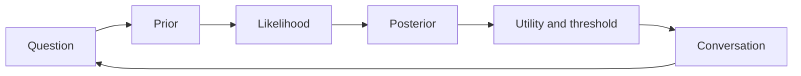
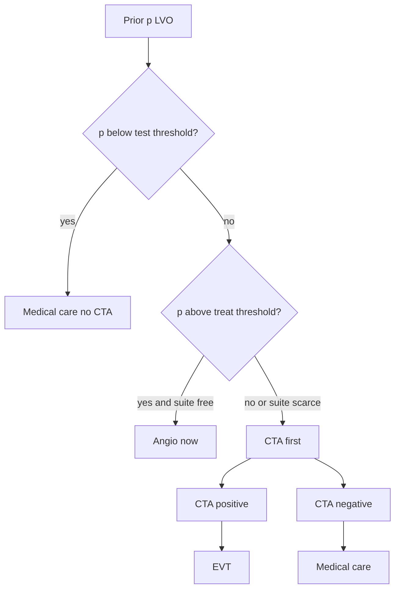

# Integrated Case Studies in Neurology and Beyond

## Opening

Four rooms, one afternoon. A CTA that has not finished reconstructing. An ICH that may still be growing. A clinic visit six weeks after an embolic-appearing infarct with no source found. A steering-committee call about a rare myopathy trial that has enrolled fourteen people. The mathematics does not change when the door does. What changes is the loss function, the time available to update, and the sentence you owe the person in front of you.

**Learning objectives**

- Carry a single prior–likelihood–posterior–utility–conversation loop through four neurologically different problems without changing the algebra.
- Separate diagnostic probability from treatment threshold, and treatment threshold from the words used at the bedside.
- Compute and interpret teaching-number posteriors for large-vessel occlusion, hematoma expansion, ESUS secondary prevention, and a small-n neuromuscular go/no-go.
- Use a conjugate update or a `brms` posterior-predictive check as a decision instrument, not as decoration.
- Recognize when the conversation is the intervention: calibration language, not reassurance theater.

### Clinical vignette

It is 14:10. You are covering the comprehensive stroke center and a rare-disease clinic the same day.

**Bay 3.** A 71-year-old right-handed woman, last known well 70 minutes ago, NIHSS 16 (forced gaze, aphasia, right hemiplegia). Noncontrast CT is ASPECTS 9. CTA is still reconstructing. The fellow wants to “just go to angio.” The family is in the hallway.

**ICU 12.** A 64-year-old man, ICH volume 18 mL, deep left putamen, systolic blood pressure 188 mm Hg on arrival, now 162 mm Hg on nicardipine. CTA spot sign is present. Neurosurgery has deferred evacuation. The question on the board is the blood-pressure target for the next six hours.

**Clinic 4.** A 58-year-old woman six weeks after a left MCA-territory infarct, workup including 30-day monitor, TTE, TEE, and CTA of the neck all unrevealing. She has been labeled ESUS. She asks whether she should “just go on a blood thinner.”

**Zoom, 16:30.** A Phase 2 trial of a complement inhibitor in a rare inflammatory myopathy has 14 of a planned 40 participants. The primary endpoint is a 6-minute walk change at week 12. The DSMB wants a go/no-go using the posterior predictive distribution of the remaining 26.

Write, for each room, a prior, a likelihood, a posterior, a threshold, and one sentence you would actually say. Do not open a laptop yet.

---

## The loop that does not change

Every case in this chapter is the same object viewed from a different loss function.



The **question** is not “is this LVO” or “is anticoagulation better.” The question is a decision: treat now, test more, wait, or stop. The **prior** is a probability or a distribution over an effect, written down before the new datum. The **likelihood** is what the new datum would look like under competing states. The **posterior** is the prior reweighted. **Utility** converts the posterior into a threshold: how much harm you will accept for a given benefit. The **conversation** is the posterior and the threshold translated into a sentence a non-statistician can use.

!!! warning "Common Pitfall"
    Collapsing the loop into a single adjective — “this looks like an LVO,” “ICH expansion is likely,” “anticoagulation is reasonable,” “the trial is promising” — discards the only information that later data can update. Adjectives do not have likelihoods.

The general principle is not neurologic. Emergency medicine, oncology, and intensive care run the same loop. Neurology is a convenient stress test because the clocks are short, the base rates are badly remembered, and the losses are asymmetric.

---

## Case 1 — Hyperacute large-vessel occlusion

### Prior

Among patients with last-known-well under 4.5 hours and NIHSS \(\geq 10\), a **teaching prior** for intracranial LVO (ICA, M1, or proximal M2) is \(p(\text{LVO}) = 0.35\). That number is a calibrated institutional base rate, not a national constant. A center that receives only mothership transfers will sit higher; a drip-and-ship spoke that sends every NIHSS 4 will sit lower. Write your number before the CTA loads.

NIHSS 16 with gaze, aphasia, and hemiplegia is not independent of that 0.35. Cortical signs raise the prior. A teaching adjustment using a likelihood ratio of about 2.5 for this syndrome against a non-LVO stroke of similar NIHSS moves the odds from \(0.35/0.65 \approx 0.54\) to \(1.35\), or a prior of about \(0.57\). That is still not a diagnosis.

### Likelihood

Noncontrast CT has already done useful work: ASPECTS 9 means there is still a large territory that could be penumbra, and it modestly lowers the probability of a stroke mimic that would have a normal examination. It does almost nothing to distinguish LVO from perforator disease or distal occlusion.

CTA is the high-information test. Using **teaching operating characteristics** — sensitivity 0.92, specificity 0.90 for LVO versus not — the likelihood ratios are

\[
\text{LR}^{+} = \frac{0.92}{1-0.90} = 9.2, \qquad \text{LR}^{-} = \frac{1-0.92}{0.90} = 0.089.
\]

### Posterior

If CTA shows a proximal M1 cutoff, posterior odds \(= 1.35 \times 9.2 \approx 12.4\), posterior probability \(\approx 0.93\). If CTA is negative, posterior odds \(= 1.35 \times 0.089 \approx 0.12\), posterior \(\approx 0.11\). The fellow who wants to “just go to angio” is proposing to skip a test whose negative result would drop LVO probability from 57% to 11%.

### Utility and threshold

Endovascular therapy for a confirmed LVO in this time window has a **teaching absolute benefit** of 0.14 on mRS 0–2 and a **teaching symptomatic ICH increment** of 0.02 above medical care. Going to angio without LVO wastes a suite, delays the next real LVO, and exposes the patient to groin and contrast risk for near-zero benefit. A simple expected-utility sketch: let \(B\) be the utility gain of EVT given LVO and \(H\) the utility loss of angio-without-LVO. The treat-without-further-test threshold is \(p^{*} = H / (B+H)\). If you judge \(B\) five times \(H\) — a defensible bedside ratio when the suite is free and the next LVO is not waiting — then \(p^{*} = 1/6 \approx 0.17\). At a prior of 0.57 you are already above that threshold. That is why the fellow is not crazy. It is also why CTA still has value: the suite is *not* free, and \(H\) includes the opportunity cost of the next patient.

The test/treat logic is the same one used for any rapid diagnostic:



### Conversation

To the family, before CTA: “Her examination makes a blocked large artery more likely than not — roughly a coin flip leaning toward yes, about 55 to 60 percent. The scan that is reconstructing will either push that above 90 percent or drop it near 10 percent. If it is a large-artery blockage and we open it, the chance of being independent later is meaningfully higher. I will come back as soon as the pictures are up.”

Do not say “we need to rush her to the catheter lab.” That sentence smuggles a posterior of 1.

!!! tip "Clinical Pearl"
    The diagnostic posterior and the treatment threshold can disagree with the logistics. A 0.57 probability of LVO can exceed a 0.17 treat threshold *and* you can still do the CTA if the two-minute delay is cheap relative to a false trip. Thresholds are not orders.

---

## Case 2 — ICH expansion and the blood-pressure target

### Prior

Hematoma expansion of \(\geq 6\) mL or \(\geq 33\%\) within 24 hours has a **teaching base rate** of 0.30 in spontaneous deep ICH presenting under 6 hours, off anticoagulants. The CTA spot sign is an imperfect marker. Teaching LR\(^{+}\) \(\approx 3.0\), LR\(^{-}\) \(\approx 0.55\). Spot-sign positive, the expansion probability is

\[
\frac{0.30/0.70 \times 3.0}{1 + 0.30/0.70 \times 3.0} \approx 0.56.
\]

That is the prognostic prior for the next six hours. It is not yet a treatment decision.

### Likelihood of the intervention

Two publicly known trials — INTERACT2 and ATACH-2 — tested intensive systolic targets near 140 mm Hg against less intensive targets near 180 mm Hg. INTERACT2’s primary ordinal outcome sat just on the unhelpful side of a conventional 0.05 threshold; ATACH-2 did not show functional benefit and recorded more renal adverse events at the most intensive target. Those are design facts, not a license to invent their point estimates here.

For teaching, encode the *effect of targeting SBP \(< 140\) versus \(< 180\)* on expansion as a risk ratio with prior

\[
\log \text{RR} \sim \mathcal{N}(\mu = -0.15,\; \sigma = 0.20).
\]

That prior says you expect about a 14% relative reduction, and you are unsure enough that a 20% relative *increase* remains inside a two-standard-deviation interval. The likelihood, when it arrives as a 24-hour scan, updates this. At the moment of the target decision you have no 24-hour scan. You have only this prior and the spot-sign-updated expansion risk.

### Posterior (here: prior used as posterior)

With no new trial-level datum in the last hour, the posterior on the treatment effect *is* the prior. The posterior predictive expansion risk under intensive treatment is approximately \(0.56 \times e^{-0.15} \approx 0.48\). Under a standard target, 0.56. Absolute difference about 8 percentage points, with a wide interval that comfortably includes zero and includes 15 points.

### Utility and threshold

Expansion is a surrogate. The utility that matters is mRS 0–3 at 90 days, plus the harm of overshoot — renal injury, perihematomal ischemia in a subset of patients, nursing burden of a dripping nicardipine infusion. A teaching conversion: each prevented expansion yields a 0.25 chance of a one-category mRS improvement. An 8-point absolute reduction in expansion then buys a 2-point absolute improvement in a good functional outcome — 0.02 — at the cost of a teaching 0.03 increment in renal adverse events.

The ratio is not a slam dunk. The decision is therefore not “140 versus 180.” It is “avoid SBP spikes above 180, do not chase 130, and do not trade a kidney for a surrogate.” A reasonable threshold policy: treat SBP \(> 160\) promptly; accept 140–160; do not intensify below 140 solely because the spot sign is present.

| Quantity | Teaching value | Role |
|---|---|---|
| Expansion base rate, deep ICH \(< 6\) h | 0.30 | Prognostic prior |
| Spot-sign LR\(^{+}\) | 3.0 | Updates expansion risk to \(\approx 0.56\) |
| Prior on \(\log\) RR (intensive vs standard) | \(\mathcal{N}(-0.15, 0.20^{2})\) | Effect on expansion |
| Implied ARR in expansion | \(\approx 0.08\), interval includes 0 | Surrogate |
| Implied ARR in good mRS | \(\approx 0.02\) | Utility-scale benefit |
| Renal-event increment | 0.03 | Utility-scale harm |

### Conversation

To the family: “The bleeding can grow in the first day. The pictures suggest that is a coin-flip-plus risk, a little over 50 percent, not a certainty. We will keep the blood pressure out of the danger zone — not sky-high — because that is the part we can control. Pushing it very low has not been shown to change independence in a reliable way and can stress the kidneys. I am not recommending surgery tonight.”

!!! note "Mathematical Detail"
    The spot sign updates \(p(\text{expand})\). The blood-pressure target updates \(p(\text{expand} \mid \text{treatment})\). Multiplying a diagnostic posterior by a treatment risk ratio is legal only if the marker does not modify the relative effect. If the spot sign identifies a biologically different hematoma, the \(\log\) RR prior should be *re-elicited* in that stratum, not reused.

---

## Case 3 — Secondary prevention after ESUS

### Prior

Embolic stroke of undetermined source is a residue class, not a disease. Annual ischemic recurrence on antiplatelet therapy has a **teaching rate** of 5 per 100 patient-years. Two large publicly known trials, NAVIGATE ESUS and RE-SPECT ESUS, did not demonstrate that rivaroxaban or dabigatran beat aspirin on their primary ischemic endpoints. That is a design-level fact. It licenses a skeptical prior on a relative risk, not a claim about their unpublished internals.

Encode the relative risk of ischemic recurrence, anticoagulant versus antiplatelet, as

\[
\log \text{RR}_{\text{isc}} \sim \mathcal{N}(0,\; 0.15^{2}).
\]

Mean relative risk 1.0; a 26% relative benefit or harm sits at the edge of a 95% prior interval. Separately, the excess symptomatic ICH rate on anticoagulant versus aspirin has a teaching value of 0.4 per 100 patient-years, with less uncertainty.

### Likelihood

This patient contributes almost no likelihood for the *class* effect. She is one person. What she does contribute is a likelihood for *her membership in a subgroup that might have a different RR*: atrial cardiopathy, PFO with high-risk features, aortic arch atheroma, occult cancer, nonstenotic carotid plaque. Each of those is a different trial, most of them unfinished or negative in the public record. Negative extended monitoring is a likelihood ratio against occult AF that depends on duration. A 30-day monitor that is negative has a teaching LR of about 0.4 against AF that would have been captured on an insertable loop recorder — useful, not decisive.

### Posterior

The posterior on the class-level RR is essentially the prior: centered at 1.0. The posterior on occult AF after negative 30-day monitoring, starting from a teaching prior of 0.12 in this age and infarct pattern, is about 0.05. Even if anticoagulation halved recurrence in true AF (it does not quite, but use 0.50 as a teaching RR), the *mixture* RR for this patient is \(0.05 \times 0.50 + 0.95 \times 1.0 = 0.975\). Annual ischemic risk moves from 5.0 to about 4.9 per 100, while ICH risk rises by 0.4 per 100.

### Utility and threshold

Let ischemic stroke cost 1 utile and symptomatic ICH cost 1.8 utiles (ICH is more often fatal or devastating). Net annual expected-utility change on anticoagulation:

\[
\Delta EU = -1 \times (-0.1/100) - 1.8 \times (0.4/100) \approx -0.0062.
\]

Negative. The threshold RR that would justify anticoagulation at these harms is the RR that buys enough ischemic reduction to pay for 0.4 extra ICH events weighted 1.8, i.e. an absolute ischemic reduction of \(0.4 \times 1.8 = 0.72\) per 100, or a relative reduction of \(0.72/5.0 = 0.144\). You need to believe in at least a 14% relative ischemic benefit *for this patient* before the ledger flips. The class-level posterior does not get you there. A confirmed AF posterior would.

| Strategy | Teaching ischemic events / 100 py | Teaching sICH / 100 py | Weighted loss (ICH = 1.8) |
|---|---|---|---|
| Antiplatelet | 5.0 | 0.2 | 5.36 |
| Anticoagulant, class ESUS | 4.9 | 0.6 | 5.98 |
| Anticoagulant, known AF | 2.5 | 0.6 | 3.58 |

### Conversation

“The stroke looks embolic, but we have not found a clot source that anticoagulation is proven to treat. On the numbers we have, switching from aspirin to a blood thinner would be unlikely to prevent even one stroke in a hundred people like you over a year, and it would cause extra brain bleeds. I recommend staying on the antiplatelet, finishing the workup we have not done — a longer monitor if you want one — and talking again if atrial fibrillation appears.”

That sentence is the decision. The table is why you can defend it.

!!! tip "Clinical Pearl"
    ESUS is a prior, not an indication. The moment a treatable mechanism is identified, you are no longer in this case. Do not let the residue-class label freeze a posterior that new monitoring is trying to move.

---

## Case 4 — Rare neuromuscular trial, go or no-go

### Prior

A Phase 2 randomized trial of a complement inhibitor versus placebo in a rare inflammatory myopathy. Primary endpoint: change in 6-minute walk distance (6MWD) at week 12, meters. Historical untreated change is about \(0 \pm 40\) m. A clinically important improvement is 40 m. The sponsor’s enthusiastic prior was \(\mathcal{N}(50, 25^{2})\) on the treatment contrast. The DSMB asked for a skeptical prior, \(\mathcal{N}(10, 30^{2})\), which puts 40 m at one standard deviation above the mean and allows a harmful effect.

Fourteen of forty participants have completed week 12: 8 active, 6 placebo. **Teaching data:** mean change \(+22\) m (SD 38) on active, \(+4\) m (SD 41) on placebo.

### Likelihood, posterior, and posterior predictive

A conjugate normal analysis with known \(\sigma = 40\) and the skeptical prior already answers the go/no-go. The likelihood for the contrast \(\delta\) is approximately normal with mean \(22-4 = 18\) and variance \(40^{2}(1/8 + 1/6) = 466.7\), so \(\text{SE} \approx 21.6\). The posterior is

\[
\delta \mid y \;\sim\; \mathcal{N}\!\left(
\frac{10/30^{2} + 18/466.7}{1/30^{2} + 1/466.7},\;
\frac{1}{1/30^{2} + 1/466.7}
\right)
\approx \mathcal{N}(15.3,\; 17.5^{2}).
\]

\(P(\delta > 0 \mid y) \approx 0.81\). \(P(\delta > 40 \mid y) \approx 0.08\). The trial is more probably slightly helpful than not, and is unlikely to be *importantly* helpful on the data so far.

The go/no-go, however, is about the *remaining* 26 participants (assume 13:13). The posterior predictive distribution of the final frequentist point estimate, or better, of the final posterior probability \(P(\delta > 20 \mid y_{\text{all}})\), is the right object. The block below specifies a `brms` model you can actually run, then draws the unfinished outcomes from the posterior predictive and reapplies the decision rule.

!!! example "R Deep Dive"
    The decision rule used here is: **go** if the final posterior probability that \(\delta > 20\) m exceeds 0.80; **pause and expand** if it sits between 0.50 and 0.80; **stop** otherwise. Those cutoffs are utilities in disguise — they encode the cost of a failed Phase 3 versus the cost of walking away from a real drug in a rare disease.

```r
# Rare-myopathy Phase 2: posterior predictive go/no-go
# Teaching data only. Educational, not a protocol.
# Requires: brms, posterior, dplyr. Seed fixed.

library(brms)
library(posterior)
library(dplyr)

set.seed(20260818)

# Observed completers (teaching numbers)
d_obs <- data.frame(
  arm = factor(c(rep("active", 8), rep("placebo", 6))),
  y   = c(18, 41, -12, 35, 22, 9, 55, 8,    # active, mean ~22
          12, -15, 30, -8, 5, 0)            # placebo, mean ~4
)

priors <- c(
  prior(normal(0, 40), class = Intercept),          # placebo mean change
  prior(normal(10, 30), class = b, coef = armactive), # skeptical delta
  prior(student_t(3, 0, 40), class = sigma)
)

fit <- brm(
  y ~ arm,
  data    = d_obs,
  family  = gaussian(),
  prior   = priors,
  chains  = 4, iter = 2000, warmup = 1000,
  seed    = 20260818,
  refresh = 0
)

# Posterior of the contrast (active - placebo)
drws <- as_draws_df(fit)
delta <- drws$b_armactive
c(mean = mean(delta),
  sd   = sd(delta),
  p_gt0 = mean(delta > 0),
  p_gt20 = mean(delta > 20),
  p_gt40 = mean(delta > 40))

# Posterior predictive for 13 future patients per arm
newdat <- data.frame(arm = factor(c(rep("active", 13),
                                    rep("placebo", 13)),
                                  levels = levels(d_obs$arm)))
y_rep <- posterior_predict(fit, newdata = newdat, ndraws = 400)

# For each draw, pretend we refit with a conjugate shortcut and
# apply the go/no-go rule on P(delta > 20).
# Shortcut: final MLE contrast and its SE, then combine with the same prior.
go_rule <- apply(y_rep, 1, function(yp) {
  m_a <- mean(c(d_obs$y[d_obs$arm == "active"],  yp[1:13]))
  m_p <- mean(c(d_obs$y[d_obs$arm == "placebo"], yp[14:26]))
  n_a <- 8 + 13; n_p <- 6 + 13
  mle <- m_a - m_p
  v_l <- 40^2 * (1 / n_a + 1 / n_p)
  post_prec <- 1 / 30^2 + 1 / v_l
  post_mean <- (10 / 30^2 + mle / v_l) / post_prec
  post_sd   <- sqrt(1 / post_prec)
  p_gt20    <- 1 - pnorm(20, post_mean, post_sd)
  c(p_gt20 = p_gt20,
    go     = as.numeric(p_gt20 > 0.80),
    pause  = as.numeric(p_gt20 > 0.50 & p_gt20 <= 0.80))
})

rowMeans(go_rule)
# Interpret: share of predictive worlds that GO / PAUSE / STOP.
```

You should not invent the printed `rowMeans` until you run the block. The *structure* of the answer is what the DSMB needs: a predictive probability of eventually meeting the go rule, not a current \(p\)-value and not a current posterior mean alone.

### Utility, threshold, conversation

A failed Phase 3 in a rare disease consumes the last untreated cohort for five years. Walking away from a real 25 m effect does the same in the other direction. If the posterior predictive probability of a go is under 0.25, stopping is usually correct. If it is over 0.60, continuing is cheap relative to the option value. Between those, the honest action is to redesign: change the endpoint, enrich, or borrow from a hierarchical historical-control model (Chapter 16) rather than to “see how the next six look.”

To the steering committee: “On a skeptical prior the mean benefit is about 14 meters, and there is only a one-in-ten chance it is as large as 40 meters. Whether we continue should be decided by the chance the *finished* trial will clear our own 80-percent-probability bar, not by whether the current interval excludes zero. I will not vote go on the current posterior mean.”

---

### For the biostatistician / methodologist

The four cases are one decision problem,

\[
a^{*} = \arg\max_{a \in \mathcal{A}} \int u(a, \theta)\, p(\theta \mid y)\, d\theta,
\]

with different action sets \(\mathcal{A}\) and different sampling models. Case 1 is a binary \(\theta\) (LVO or not) and a three-action set (treat, test, wait). Case 2 is a pair \((\theta_{\text{expand}}, \delta_{\text{RR}})\). Case 3 is a mixture over latent mechanisms. Case 4 is a sequential design whose utility is evaluated under the posterior predictive \(p(y_{\text{future}} \mid y_{\text{obs}})\).

Two technical points that are easy to get wrong when the cases are taught separately.

First, **transport**. The 0.14 EVT benefit is a trial-population number. The woman in Bay 3 is 71, NIHSS 16, ASPECTS 9, 70 minutes out. That is closer to the trial population than a 90-year-old with ASPECTS 5, but it is not identical. A hierarchical partial-pooling model (Chapter 10) is how you move from trial \(\delta\) to patient \(\delta_{i}\) without pretending they are equal and without pretending the trial is irrelevant.

Second, **the posterior predictive is the go/no-go object**, not the posterior of \(\delta\). \(P(\delta > 20 \mid y_{\text{obs}}) = 0.40\) can coexist with \(P(\text{final analysis goes} \mid y_{\text{obs}}) = 0.15\) if the remaining sample is small. DSMBs that stare at the current posterior mean are answering a different question from the one they were asked.

---

## Worked solution to the opening vignette

**Bay 3.** Prior after the examination \(\approx 0.57\). CTA is cheap relative to a false-negative trip only if the suite is scarce; if the suite is free and \(p^{*} \approx 0.17\), treating without CTA is defensible but still usually wrong because two minutes of reconstruction will move 0.57 to either 0.93 or 0.11. Sentence: give the family the 55–60% number and the two-way update. Do not take her to angio on an adjective.

**ICU 12.** Expansion posterior \(\approx 0.56\). Intensive SBP targeting buys a teaching 8-point ARR in a surrogate and a 2-point ARR in function, against a 3-point renal harm. Target: keep SBP out of the 180s; do not chase 130 because of the spot sign. Sentence: coin-flip-plus growth risk, control the spikes, no surgery tonight.

**Clinic 4.** Class-level RR posterior centered at 1.0. Mixture RR given negative 30-day monitor \(\approx 0.975\). Net expected utility of anticoagulation is negative unless you believe in at least a 14% relative ischemic benefit. Sentence: stay on antiplatelet; longer monitor is optional information, not a moral duty.

**Zoom.** Skeptical posterior \(\delta \approx \mathcal{N}(15.3, 17.5^{2})\). \(P(\delta > 40) \approx 0.08\). Vote on the posterior predictive probability of eventually clearing the predeclared go rule, not on whether 14 meters “looks promising.”

The four sentences share a grammar: a number, a contrast, an action, a stop-condition for the next update.

---

## Exercises

**18.1.** Recalculate Case 1 if the institutional LVO base rate is 0.18 rather than 0.35, same examination LR of 2.5, same CTA LRs. Does CTA become mandatory even if the suite is free? What is the new treat-without-test decision?

**18.2.** In Case 2, suppose you believe the spot sign *modifies* the RR of intensive BP lowering, with \(\log\text{RR} \mid \text{spot+} \sim \mathcal{N}(-0.35, 0.25^{2})\). Recompute the implied ARR in expansion and say whether your target changes.

**18.3.** A colleague argues that Case 3 should use a prior \(\log\text{RR}_{\text{isc}} \sim \mathcal{N}(-0.20, 0.15^{2})\) “because anticoagulation works for clots.” Compute the posterior mixture RR after the negative 30-day monitor and the new net \(\Delta EU\). Where did the colleague smuggle a mechanism?

**18.4.** Using the conjugate numbers in Case 4, what happens to \(P(\delta > 20 \mid y)\) if the next four completers (2 and 2) all come in at \(+60\) m on active and \(-10\) m on placebo? Compute the updated posterior mean and SD. Do not use software.

**18.5.** Write the one-sentence conversation for a fifth room the chapter did not visit: a 45-year-old with a first unprovoked unruptured 6 mm posterior-communicating aneurysm, annual rupture teaching rate 0.5%, treatment morbidity 4%. Prior, likelihood (there is none yet), posterior, threshold, sentence.

**18.6.** Sketch, in six lines of `brms` plus priors, a hierarchical model that would let Case 3 borrow AF-trial information without pretending ESUS is AF. (Specification only.)

---

## Further reading

- Sox HC, Higgins MC, Owens DK. *Medical Decision Making*. 2nd ed. Wiley-Blackwell; 2013. Thresholds and expected utility, the grammar of Cases 1–3.
- Pauker SG, Kassirer JP. The threshold approach to clinical decision making. *N Engl J Med*. 1980;302:1109–1117.
- Gelman A, Carlin JB, Stern HS, Dunson DB, Vehtari A, Rubin DB. *Bayesian Data Analysis*. 3rd ed. CRC Press; 2013. Chapters 1 and 6, posterior predictive checks as decision instruments.
- Spiegelhalter DJ, Abrams KR, Myles JP. *Bayesian Approaches to Clinical Trials and Health-Care Evaluation*. Wiley; 2004. Go/no-go and skeptical priors.
- Goyal M, Menon BK, van Zwam WH, et al. Endovascular thrombectomy after large-vessel ischaemic stroke: a meta-analysis of individual patient data from five randomised trials. *Lancet*. 2016;387:1723–1731. Design and publicly reported effect of EVT; do not lift tables.
- Hart RG, Diener H-C, Coutts SB, et al. Embolic strokes of undetermined source: the case for a new clinical construct. *Lancet Neurol*. 2014;13:429–438.
- Anderson CS, Heeley E, Huang Y, et al. Rapid blood-pressure lowering in patients with acute intracerebral hemorrhage. *N Engl J Med*. 2013;368:2355–2365. INTERACT2 design facts.
- U.S. Food and Drug Administration. Guidance for the Use of Bayesian Statistics in Medical Device Clinical Trials. 2010. Predictive probability of success as a stopping language.

!!! success "Key Takeaway"
    The loop is prior, likelihood, posterior, utility, conversation. Large-vessel occlusion, hematoma expansion, ESUS, and a fourteen-person myopathy trial do not get different mathematics; they get different loss functions and different sentences. Write the number before the scan, the scan, or the DSMB slide can write it for you. If you cannot say the sentence to the family or the committee, you do not yet have a decision — you have a posterior looking for a place to happen.
