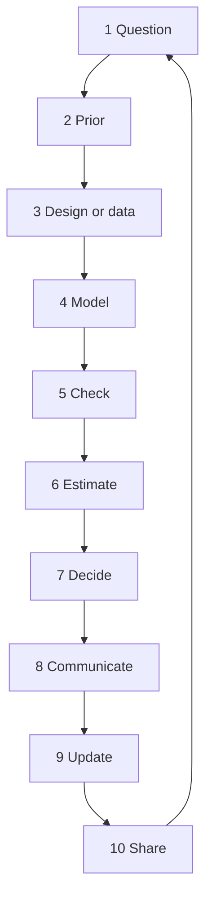
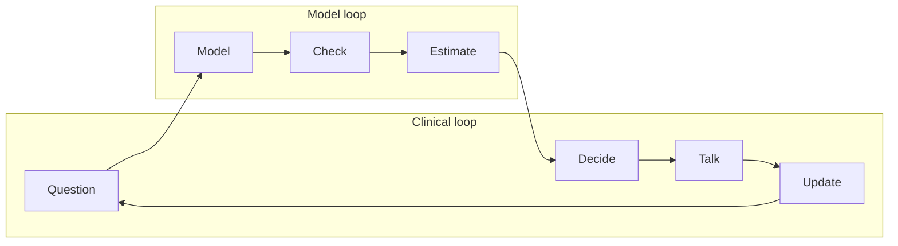

# Putting It All Together: A Complete Bayesian Clinical Reasoning Workflow

## Opening

A workflow is a habit you can audit. Without one, Bayesian clinical reasoning collapses into a mood: you feel more numerical on Tuesdays. With one, a new fellow, a new dataset, and a new family meeting produce the same ten moves in the same order, and anyone can see where you cheated.

**Learning objectives**

- Run a ten-step Bayesian clinical reasoning loop from a raw question to a shareable artifact.
- Distinguish the clinical loop (decide, talk, update) from the model loop (fit, check, estimate) without letting either eat the other.
- Use a checklist at the bedside and at the keyboard, and know which items are allowed to be skipped under time pressure.
- Place this workflow beside CRIT-APP critical appraisal and beside machine-learning literacy rather than in competition with them.
- Specify a small `brms` analysis that is the computational middle of the loop, not the point of the loop.

### Clinical vignette

A regional network asks you to decide whether to pre-alert the angiography suite for every ambulance NIHSS \(\geq 8\), or only for NIHSS \(\geq 12\). They have six months of teaching-quality registry data: 420 prehospital NIHSS values, CTA results, door-to-puncture times, and 90-day mRS. A visiting data-science group has already trained a gradient-boosted classifier that “predicts LVO with AUROC 0.84.” A journal club last week used a CRIT-APP worksheet to dismantle a thrombectomy paper. The operations chief wants an answer by Friday. The families in the ED will not read your Friday memo.

Write the ten steps you will take, in order, before you open R and before you argue with the gradient booster.

---

## The ten-step loop



The loop is closed. Sharing produces the next question. Updating produces the next prior. Nothing in the figure is original as mathematics. The contribution is the refusal to start at step 4.

### Step 1 — Question

A question is a decision plus a population plus a time horizon. “Does NIHSS predict LVO?” is not a question. “Should this network pre-alert angio for NIHSS \(\geq 8\) rather than \(\geq 12\), given current CTA and transfer times, with the loss function of wasted-suite minutes versus delayed true LVO?” is a question. Write it in one sentence. If you cannot, you are still in literature-review mode.

Name the action set. Here: \(\{8, 10, 12, 14\}\) as candidate cutoffs, or a continuous risk score with a threshold. Name the unit of loss: minutes of suite time, mRS expected value, or both.

### Step 2 — Prior

Write the prior *before* you open the registry. Two priors, actually.

**Clinical prior.** In unselected EMS stroke alerts, a teaching LVO prevalence is 0.15. NIHSS \(\geq 8\) will enrich that; NIHSS \(\geq 12\) will enrich it more. Sketch \(p(\text{LVO} \mid \text{NIHSS})\) as a monotone function and commit to two points, for example \(p = 0.22\) at NIHSS 8 and \(p = 0.38\) at NIHSS 12.

**Effect prior.** Pre-alert that saves 15 minutes of door-to-puncture has a teaching effect on mRS 0–2, given true LVO, of about 1 to 2 absolute points per 15 minutes in the early window. Given not-LVO, the effect is approximately zero and the cost is a blocked suite.

If you skip this step, the registry will launder itself into a prior and you will not notice.

!!! warning "Common Pitfall"
    “Uninformative prior” is not a step-2 answer. An improper flat prior on LVO prevalence is a claim that 1% and 99% were equally plausible before you saw 420 rows. They were not. Weakly informative means *weak relative to the likelihood you expect*, not *empty*.

### Step 3 — Design or data

Decide what you are allowed to learn from. Registry data are convenient and biased: prehospital NIHSS is noisy, CTA is missing when the patient went to a spoke, 90-day mRS is missing when the patient went home to another county. Write the missingness mechanism in words. If CTA-not-done is informative (the clinician already “knew” it was not an LVO), a complete-case logistic regression estimates the wrong thing.

If you still have design freedom — a prospective period, a second region, a cluster flip of the pre-alert rule — say so now. Retrospective convenience is a design, not the absence of one.

### Step 4 — Model

The model is the likelihood plus the prior, written so that another person can fit it. For the network problem a minimum model is

\[
\text{LVO}_{i} \sim \text{Bernoulli}(\pi_{i}), \qquad
\text{logit}(\pi_{i}) = \alpha + \beta\, \text{NIHSS}_{i} + \gamma^{\top} x_{i},
\]

with weakly informative priors on \(\alpha, \beta\) and a missing-data submodel if CTA is absent. The operations outcome — door-to-puncture, wasted-suite time — is a second model, not a coefficient in the first.

Do not start with a stacked ensemble because a visitor brought one. Complexity is added when step 5 says the simple model cannot predict the checks you care about.

### Step 5 — Check

Before you read a single posterior interval, look at:

- Convergence: \(\widehat{R}\), bulk and tail effective sample size, divergences.
- Posterior predictive: NIHSS-stratified LVO counts, not a global mean.
- Calibration in the large and in slices the decision will use (NIHSS 6–9, 10–13, \(\geq 14\)).
- Sensitivity to the step-2 prior: refit with a tighter and a flatter prior and see whether the *decision*, not the coefficient, moves.

A model that passes \(\widehat{R} < 1.01\) and fails the NIHSS 6–9 calibration check is not ready for step 7.

### Step 6 — Estimate

Now read numbers. Report them on the scale of the decision: \(p(\text{LVO} \mid \text{NIHSS}=8)\), \(p(\text{LVO} \mid \text{NIHSS}=12)\), expected wasted-suite hours per month at each cutoff, expected additional independent outcomes per month. Highest-density intervals, not stars. A table beats a coefficient plot.

### Step 7 — Decide

Apply the threshold you wrote in step 1. Expected utility, or a constrained rule (“never waste more than 8 suite-hours a month”). The posterior does not decide. You do, using a loss that should have been public before the data were opened.

If two cutoffs have overlapping expected utilities, the decision is “either is acceptable; pick the one the nurses can run at 03:00.” That is a valid output of a Bayesian analysis.

### Step 8 — Communicate

Three audiences, three artifacts.

| Audience | Artifact | Forbidden move |
|---|---|---|
| Family in Bay 3 | One sentence with a number and an action | “The model says” |
| Network operations | One table of cutoffs × suite-hours × expected independents | AUROC as a headline |
| Other statisticians | Prior, model, checks, code, seed | A coefficient without a posterior predictive |

Chapter 18 wrote the family sentence. This chapter writes the operations table. Chapter 20 writes the shareable bundle.

### Step 9 — Update

After three months of the new rule, the registry is no longer the prior. The posterior from Friday is the prior for May. Pre-specify what will flip the rule back: if wasted-suite hours exceed the 80th percentile of the predictive distribution for two consecutive months, reopen step 1. Updating is not “we will look at it.” Updating is a predeclared discrepancy.

### Step 10 — Share

A Quarto file, an `renv.lock`, a de-identified analysis table, and a paragraph that states the question, the prior, and the decision (Chapter 20). If you cannot share the data, share the prior, the likelihood specification, and the posterior summaries. An unreproducible posterior is a rumor.

---

## The checklist

Use this at the keyboard. At the bedside, the same items collapse to question, prior, datum, threshold, sentence.

| # | Item | Bedside (minutes) | Analysis (hours) | Skip only if |
|---|---|---|---|---|
| 1 | Decision, population, horizon, action set written | 1 | 1 | Never |
| 2 | Prior written, with source | 1 | 2 | Never |
| 3 | Data or design, missingness named | 0 (the datum is the patient) | 4 | Never |
| 4 | Model specified, priors in code | — | 4 | Never |
| 5 | Convergence + PPC + slice calibration | — | 4 | Never for a report |
| 6 | Estimates on the decision scale | 1 | 2 | Never |
| 7 | Threshold applied, sensitivity shown | 1 | 2 | Never |
| 8 | Three-audience communication | 2 | 3 | Family sentence never skipped |
| 9 | Next update trigger written | 0.5 | 1 | Never |
| 10 | Bundle archived | — | 2 | PHI blockade, then share summaries |

!!! tip "Clinical Pearl"
    Under a 90-second door-to-CT constraint, steps 3–5 and 10 are not performed. Steps 1, 2, 6, 7, 8, and 9 still are. “I do not have time to be Bayesian” usually means “I do not have time to fit `brms`.” That is a different complaint.

---

## Where the computational middle sits

The following specification is step 4 for the vignette. It is not the workflow. It is the part of the workflow that happens to be software.

```r
# Network pre-alert: P(LVO | NIHSS) with a weakly informative prior
# Teaching analysis. Not an institutional calculator.
# brms + cmdstanr assumed. Seed fixed.

library(brms)
library(dplyr)
library(tidybayes)
library(ggplot2)

set.seed(19)

# d has columns: lvo (0/1), nihss (prehospital), age, transfer (0/1)
# Specification only — comment the sampler until d exists.

# Priors derived from the step-2 anchors, so step 4 encodes step 2:
#   slope     = (qlogis(0.38) - qlogis(0.22)) / 4 = 0.19 per NIHSS point
#   intercept = qlogis(0.22) - 0.19 * 8           = -2.8 (p ~ 0.06 at NIHSS 0;
#   the marginal 0.15 prevalence lives at typical alert NIHSS, not NIHSS 0)
priors <- c(
  prior(normal(-2.8, 0.8), class = Intercept),
  prior(normal(0.19, 0.06), class = b, coef = nihss),
  prior(normal(0, 0.5), class = b)              # other coefficients
)

# fit_lvo <- brm(
#   lvo ~ nihss + age + transfer,
#   data    = d,
#   family  = bernoulli(link = "logit"),
#   prior   = priors,
#   chains  = 4, iter = 3000, warmup = 1000,
#   seed    = 19,
#   control = list(adapt_delta = 0.95),
#   refresh = 0
# )
#
# new <- data.frame(
#   nihss    = c(8, 10, 12, 14),
#   age      = median(d$age),
#   transfer = 0
# )
# new %>%
#   add_epred_draws(fit_lvo) %>%
#   group_by(nihss) %>%
#   median_qi(.epred, .width = 0.90)
# Report the 90% intervals to operations, not the log-odds slope.
```

Step 5 then asks for a grouped bar check — e.g. `pp_check(fit_lvo, type = "bars_grouped", group = "nihss_bin", newdata = transform(d, nihss_bin = cut(nihss, c(0, 5, 9, 13, 42))))`, the bin variable being created on the way in because only formula variables survive into the fitted object’s data — and for a calibration slice at NIHSS 6–9. Step 6 is the `median_qi` table. Step 7 multiplies those probabilities by suite-time costs.



The clinical loop can run without MCMC. The model loop cannot produce a decision without the clinical loop. People who live only in the right-hand box become analysts. People who live only in the left-hand box become confident. The workflow is the hinge.

---

## Beside CRIT-APP, not instead of it

CRIT-APP, as used in this curriculum, is a structured critical-appraisal pass over a published study: design, selection, intervention fidelity, outcome ascertainment, follow-up, analysis, applicability, and the honesty of the abstract. It is frequentist-fluent and bias-first. It answers “should I believe this paper enough to let it move my prior?”

The ten-step loop answers a different question: “given what I already believe and the data I actually have, what do I do on Friday?”

They stack.

| Task | CRIT-APP | This workflow | ML literacy |
|---|---|---|---|
| Should DAWN/DEFUSE-3 move my late-window prior? | Primary | Step 2 uses the result | Secondary |
| What cutoff should *this* network use? | Secondary (external validity row) | Primary | A model class, not the decision |
| Is the visitor’s AUROC 0.84 usable? | Partly (overfitting, test set) | Steps 5 and 7 | Primary |
| What do I say to the family tonight? | No | Step 8 | No |
| Is the abstract overclaiming? | Primary | Step 10’s honesty clause | Secondary |

A paper can pass CRIT-APP and still be the wrong likelihood for your network (different EMS mix, different CTA access). A model can have AUROC 0.84 and still be miscalibrated at NIHSS 8, which is the only slice the cutoff cares about. Appraisal, prediction, and decision are three crafts. This book teaches the third and refuses to sneer at the first two.

!!! note "Mathematical Detail"
    AUROC is a rank statistic, \(\Pr(\hat{p}_{1} > \hat{p}_{0})\). Expected utility is \(\sum_{a}\int u(a,\theta)\,p(\theta \mid y)\,d\theta\). They share no necessary ordering. A worse AUROC model can have better decision value at a single threshold if it is better calibrated there. Reporting AUROC as if it were a utility is a category error, not a preference.

---

## Machine-learning literacy in the same room

The visiting booster is not the enemy. It is a likelihood with more parameters and a worse prior story. Treat it as a candidate for steps 4–6 under the same rules.

- **Calibration over discrimination.** At the cutoff, Brier score and a reliability diagram beat AUROC.
- **Transport.** Train-on-mothership, deploy-on-spoke is a hierarchical transport problem (Chapters 6 and 21), not a “we have a test set” problem.
- **Actionability.** If the booster uses variables that EMS does not have (CTA collateral score, last laboratory creatinine), it is not a pre-alert model. It is a different question pretending to answer this one.
- **Update.** A locked booster that cannot become tomorrow’s prior is a one-way artifact. Prefer models whose posterior can be the next prior, or at least whose predictions are monitored against a predeclared discrepancy.

You do not have to refit the booster in `brms` to be Bayesian about it. You do have to refuse step 7 until step 5 has been done on the slice that the cutoff uses.

!!! example "R Deep Dive"
    A disciplined way to host an ML score inside this workflow is to treat the score as a covariate with a regularized slope, not as a probability. `brm(lvo ~ s(ml_score), family = bernoulli(), prior = prior(normal(0, 1), class = b))` plus a calibration PPC. The booster proposes a feature. The posterior owns the probability.

---

### For the biostatistician / methodologist

The ten steps are an operations wrapper around a standard Bayesian decision problem. Two places where trained statisticians still skip steps:

**Step 2 is a proper probability, not a regularization trick.** Putting `normal(0, 1)` on every coefficient because McElreath’s default is nearby is not elicitation. If the coefficient is a log-odds increment per NIHSS point, plausible values live near 0.1–0.2, not near 2 — the step-2 anchors imply 0.19, which is where the code block’s prior mean comes from. The two-anchor linear prior is still a simplification; a spline with a structured prior on first differences would be more honest, and would be elicited by asking clinicians for \(p(\text{LVO})\) at four NIHSS anchors rather than for a slope.

**Step 7 requires a utility, not a posterior probability cutoff.** \(P(\pi_{12} > \pi_{8} \mid y) = 0.99\) can be true and still not justify moving the cutoff if the suite-cost difference is large. Write \(u(\text{cutoff}, \theta)\) explicitly, even if it is a back-of-envelope linear loss. Then compute the expected-utility surface over the candidate cutoffs and the posterior of \(\theta\). If you cannot get the operations chief to agree on \(u\), the honest output of the analysis is that surface, not a recommended number.

A third, quieter failure: treating step 10 as “push to GitHub.” Sharing includes the decision rule that will flip the policy. A repository without an update trigger is a poster.

---

## Worked solution to the opening vignette

**1. Question.** Choose a pre-alert NIHSS cutoff for this network to maximize expected independent outcomes minus a priced penalty for wasted-suite hours, over the next six months.

**2. Prior.** LVO prevalence 0.15 unselected; 0.22 at NIHSS 8; 0.38 at NIHSS 12. Fifteen minutes saved given LVO buys 1–2 absolute points on mRS 0–2 (teaching). Write these before opening the 420 rows.

**3. Data.** 420-row registry. Name the CTA-missing mechanism. Do not drop the missing CTA rows without a model.

**4. Model.** Logistic `lvo ~ nihss + covariates` with the priors in the code block; a second model for door-to-puncture given pre-alert.

**5. Check.** \(\widehat{R}\), NIHSS-binned PPC, calibration in the 6–9 slice, prior sensitivity of the *recommended cutoff*.

**6. Estimate.** Table of \(p(\text{LVO} \mid \text{NIHSS} \in \{8,10,12,14\})\) with 90% HDIs, plus expected suite-hours and expected independents per month.

**7. Decide.** Pick the cutoff with the best expected utility, or report a tie. Do not pick the cutoff that maximizes AUROC.

**8. Communicate.** Family sentence is not needed for the Friday memo; the operations table is. Still write one sentence the ED can reuse: “If the field score is 12 or more we call the suite because about two in five of those patients have a large-vessel blockage; at 8 it is closer to one in five, and we will not empty the suite for that unless we are idle.”

**9. Update.** Three-month review; flip if wasted hours exceed the 80th predictive percentile twice.

**10. Share.** Quarto + `renv.lock` + de-identified table + the update rule (Chapter 20).

The booster’s AUROC 0.84 is admitted at step 4 as a candidate score and is judged at steps 5 and 7. The CRIT-APP worksheet from journal club informs step 2 (how hard the published EVT effect is allowed to push the time-is-brain prior) and does not pick the cutoff.

---

## Exercises

**19.1.** Shrink the loop to a 90-second bedside version for a single patient with possible SAH and a negative CT at 8 hours. Which numbered steps remain, and what is the sentence?

**19.2.** The operations chief refuses to price wasted-suite hours. Give two ways to complete step 7 anyway, one of which is not “pick the cutoff you like.”

**19.3.** A complete-case analysis drops 80 of 420 rows with missing CTA. Write a one-paragraph missingness model and say whether the complete-case \(\beta_{\text{NIHSS}}\) is biased up or down if CTA is skipped when the clinician thinks LVO is unlikely.

**19.4.** Using the code block’s prior on the NIHSS slope, \(\beta \sim \mathcal{N}(0.12, 0.06^{2})\), what prior probability is assigned to a slope \(\leq 0\)? Is that consistent with the clinical claim that NIHSS is a useful enricher?

**19.5.** Map each CRIT-APP domain you know (design, selection, outcome, analysis, applicability) onto a single step of the loop. If a domain maps to two steps, say so.

**19.6.** The booster uses CTA laterality as a feature. Can it enter a *prehospital* pre-alert model? If the visitors insist, what step-5 check would you demand before step 7?

---

## Further reading

- Gelman A, et al. *Bayesian Data Analysis*. 3rd ed. CRC Press; 2013. Chapter 6, model checking, and the spirit of steps 5–6.
- Gelman A, Vehtari A, Simpson D, et al. Bayesian workflow. *arXiv:2011.01808*. 2020. The computational cousin of this chapter’s loop.
- McElreath R. *Statistical Rethinking*. 2nd ed. CRC Press; 2020. Especially the insistence that the model is not the question.
- Sox HC, Higgins MC, Owens DK. *Medical Decision Making*. 2nd ed. Wiley-Blackwell; 2013. Utility and thresholds for step 7.
- Collins GS, Reitsma JB, Altman DG, Moons KGM. Transparent reporting of a multivariable prediction model for individual prognosis or diagnosis (TRIPOD). *Ann Intern Med*. 2015;162:55–63.
- Van Calster B, McLernon DJ, van Smeden M, Wynants L, Steyerberg EW. Calibration: the Achilles heel of predictive analytics. *BMC Med*. 2019;17:230.
- Goyal M, et al. Endovascular thrombectomy after large-vessel ischaemic stroke. *Lancet*. 2016;387:1723–1731. Publicly known effect that informs the time-is-brain prior; do not lift tables.
- U.S. Food and Drug Administration. Guidance for the Use of Bayesian Statistics in Medical Device Clinical Trials. 2010.

!!! success "Key Takeaway"
    Ten steps, always in the same order: question, prior, design or data, model, check, estimate, decide, communicate, update, share. Software lives in the middle and is not the point. CRIT-APP tells you whether a paper may move the prior; machine-learning literacy tells you whether a score may enter the model; neither picks the cutoff and neither talks to the family. Write the question and the prior before you open the file. Write the update rule before you congratulate yourself.
