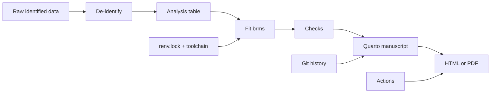
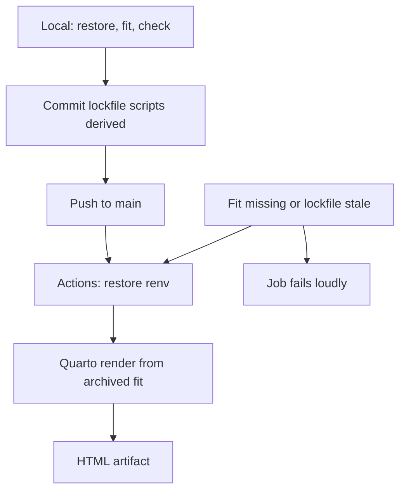

# Reproducible Bayesian Research Pipelines (Quarto + renv + Git)

## Opening

A posterior that cannot be rebuilt is a rumor with credible intervals. Neurology is hard on rumors: the fellow who fitted last year’s ICH model has graduated, `brms` has moved a minor version, and the CSV on the shared drive is named `final_final_v3.csv`. Reproducibility is not aesthetics. It is how a prior survives a personnel change.

**Learning objectives**

- Lay out a small Bayesian project so that a stranger can rebuild the posterior in one sitting.
- Pin R packages with `renv`, pin the Stan toolchain, and pin the seed, and know which of those three is insufficient alone.
- Archive a `brms` fit and reload it without silently refitting.
- Write a Quarto manuscript that is the paper, not a screenshot of a paper.
- De-identify a stroke registry well enough to share an analysis table, and know what you still cannot share.
- Sketch a GitHub Actions job that rebuilds the manuscript when the lockfile is honest.

### Clinical vignette

You submitted a teaching analysis: a hierarchical logistic model of 90-day mRS 0–2 after EVT across eight hospitals, \(N = 640\). A reviewer asks for “the code.” What you have is an RStudio project on a laptop, a model fitted at 01:14 last Thursday, and a Word file with numbers pasted from the Console. The `brms` object is gone. The reviewer also asks whether hospital 3 can be identified from the random-effect table. You have fourteen days.

List the directory tree you wish you had started with, and the first command you will run this afternoon.

---

## What “reproducible” means here

Three nested claims, in increasing strength.

1. **You** can rebuild the numbers from the raw file on this machine next month.
2. **A stranger** can rebuild the numbers from a repository and a lockfile on a different machine next year.
3. **A stranger** can rebuild the numbers *and* see that the decision, not just the coefficient, is the same.

This chapter aims at (2) and gestures at (3). Claim (1) is what most laboratories already fail.



The clinical analogue is a discharge summary another neurologist can act on. A notebook only you can run is a handwritten note in a personal cipher.

---

## Project structure

A teaching layout that has survived contact with residents:

```
evt-mrs-2026/
  README.md
  evt-mrs-2026.Rproj
  renv.lock
  renv/
  _quarto.yml
  data/
    raw/                 # never push; gitignored
    derived/
      analysis.csv       # de-identified
      codebook.md
  R/
    00-renv-restore.R
    01-deidentify.R
    02-fit-model.R
    03-checks.R
    04-figures.R
  fits/
    hierarchical_mrs.rds
    hierarchical_mrs_session.txt
  reports/
    manuscript.qmd
    supplement.qmd
  .github/
    workflows/render.yml
  .gitignore
```

Rules that are not decorative:

- `data/raw/` is in `.gitignore`. Always. PHI does not belong to GitHub, even a private repository, unless your institution has already said it does.
- Derived analysis tables contain no dates of birth, no ZIP codes, no exact event timestamps, no hospital names.
- Fits live in `fits/` as `.rds` plus a sidecar text file that records `sessionInfo()`, `cmdstanr::cmdstan_version()`, the seed, and the wall time.
- One script, one job. `02-fit-model.R` does not also make figures.

| Path | What it is allowed to contain | What it is not |
|---|---|---|
| `data/raw/` | Identified extracts, local only | Git history, Slack, email |
| `data/derived/` | De-identified analysis table, codebook | Free-text notes, MRNs |
| `R/` | Numbered scripts, functions | Pasted Console archaeology |
| `fits/` | Serialized `brmsfit`, session sidecar | The only copy of the model |
| `reports/` | Quarto sources | A Word file with pasted numbers |
| `renv.lock` | Exact package versions | A README that says “use brms” |

!!! warning "Common Pitfall"
    A single 2,400-line `analysis.R` that reads, cleans, fits, plots, and writes the paper will reproduce *if it runs*. It will not be reviewable, and it will not be reusable when the next registrar wants only the de-identification step. Split by job. Orchestrate with a short `make` or a top-level `run-all.R`.

---

## Pinning the world: renv, toolchain, seed

### renv

From a clean project:

```r
# R/00-renv-restore.R
# Run once on a new machine. Teaching stub.

if (!requireNamespace("renv", quietly = TRUE)) {
  install.packages("renv")
}
renv::restore()   # reads renv.lock, installs recorded versions
```

`renv::init()` on the original machine, `renv::snapshot()` after any intentional package change, commit `renv.lock`. Do not snapshot after a panicked `install.packages("brms")` at 01:14 unless you intend that version to be the record.

`renv.lock` is not a Dockerfile. It does not pin the C++ compiler, the BLAS, or the OS. It pins R packages. That is necessary and not sufficient.

### cmdstanr and the Stan toolchain

`brms` talks to Stan. The backend that actually samples should be recorded.

```r
# Record the toolchain beside the fit. Do not skip.
writeLines(
  c(
    paste("date:", Sys.time()),
    paste("R:", getRversion()),
    paste("cmdstan:", cmdstanr::cmdstan_version()),
    paste("brms:", utils::packageVersion("brms")),
    paste("seed:", 20260818)
  ),
  con = "fits/hierarchical_mrs_session.txt"
)
```

If you use `rstan` instead of `cmdstanr`, say so, and accept that `rstan` versions track R and Stan more awkwardly. New projects should prefer `cmdstanr`. Appendix A covers the install failures.

### Seeds

Set a seed once, at the top of `02-fit-model.R`, and pass the same integer to `brm(..., seed = ...)`. `set.seed()` alone does not control Stan’s RNG. `brm`’s `seed` argument does. If you refit with a different `brms` minor version, bit-identical draws are not promised even with the same seed. The *decision* should be stable; the twelfth posterior draw need not be.

!!! tip "Clinical Pearl"
    Stability of the *sentence* is the reproducibility criterion that matters clinically. If a new `brms` version moves \(P(\delta > 0)\) from 0.81 to 0.83, the conversation does not change. If it moves it from 0.81 to 0.48, your result was never a result. It was a software weather report.

---

## Archiving a brms fit

A `brmsfit` is an R list with Stan draws, the data, the formula, the priors, and enough metadata to predict. Treat it as a lab instrument reading.

```r
# R/02-fit-model.R  -- minimal analysis pipeline
# Hierarchical logistic model of mRS 0-2 after EVT.
# Teaching specification. Seed fixed. Not a clinical calculator.

library(brms)
library(readr)
library(dplyr)

set.seed(20260818)

d <- read_csv("data/derived/analysis.csv", show_col_types = FALSE)
# expected columns: y_ind (0/1), nihss, age_c, aspects, hospital (factor)

priors <- c(
  prior(normal(0, 1.5), class = Intercept),
  prior(normal(0, 0.5), class = b),
  prior(student_t(3, 0, 0.5), class = sd)   # hospital tau
)

fit <- brm(
  y_ind ~ nihss + age_c + aspects + (1 | hospital),
  data    = d,
  family  = bernoulli(link = "logit"),
  prior   = priors,
  chains  = 4, iter = 4000, warmup = 1000,
  seed    = 20260818,
  control = list(adapt_delta = 0.95),
  file       = "fits/hierarchical_mrs",  # writes .rds; skips refit if present
  file_refit = "on_change"
)

# Sidecar
writeLines(
  c(
    paste("date:", Sys.time()),
    paste("R:", getRversion()),
    paste("brms:", utils::packageVersion("brms")),
    paste("cmdstan:", tryCatch(cmdstanr::cmdstan_version(),
                               error = function(e) "not used")),
    paste("n:", nrow(d)),
    paste("seed: 20260818"),
    paste("formula:", deparse(fit$formula$formula))
  ),
  "fits/hierarchical_mrs_session.txt"
)

saveRDS(fit, "fits/hierarchical_mrs.rds")
```

`file =` plus `file_refit = "on_change"` is the difference between a pipeline and a ritual. Quarto chunks that call this script should *read* the `.rds`, not refit inside the manuscript, unless the dataset is tiny and you have accepted the compile tax.

To reload:

```r
fit <- readRDS("fits/hierarchical_mrs.rds")
# Confirm you did not load a different model by accident
stopifnot(identical(deparse(fit$formula$formula),
                    "y_ind ~ nihss + age_c + aspects + (1 | hospital)"))
```

Large fits (tens of thousands of draws, many parameters) belong in Git LFS or in an institutional archive, not in a raw `git add`. Record the SHA256 of the `.rds` in the sidecar if the binary lives elsewhere.

---

## Quarto is the paper

`reports/manuscript.qmd` should compile from the derived table and the archived fit to the numbers in the abstract. If you paste a posterior mean into the YAML abstract by hand, you have reintroduced the Word-file failure mode.

```markdown
---
title: "Hospital variation in independence after EVT"
author: "Teaching analysis"
format: html
execute:
  echo: false
  warning: false
---

```

Inside the body, read, do not refit:

```r
# reports/manuscript.qmd, a computational chunk (sketch)
# echo: false in YAML. Numbers come from the archived fit.

fit <- readRDS("../fits/hierarchical_mrs.rds")
post <- posterior::as_draws_df(fit)
tau  <- post$sd_hospital__Intercept
# Then inline: the hospital SD had posterior median
# `r sprintf('%.2f', median(tau))`.
```

`_quarto.yml` can render both the manuscript and a supplement that *does* show the code, the priors, and the `pp_check` figures. The clinical paper hides the scaffolding. The supplement is the scaffolding. Both are generated from the same fit.

!!! example "R Deep Dive"
    A `run-all.R` that a stranger can execute after `renv::restore()` is the whole pipeline in one file. Fit only if the archive is missing; always re-run checks.

```r
# run-all.R — teaching orchestrator. Seed lives in 02-fit-model.R.
# After renv::restore(), this should rebuild the HTML from derived data.

source("R/00-renv-restore.R")
if (!file.exists("data/derived/analysis.csv")) {
  stop("No derived table. Run R/01-deidentify.R on local raw data.")
}
source("R/02-fit-model.R")   # no-ops if fits/hierarchical_mrs.rds is current
source("R/03-checks.R")
if (requireNamespace("quarto", quietly = TRUE)) {
  quarto::quarto_render("reports/manuscript.qmd")
}
```


!!! note "Mathematical Detail"
    Inline numeric interpolation is a reproducibility feature, not a typesetting trick. The claim \(\widehat{\tau} = 0.41\) in the text is a function of the draws. If the draws change, the text must change. Quarto enforces that. A camera-ready Word file does not.

---

## Git, and a GitHub Actions sketch

Commit small, commit often, commit the lockfile, never commit `data/raw/`. `.gitignore` at minimum:

```
data/raw/
.Rproj.user
.Rhistory
*.html
/.quarto/
renv/library/
```

You *do* commit `renv.lock`, `R/`, `reports/*.qmd`, `data/derived/analysis.csv` if it is truly de-identified, and the sidecar text. You commit `fits/*.rds` only when the file is small and the institution allows it.

A minimal Actions workflow that rebuilds the HTML when the lockfile and scripts are honest:

```yaml
# .github/workflows/render.yml
# Sketch. Will fail until renv.lock is complete and data/derived is public.
name: render
on:
  push:
    branches: [main]
jobs:
  quarto:
    runs-on: ubuntu-latest
    steps:
      - uses: actions/checkout@v4
      - uses: r-lib/actions/setup-r@v2
        with:
          r-version: "4.4.1"
      - uses: r-lib/actions/setup-renv@v2
      - uses: quarto-dev/quarto-actions/setup@v2
      - name: restore and render
        run: |
          Rscript -e 'renv::restore()'
          quarto render reports/manuscript.qmd
      - uses: actions/upload-artifact@v4
        with:
          name: manuscript
          path: reports/manuscript.html
```

This sketch does **not** install CmdStan. A full Bayesian CI job is slower and more brittle; many laboratories run the sampler locally, commit the `.rds`, and let Actions only *read* the fit and render. That is an honest compromise. A CI job that silently skips the model and renders last week’s cached numbers is not.



---

## Data de-identification

A stroke registry is a re-identification hazard. Dates, ages over 89, rare procedure combinations, and hospital-level random effects can point back to a person or a site.

Teaching rules for the derived table:

- Replace MRN with a random study ID generated *once* and stored in `data/raw/` only.
- Age in completed years, top-coded at 89.
- Event time as delay from last known well, in minutes, not as a clock time.
- Dates as year, or as days from an arbitrary origin that is not 1 January.
- Drop free text. “Lives with sister in [small town]” is an identifier.
- Hospital labels become `H1`…`H8` in a random order that is *not* geographic. The key lives in `data/raw/`.
- Do not release a random-effect table that can be matched to publicly reported hospital volumes.

The reviewer who asked whether hospital 3 is identifiable is asking a real question. If H3 has \(n = 11\) and a wildly different intercept, and the region has one critical-access hospital that does eleven EVTs a year, you have published their outcome. Shrinkage helps but does not anonymize. Consider reporting only the posterior of \(\tau\) and a caterpillar plot without labels in the main paper.

!!! warning "Common Pitfall"
    “We removed names” is not de-identification. HIPAA’s safe-harbor list is a starting point, not a blessing, and this book is not legal advice. When in doubt, share the prior, the formula, the posterior summaries, and a simulated dataset with the same column types.

---

### For the biostatistician / methodologist

Three technical points that separate a pipeline from a folder of scripts.

**Bit-reproducibility is the wrong target for MCMC.** Even with a fixed seed, compiler flags and `cmdstan` point releases change the stream. Target *decision-reproducibility*: the same action under the same utility. Encode that as a test. After loading the archived fit and a fresh refit, `stopifnot(abs(mean(delta_old > 0) - mean(delta_new > 0)) < 0.02)`. If that test fails, the manuscript does not render.

**The unit of sharing is the posterior, not the script.** A well-written `02-fit-model.R` that cannot run because the raw file is missing is less useful than `fits/hierarchical_mrs.rds` plus a simulated-data script that regenerates a plausible table. `brms::make_stancode()` and `brms::make_standata()` belong in the supplement so a Stan user who refuses `brms` can still rebuild.

**Provenance for the prior.** The prior is part of the likelihood story and part of the human story. Record *who* elicited it and *when*, in the sidecar or in `codebook.md`. A `normal(0, 0.5)` that was a default is a different scientific object from a `normal(0, 0.5)` that three attendings produced with the Appendix B worksheet.

---

## Worked solution to the opening vignette

The tree you wish you had is the tree printed above. This afternoon’s first command is not a refit. It is an inventory:

1. Copy the laptop project into `evt-mrs-2026/` with that layout. Put the identified extract in `data/raw/` and add that path to `.gitignore` *before* `git init`.
2. Rebuild a de-identified `data/derived/analysis.csv` with `R/01-deidentify.R` (study IDs, top-coded age, relabeled hospitals, no timestamps).
3. Recreate `02-fit-model.R` from the Word file’s model description and from memory of the priors. You will not recover last Thursday’s draws. You will recover the *model*. Set `seed = 20260818`.
4. Fit once, archive `fits/hierarchical_mrs.rds` and the sidecar. Confirm \(\widehat{R}\) and the hospital-\(\tau\) posterior are close enough to the Word numbers that the sentence survives. If they are not, the Word numbers were never a result.
5. Move every reported number into `reports/manuscript.qmd` as inline code over the archived fit.
6. `renv::init()`; `renv::snapshot()`; commit lockfile, scripts, derived table, sidecar. Do not commit raw data. For the reviewer’s hospital-3 question: drop labels from the caterpillar plot; report \(\tau\); do not ship a volume table that matches H3 to a known site.

Fourteen days is enough if you stop trying to resurrect the 01:14 object and start trying to make the next object immortal.

---

## Exercises

**20.1.** Write a `.gitignore` for a project that also uses `cmdstanr`’s default `.cmdstan/` directory and writes `*.stan` files into `fits/`. Which of those should be committed?

**20.2.** A colleague commits `data/raw/evt_extract.csv` to a private GitHub repository “because it is private.” Give three reasons this is still the wrong action.

**20.3.** The archived `brmsfit` is 1.8 GB. Propose a sharing strategy that still lets a stranger rebuild the manuscript’s inline numbers.

**20.4.** Add one test to `R/03-checks.R` that would have caught a silent column-rename (`nihss` became `NIHSS`) before the manuscript rendered a nonsense intercept.

**20.5.** Convert the Actions sketch so that it *does not* restore a Stan toolchain and *does* fail if `fits/hierarchical_mrs.rds` is absent. Why is that the better default for most laboratories?

**20.6.** Using only the codebook, a stranger should be able to say what `age_c` is. Write the codebook entry.

---

## Further reading

- Wickham H, Çetinkaya-Rundel M, Grolemund G. *R for Data Science*. 2nd ed. O’Reilly; 2023. Project-oriented workflows; tidy derived tables.
- Ushey K, Wickham H. *renv: Project Environments for R*. https://rstudio.github.io/renv/
- Allaire JJ, et al. *Quarto*. https://quarto.org. Computational manuscripts.
- Gabry J, Češnovar R, Johnson A. *cmdstanr*. https://mc-stan.org/cmdstanr/
- Bürkner P-C. brms: An R package for Bayesian multilevel models using Stan. *J Stat Softw*. 2017;80(1):1–28.
- Wilson G, Bryan J, Cranston K, Kitzes J, Nederbragt L, Teal TK. Good enough practices in scientific computing. *PLOS Comput Biol*. 2017;13(6):e1005510.
- U.S. Department of Health and Human Services. Guidance Regarding Methods for De-identification of Protected Health Information in Accordance with the HIPAA Privacy Rule. Safe-harbor as a starting point, not a blessing.
- Goodman SN, Fanelli D, Ioannidis JPA. What does research reproducibility mean? *Sci Transl Med*. 2016;8:341ps12.

!!! success "Key Takeaway"
    Pin the packages, pin the toolchain, pin the seed, and still judge success by whether the sentence survives a refit on a stranger’s machine. Keep raw PHI off Git. Let Quarto own every number in the manuscript. Archive the `brmsfit` with a sidecar that says what world produced it. A pipeline is a clinical object: another neurologist should be able to discharge the analysis without calling you.
