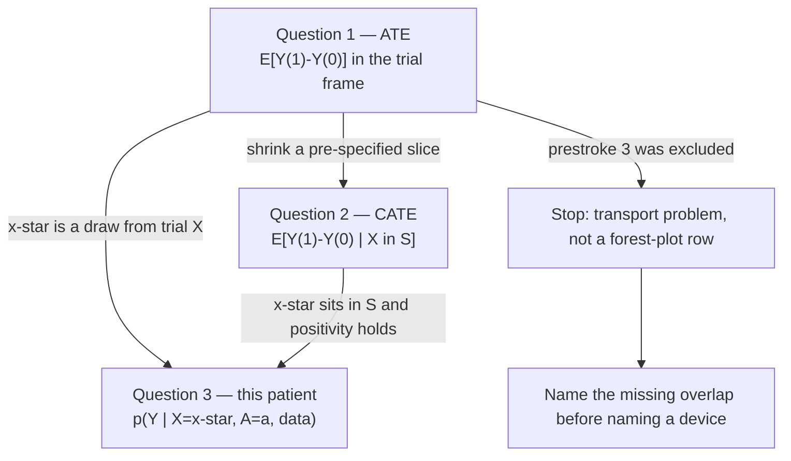
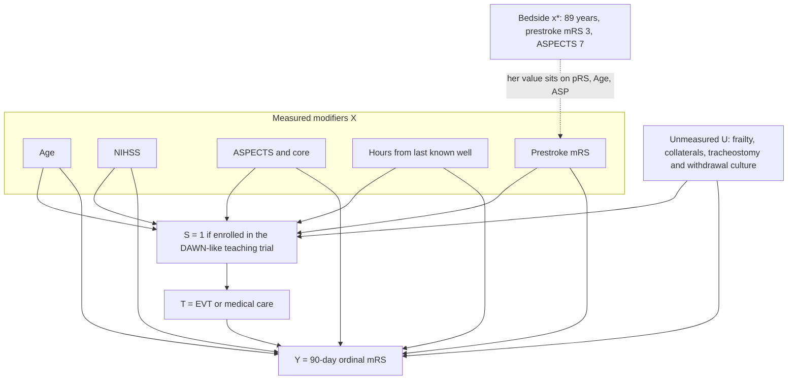

# Transporting trial evidence to this patient: effect modification, shrinkage, and the individual posterior

## Opening

The whiteboard number is an average treatment effect, or a close cousin of one, computed in a sampling frame that rejected prestroke disability and barely saw her age. The daughter is asking what will happen to *her* mother. Those are different functionals of different distributions. Pretending they are the same object is how “the trial was positive” becomes a transfer order.

## Clinical vignette

A teaching posterior for a DAWN-eligible patient sits on the workroom whiteboard: late window, clinical-core mismatch, prestroke modified Rankin score of 0 or 1, large-vessel occlusion, a large shift of the 90-day mRS toward better states with endovascular therapy. The fellow points at it, then at the bed. “She is DAWN-positive. We take her.”

She is not. She is 89. Prestroke mRS is 3: cane, help to bathe, still recognizes faces and eats independently. ASPECTS is 7. NIHSS is 18. Last known well was at dinner; it is now 02:10. CTA shows a left M1 cutoff. CT perfusion, for teaching, shows a small estimated core and a large penumbra. The photograph that made the trial famous was not taken of a woman who already lived at 3.

Write, before any model: (1) what the whiteboard posterior is actually the posterior *of*; (2) which of her covariates are effect modifiers you believed yesterday, and which you are tempted to discover tonight; (3) whether anyone like her was randomized; (4) the sentence you will not say even if an interaction plot later looks dramatic.

## Learning objectives

After working this chapter you should be able to:

- Name three nested questions — the average treatment effect, a subgroup contrast, and this patient’s posterior predictive — and say which one a family is asking.
- Separate effect modifiers you would have written into a protocol on Monday from interactions found after staring at a forest plot.
- Shrink noisy subgroup contrasts toward the average effect with a hierarchical prior, and say when that shrinkage is a feature rather than a political act.
- Standardize a fitted outcome model to a new mix of patients (g-computation) and contrast that average with a single-patient prediction.
- Recite consistency, positivity, and exchangeability in stroke English, and recognize when prestroke mRS 3 has already broken positivity.
- Refuse the sentences that turn an interaction plot into a false individual prognosis.

## Three questions: the ATE, the subgroup, and this patient's posterior predictive

Every late-window EVT conversation collapses three questions into one adjective. Separate them on paper or you will transport the wrong object.

**Question 1 — the average treatment effect (ATE).** In the trial’s sampling frame, what is the expected contrast in 90-day mRS if everyone is assigned EVT versus everyone is assigned medical care? Write \(\mathbb{E}[Y(1) - Y(0)]\), or, better for an ordinal outcome, a small set of contrasts such as \(\mathbb{E}[\mathbf{1}(Y(1) \le 2) - \mathbf{1}(Y(0) \le 2)]\) and the corresponding contrasts for death and for return to prestroke state. This is what a well-designed individually randomized trial estimates, in the people it enrolled. “DAWN was positive” is a slogan pointing at Question 1.

**Question 2 — a subgroup contrast, or CATE.** In a slice of that frame defined by a covariate — age \(\ge 80\), ASPECTS 7, right-hemisphere occlusion — what is \(\mathbb{E}[Y(1) - Y(0) \mid X \in \mathcal{S}]\)? This is still an *average*, just a smaller one. It is not her. A forest plot of eight pre-specified subgroups is eight attempts at Question 2. An unadjusted hunt through twenty slices is eight attempts plus twelve acts of fiction.

**Question 3 — this patient’s posterior predictive.** Given her covariate vector \(x^\star\) — 89 years, prestroke mRS 3, ASPECTS 7, NIHSS 18, left M1, late clock — and given the data and a model, what is

\[
p(Y \mid X = x^\star,\ A = a,\ \text{data})
= \int p(Y \mid X = x^\star,\ A = a,\ \theta)\, p(\theta \mid \text{data})\, d\theta
\]

under \(a =\) EVT and under \(a =\) medical care? This is the object Chapter 16 turns into frequencies for a daughter. It is not a p-value. It is not a subgroup odds ratio. It is a pair of distributions over an ordinal scale, already integrating parameter uncertainty.

| Question | Formal object | Who it is about | What usually impersonates it |
|---|---|---|---|
| 1. ATE | \(\mathbb{E}[Y(1)-Y(0)]\) in the trial frame | The enrolled population | “The trial was positive.” |
| 2. Subgroup CATE | \(\mathbb{E}[Y(1)-Y(0) \mid X \in \mathcal{S}]\) | A slice of that population | A forest-plot row, often unshrunk |
| 3. This patient | \(p(Y \mid X=x^\star, A=a, \text{data})\) | The woman in the bed | “She is DAWN-eligible.” |

The fellow’s sentence answered Question 1, borrowed the eligibility language of Question 2, and offered the result to the family as if it were Question 3. The transport problem is the move from 1 (or 2) to 3 when \(x^\star\) is not a draw from the trial’s \(X\).



A **teaching** contrast, invented so the arithmetic can be seen and *not* copied from any late-window paper: in a DAWN-like teaching cohort the modeled probability of mRS 0–2 at 90 days is 0.44 with EVT and 0.18 without. That 26-point difference is a Question-1 number. It is already the wrong endpoint for a woman whose prestroke state is 3, because mRS 0–2 is a state she did not occupy last week. Even if you switch the endpoint to “return to prestroke 3 or better,” you still do not have *her* number. You have an average among people who were allowed into the cohort.

!!! tip "Clinical Pearl"
    If the trial’s case-report form would have ticked “exclude” at prestroke mRS 3, you do not have a subgroup analysis waiting in a supplement. You have a transport problem, and positivity may already have failed. Name that before you name a device.

## Effect modifiers you actually believe versus fishing

An effect modifier is a covariate for which the contrast \(Y(1)-Y(0)\) changes with \(X\). That is a causal claim about treatment-effect heterogeneity, not a claim that \(X\) predicts outcome. Age predicts 90-day mRS under either action. Age is an effect modifier of EVT only if the *contrast* between actions changes with age.

You do not learn that distinction by starring every row of a forest plot. You learn it by writing, on Monday, the short list of modifiers your stroke service actually believes, for reasons that would survive a null interaction.

**Modifiers a stroke attending already believed, before seeing tonight’s plot.** Core and ASPECTS: a larger established infarct leaves less penumbra; this is why late-window trials gated on mismatch, and why ASPECTS 7 is nearer the edge than ASPECTS 10. Clock, given imaging: time is a modifier when the image is crude and is partly already in the image when the core is reliable. Prestroke disability: not only a change of utility (Chapter 16) but a change of what the outcome *is* — a shift from 4 to 3 is not a shift from 2 to 1. Age: partly a marker of the previous two, partly of hemorrhage, withdrawal culture, and tortuosity; treat it as continuous, because an “age \(\ge 80\)” box erases 80 versus 89. NIHSS and occlusion site: a left M1 with NIHSS 18 is not an NIHSS 8 M2.

**Modifiers you are tempted to discover at 02:10.** Laterality, after the last right-hemisphere case did poorly. Every laboratory cut as a treatment interaction rather than a prognostic adjustment. Weekend as a modifier of the device rather than of door-to-puncture. Hour-by-hour clock bins in a sample that has twelve patients after hour 20. “Women over 85 with ASPECTS 7 and atrial fibrillation,” which is not a modifier. It is a description of the bed.

The test is chronological. Would you have written the interaction into the statistical analysis plan last year, with a skeptical prior, because the biology demanded it? Then it belongs in the model. Did it become interesting after a software package printed twenty interaction p-values? Then it is a fishing expedition wearing a forest plot.

!!! warning "Common Pitfall"
    “No significant interaction” is not evidence of a homogeneous effect. It is a statement that the data could not distinguish the interaction you happened to test from zero, at a threshold nobody should be using for this decision. A wide posterior on an age interaction that includes both harm and large benefit is *uncertainty*, not reassurance that the ATE applies at 89.

Pre-specification is not a ritual for journals. It is how you keep Question 2 from eating the prior you need for Question 3. Every extra interaction is a bid to spend residual information on a slope instead of on the intercept that the next patient still needs. With a teaching cohort of a few hundred ordinal outcomes you can defend three or four pre-specified treatment interactions. You cannot defend fifteen.

A second, quieter error is to treat a strong *prognostic* factor as if it were automatically a modifier. NIHSS will dominate a main-effects model of mRS. That does not tell you whether EVT’s contrast is larger at NIHSS 20 than at NIHSS 10. Risk-based heterogeneity — people at intermediate untreated risk having more absolute gain — is a reason to *look*, with a model that lets the contrast vary smoothly with predicted untreated outcome. It is not a license to slice the trial at every NIHSS point and declare a sweet spot.

## Hierarchical shrinkage of subgroups

Suppose, as a **teaching** partition and not as a protocol, you cut the teaching cohort into four age bands and also isolate the handful of patients with prestroke mRS 3. Separate logistics (or separate ordinal models) in each slice are *no pooling*. The slice with twelve patients and a noisy odds ratio of 1.1 is treated as a fact. The slice with ninety patients and an odds ratio of 2.4 is treated as a fact of equal dignity. A journalist, or a fellow, will quote the 1.1.

Complete pooling — one EVT coefficient, no interactions — is the opposite failure. It announces that the contrast does not move with age or prestroke state, which is exactly the claim you do not believe about the woman in the bed.

Partial pooling is the same compromise Chapter 6 made for hospitals, now applied to subgroup contrasts. Write the treatment effect in slice \(j\) as

\[
\beta_j \sim \mathrm{Normal}(\mu_\beta,\ \tau_\beta^2).
\]

\(\mu_\beta\) is the ATE on the model’s scale. \(\tau_\beta\) is how much genuine modification you are willing to believe exists across the slices you pre-specified. The posterior mean of \(\beta_j\) is pulled toward \(\mu_\beta\) with a force that grows as \(n_j\) shrinks and as \(\tau_\beta\) shrinks. The twelve-patient prestroke-mRS-3 slice moves almost to the average. The ninety-patient late-sixties slice barely moves.

In a model with continuous modifiers you do not need literal slices. A skeptical prior on an interaction coefficient *is* shrinkage toward no modification:

\[
\beta_{\text{EVT} \times \text{age}} \sim \mathrm{Normal}(0,\ 0.25^2)
\]

on a logit or cumulative-logit scale says that a decade of age is very unlikely to flip a large EVT benefit into harm, and still allows the contrast to tilt. That is a scientific claim. Defend it as one. A \(\mathrm{Normal}(0,\ 10^2)\) prior on the same interaction is not “letting the data speak.” It is a prior that treats an order-of-magnitude change in the odds ratio per decade as ordinary.

When should you *refuse* to shrink a slice toward the ATE? When the slice is not a noisy version of the same question. Prestroke mRS 3 is the live example. If the trial’s sampling frame contained almost no such patients, the issue is not that \(\beta_{j}\) is noisy. The issue is that \(\beta_{j}\) is barely identified, and shrinking it toward a \(\mu_\beta\) estimated from mRS 0–1 patients is a decision to *export* the ATE into a phenotype the trial declined to study. Shrinkage cannot manufacture overlap. It can only keep you from worshipping a cell of size twelve.

!!! note "Mathematical Detail"
    In the Gaussian sketch the shrunk slice effect is \(\hat\beta_j \approx w_j \hat\beta_j^{\text{local}} + (1-w_j)\mu_\beta\) with \(w_j = v_j^{-1} / (v_j^{-1} + \tau_\beta^{-2})\), where \(v_j\) is the local sampling variance. Logistic and cumulative-logit analogues have the same shape. As \(v_j \to \infty\) (tiny \(n_j\)), \(\hat\beta_j \to \mu_\beta\). As \(\tau_\beta \to 0\), every slice collapses to the ATE. Estimating \(\tau_\beta\) from four slices is barely possible; the prior on \(\tau_\beta\) is then part of the result, exactly as the prior on a meta-analytic \(\tau\) was in Chapter 13. Report both.

A practical architecture in `brms` is therefore not eight separate models. It is one ordinal model, main effects for the prognostic factors you believe, treatment, and a short list of pre-specified treatment interactions with skeptical priors. If you truly have many exchangeable slices — sites, or a long list of pre-committed strata — a term such as `(0 + evt | stratum)` puts a hierarchical prior on the stratum-specific treatment increments and lets \(\tau_\beta\) be shared. Do not reach for that term to rescue an interaction you found at 01:50.

## G-computation and posterior standardization

Fitting the outcome model is not the last step. The model’s coefficients live on a cumulative-logit scale and are mixed with interactions. Nobody in the room wants \(\beta_{\text{EVT} \times \text{age}}\). They want a contrast in probability units, for a population or for a person.

G-computation (posterior standardization) is the move that produces those contrasts from a fitted outcome model.

1. Fit \(p(Y \mid X, A, \theta)\) — here, a cumulative logit for 90-day mRS.
2. For each posterior draw \(\theta^{(s)}\), and for each person \(i\) in a *target* sample, compute \(\hat p_i^{(s)}(a) = P(Y \in \mathcal{A} \mid X_i,\ A=a,\ \theta^{(s)})\) under both actions, for the sets \(\mathcal{A}\) you care about (death; return to prestroke state; mRS \(\le 3\)).
3. Average over people: \(\hat\Delta^{(s)} = N^{-1}\sum_i \bigl(\hat p_i^{(s)}(1) - \hat p_i^{(s)}(0)\bigr)\).
4. The collection \(\{\hat\Delta^{(s)}\}\) is the posterior of the standardized contrast in the target mix.

If the target sample is the trial’s own patients, you have recovered a model-based ATE (Question 1). If the target sample is last year’s admissions at *this* hospital — older, more prestroke disability, worse ASPECTS — you have transported the contrast to a new mix, *provided* the transport assumptions below hold. If the target “sample” is one row, \(x^\star\), you have Question 3 and you should stop averaging.

The distinction matters because a hospital can have a smaller standardized effect than the trial without any single coefficient being “nonsignificant.” The mix moved.

A **teaching** four-row world, invented so the weighted sums can be done by hand. “Good” here means return to prestroke function or better — already a more honest endpoint for mixed baselines than mRS 0–2.

| Phenotype (teaching) | P(good \| EVT) | P(good \| medical) | Risk difference | Weight in trial | Weight at this hospital |
|---|---:|---:|---:|---:|---:|
| 70 years, prestroke 0, ASPECTS 9 | 0.50 | 0.22 | 0.28 | 0.40 | 0.15 |
| 80 years, prestroke 1, ASPECTS 8 | 0.36 | 0.16 | 0.20 | 0.35 | 0.25 |
| 85 years, prestroke 1, ASPECTS 7 | 0.24 | 0.12 | 0.12 | 0.20 | 0.35 |
| 89 years, prestroke 3, ASPECTS 7 | 0.11 | 0.07 | 0.04 | 0.05 | 0.25 |

The trial ATE is the trial-weighted sum of the risk differences:

\[
0.40\times 0.28 + 0.35\times 0.20 + 0.20\times 0.12 + 0.05\times 0.04 = 0.208.
\]

The hospital-standardized effect is

\[
0.15\times 0.28 + 0.25\times 0.20 + 0.35\times 0.12 + 0.25\times 0.04 = 0.144.
\]

This patient’s contrast is the last row: 0.04. All three numbers are **teaching** numbers. None is a DAWN cell count. The arithmetic is the lesson. The 4-row trial-weighted ATE of 0.21 (return-to-prestroke) and her 0.04 can both be true of the same surface. The 26-point mRS 0–2 contrast is a different endpoint and is already the wrong one for prestroke 3. Quoting the 0.21 at 02:10 is a standardization to the wrong mix. Quoting the 0.14 is a standardization to the hospital, which is closer and still not her. Question 3 does not average.

Do the average on the *probability* scale, from posterior draws, not by plugging posterior-mean coefficients into the inverse link. The nonlinear link makes those operations differ, and the second hides uncertainty. And name the mix. Standardizing to “all 89-year-olds with prestroke mRS 3 in the county” is a sentence about a population. Predicting for the woman in the bed is a sentence about a person. They license different words to a daughter.

!!! warning "Common Pitfall"
    A fitted interaction plotted as a smooth CATE-versus-age curve is still Question 2 along a line. The point on that curve at age 89 is not her posterior predictive. It has marginalized the rest of \(X\) in whatever way the plotter chose — often, at the sample means of NIHSS and ASPECTS, which she does not have, and at prestroke mRS 0, which she does not have. Read the footnote of the plot before you read the plot.

## Transport assumptions in stroke English

Moving a contrast from a trial frame to \(x^\star\) is not a software option. It is a set of assumptions. The causal literature names them consistency, positivity, and exchangeability (conditional, and here with respect to selection as well as treatment). Stroke English is plainer.



The diagram is a selection DAG, not a slogan. Arrows from \(X\) and from \(U\) into both selection \(S\) and outcome \(Y\) are the transport problem. The arrow \(S \to T\) is the gate: only the enrolled are randomized. There is no arrow from \(X\) into \(T\) inside the trial, because randomization, if it happened, cut that path. The dashed line from the bedside patient into prestroke mRS is the warning: her value of a modifier that also determined enrollment may have no counterpart among the randomized.

**Consistency, in stroke English.** The EVT in the likelihood has to be the EVT you are about to offer. Trial EVT was a selected-center thrombectomy with a device generation, an anesthesia style, and a culture about tracheostomy. At 02:10 you are offering a transfer, whoever is on call, and a family that has already said “vegetable.” If those are not the same operation, the trial’s \(Y(1)\) is not the \(Y(1)\) you are about to generate. The outcome can fail consistency too: transporting an mRS 0–2 contrast and speaking it as return-to-3 changes \(Y\) in the sentence without changing \(Y\) in the model.

**Positivity, in stroke English.** People like her must have had a chance of both actions *in the data you are using*. Treatment positivity: inside the trial, given \(X\), both arms occurred — randomization usually buys this, except in empty cells you created by slicing. Selection positivity: people with her \(X\) must have been allowed in. DAWN-like protocols required prestroke mRS 0–1. Hers is 3. Enrollment at \(x^\star\) is zero by design. There is no empirical CATE for prestroke mRS 3 in that likelihood. There is an extrapolation, which is a prior wearing a model’s clothes.

ASPECTS 7 is softer: if the teaching trial enrolled across 7–10 she is on that margin; if almost everyone had ASPECTS 9–10, she is a thin tail and the prediction is prior-dominated even if software returns a number. Age 89 is usually the thin tail rather than a hard exclusion. A trial that enrolled “up to 90” with a median of 70 permitted 89-year-olds. Permission is not information.

**Exchangeability, in stroke English.** After you condition on measured modifiers, selection is not still entangled with outcome through something unmeasured. The open fork \(U \to S\), \(U \to Y\) is the failure. \(U\) is physiologic reserve, collaterals beyond the perfusion summary, appetite for a feeding tube, the unmeasured reasons a frail 89-year-old was or was not offered randomization. Randomization buys \(Y(a) \perp T \mid S=1\). It does not buy \(Y(a) \perp S \mid X\). That last independence is a hope about \(U\). You cannot test it with the trial file alone.

!!! tip "Clinical Pearl"
    When you cannot name a patient in the trial file who looks like her on the modifiers that determined enrollment, do not say “based on DAWN.” Say “we are extrapolating past the trial’s sampling frame, and the uncertainty is wider than the whiteboard interval.” That sentence is the transport assumption made audible.

A fourth word, used more by epidemiologists than by night-float neurologists, is **generalizability versus transportability**. Generalizing is reweighting a trial to a new mix of patients who would have been *eligible*. Transporting is moving to a population that would not have been eligible — her, tonight. Software will do both if you ask. Only the second requires you to invent a response surface off the support of \(X\). Be honest about which one you are doing. The fellow’s “DAWN-positive” claimed generalizability. The eligibility form already forbade it.

!!! info "For the biostatistician"
    The transported mean contrast in a target \(P^\star\) is the g-formula \(\mathbb{E}_{P^\star}\bigl[\mathbb{E}(Y \mid A=1, X, S=1) - \mathbb{E}(Y \mid A=0, X, S=1)\bigr]\), equal to \(\mathbb{E}_{P^\star}[Y(1)-Y(0)]\) under consistency, positivity of \(A\) given \(X\) in the trial, positivity of \(S\) on the support of \(P^\star\), and \(Y(a) \perp S \mid X\). If \(P^\star\) puts mass where \(P(S=1 \mid X)=0\), the inner expectation is not identified; a parametric model will still return a number by extending a surface. Report that as a prior-and-model extrapolation, or refuse it. Hierarchical shrinkage of interactions is a prior on the *shape* of the surface, not a repair for empty support. Inverse-odds-of-selection weights need overlap; they do not apply at \(x^\star\) with \(P(S=1 \mid x^\star)=0\). The bedside object is the posterior predictive at \(x^\star\), not a weighted ATE. Proportional odds is an extra restriction — one shift at every mRS cut — convenient and often false, because EVT may move death more than the 0–1 versus 2 cut. Check it before you export a single shift into an 89-year-old’s tail.

## R Deep Dive: an ordinal model, pre-specified interactions, and her posterior predictive

The block below builds a **teaching** individual-patient data set, writes the cumulative-logit model this chapter has been describing, puts skeptical priors on the pre-specified interactions, and shows how to extract (i) a trial-frame standardized contrast, (ii) a hospital-mix standardized contrast, and (iii) the vignette patient’s posterior predictive under both actions. The patients are invented. The coefficients that generate them are invented. They are not an extract from DAWN, DEFUSE-3, or any registry.

Stan sampling is illustrative. The `brm()` call is commented so the chapter does not pretend a sampler ran while the book was typeset. Uncomment it on a machine with a working toolchain. The seed is fixed.

!!! example "R Deep Dive"
    Teaching IPD, a cumulative logit with three pre-specified treatment interactions, and the three functionals from the opening. Shrinkage lives in the \(\mathrm{Normal}(0, 0.25)\) priors on the interaction terms.

```r
# Teaching IPD for transporting an EVT effect to one patient.
# Invented rows. Not DAWN, not DEFUSE-3, not a registry extract.
# Stan sampling is illustrative: brm() is commented so typesetting
# does not pretend a chain ran.

library(dplyr)
library(tidyr)
library(brms)
library(tidybayes)

set.seed(20260818)

n <- 480
dat <- tibble(
  age       = pmin(pmax(rnorm(n, 70, 12), 40), 90),
  nihss     = pmin(pmax(round(rnorm(n, 16, 5)), 6), 25),
  aspects   = pmin(pmax(round(rnorm(n, 8, 1.5)), 3), 10),
  prestroke = sample(0:3, n, TRUE, prob = c(0.55, 0.25, 0.15, 0.05)),
  evt       = rbinom(n, 1, 0.50)
) %>%
  mutate(
    age_c     = (age - 70) / 10,
    nihss_c   = (nihss - 16) / 5,
    aspects_c = (aspects - 8) / 2,
    # Teaching latent scale: lower is better mRS.
    eta = 0.15 * age_c + 0.45 * nihss_c - 0.35 * aspects_c +
      0.55 * prestroke - 0.70 * evt -
      0.10 * evt * age_c - 0.08 * evt * prestroke +
      0.12 * evt * aspects_c +
      rlogis(n()),
    mrs = case_when(
      eta < -2.2 ~ 0L,
      eta < -1.2 ~ 1L,
      eta < -0.3 ~ 2L,
      eta <  0.5 ~ 3L,
      eta <  1.4 ~ 4L,
      eta <  2.3 ~ 5L,
      TRUE       ~ 6L
    )
  )

# How much support does prestroke 3 actually have?
dat %>% count(prestroke, evt)

# The bedside patient, both actions, same other covariates.
her <- tibble(
  age_c     = (89 - 70) / 10,
  nihss_c   = (18 - 16) / 5,
  aspects_c = (7 - 8) / 2,
  prestroke = 3,
  evt       = c(0L, 1L)
)

# A crude "this hospital" mix: older, more disabled, lower ASPECTS.
# Teaching weights, not an audit.
hospital <- dat %>%
  mutate(
    age_c     = age_c + 0.8,
    aspects_c = aspects_c - 0.4,
    prestroke = pmin(prestroke + 1L, 3L)
  )

priors <- c(
  prior(normal(0, 1.5), class = Intercept),
  prior(normal(0, 0.5), class = b),
  # Skeptical shrinkage of modification toward zero.
  prior(normal(0, 0.25), class = b, coef = "evt:age_c"),
  prior(normal(0, 0.25), class = b, coef = "evt:prestroke"),
  prior(normal(0, 0.25), class = b, coef = "evt:aspects_c")
)

# fit <- brm(
#   mrs ~ evt * (age_c + nihss_c + aspects_c + prestroke),
#   data   = dat,
#   family = cumulative("logit"),
#   prior  = priors,
#   seed   = 20260818,
#   chains = 4,
#   iter   = 2000,
#   refresh = 0
# )

# After fitting, three functionals from the same draws.
# Use posterior_epred, not add_epred_draws + .category:
# integer mrs 0:6 is coded internally as categories 1:7, so
# as.integer(as.character(.category)) <= 3 would select mRS 0-2 —
# the independence cut this chapter exists to refuse.
#
# 1) Trial-frame standardized P(mRS <= 3) contrast (Question 1, model-based).
# trial_grid <- bind_rows(
#   mutate(dat, evt = 0L),
#   mutate(dat, evt = 1L)
# )
# trial_epred <- posterior_epred(fit, newdata = trial_grid)
# # Array: draws x rows x categories (1:7 = mRS 0:6). Sum categories 1-4 (mRS 0-3)
# # within action, then subtract.
#
# 2) Hospital-mix standardized contrast (transported ATE, if assumptions hold).
# hospital_grid <- bind_rows(
#   mutate(hospital, evt = 0L),
#   mutate(hospital, evt = 1L)
# )
# hospital_epred <- posterior_epred(fit, newdata = hospital_grid)
#
# 3) This patient: do not average (Question 3).
# add_epred_draws(fit, newdata = her) %>%
#   group_by(evt, .category) %>%
#   summarise(p = mean(.epred), .groups = "drop") %>%
#   pivot_wider(names_from = evt, values_from = p, names_prefix = "evt_")
#
# her_epred <- posterior_epred(fit, newdata = her)
# # her_epred[, 1, ] medical; [, 2, ] EVT; columns mRS 0..6.
# back <- function(a) rowSums(her_epred[, a, 1:4])  # mRS 0-3
# die  <- function(a) her_epred[, a, 7]             # mRS 6
# quantile(back(2) - back(1), c(0.10, 0.50, 0.90))
# quantile(die(1)  - die(2),  c(0.10, 0.50, 0.90))
```

Once a chain has run on these teaching draws, the lesson is qualitative. The trial-frame contrast on “mRS \(\le 3\)” is large. The hospital-mix contrast is smaller. Her row is smaller still, and the 80% interval should be wide enough that a preference-sensitive conversation (Chapter 16) is mandatory. If her interval is *not* wide, you have understated extrapolation: check `count(prestroke, evt)` and the posterior of `evt:prestroke`. A tight posterior on an interaction identified by a handful of rows is a warning, not a finding. Tiny prestroke-3 cells mean positivity is a sentence in the note, not a problem the sampler can fix. `family = cumulative("logit")` imposes proportional odds. For teaching, one shift keeps the surface inspectable. For a service model, check category-specific residuals (Chapter 8) before you export the shift to \(x^\star\).

## What you may not say to the family after an interaction plot

Return to 02:10. Suppose a colleague has already plotted CATE versus age from a model like the one above, or worse, from eight separate slices, and the band for age \(\ge 80\) crosses the null. The plot is glowing on a phone. The daughter is in the room. The following sentences are not available to you, no matter how clean the ggplot is.

**You may not say “she is too old to benefit.”** Age entered as a continuous interaction or as a noisy slice. You have a *tilt* of an average, not a property of this woman. The plot marginalized the rest of her \(X\). She is also prestroke 3 and ASPECTS 7.

**You may not say “the interaction was (not) significant, so the trial does (not) apply.”** A hypothesis test is not a transport theorem. Positivity does not become true because \(p > 0.05\).

**You may not quote an unshrunk subgroup odds ratio.** A teaching cell of twelve prestroke-mRS-3 patients with an odds ratio of 1.1 (interval 0.2 to 6) is a confession of ignorance. Reading it as “no benefit in disabled patients” is how small cells colonize practice.

**You may not collapse her posterior predictive into “the data show we should” or “should not.”** Those are utility sentences (Chapters 14 and 16). A 4-point **teaching** difference in return-to-3 can be worth a puncture to one family and not to another.

**You may not say “based on DAWN” if the eligibility form would have rejected her.** You may say the trials showed that late-window EVT can work in selected, previously independent mismatch patients, and that her scan rhymes with that mechanism. You may not launder the rhyme into an enrollment.

What you may say is the Chapter 16 script, with the transport named and the endpoint moved to her baseline.

“She has a clot in a large artery on the left. We can try to pull it out, or we can care for her without that procedure.”

“The best evidence we have is from people who were more independent than she was, and a bit younger. We are borrowing that evidence and adjusting for her age, her scan, and the cane and the help she already needed. That borrowing is imperfect.”

“In people we can model as something like her, without the procedure many do not survive three months, and only a small number get back to the life she already had. With the procedure those numbers move, less than the poster in the hallway, and we could put her through a transfer and a puncture for no gain.”

Then stop. The daughter names the values. You do not name them from an interaction plot.

The chart should add four things to Chapter 16’s note: the functional (her posterior predictive, not the ATE); the modifiers you conditioned on; the assumption you could not defend (positivity at prestroke mRS 3; unmeasured frailty); and that the interaction plot was not shown as a prognosis.

!!! warning "Common Pitfall"
    Printing a color interaction plot in the family meeting is not transparency. It is a transfer of a Question-2 object to an audience that asked Question 3, in a visual language trained on weather maps. Speak frequencies for the states she named. Leave the plot in the workroom.

A last discipline, because this chapter will be misread as a reason to deny EVT to the old and the already-disabled. A smaller transported contrast does not set her threshold. Hiding the transport problem in order to keep the ATE is how services over-treat. Hiding the utility problem in order to keep the shrunk CATE is how they under-treat. Both fail to finish the loop.

## Exercises

1. The fellow says “She is DAWN-positive. We take her.” Name which of the three questions that sentence answered, which it pretended to answer, and write six sentences to the daughter that do not smuggle the trial ATE across a failed positivity condition at prestroke mRS 3.

2. Using only the teaching four-row table, compute the trial-weighted ATE and the hospital-standardized contrast by hand. A colleague wants to quote the hospital number at the bedside because “it is closer to our patients.” Why is it still not Question 3? What single change to the table would make the hospital number *equal* her number?

3. A supplement reports an unshrunk odds ratio of 1.05 (interval 0.22 to 5.1) in “patients aged \(\ge 85\)” from a teaching slice with \(n = 16\). Write the hierarchical estimator in words, including what \(\tau_\beta\) is doing. Then write the sentence you put in the note if you *refuse* to shrink this slice toward the ATE. Which assumption are you declining to make?

4. Uncomment the `brm()` call and, once it runs, extract her posterior predictive probabilities for mRS 0–3 and for death under both actions. Report the 80% interval on each contrast. Then refit with `prior(normal(0, 2), class = b, coef = "evt:prestroke")` in place of the skeptical \(0.25\) prior. What happens to her interval, and what does that tell you about whether the data or the prior is doing the transport past prestroke mRS 3?

## Further reading

- Dahabreh IJ, Robertson SE, Steingrimsson JA, Stuart EA, Hernán MA. Extending inferences from a randomized trial to a new target population. *Stat Med.* 2020;39(14):1999–2014. The g-formula, the identification assumptions, and the difference between a new mix and a new person.
- Cole SR, Stuart EA. Generalizing evidence from randomized clinical trials to target populations: the ACTG 320 trial. *Am J Epidemiol.* 2010;172(1):107–115. Standardization and inverse-probability weighting as two routes to the same transported mean.
- Pearl J, Bareinboim E. External validity: from do-calculus to transportability across populations. *Stat Sci.* 2014;29(4):579–595. Selection diagrams; why an open fork through unmeasured \(U\) is not repaired by randomization inside the trial.
- Kent DM, Steyerberg E, van Klaveren D. Personalized evidence based medicine: predictive approaches to heterogeneous treatment effects. *BMJ.* 2018;363:k4245. Risk-based HTE done on purpose, versus subgroup fishing.
- Nogueira RG, Jadhav AP, Haussen DC, et al. Thrombectomy 6 to 24 hours after stroke with a mismatch between deficit and infarct. *N Engl J Med.* 2018;378(1):11–21. Cite for eligibility and design (prestroke independence, mismatch, late window). Do not scrape its cells into this chapter’s teaching tables.

!!! success "Key Takeaway"
    The whiteboard posterior is an average in a sampling frame. The daughter asked for a posterior predictive at \(x^\star\). Getting from one to the other is a transport problem, not a change of caption. Pre-specify the modifiers you actually believe, shrink the rest, standardize on the probability scale to the mix you mean, and stop averaging when the mix is one woman. Consistency, positivity, and exchangeability have stroke translations: same operation, people like her actually randomized, no leftover frailty fork. Prestroke mRS 3 in a DAWN-like frame fails positivity by design; a number you still compute is an extrapolation and must be spoken as one. An interaction plot is not a sentence a family can use.
