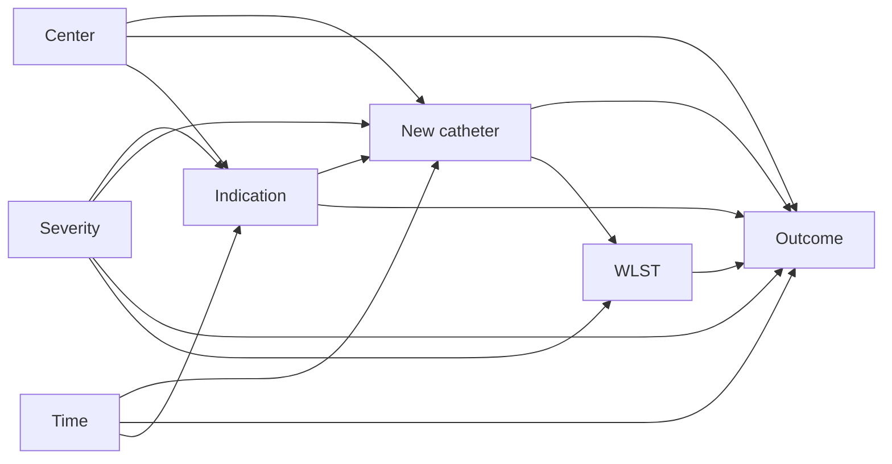

# Causal models for observational neurology: DAGs, confounding by indication, and the target trial

## Opening

The same eight-center endovascular network from Chapter 6 now wants a causal sentence. Over twelve months the registry recorded \(1{,}240\) large-vessel occlusions treated with EVT. A new aspiration catheter was used in a minority of cases. Crude TICI 2b/3 was \(0.86\) where the new catheter was used and \(0.74\) where it was not. Center volumes are still \(410\), \(265\), \(180\), \(140\), \(95\), \(72\), \(48\), and \(30\). The four largest centers adopted first. They are also the good ones: on-site anesthesia, shorter CT-to-puncture, operators who already reperfused more often last year on the old device. The quality committee has a slide that says “OR \(2.1\), \(p < 0.001\)” and a purchase order. A junior analyst has added `(1 | center)` and the odds ratio fell to \(1.4\). The committee calls that “center-adjusted” and asks you to sign the memo.

Partial pooling absorbed a time-invariant center baseline. It did not invent a trial. Operators still chose the new catheter for a reason. Drip-and-ship patients still had to survive the transfer before anyone could open the new device. Some families withdrew life-sustaining therapy after a failed recanalization, and some after a successful one that the evening scan made look futile. Those are different biases. A single coefficient cannot be all of them, and it is not an effect of the catheter until you can name the experiment you wish you had run.

This chapter is the work Chapter 6 deferred. Write the DAG. Name the target trial. Say what the hierarchical model does not fix. Standardize when the trial can be named. Refuse the analysis when it cannot.

## Learning objectives

After working this chapter you should be able to:

- Draw a DAG for an observational device comparison and defend every included and omitted arrow.
- Write the target trial — eligibility, strategies, assignment, time zero, follow-up, and estimand — before any model.
- Separate confounding by indication from confounding by center from immortal time in drip-and-ship analyses.
- State what partial pooling of center intercepts does not fix, and implement Bayesian standardization from a `brms` posterior.
- Treat withdrawal of life-sustaining therapy as both a collider and a mediator, and refuse the analysis when the target trial cannot be named.

## A DAG you can defend

A directed acyclic graph is not a decoration for the methods paragraph. It is the list of causal claims you are willing to read aloud. Every arrow is a claim that intervening on the tail would change the head, holding the other parents fixed. Every missing arrow is a claim that it would not. If you cannot defend the picture, you cannot defend the adjustment set.

The registry contrast needs at least these nodes: indication, severity (NIHSS, occlusion site, ASPECTS, clot burden), center, calendar time, withdrawal of life-sustaining therapy (WLST), treatment, and the outcome. One teaching DAG is enough if every arrow on it is a sentence.



Read it as claims, not as software. Severity shapes indication: operators reach for the new catheter on a stubborn ICA terminus or leave it on the shelf for an easy M2. Severity also hits the outcome directly, and it hits WLST, because a large core is what families are shown at 24 hours. Indication is not a synonym for severity. It carries operator taste and leftover reasons that still predict both device choice and technical success. Center arrows into treatment because adoption was staggered, into indication because protocols differ, and into outcome because logistics and skill differ. Time arrows into treatment because the device arrived mid-year and into outcome because door-to-puncture drifted whether or not anyone changed catheters. Treatment arrows into the angiographic outcome if the device does anything, and into WLST if recanalization changes the conversation at 24 hours. WLST arrows into 90-day function because the dead cannot recover. It does not arrow into TICI 2b/3, which is already recorded when the groin is closed. The picture above is a DAG for a *functional* outcome. If the estimand is TICI, delete the WLST node and say so.

!!! tip "Clinical Pearl"
    The first question after you draw the DAG is not “which package.” It is “which outcome is this a DAG for.” TICI 2b/3 is fixed before anyone talks to a family. Day-90 mRS is not. A picture that treats them as interchangeable will recommend an adjustment set that is wrong for one of them.

What you omit must be as deliberate. Operator identity is left off because operator is almost nested in center and leftover taste sits inside indication. Post-procedure hemorrhage is omitted as a parent to adjust for because it is a mediator on the path to 90-day mRS; conditioning on it estimates a direct effect nobody ordered. The test of a DAG is whether you can delete an arrow without changing your mind about the world.

If the DAG is right, the back-door paths from the new catheter to the outcome run through indication, severity, center, and time. Conditioning on those four — or standardizing over them — blocks the non-causal paths. WLST is not a back-door. It is downstream. Conditioning on it opens a collider and closes a mediator. A DAG you can defend tells you what *not* to put in the model as clearly as it tells you what to put in.

!!! warning "Common Pitfall"
    “We adjusted for everything in the registry” is not a DAG. Age, NIHSS, ASPECTS, occlusion site, onset-to-puncture, center, year, balloon guide, intravenous thrombolysis, and WLST dumped into one linear predictor is a list. Some of those variables are confounders. Some are mediators. Some are colliders. The software cannot tell which. The picture can.

## The target trial: eligibility, strategies, time zero, estimand

Observational causal inference is the attempt to emulate a randomized experiment that was not run. Hernán’s instruction is to write that experiment down, in protocol language, before you touch the likelihood. If you cannot write it, you do not have an estimand. You have a coefficient in search of a sentence. The target trial is not “patients who got the new catheter versus patients who did not.” That is the observed treatment. A trial assigns *strategies*.

**Eligibility.** Adults with imaging-confirmed LVO who undergo arterial puncture for EVT, last known well to puncture within a pre-declared window (teaching: 24 hours), pre-morbid mRS 0–2, and a device choice still open at puncture — not a rescue after a failed first device. Drip-and-ship patients are eligible only at the moment the strategy could have been assigned, which is not spoke-door if the catheter lives at the hub.

**Strategies.** Strategy A: first-line use of the new aspiration catheter, with a pre-specified rescue (stent retriever after two failed aspiration passes). Strategy B: first-line use of the standard device in use at that center that month, with the same rescue rule. “Any use, including rescue” is not a strategy a trial would randomize. It mixes assignment with a response to failure.

**Assignment.** In the hypothetical trial, assignment is randomized at arterial puncture, possibly stratified by center. In the registry, assignment is chosen by operator, center, and anatomy. The back-door set has to recreate the balance randomization would have produced.

**Time zero.** Arterial puncture, or the moment of first-device selection — the instant a person in the trial would have been randomized. Not last-known-well, not hub-door, not the supply-log timestamp. Everyone eligible must have a time zero, including those who will later receive the other device. If a patient can enter only after the new catheter has already been used, you have built immortal time into the protocol.

**Follow-up, outcome, estimand.** For the angiographic estimand, follow-up ends when the groin is closed; the outcome is TICI 2b/3. For the functional estimand, follow-up ends at day 90; the outcome is mRS 0–2, or the full ordinal mRS, with death as 6. These are different trials. They share eligibility and strategies. They do not share the DAG or the sentence you will read to the committee. The contrast a trial would print is the intention-to-treat effect of assignment to A versus B, or a named per-protocol effect, or the effect in the treated if the committee is deciding whether *these* early-adopter centers should keep the device. Say which. The crude odds ratio is none of these.

| Protocol piece | Catheter target trial | What the registry actually did |
| --- | --- | --- |
| Eligibility | LVO, puncture, device choice still open | Everyone who got EVT, including rescues |
| Strategies | First-line new vs first-line standard, named rescue | Any use vs never, or billing code vs not |
| Assignment | Randomized at puncture | Operator taste, center, month, anatomy |
| Time zero | Arterial puncture | Often hub-door, sometimes first device used |
| Outcome | TICI 2b/3, or day-90 mRS, not both as one | Whichever column was complete |
| Estimand | ITT or a named per-protocol contrast | A logistic coefficient |

!!! info "The target trial is a protocol, not a metaphor"
    If a DSMB would reject the protocol — ill-defined strategies, time zero that depends on the treatment, an outcome collected after a decision the treatment changes — you do not get to run that protocol on a CSV. Emulation inherits the defects of the trial you wrote down.

Positivity is part of the protocol, not a diagnostic you glance at later. If four centers used the new catheter in \(>90\%\) of first-line cases and four used it in \(<10\%\), there is almost no within-center overlap. You would be identifying the contrast from the between-center difference, which is exactly the difference Chapter 6 told you not to causalize. A cross-tab of first-line device by center is more important than the prior on \(\tau\).

Consistency is the other quiet assumption. The potential outcome \(Y^a\) is well-defined only if \(a\) is a version of treatment you could assign. “New catheter” that mixes lumen sizes, balloon guide with long sheath, and first-line use with fifth-pass rescue is several treatments. The registry will let you code them as one column. The target trial will not.

## Confounding by indication, confounding by center, and immortal time

Three biases travel under one complaint — “the groups are different” — and they are repaired by three different moves. Mixing them is how a network buys a device for the wrong reason and then cannot say why the next quarter disappointed.

**Confounding by indication.** The operator chose the new catheter *because* of something that also predicts TICI. Teaching pattern A: the new device is reserved for the ugly clot. Those cases recanalize less often on any device, so the crude association *understates* benefit. Teaching pattern B: the new device is used on the easy M2 when the operator wants a clean first-pass trophy, so the crude association *overstates* benefit. Indication is not a synonym for NIHSS. The unmeasured rest — clot texture, the last failure — remains on the DAG as the leftover arrow from indication to outcome. You can shrink that leftover with a richer severity vector. You cannot delete it by wishing.

**Confounding by center.** Early-adopter centers are the good ones. Adoption is a center-level treatment; baseline reperfusion is a center-level outcome. Any analysis that ignores center attributes the good centers’ baseline to the catheter. This is the bias Chapter 6’s hierarchical intercept is built to absorb, and only this one. When adoption is nearly all-or-none inside each center, center confounding and non-positivity are the same fact.

**Immortal time, drip-and-ship version.** A patient who leaves a spoke at 19:00 and arrives at the hub at 21:10 cannot receive the new catheter until 21:10. If you start the clock at last-known-well or at spoke-door, and you classify exposure by whether the new catheter was eventually used, the exposed have two hours during which they cannot have failed in a way that would have kept them from the hub. The unexposed include people who died or were turned down in that window. That stretch of guaranteed survival is immortal time. It is a misalignment of time zero with the strategy, not confounding.

The drip-and-ship problem is worse than the usual drug-exposure version because the transfer *is itself a strategy*. Two target trials are being glued together. Trial 1: at the spoke, transfer for EVT versus do not transfer; time zero is the transfer decision; the new catheter is not assignable there. Trial 2: at hub puncture, first-line new versus first-line standard; time zero is puncture. An analysis that codes “new catheter” on a cohort assembled at spoke-door is emulating a trial no ethics board would approve: randomization to a device that is two hours away, with the dead-on-arrival counted as control.

!!! warning "Common Pitfall"
    Starting follow-up at hub-door and restricting to patients who arrived alive does not automatically fix immortal time. It changes the population. You are now estimating an effect among transfer survivors, which may be the right estimand for a hub device decision and the wrong one for a network transfer policy. Name the population. Do not let the timestamp name it for you.

| Bias | When it appears | What it does to the catheter contrast | Repair |
| --- | --- | --- | --- |
| Indication | Operators choose on anatomy, taste, last case | Either direction; usually not small | Measure the indication; standardize |
| Center | Early adopters are the good centers | Usually makes the catheter look better | Center in the DAG and in the model |
| Immortal time | Exposure defined after a window you must survive | Makes the catheter look safer or more effective | Reset time zero; or clone-censor-weight |

These three can coexist. Teaching numbers, not a result: a true first-line risk difference of \(+3\) points, plus center confounding of \(+8\), indication confounding of \(-4\), and immortal time worth \(+2\), produces a crude difference of about \(+9\). A hierarchical intercept will peel off some of the \(+8\). The leftover is not “the causal effect, center-adjusted.”

## What partial pooling does not fix

Chapter 6 wrote `reperfusion ~ treatment + (1 | center)` and said, at the end, that the model is not a causal model of the catheter. This section is that sentence at working length.

The varying intercept \(\alpha_j\) is a time-invariant center-level shift on the logit. It absorbs the part of confounding by center that does not change over the year and does not interact with treatment. It accounts for clustering, shrinks small centers, and uses within-center contrast where that contrast exists. It does not do the following.

It does not block confounding by indication. Indication varies *within* center. The operator at C1 who reaches for the new catheter on the ICA terminus is not the same decision as the operator at C1 who uses it on an easy M2. A center intercept is orthogonal to that choice. Severity and the rest of the indication vector still belong in the linear predictor as population-level terms.

It does not block confounding by calendar time. If the catheter arrived in March and door-to-puncture fell by twelve minutes between January and December, time is a common cause. A center intercept is constant through the year. A month term has to sit next to it. `(1 | center) + (1 | month)` is a start. It is not a DAG.

It does not repair immortal time. Misaligned time zero is a property of the rows you built, not of the correlation among rows from the same hospital. Partial pooling a badly timed cohort produces a more precise answer to the wrong trial.

It does not create positivity. When four centers used the device almost always and four almost never, \(\beta\) is identified from the off-diagonal patients plus the hierarchical claim that intercepts are exchangeable. That second piece is causal work the prior on \(\tau\) was not hired to do.

It does not turn a conditional odds ratio into the estimand the committee asked for. Even under a correct DAG, \(\beta\) is a log-odds ratio *conditional on* the intercept and the covariates. Odds ratios are not collapsible. The network-level risk difference is a functional of the whole predictive distribution. Quoting `exp(b_treatment)` as “the effect after adjusting for center” is how you skip the next section.

It does not license a device mandate. A well-specified standardized contrast is still observational. The honest downstream use is a prior for a stepped-wedge. The dishonest use is the purchase order.

!!! tip "Clinical Pearl"
    When a committee says “but we already adjusted for center,” ask which of the six things above they think the intercept accomplished. If the answer is “all of them,” the intercept is being asked to be a DAG, a time-zero protocol, and a trial. It is a distribution on eight numbers.

## Bayesian g-methods and standardization in `brms`

The g-formula says that, if you have blocked the back-doors, the risk under a strategy is the covariate-weighted average of the outcome predictions under that strategy:

\[
\mathbb{E}[Y^a] = \sum_{x} \mathbb{E}[Y \mid A=a,\ X=x]\, P(X=x).
\]

In a trial, randomization makes \(X\) independent of \(A\), and the two arms’ raw means already estimate the two expectations. In the registry, you estimate \(\mathbb{E}[Y \mid A=a,\ X=x]\) with a model and \(P(X=x)\) with the empirical distribution of the eligible sample. The difference of the two averages is a risk difference. Neither object is \(\beta\).

Bayesian g-computation does the same average *inside the posterior*. Fit an outcome model. For every posterior draw, predict every eligible patient’s outcome twice — catheter forced on, catheter forced off — leaving severity, center, and time as they were. Average over patients. The collection of those averages is the posterior of the standardized contrast. Uncertainty in the coefficients, the intercepts, and \(\tau\) is already inside it.

The outcome model for the vignette, now actually trying to be causal, is

\[
\operatorname{logit}\pi_i = \alpha_{j[i]} + \beta\, A_i + \gamma^{\top} X_i,
\]

where \(X_i\) holds the measured indication and time (teaching: a standardized severity composite, a calendar-month index) and \(\alpha_j \sim \mathrm{Normal}(\mu_\alpha, \tau^2)\) as in Chapter 6. In `brms` that is `reperfusion ~ treatment + severity + month + (1 | center)`. The formula is the outcome model. It is not the estimand. The estimand is computed after the fit, by pushing two counterfactual copies of the data through `posterior_epred()`.

!!! note "Mathematical Detail"
    Let \(\theta = (\beta, \gamma, \mu_\alpha, \tau, \{\alpha_j\})\). One posterior draw \(\theta^{(s)}\) produces \(\widehat{\mathbb{E}}[Y^a \mid \theta^{(s)}] = n^{-1}\sum_{i=1}^{n} \operatorname{logit}^{-1}\bigl(\alpha_{j[i]}^{(s)} + \beta^{(s)} a + \gamma^{(s)\top} X_i\bigr)\). The posterior of the risk difference is the induced distribution of that contrast. This is g-computation with a Bayesian plug-in. It inherits misspecification: if the linear predictor is missing an interaction the DAG requires (treatment \(\times\) severity, treatment \(\times\) center), the average is wrong with pretty intervals. Fit the interactions you can name. Check overlap. Do not treat the posterior width as a certificate of the DAG.

The teaching simulation follows the DAG, not Chapter 6’s exchangeable-treatment version. Early-adopter centers have a higher intercept *and* a higher adoption probability. Severity raises the chance of receiving the new catheter and lowers the chance of TICI 2b/3. The true first-line log-odds effect is small, \(\beta = 0.18\). Crude association mixes a helpful center bias with a harmful indication bias. Standardization after a model that contains both is the object that has a right to be compared with \(0.18\).

!!! example "R Deep Dive"
    Teaching data with confounding by center and by indication, a `brms` outcome model, and posterior standardization. Invented numbers. Uncomment `brm()` to sample. The printed contrast is not a device result.

```r
# Teaching g-computation: new aspiration catheter vs TICI 2b/3
# Confounding by center (early adopters are better) and by indication.
# Teaching numbers only. seed for simulation and MCMC.

library(brms)
library(tidybayes)
library(dplyr)

set.seed(20260818)

center_n <- c(410, 265, 180, 140, 95, 72, 48, 30)
J <- length(center_n)
early <- c(1L, 1L, 1L, 1L, 0L, 0L, 0L, 0L)
mu_alpha <- 1.10          # ~75% at treat = 0, average severity, late center
alpha_j <- mu_alpha + 0.45 * early + rnorm(J, 0, 0.12)
beta_true <- 0.18         # small causal log-OR
gamma_sev <- -0.40

dat <- lapply(seq_len(J), function(j) {
  n <- center_n[j]
  severity <- rnorm(n, 0, 1)
  month <- sample.int(12, n, replace = TRUE)
  # Early centers adopt; worse anatomy more often gets the new device
  p_tx <- plogis(-1.05 + 1.85 * early[j] + 0.40 * severity + 0.04 * (month - 6))
  treatment <- rbinom(n, 1, p_tx)
  eta <- alpha_j[j] + beta_true * treatment + gamma_sev * severity +
    0.03 * (month - 6)
  data.frame(
    center    = factor(paste0("C", j), levels = paste0("C", seq_len(J))),
    early     = early[j],
    severity  = severity,
    month     = month,
    treatment = treatment,
    reperfusion = rbinom(n, 1, plogis(eta))
  )
}) %>%
  bind_rows()

priors <- c(
  prior(normal(1.2, 0.5), class = Intercept),
  prior(normal(0, 0.4),   class = b, coef = treatment),
  prior(normal(0, 0.5),   class = b),
  prior(normal(0, 0.5),   class = sd)
)

# Specification. Uncomment brm() to sample.
# fit <- brm(
#   reperfusion ~ treatment + severity + month + (1 | center),
#   data = dat,
#   family = bernoulli(),
#   prior = priors,
#   seed = 20260818,
#   cores = 4,
#   refresh = 0
# )

# Standardization over the empirical distribution of (severity, month, center):
# nd1 <- dat; nd1$treatment <- 1L
# nd0 <- dat; nd0$treatment <- 0L
# mu1 <- posterior_epred(fit, newdata = nd1)
# mu0 <- posterior_epred(fit, newdata = nd0)
# rd  <- rowMeans(mu1) - rowMeans(mu0)          # posterior of ATE (risk difference)
# or  <- (rowMeans(mu1) / (1 - rowMeans(mu1))) /
#        (rowMeans(mu0) / (1 - rowMeans(mu0)))  # posterior of marginal OR
# quantile(rd, c(0.025, 0.5, 0.975))

# Effect in the treated: standardize only over rows with treatment == 1
# att <- rowMeans(mu1[, dat$treatment == 1]) -
#        rowMeans(mu0[, dat$treatment == 1])
```

Three numbers belong on the committee slide, and none of them is `exp(b_treatment)` alone. (1) The crude risk difference, too large if center confounding dominates. (2) The posterior of \(\beta\), a *conditional* association after severity, month, and the intercept. (3) The posterior of the standardized risk difference `rd`, the g-formula functional and the only one that matches a trial’s risk difference. If (2) and (3) disagree, that is non-collapsibility plus averaging, not a software bug. Report (3).

Two implementation remarks that save a Friday. First, `posterior_epred()` with the same `center` factor uses that center’s intercept. That is correct for these \(1{,}240\) patients at these eight centers. It is not correct for a ninth hospital; Chapter 6 already taught the new-center draw. Second, positivity still binds. If C7 never used the new catheter, predictions for C7 under treatment \(= 1\) are extrapolations along \(\beta\). Stratify the contrast by early versus late centers, or refuse a network-wide ATE and report it only where first-line overlap exists.

Inverse-probability weighting is the sibling g-method: model \(P(A=1 \mid X, \text{center})\), reweight, and average. Weighting is attractive when you distrust the outcome model. Standardization is attractive when you already have a `brms` outcome fit. For this vignette, standardize the Chapter 6 model. Do not fit both, pick the friendlier number, and call the pair a sensitivity analysis after the fact.

### For the biostatistician / methodologist

The hierarchical intercept is a partially pooled fixed effect. If \(\operatorname{Cov}(\alpha_j, \bar A_j) \neq 0\) — early adopters are better — \(\beta\) without the intercept blends within- and between-center contrasts. Putting `(1 | center)` back is a within estimator plus shrinkage. A Mundlak term (the center-level mean of treatment) makes the between contrast explicit. Neither move is g-computation. Doubly robust functionals will not invent overlap when a device is aliased with four of eight centers.

## Withdrawal of life-sustaining therapy as collider and mediator

TICI 2b/3 is already on the page when the family meeting happens. If that is the estimand, WLST is off the DAG. The trouble starts when the committee, pleased with a reperfusion contrast, asks you to “just do 90-day mRS as a secondary.” The secondary has a different causal structure. Chapter 12 said this as a competing-risk remark. Here it is a DAG remark.

WLST is a *collider* on paths that end in the decision. Severity \(\rightarrow\) WLST \(\leftarrow\) unmeasured preference. Treatment \(\rightarrow\) WLST \(\leftarrow\) preference, if the 24-hour CT looks different because the device opened a vessel. Conditioning on WLST — restricting to “patients not withdrawn,” putting WLST in the linear predictor of day-90 mRS, or censoring the withdrawn — opens the collider. The opened path runs from treatment through preference into the outcome. You have manufactured an association among people who share a decision, not a treatment effect among people who share a disease.

WLST is also a *mediator* on the path the device uses if it works. Treatment \(\rightarrow\) recanalization \(\rightarrow\) a changed scan \(\rightarrow\) WLST \(\rightarrow\) day-90 mRS. A device that improves TICI will, in some ICUs, reduce withdrawals and produce more survivors. That path is part of the ITT effect on function. Blocking it estimates a direct effect: the catheter’s effect on mRS *if withdrawal decisions were held fixed*. That is the effect in a world where families ignore the scan the device changed. No consent form described that world.

The two roles are not a contradiction. Treating WLST as a baseline covariate opens a collider and blocks a mediator at once. Treating WLST as a competing event that you censor pretends the withdrawn were still at risk to walk. The ITT functional is the contrast in day-90 state occupancy, death included as mRS 6, WLST left on the pathway. A mediation decomposition needs a care-preference covariate this registry will not support.

!!! warning "Common Pitfall"
    A “modified Rankin among survivors,” or a model of mRS 0–2 that drops the dead, is conditioning on a descendant of WLST. It is the collider mistake with a prettier table. If the catheter changes who survives, the survivors are not comparable across strategies. Quote state occupancy. Do not quote a recovery rate in a filtered room.

What you *can* put in the model is a *baseline* care-preference variable — a DNR that predates puncture, a living will. Those sit above treatment. Most registries do not have them. In their absence you do not “adjust for WLST.” You leave it alone, report 90-day mRS with death in the scale, and say that part of any functional contrast may be a changed conversation rather than changed tissue.

## Refuse the analysis when the target trial cannot be named

The skill this chapter is for is not g-computation. It is the refusal. The network will always have a CSV. The CSV will always have a treatment column and an outcome column. `brms` will always fit. None of that is a reason.

Refuse when you cannot write eligibility without using the treatment. “Patients who received EVT with the new catheter” is an arm, not a population. Refuse when the strategies are not versions of treatment a human could be assigned at a named instant. “Any exposure, including rescue on pass five” is not a strategy. “Drip-and-ship with the new catheter” is two strategies taped together. Refuse when time zero depends on which strategy the patient ended up receiving. If drip-and-ship exposed patients must arrive to be counted and unexposed patients need not, you have immortal time with a transfer sticker on it.

Refuse when the DAG requires a back-door you cannot measure. If operator intention and unrecorded clot texture arrow into treatment and into outcome, standardization over NIHSS and center is a ritual. Refuse when positivity is a hope. Four centers at \(>90\%\) and four at \(<10\%\) is a design in which the target trial was not run at half the sites. Report within-center contrasts where both devices were first-line. Decline a network-wide mandate. Refuse when the requested outcome and the available time-zero do not match. A request for 90-day mRS on a file with TICI and no day-90 contact is a missing-outcome problem, and WLST will sit inside the missingness.

The refusal is a written object. It names the trial you could *not* write, the arrow you could *not* block, and the analysis you *will* do instead: a descriptive hierarchical summary, or a design for the stepped-wedge the network should run next year. Chapter 6’s model, used descriptively, is an honorable fallback. A coefficient produced because the committee had a meeting is not.

!!! tip "Clinical Pearl"
    The sentence “we cannot estimate that from these data” is a Bayesian sentence. It means the posterior you would have to show is identified by the prior and the untestable part of the DAG, not by the likelihood. Saying so is the analysis.

## Exercises

1. **Defend the DAG.** A colleague wants to add post-procedure PH2 hemorrhage to the teaching DAG as a parent of the outcome and a child of treatment, and then “adjust for it” in the day-90 mRS model. Write six sentences: what the new arrows claim, whether PH2 is a confounder, a mediator, or a collider for the ITT functional, and what estimand you would be reporting if you conditioned on it.

2. **Write the protocol.** For a mothership-versus-drip-and-ship contrast in the same network, write eligibility, the two strategies, time zero, follow-up, and the estimand, each in one sentence. Then write one sentence naming the immortal-time error you would commit if you classified exposure by whether the patient *arrived* at the hub and started follow-up at last-known-well.

3. **What the intercept missed.** Using the teaching simulation (run it), compare the crude risk difference, `exp(b_treatment)` from `reperfusion ~ treatment + (1 | center)` with no severity term, and the standardized risk difference from the full outcome model. Which bias did partial pooling remove? Which did it leave? What would you tell the committee that has already printed the middle number?

4. **Collider or mediator.** An ICU colleague proposes restricting the day-90 mRS analysis to patients “who were given a chance,” meaning no WLST in the first 72 hours. Draw (in words) the paths that restriction opens and the path it closes. What contrast would you offer instead, and which baseline variables would you accept as covariates?

## Further reading

- Hernán MA, Robins JM. Using big data to emulate a target trial when a randomized trial is not available. *Am J Epidemiol*. 2016;183:758-764. The protocol items this chapter treats as mandatory.
- Hernán MA, Robins JM. *Causal Inference: What If*. Chapman & Hall/CRC; 2020. Target trials, the g-formula, and writing strategies before models.
- Greenland S, Pearl J, Robins JM. Causal diagrams for epidemiologic research. *Am J Epidemiol*. 1999;149:208-213. Rules for reading a DAG you are willing to defend.
- Hernán MA, Hernández-Díaz S, Robins JM. A structural approach to selection bias. *Epidemiology*. 2004;15:615-625. Conditioning on a collider, including “among survivors.”
- Snowden JM, Rose S, Mortimer KM. Implementation of G-computation on a simulated data set. *Epidemiology*. 2011;22:718-723. Standardization as a practical estimator.
- Keil AP, Edwards JK, Richardson DB, Naimi AI, Cole SR. The parametric g-formula for time-to-event data. *Epidemiology*. 2014;25:889-897. g-computation when follow-up, not a binary TICI, is the structure.
- Hernán MA. The C-word: scientific euphemisms do not improve causal inference from observational data. *Am J Public Health*. 2018;108:616-619. Why “associated with” is not a safer claim than a named estimand.
- Becker KJ et al. Withdrawal of support in intracerebral hemorrhage may lead to self-fulfilling prophecies. *Neurology*. 2001;56:766-772. WLST as a decision that uses the same prognosis the treatment is trying to change.
- Goyal M et al. Endovascular thrombectomy after large-vessel ischaemic stroke: a meta-analysis of individual patient data from five randomised trials. *Lancet*. 2016;387:1723-1731. Public design facts on multi-center EVT; do not copy tables. The target trial for *whether* to do EVT exists. The trial for *which catheter* does not.
- Bürkner P-C. brms: An R package for Bayesian multilevel models using Stan. *J Stat Softw*. 2017;80(1):1-28. `posterior_epred()` is the g-formula once you force the treatment column.

!!! success "Key Takeaway"
    An observational catheter contrast is a target trial or it is a table. Draw the DAG, name eligibility, strategies, time zero, and the estimand, and only then fit the Chapter 6 hierarchy as an outcome model and standardize over the back-door set. Partial pooling fixes a center intercept. It does not fix indication, immortal time, or a collider you created by “adjusting for” withdrawal. If you cannot write the trial, do not run the model as if you had.
