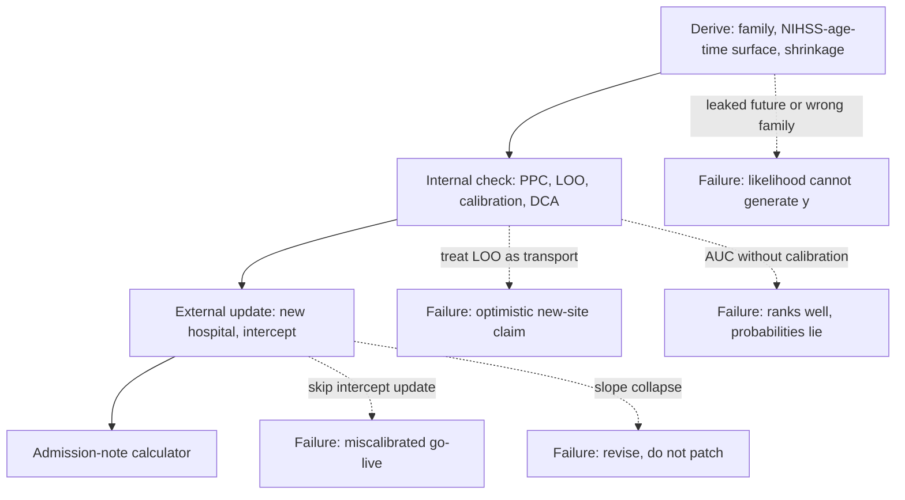

# Bayesian Clinical Prediction Models: Derivation, Validation, Updating, and TRIPOD

## Opening

A probability printed on an admission note is a promise. The network that wants a 90-day mRS \(0\)–\(2\) calculator is asking you to sign that promise under every name on the board. Derivation is how you write it. Internal checking is how you find out whether the writing is coherent. External updating is how you find out whether a new hospital can use it. TRIPOD is how you refuse to hide the seams. An AUC of \(0.84\) from a GUI logistic is none of those things.

## Learning objectives

After working this chapter you should be able to:

- Separate three estimands that share predictors and destroy each other when mixed: prognosis, diagnosis, and treatment-benefit prediction.
- Specify a family, a nonlinear NIHSS–age–time surface, and shrinkage priors for a binary or ordinal functional-outcome model, and say which predictors are illegal because they are not known when the note is signed.
- Treat PSIS-LOO as an internal, same-hospital check, and refuse to call it external validation.
- Report calibration, discrimination, and a decision curve of the *same* model on the *same* sample, and say which of the three licenses an admission-note probability.
- Recalibrate an intercept on a new hospital, recognize when a slope failure means you must revise rather than patch, and write the paper as TRIPOD discipline rather than as a trophy statistic.

## Clinical vignette

A seven-hospital stroke network wants a 90-day mRS \(0\)–\(2\) probability on every admission note, ischemic and ICH, available at the moment the attending signs. The intended user is a resident counseling a family at 08:00. The two comprehensive centers have three years of teaching-quality registry data: \(920\) patients with a locked 90-day mRS, plus the usual cemetery of incomplete rows. Legal at signature: age, pre-morbid mRS, NIHSS or GCS, last-known-well to door, systolic pressure, glucose, anticoagulant use, ICH volume and location when already measured, receiving hospital. Illegal: 24-hour NIHSS, TICI grade, hematoma expansion, aspiration pneumonia, later rehab destination.

A fellow has already fit a 14-predictor frequentist logistic in a point-and-click tool. The printed AUC is \(0.84\). Two of the fourteen predictors are post-baseline variables (the 24-hour NIHSS and the procedural TICI grade). The fellow wants the equation in the EHR next month and has drafted a title that begins “Externally validated predictor of favorable outcome.” The quality committee asks whether the product is “TRIPOD-compliant.” The CMIO asks for a single number, not a posterior.

Before any software, write four sentences and do not soften them. (1) The estimand: prognosis under the *observed* care policy, diagnosis of a present state, or predicted benefit of a treatment the patient has not yet received. (2) The prediction time: which columns are legal. (3) The action the number is allowed to change, and the action it is forbidden to change. (4) What would make you refuse go-live even if the AUC were \(0.90\).



The rest of the chapter walks that path. Each dashed arrow is a way the calculator reaches a note without earning it.

## Prognosis is not diagnosis is not treatment-benefit prediction

Three questions share a covariate list and almost never share an estimand.

**Prognosis** asks what will happen to this patient by a named horizon under a named care policy. \(P(\mathrm{mRS}_{90}\in\{0,1,2\} \mid x_{\mathrm{adm}},\ \text{usual care in this network})\) is a prognostic functional. Counseling, expected length of stay, and the family’s request for “a percentage” live here. The policy is part of the definition. A network that recanalizes more, that sends more patients to intensive rehab, or that withdraws care earlier will have a different prognostic map from the same admission NIHSS.

**Diagnosis** asks what is already true. \(P(\text{LVO} \mid \text{NIHSS},\ \text{AF},\ \text{CTA read})\) is Chapter 11. The clock on the state has already run. Sensitivity and specificity are properties of a test for a present class, not properties of a 90-day outcome. Printing a prognostic mRS probability on the note does not diagnose a vessel, and a CTA likelihood ratio does not forecast independence.

**Treatment-benefit prediction** asks who gains from an action not yet taken. The object is a contrast, \(P(Y^{a=1}=1 \mid x) - P(Y^{a=0}=1 \mid x)\). You cannot read it off a model fitted only on treated patients, only on untreated patients, or on a mixture whose assignment was itself a function of \(x\). Randomization, a credible instrument, or an explicit causal model is the price of admission. A logistic that includes “EVT yes/no” estimates an association under the observed rule. It does not estimate the benefit of sending *this* patient.

The admission-note calculator in the vignette is a prognostic object. That is allowed. What is not allowed is promoting it into the other two jobs. A resident who sees \(0.12\) and withholds a medically appropriate transfer is using a mixed-policy forecast as a treatment rule. A fellow who sees \(0.12\) and tells the family “this is not an LVO” is using a future functional state as a diagnosis. Both errors are easier once the number is printed in bold. Quieter still: a calculator trained on last year’s policy becomes part of this year’s policy the moment it is printed. If low probabilities start to produce earlier withdrawal, the calibration plot in your office is a historical document. Models that are allowed to change care must be scheduled for re-estimation.

!!! warning "Common Pitfall"
    “The model includes treatment, so it can tell us who to treat” is a category error. Conditioning on the observed treatment answers a different question from intervening on treatment. If the note is allowed to change an action, you need a benefit model, or you need a protocol that forbids the prognostic number from gating that action. Write the prohibition on the same screen as the percentage.

A compact map:

| Estimand | Target | Needs | Legal on the admission note? |
| --- | --- | --- | --- |
| Prognosis | \(P(Y_{90}\mid x_{\mathrm{adm}},\ \text{policy})\) | Outcome at a horizon; predictors known at \(t_0\) | Yes, as counseling, if calibrated |
| Diagnosis | \(P(\text{state now}\mid \text{test},\ x)\) | A present class and a reference | No; that is a different model |
| Benefit | \(P(Y^{1}-Y^{0}\mid x)\) | A contrast and an identification story | Only if you built that model on purpose |

The ICH-score analogue later in the chapter is prognostic. The classic published ICH score was built for 30-day mortality, not for independence, and not for choosing surgery. Teaching with an analogue does not license treating the analogue as a treatment rule.

## Specifying the family, the nonlinear NIHSS–age–time surface, and shrinkage priors

A prediction model is a family, a linear predictor, and a prior. Software will happily accept a worse triple than the one you meant.

**Family.** Ninety-day mRS \(0\)–\(2\) is a Bernoulli functional of an ordinal scale. `family = bernoulli(link = "logit")` is honest if the clinical claim is about independence and you accept the information you throw away. `family = cumulative()` on the seven-level mRS is the better default when you can defend proportional odds, or a relaxation of it, and then *derive* \(P(\mathrm{mRS}\le 2)\) as a posterior functional. A Gaussian on the raw mRS treats the gap from \(0\) to \(1\) as the gap from \(5\) to \(6\) and will predict impossible values. A Cox model for “time to independence” that censors the dead is the Chapter 12 error in a new coat. Choose the family that can generate the outcome you will display.

**Surface.** NIHSS, age, and last-known-well time do not enter a logit as three straight lines. The step from NIHSS \(4\) to \(8\) is not the step from \(18\) to \(22\). An NIHSS of \(8\) in a 52-year-old is not an NIHSS of \(8\) in an 88-year-old. Time to door is a decaying curve, not a coefficient per minute, and it interacts with whether reperfusion is even on the table. Linear main effects miscalibrate the tails, where families ask the hardest questions. Dummy-coding NIHSS into ten bins memorizes empty cells. A kitchen-sink `nihss * age * time * glucose * sbp` on \(200\) events is a prior the sample cannot update.

A teaching specification that matches the claim is a smooth surface plus a small set of pre-declared modifiers:

\[
\begin{aligned}
y_i &\sim \operatorname{Bernoulli}(\pi_i),\\
\operatorname{logit}(\pi_i) &= \alpha_{j[i]} + f(\mathrm{NIHSS}_i,\ \mathrm{age}_i) + g(\mathrm{time}_i) + \mathbf{w}_i^{\top}\boldsymbol{\gamma}.
\end{aligned}
\]

In `brms`, \(f\) is `t2(nihss, age)` or paired `s()` terms plus a planned `nihss:age` product; \(g\) is `s(log_time)` with a tight prior on wiggliness; \(\mathbf{w}\) holds the other legal admission variables; \(\alpha_j\) is a hospital intercept (Chapter 6). The ICH analogue replaces NIHSS with GCS, but volume has the same problem: 12 mL and 72 mL are not two points on a slope you should trust without looking.

**Shrinkage priors.** A 14-predictor logistic on \(920\) rows with \(300\) events can look identified and still be too flexible in the corners. After scaling continuous predictors to mean \(0\) and SD \(1\), \(\gamma_k \sim \operatorname{Normal}(0, 0.5)\) says that odds ratios beyond about \(e^{1}\) per SD are unusual, not impossible. That is shrinkage, not a claim that NIHSS does not matter. A regularized horseshoe on optional laboratory toys keeps the pre-declared surface (NIHSS, age, time) in the model and asks the extras to earn their keep. Hospital intercepts get a hierarchical prior, not fourteen fixed dummies. Spline smoothness in `brms` already carries a prior on the wiggliness SD; look at `get_prior()` and tighten it if the surface scribbles through six points. Shrinkage is not a substitute for a prediction-time rule. A coefficient shrunk toward zero is still illegal if the variable is “aspiration on day 4.”

!!! tip "Clinical Pearl"
    Write the prediction time as a timestamp, not as a vibe. “Admission” is not a time. “Values known when the attending signs the history, before 24-hour imaging and before the angiogram is coded” is a time. Anything later is leakage. Leakage is the most reliable way to buy an AUC you will not have tomorrow morning.

!!! note "Mathematical Detail"
    After standardizing a continuous predictor, \(\operatorname{Normal}(0, 0.5)\) on its logit coefficient puts most prior mass on an odds ratio of about \(0.4\) to \(2.7\) per SD. Combined with a spline, that prior keeps the average slope out of the circus while the smoothness prior keeps the wiggles from interpolating noise. Prior predictive draws of \(\pi\) against NIHSS, at fixed ages, are the check that the pair is not jointly absurd. Do them before you fit.

## PSIS-LOO is not a new hospital

Chapter 8 treated PSIS-LOO as a comparative estimate of pointwise out-of-sample log predictive density, with Pareto \(k\) as a diagnostic. That use stands. This chapter’s claim is narrower and more often violated: **leave-one-patient-out on the derivation hospitals is not transport to a hospital that has never been seen.**

LOO asks, approximately, how well the model predicts a patient who could have been in this file but was left out. The left-out patient shares the network’s coding of mRS, the network’s rehab access, the network’s habit of withdrawing care, and the network’s missingness. A new hospital shares none of those by default. Leave-one-*center*-out is a stricter internal check and is the right LOO variant when the derivation file is clustered (Chapter 6). It is still not a future calendar year, a new country, or a spoke that codes pre-morbid mRS differently.

The fellow’s draft title — “externally validated” — is therefore already false if the only out-of-sample number is a LOO AUC computed on the same \(920\) rows. TRIPOD calls that internal validation, and even that name is optimistic when the same analyst used the same file to choose the 14 predictors. Apparent performance, optimism-corrected performance, and external performance are three different numbers. Reporting the first with the third’s adjective is the most common way a calculator reaches an EHR.

Use LOO inside derivation the way Chapter 8 taught: to compare linear NIHSS against a spline, or hospital intercepts against none, after looking at Pareto \(k\). Do not tour twenty specifications. Do not treat a LOO win as a transport certificate. If several \(k > 0.7\) land on the same corner — the young cerebellar ICH, the 92-year-old with NIHSS \(3\) — that corner is where the note will be most confident and most wrong. Exact LOO for those points, or a pre-specified restriction of intended use, is the repair. Deleting them is how you launch a dashboard that has never met its hardest patients. \(K\)-fold by *time* (train on years 1–2, test on year 3) is still internal, but it rehearses drift better than shuffled LOO. If year 3 is already miscalibrated, plan updating; do not announce external validity.

## Calibration, discrimination, and a decision curve of the same model

Dashboards display probabilities. Ranking statistics do not know what a probability is. Decision curves do not care how elegant the spline was. The same fitted model must survive all three, on the same locked sample, or the sample is being used as a costume shop.

**Discrimination** is whether patients who had mRS \(0\)–\(2\) received higher \(\hat\pi\) than patients who did not. The c-statistic (AUC of the predicted probability) summarizes that ranking. It is useful and incomplete. A model can rank perfectly while saying \(0.40\) in a world that produces events at \(0.18\). Families do not need a rank. They need a percentage that means itself.

**Calibration** is whether, among patients with \(\hat\pi \approx 0.25\), about one in four is independent at 90 days. Calibration-in-the-large compares the mean prediction to the event rate. The calibration slope compares the spread of the linear predictor to the spread the sample can support. A Bayesian plot bins on the posterior mean and shows a posterior predictive band for the observed rate (Chapter 8). Name the bins clinically and populate them. Ten deciles of \(180\) ICH patients with \(50\) good outcomes produce empty right-hand bins and a false local failure.

**Decision-curve analysis** asks whether acting on the model at a threshold \(p_t\) has higher net benefit than treating all or treating none (Chapter 15). Name the action or the curve is decoration. Reasonable: a longer family meeting, earlier goals-of-care, a specialist rehab alert. Forbidden, unless you built a benefit model: withholding indicated reperfusion because \(\hat\pi\) is low. Compute the curve on the same patients as the calibration plot. If the useful interval of \(p_t\) does not meet the thresholds the service will actually use, the model can rank well and still have no business on the note.

Report the trio as one object.

| Claim | Number or graph | Licenses | Does not license |
| --- | --- | --- | --- |
| Discrimination | c-statistic with a posterior interval | “The model ranks” | A printed probability |
| Calibration | Reliability plot with predictive bands | “This percentage means itself, here” | A treatment rule |
| Decision curve | NB versus \(p_t\), with treat-all / treat-none | “Acting at these thresholds beats the defaults” | Use outside that interval |

A model that wins on AUC, misses the top calibration bin, and loses to treat-all on the only \(p_t\) the service endorses is not “good except for a small intercept problem.” It is not ready. Recalibrating the intercept may fix the second column and will not automatically fix the third.

!!! tip "Clinical Pearl"
    Put the calibration plot on the same screen as the percentage, in the units the family hears — “about 1 in 4,” not a logit. If the top bin is uncalibrated, gray out probabilities above that edge rather than rounding them to a false precision.

## External validation and intercept recalibration

External validation is a new place, a new time, or a prospectively registered cohort whose patients were not used to choose the surface. A random split of the derivation file is not external. A second comprehensive center in the same network is a start; a spoke with different imaging and different rehab access is a stricter test; a different country a year later is the test TRIPOD has in mind when it says “external.”

What usually fails first is calibration-in-the-large. The new hospital’s independence rate is not the derivation rate, even at the same NIHSS, because withdrawal culture, transfer-in fraction, and missing-mRS mechanisms differ. The linear predictor still ranks. The intercept does not travel.

**Intercept recalibration** freezes the derived surface and re-estimates only the intercept on the new sample:

\[
\operatorname{logit}(\pi_i^{\mathrm{new}}) = \alpha^{\mathrm{new}} + \eta_i^{\mathrm{old}},
\]

where \(\eta_i^{\mathrm{old}}\) is the locked linear predictor (old intercept removed) and \(\alpha^{\mathrm{new}}\) has a prior centered on the old intercept with enough width for the new baseline to move. You are using the old intercept as a prior location, not as data. If the new hospital is a new hierarchical center, the same idea is a draw of \(\alpha_{J+1}\) — partial pooling rather than a hard freeze (Chapter 6).

**Slope failure** is a different disease. If low-risk patients are over-predicted and high-risk patients under-predicted, or the reverse, the surface is wrong for that case-mix. An intercept patch will not fix a missing interaction or a stiff spline. A second-stage logistic of \(y\) on \(\operatorname{logit}(\hat\pi)\) that re-estimates a slope can make a dashboard less dangerous; it is not a new derivation. If the slope posterior at the new hospital excludes \(1\) by a wide margin, stop. Revise, restrict intended use, or do not go live. An external “validation” on \(40\) patients with \(11\) good outcomes can move an intercept and cannot test a slope. TRIPOD would rather read “intercept updated on \(n=40\); slope untested” than a new AUC whose interval runs from \(0.58\) to \(0.88\).

!!! warning "Common Pitfall"
    Refitting every coefficient on the new hospital and calling the result “validated” is derivation in a smaller room. External validation uses the locked model. Updating, if you do it, is a named subsequent step with its own sample and its own TRIPOD sentence. Do not launder the refit into the validation paragraph.

## TRIPOD as writing discipline

TRIPOD (Collins, Reitsma, Altman, Moons, 2015) and its TRIPOD+AI update are reporting guidelines. They are also a writing order. If you cannot fill an item, you do not have a model you should print. The guideline will not fit the model for you. It will not convert an AUC into a calibrated probability. It will make it embarrassing to hide what you did.

Items that stroke-network calculators most often skip, and that this vignette is designed to force:

- **Title and intended use.** Development, validation, or both — in the title. User, prediction time, and the action the number may change. “A predictor of favorable outcome” is not a use.
- **Participants.** Hospitals, years, who was dropped for missing mRS, and whether missingness tracks severity.
- **Predictors.** The legal list at \(t_0\), the illegal list you did *not* use, missing-NIHSS handling. Complete-case analysis is a hidden inclusion criterion.
- **Outcome.** mRS \(0\)–\(2\) at 90 days, who scored it, whether the scorer saw the predictors. Deaths are mRS \(6\), not missing.
- **Sample size.** Events per planned coefficient, or prior-predictive assurance that the named surface can be updated at all.
- **Specification.** Family, link, nonlinear terms, hierarchy, priors, seed, software. A nomogram without an intercept is a poster.
- **Performance.** Calibration *and* discrimination, in the slices a decision will use, with intervals. A decision curve if you recommend a cutoff.
- **External performance and updating.** Named, or an honest “none.” Intercept recalibration belongs in the abstract, not only a supplement.
- **How to get a prediction.** Formula, intercept, spline basis, centering of age.

Write the Bayesian extras anyway: the prior, a prior-predictive check of \(\pi\) against NIHSS, prior sensitivity of a *patient-level* probability, \(\widehat{R}\), divergences, Pareto \(k\). Chapter 19 and Appendix D are the short form. TRIPOD+AI adds the training/tuning/test cut, whether the test file was touched during selection, fairness slices, and the shift you actually looked for. A Bayesian GLM does not get a moral exemption. It gets a shorter appendix if you pre-declared the surface.

## A brms + tidybayes pipeline on a teaching ICH-score analogue

The vignette’s network will eventually need two surfaces, one ischemic and one ICH. The computational object below is the ICH analogue: a five-component teaching structure in the spirit of the classical ICH score, aimed at 90-day mRS \(0\)–\(2\) rather than at 30-day death, with teaching coefficients and a teaching sample. It is not the published score, not a meta-analysis, and not a calculator you may paste into a chart.

Predictors known at ICH admission, in teaching names: GCS, hematoma volume in mL, IVH (yes/no), infratentorial origin (yes/no), age. Outcome: `mrs02` at 90 days. Six hospitals, \(n = 480\), so that a hierarchical intercept is not a cartoon.

```r
# Teaching ICH-score analogue: 90-day mRS 0-2 from admission predictors.
# Teaching pipeline. Uncomment brm() to sample locally.
# seed used for simulation and for brm().

library(brms)
library(tidybayes)
library(dplyr)
library(ggplot2)
library(loo)

set.seed(20260818)

n <- 480
hospital <- factor(rep(1:6, length.out = n))
age <- round(pmin(pmax(rnorm(n, 68, 12), 22), 95))
gcs <- pmin(pmax(round(rnorm(n, 11, 3)), 3), 15)
volume <- pmax(round(rgamma(n, shape = 2.2, scale = 12)), 1)
ivh <- rbinom(n, 1, 0.38)
infra <- rbinom(n, 1, 0.16)
alpha_h <- rnorm(6, 0, 0.35)

linpred <-
  -0.35 + alpha_h[as.integer(hospital)] +
  0.22 * (gcs - 11) +
  -0.035 * (volume - 20) +
  -0.85 * ivh +
  -0.70 * infra +
  -0.028 * (age - 68)

ich <- tibble(
  hospital, age, gcs, volume, ivh, infra,
  mrs02 = rbinom(n, 1, plogis(linpred))
)

priors_ich <- c(
  prior(normal(-0.4, 0.6), class = Intercept),
  prior(normal(0, 0.4), class = b),
  prior(normal(-0.03, 0.02), class = b, coef = age),
  prior(exponential(2), class = sd),
  prior(exponential(2), class = sds)
)

# fit_ich <- brm(
#   mrs02 ~ s(gcs, k = 5) + s(volume, k = 5) + ivh + infra +
#     age + (1 | hospital),
#   data = ich,
#   family = bernoulli(),
#   prior = priors_ich,
#   seed = 20260818,
#   iter = 4000,
#   warmup = 1000,
#   chains = 4,
#   cores = 4,
#   refresh = 0
# )

# Internal checks (Chapter 8), then the trio this chapter requires.
# loo_ich <- loo(fit_ich)
# plot(loo_ich)
# pp_check(fit_ich, type = "bars_grouped", group = "ivh")

# new <- tibble(
#   age = 74, gcs = 9, volume = 28, ivh = 1, infra = 0,
#   hospital = "7"
# )
# fit_ich %>%
#   add_epred_draws(newdata = new, allow_new_levels = TRUE) %>%
#   median_qi(.epred, .width = c(0.5, 0.95))
```

Read the pipeline in lifecycle order. Generate only legal predictors. Put a hierarchical intercept on hospital before you congratulate yourself on a pooled AUC. Spline GCS and volume; keep IVH, infratentorial origin, and age as pre-declared modifiers, with a tight prior on age and default shrinkage on the binaries. Fit. Then: grouped PPCs by IVH and volume band; LOO with Pareto \(k\); calibration in four named bins of posterior-mean \(\hat\pi\); a c-statistic as a posterior functional, not a single `pROC` number; a decision curve whose action is “open an early goals-of-care meeting,” not “cancel surgery.” For hospital 7, do not refit \(\boldsymbol{\gamma}\). Draw a new intercept.

!!! example "R Deep Dive"
    `add_epred_draws()` is the expected probability \(\pi_i\), which is what the note should display. `add_predicted_draws()` is a posterior predictive \(0/1\), which is what a PPC wants. Do not show the family a single posterior predictive draw and call it their forecast. Do not show them \(\operatorname{logit}(\hat\pi)\) and call it English. For a new hospital, `allow_new_levels = TRUE` uses the hierarchical prior predictive for \(\alpha_{J+1}\). That interval is wider than the interval at hospital 1, and the width is the point.

## Worked solution to the vignette

**(1) Estimand.** Prognosis under the network’s observed care policy. Not diagnosis of LVO or of hematoma expansion. Not the benefit of EVT or of surgical evacuation.

**(2) Prediction time.** Columns known when the attending signs: age, pre-morbid mRS, admission NIHSS or GCS, last-known-well to door, systolic pressure, glucose, anticoagulant, ICH volume and location if already measured, hospital. The 24-hour NIHSS, TICI grade, expansion, pneumonia, and discharge destination are illegal. The fellow’s 14-predictor fit is already disqualified, before anyone discusses AUC.

**(3) Allowed action; forbidden action.** Allowed: a calibrated percentage for counseling, with a band, and perhaps an earlier goals-of-care conversation if the decision curve supports that threshold. Forbidden: withholding a transfer or a procedure that would have been offered in the absence of the number. The prohibition belongs on the note.

**(4) Reasons to refuse go-live at any AUC.** Illegal predictors; no calibration plot in clinical bins; LOO sold as external validation; no new-hospital intercept check; a decision curve that loses to treat-all on every threshold the service will use; a missing-mRS mechanism that silently drops the dead or the discharged-to-nowhere. An AUC of \(0.90\) with two of those failures is a ranking toy.

What you will actually build is smaller than the fellow’s GUI: an ischemic surface (`t2(nihss, age) + s(log_time) + legal w + (1 | hospital)`) and the ICH analogue above, each with shrinkage priors, Chapter 8 checks, and the trio of calibration, discrimination, and a named decision curve. External performance starts as leave-one-center-out plus a locked-model evaluation at hospitals that did not dominate derivation, then intercept recalibration when the next spoke comes online. The title will say “development and internal validation; intercept updated at site \(k\)” and will not say “externally validated” until a site that never touched the surface has been evaluated. TRIPOD is that outline, written before the first `brm()` call. The CMIO’s single number is refused. The note may show a posterior median and a 95% interval, or it may show nothing.

## Exercises

1. **Illegal columns.** The fellow’s 14-predictor fit includes 24-hour NIHSS and TICI 2b/3. Explain, in four sentences, why the apparent AUC is not the AUC the admission note will have, and name the TRIPOD item that should have made the leakage visible in the paper even if the software never complained.

2. **Leave-one-out versus leave-one-hospital-out.** PSIS-LOO ELPD favors a spline on NIHSS over a linear term (difference \(+6\), SE \(4\)). Leave-one-hospital-out, on the same two models, favors the linear term at two of seven sites. What are you allowed to claim about nonlinearity, and what must you do before the spline reaches the note?

3. **Intercept only.** At a new spoke, \(n = 90\) with \(28\) mRS \(0\)–\(2\) events, the locked model’s mean predicted probability is \(0.41\) and the observed rate is \(0.31\). The calibration slope posterior is \(0.94\) (\(95\%\) interval \(0.61\) to \(1.28\)). Do you recalibrate the intercept, re-estimate the slope, or refuse the go-live? Write the sentence that belongs in the abstract.

4. **Same model, three graphs.** You are handed an AUC of \(0.81\), a calibration plot whose top bin sits above the predictive band, and a decision curve — thresholds on predicted dependence risk, \(1-\hat\pi\) — that beats treat-all only for \(p_t < 0.08\). The service will not open a goals-of-care meeting below a predicted dependence risk of \(0.30\) (that is, they will not act unless \(\hat\pi\) for mRS \(0\)–\(2\) is below \(0.70\)). What do you tell the quality committee, in five sentences, about putting this model on the admission note?

## Further reading

- Collins GS, Reitsma JB, Altman DG, Moons KGM. Transparent reporting of a multivariable prediction model for individual prognosis or diagnosis (TRIPOD). *Ann Intern Med*. 2015;162:55-63.
- Collins GS, Moons KGM, Dhiman P, et al. TRIPOD+AI statement: updated guidance for reporting clinical prediction models with machine learning. *BMJ*. 2024;385:e078378.
- Steyerberg EW. *Clinical Prediction Models*. 2nd ed. Springer; 2019.
- Harrell FE. *Regression Modeling Strategies*. 2nd ed. Springer; 2015. Restricted cubic splines; hostility to unpenalized stepwise selection.
- Riley RD, Ensor J, Snell KIE, et al. Calculating the sample size required for developing a clinical prediction model. *BMJ*. 2020;368:m441.
- Van Calster B, McLernon DJ, van Smeden M, Wynants L, Steyerberg EW. Calibration: the Achilles heel of predictive analytics. *BMC Med*. 2019;17:230.
- Vickers AJ, Elkin EB. Decision curve analysis: a novel method for evaluating prediction models. *Med Decis Making*. 2006;26:565-574.
- Vehtari A, Gelman A, Gabry J. Practical Bayesian model evaluation using leave-one-out cross-validation and WAIC. *Stat Comput*. 2017;27:1413-1432.
- Bürkner P-C. brms: an R package for Bayesian multilevel models using Stan. *J Stat Softw*. 2017;80:1-28.
- Hemphill JC, Bonovich DC, Besmertis L, Manley GT, Johnston SC. The ICH score. *Stroke*. 2001;32:891-897. Design context for the teaching analogue only; do not copy tables or coefficients.

!!! success "Key Takeaway"
    An admission-note probability is a prognostic promise under a named policy, not a diagnosis and not a treatment rule. Derive a family that can generate the outcome, a nonlinear NIHSS–age–time (or GCS–volume) surface, and shrinkage priors that keep illegal flexibility out of the tails. Check internally with PPCs, calibration, a decision curve, and LOO — and remember that PSIS-LOO is not a new hospital. Validate externally; update the intercept when the baseline moves; revise rather than patch when the slope collapses. TRIPOD is the writing order that makes those steps visible. A single AUC, however large, is not a go-live.
