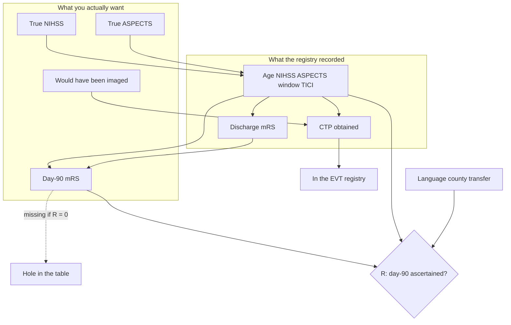

# Missing Data, Informative Ascertainment, and Measurement Error

## Opening

A complete-case table is a decision to throw patients away. Last observation carried forward is a decision to pretend discharge is day 90. Inverse-probability weights are a decision about whose missingness you believe you understand. None of those decisions is “preprocessing.” Each is a model for why the number is absent, and each writes itself into the posterior you will later quote as if the registry had been fully observed.

## Learning objectives

After working this chapter you should be able to:

- Distinguish MCAR, MAR, and MNAR as statements about a joint distribution, not as slogans about how hard you tried to call patients.
- Contrast joint Bayesian imputation, inverse-probability weighting, and last observation carried forward on the same teaching registry, and say which assumption each one is actually making.
- Recognize verification bias as a missing-reference problem and generalize it to any setting in which the expensive measurement is reserved for the people you already think are interesting.
- Write a measurement-error submodel for NIHSS, ASPECTS, or mRS rather than treating the recorded integer as the truth.
- Specify a `brms` model that uses `mi()` for missing covariates and a measurement or selection submodel when the missingness or the error is the scientific object.

## Clinical vignette

A teaching endovascular registry at a comprehensive center has enrolled 400 consecutive patients with anterior-circulation large-vessel occlusion who underwent EVT over three years. The primary scientific question the registry was built to answer is the 90-day ordinal mRS contrast between patients treated 0–6 hours after last known well and patients treated 6–24 hours, adjusted for age, NIHSS, ASPECTS, occlusion site, and reperfusion (TICI 2b–3). The late-window patients are the ones the fellowship wants a paper about.

Day-90 mRS is missing in 88 of 400 (22%). The coordinator’s note is almost always the same: “went home to another county; no working number; outside hospital will not release the score.” Discharge mRS is complete. NIHSS is complete but was recorded by whoever was in the bay — sometimes a certified attending, sometimes a night float who has taken the video course once. ASPECTS is complete on paper; 140 of the 400 scores are from the on-call resident, the rest from a single attending who later over-read a convenience subset. CT perfusion was obtained in 168 of 274 late-window patients and in 31 of 126 early-window patients. The perfusion-negative late-window patients were usually not taken for EVT and therefore are not in this registry at all.

**Teaching counts, not a published series.** Among the 312 with observed day-90 mRS, 118 are 0–2. Among the 88 with missing day-90 mRS, discharge mRS was 0–2 in 51 (58%), 3 in 19, 4–5 in 14, and 6 (in-hospital death) in 4 — the four deaths should not have been missing, which is your first data-quality finding. Preferred language was not English in 34 of the 88 missing (39%) versus 52 of 312 observed (17%). Transfer-in from another county accounted for 61 of 88 missing (69%) versus 98 of 312 observed (31%). Mean recorded NIHSS was 14.1 in the observed and 12.4 in the missing.

Do not impute yet. Write three sentences: (1) a mechanism that would make these 88 missing completely at random, (2) a mechanism that would make them missing at random given the covariates you already have, and (3) a mechanism that would make them missing not at random even after those covariates. Then write the estimand the fellowship thinks it is estimating.

## Missingness is a joint distribution

Let \(Y\) be the scientific outcome (day-90 mRS), \(X\) the covariates you intend to condition on, and \(R\) the response indicator: \(R = 1\) if \(Y\) is observed, \(R = 0\) if not. The object you wish you had is \(p(Y \mid X)\), or \(p(Y \mid X, A)\) if \(A\) is an exposure such as early versus late window. The object the complete cases give you is \(p(Y \mid X, R = 1)\). Those are the same distribution if and only if \(Y \perp R \mid X\). That independence is not a vibe. It is a restriction on the joint \(p(Y, R \mid X)\).

Every analysis of a registry with holes is an analysis of that joint, whether or not the paper writes \(R\). Complete-case logistic regression assumes the restriction. Multiple imputation assumes a model for \(Y \mid X\) and, usually, the same restriction. Inverse-probability weighting assumes a model for \(R \mid X\) and the same restriction. A selection model writes \(p(R \mid Y, X)\) explicitly. A pattern-mixture model writes \(p(Y \mid R, X)\) explicitly. Last observation carried forward assumes that discharge mRS *is* day-90 mRS for anyone with \(R = 0\). That last assumption is a degenerate pattern-mixture model with a point-mass bridge from discharge to day 90. It is not “conservative.” It is a story about recovery that nobody who has walked a stroke clinic would sign.



The figure is the chapter. Arrows into \(R\) are why the 88 are gone. Arrows into the recorded NIHSS and ASPECTS are why the integers in the spreadsheet are not the clinical states. The arrow from “would have been imaged” into the registry is why late-window contrasts estimated in treated patients are not contrasts in presenting patients.

!!! tip "Clinical Pearl"
    Before you pick a package, draw \(Y\), \(R\), and every variable that a coordinator would use to decide whether to keep calling. If a cause of missingness is not in the diagram, it will not be in the imputation model, and calling the procedure “MAR” will not put it there.

## MCAR, MAR, MNAR are statements about arrows

Rubin’s taxonomy is a partition of assumptions about \(p(R \mid Y, X)\).

**Missing completely at random (MCAR).** \(R \perp (Y, X)\). The 88 are a simple random sample of the 400. The coordinator’s county story already refutes this. Transfer-in, language, and discharge mRS all move the missingness rate. A Little MCAR test would reject; you do not need one. What you need is to stop writing “data were assumed MCAR” in a limitation paragraph as if the phrase were a courtesy.

**Missing at random (MAR).** \(R \perp Y \mid X\). Given the covariates in the model — and *only* those — missingness does not still depend on the unobserved day-90 score. MAR is not a property of the world. It is a property of the variables you condition on. Add preferred language, transfer status, discharge mRS, and window, and a story that “we lose people who go home well to another county” can be MAR: going home well is in \(X\) via discharge mRS, and county is in \(X\) via transfer. The same story is MNAR if the people who go home well and then *worsen* are harder to find than the people who go home well and stay well, and you have no variable that captures the worsening.

**Missing not at random (MNAR).** \(R \not\perp Y \mid X\). Residual dependence on the unobserved value. Classic stroke versions: the patient who is devastated and in a nursing home whose staff will not come to the phone; the patient who has recovered completely and screens the unknown number; the patient who died at home and whose death is not in your EHR. Those three mechanisms pull \(Y\) in opposite directions. A single “MNAR sensitivity parameter” that shifts every missing mRS toward worse is a policy, not a description of the three.

!!! warning "Common Pitfall"
    Do not diagnose MAR by showing that missingness is associated with \(X\). That association is compatible with MAR *and* with MNAR. The association of \(R\) with *observed* \(Y\) is not identifiable. What you can do is (i) condition on a richer \(X\), (ii) write the MNAR mechanism you actually fear, and (iii) report how the posterior on the estimand moves when that mechanism is allowed.

A compact teaching table for the vignette, still invented:

| Assumed mechanism | What you are claiming | Estimand if the claim is wrong |
| --- | --- | --- |
| MCAR | The 88 are a coin flip | Complete-case mRS 0–2 rate is unbiased — it is not |
| MAR given discharge mRS, language, transfer, window, NIHSS | Those variables soak up every reason a score is missing | Residual MNAR still biases the late-window contrast |
| MNAR, “missing are worse” | Unobserved day-90 mRS stochastically worse than predicted | Over-correction if the missing are mostly well transfers |
| MNAR, “missing are better” | The opposite tilt | Under-correction if nursing-home nonresponse dominates |
| LOCF | Discharge mRS equals day-90 mRS | Recovery after discharge is defined out of existence |

The complete-case day-90 mRS 0–2 rate is \(118/312 \approx 0.38\). If the 88 followed the same distribution as the observed, the registry rate would be the same. If the 88 followed their discharge distribution (LOCF), you would add 51 extra 0–2 scores and the rate would be \(169/400 = 0.42\). If the 84 living missing patients were systematically one mRS step worse than a MAR imputation from discharge and covariates would predict, the rate falls back toward 0.36. Those three numbers — 0.38, 0.42, 0.36 — are **teaching functionals** of three different joints. Quoting one of them as “the registry’s 90-day independence rate” without naming the joint is how posters get written.

## Joint Bayesian imputation, IPW, and LOCF are different models

Three procedures dominate clinical papers. They are not robust cousins. They answer different questions under different restrictions.

**Last observation carried forward.** Replace missing day-90 mRS with discharge mRS. No posterior uncertainty for the filled values. No model for recovery. In stroke, discharge to day 90 is when most of the interesting improvement *and* most of the post-discharge death happens. LOCF freezes both. It also creates a spuriously precise likelihood: 400 “observed” ordinal outcomes, 88 of which are copies. Interval estimates shrink. That shrinkage is fiction.

**Inverse-probability weighting.** Estimate \(e(X) = P(R = 1 \mid X)\), then analyze the complete cases with weights \(1/\hat{e}(X)\). Under MAR and a correct model for \(e(X)\), the weighted estimating equation is consistent for the parameter of \(p(Y \mid X)\) (or of a marginal contrast). The method discards the missing \(Y\) entirely and up-weights the observed people who looked like the missing. It does not use discharge mRS as an *outcome* bridge except insofar as discharge sits in \(X\). Stabilized weights and truncation at the 1st/99th percentile are engineering. They do not repair a missing predictor of \(R\). In the vignette, a logistic model for \(R\) that omitted language would treat a non-English-speaking transfer as exchangeable with an English-speaking local of the same NIHSS, and then overweight the wrong complete cases.

**Joint Bayesian imputation.** Write a model for the full data, including the missing \(Y\), and sample the missing values from their posterior predictive distribution given everything you believe is relevant. Under MAR this is

\[
p(Y_{\text{mis}} \mid Y_{\text{obs}}, X, R) = p(Y_{\text{mis}} \mid Y_{\text{obs}}, X),
\]

so you can ignore the missingness model once \(X\) is rich enough. Under MNAR you cannot; you need \(p(R \mid Y, X)\) or \(p(Y \mid R, X)\). The Bayesian part is not a branding exercise. It is the bookkeeping that carries uncertainty about the filled-in scores into the posterior for the scientific estimand. Rubin’s combining rules for multiple imputation are a special case: \(M\) draws of the missing data, \(M\) completed-data analyses, then a between-plus-within variance. A single joint MCMC that updates parameters and missing values together *is* the combining rule, and it does not require \(M = 5\) as a ritual.

!!! note "Mathematical Detail"
    Pattern-mixture and selection models are reparameterizations of the same joint. Selection: \(p(Y \mid X)\, p(R \mid Y, X)\). Pattern-mixture: \(p(Y \mid R, X)\, p(R \mid X)\). Identification always fails without a restriction that reaches into the missing pattern. On an outcome where higher is worse (mRS), a typical restriction is a shift of the latent linear predictor, \(\eta_{R=0} = \eta_{R=1} + \delta\), with \(\delta > 0\) meaning the missing are worse. Equivalently, on the `brms` cumulative logit \(P(Y \le k) = \operatorname{logit}^{-1}(\tau_k - \eta)\), that same “missing are worse” story is a *negative* increment to \(\operatorname{logit} P(Y \le k \mid R = 0, X)\). Adding a positive \(\delta_k\) to the cumulative logit would tilt the missing toward *better* scores — the opposite of the elicitation question. The sensitivity parameter is not estimable from the observed data. You either elicit \(\delta\) on the latent scale (“how many logit steps worse do we fear the missing are?”) or you report a curve of posteriors against \(\delta\).

Which procedure for the vignette? LOCF is not a candidate unless you are writing a sensitivity row labeled “if nobody changed after discharge.” IPW is a candidate if you trust a model for \(R\) more than a model for \(Y\), and if you only care about a low-dimensional contrast. Joint imputation is the candidate if you have a scientifically defensible model for ordinal mRS given age, NIHSS, ASPECTS, window, TICI, discharge mRS, and language, and if you want a posterior that knows the 88 scores were not seen. In a teaching analysis the two honest numbers to put side by side are a MAR joint imputation and one MNAR shift. IPW belongs in a third column as a check that the imputation model is not doing all the work.

A second teaching table, still invented, for the late-versus-early contrast on the utility-weighted mRS (UW-mRS; teaching scale with death at 0 and mRS 0 at 1):

| Procedure | Posterior mean increment (late − early), teaching | 95% ET interval | What the interval pretends not to know |
| --- | ---: | --- | --- |
| Complete cases | −0.04 | −0.11 to 0.03 | The 88, and measurement error |
| LOCF | −0.01 | −0.07 to 0.05 | Recovery and death after discharge |
| IPW, MAR for \(R \mid X\) | −0.05 | −0.13 to 0.04 | Outcome-model misspecification; residual MNAR |
| Joint MAR imputation | −0.05 | −0.12 to 0.03 | Residual MNAR; NIHSS/ASPECTS error |
| Joint MNAR, \(\delta = +0.4\) logit steps worse if missing | −0.08 | −0.16 to 0.00 | The value of \(\delta\) |
| Joint MAR + NIHSS/ASPECTS measurement submodel | −0.04 | −0.13 to 0.05 | Residual MNAR |

The qualitative lesson is the one you carry to the next registry meeting: the point can move by a few hundredths, and the interval can widen by a third, once you stop treating the spreadsheet as fully observed truth. That movement is often larger than the “adjusted versus unadjusted” movement the fellowship was arguing about.

## Verification bias is missing data with a clinical name

Chapter 11 treated verification bias as the problem of a reference standard obtained only in the transferred. The general pattern is identical to \(R\) above. Let \(T\) be an index test (spoke CTA, CTP profile, an automated LVO flag) and \(D\) the reference (DSA, 90-day infarct territory, a core-lab ASPECTS). If \(D\) is ascertained only when \(T\) is positive, or only when someone already wants the procedure, then \(p(T \mid D, \text{verified})\) is not \(p(T \mid D)\). Sensitivity computed in the verified is flattered; specificity is unidentified or worse.

The EVT registry is a verification-bias machine for perfusion. CTP is the index profile. “EVT performed” is a collider on the path from the perfusion map to the outcome. Patients with a large estimated core and a small penumbra are less often taken for EVT, especially after hour six, and therefore never enter a *treated* registry. Estimating “the effect of a favorable CTP profile on 90-day mRS among EVT patients” conditions on a variable downstream of the profile. A favorable map looks less prognostic than it is in presenting patients, because the unfavorable maps that would have done badly were never treated — or, conversely, the few unfavorable maps that *were* treated were treated for unrecorded reasons that also affect outcome (young, dominant hemisphere, family insistence). This is not a subtlety of causal graphs. It is the reason DAWN and DEFUSE-3 cannot be read as “CTP is required” and cannot be read as “CTP is irrelevant” from a treated-only series.

The honest moves are the same as in the missing-outcome problem:

1. **Change the estimand.** “Among patients who received EVT” is a different question from “among patients who presented with LVO in a late window.” Write the one you mean.
2. **Get the denominator.** A presentation registry — every LVO CTA, treated or not — lets you model selection into EVT and into CTP. The treated-only file cannot.
3. **Model the missing reference.** If the scientific object is the accuracy of CTP against a core-lab tissue fate, and tissue fate is missing in the untreated, that is a latent-class or imperfect-reference problem, not a complete-case ROC.

!!! warning "Common Pitfall"
    Do not compute the sensitivity of “favorable CTP” for “good outcome after EVT” and then call it a diagnostic accuracy paper. Outcome after treatment is not a reference standard for the map. It is a joint of the map, the treatment decision, the reperfusion, and the missingness.

Generalized verification bias is everywhere in neurology once you look. Who gets an EEG after a first seizure. Who gets a lumbar puncture for possible encephalitis. Who gets a formal neuropsychological battery after a “recovered” ICU stay. Who gets a 90-day mRS from a certified rater rather than a telephone score from a coordinator. In each case the expensive measurement is reserved for a selected slice, and the paper then reports the measurement’s properties as if the slice were the population.

## The integers are not the clinical states

NIHSS, ASPECTS, and mRS are recorded as integers. They are measurements of latent clinical states. Treating the integer as the state is a measurement-error model with noise variance fixed at zero.

**NIHSS.** Inter-rater disagreement of two to three points is ordinary, larger in aphasia and neglect, larger still when one rater is a night-float intern and the other is a certified research coordinator. The error is not classical white noise. It is differential: more error in the sick and the aphasic, and sometimes systematic (the fellow who never scores anosognosia). If NIHSS is a covariate in the outcome model, classical error flattens its coefficient and can spill bias into the window coefficient if late-window patients are scored by a different mix of raters. If NIHSS is an inclusion criterion — “NIHSS ≥ 6” — measurement error is also misclassification into and out of the cohort.

**ASPECTS.** The step from 8 to 7 is not the step from 5 to 4. Resident–attending kappa in the 0.6 range is a **teaching order of magnitude**, not a citation. Early ischemic change is harder on a 3 a.m. scanner with motion. A late-window patient with a true ASPECTS of 5 who is scored 7 enters EVT; the reverse patient may not, and if this is a treated registry you will never see them. That is measurement error *and* selection.

**mRS.** The scale’s scientific career is a history of boundary arguments: 1 versus 2, 2 versus 3, 3 versus 4. Structured interviews and certification improve agreement; they do not make it 1. Telephone mRS versus in-person mRS is a different instrument. A day-90 score obtained from a spouse is not the same random variable as a score obtained from the patient. If missingness is filled by a telephone call to a family member in another county, the imputation model and the measurement model are the same object: you are inferring a latent functional state from a noisy, sometimes biased, sometimes absent instrument.

A usable measurement submodel is

\[
W = Y^{\star} + U, \qquad U \mid Y^{\star}, V \sim F_{\psi},
\]

where \(W\) is what was written down, \(Y^{\star}\) is the latent state, and \(V\) may include rater identity, language, and whether the score was in person. For an ordinal truth, a more natural version is a cumulative probit for \(W\) given \(Y^{\star}\), or a discrete-error matrix \(P(W = k \mid Y^{\star} = j)\) with most mass on the diagonal and the adjacent cells. Replicate ratings — the attending over-read of 140 ASPECTS, dual-scored NIHSS on a research subset — identify \(\psi\) without heroics. A single rating plus a prior on the error matrix is weaker and should be reported as such.

!!! tip "Clinical Pearl"
    If you have any dual-scored subset, that subset is worth more than another hundred singly scored rows. It is the likelihood for the error model. A registry that never dual-scores NIHSS or mRS has decided, silently, that measurement error is zero.

## Selection into perfusion imaging

Return to the 168 of 274 late-window patients who received CTP. The 106 who did not are not MCAR with respect to creatinine, age, time, “the scanner was down,” or “the fellow thought the ASPECTS already answered the question.” A model for 90-day outcome given a CTP target-mismatch indicator, fit only in the imaged, describes imaged patients. Transporting that description to the next late-window arrival requires either (i) a claim that imaging was effectively randomized given the covariates you have, or (ii) a model for selection into imaging and a statement of the population you are predicting for.

Let \(S = 1\) if CTP is obtained. A selection-into-imaging model is a probit or logit for \(S\) given age, time, creatinine, ASPECTS, NIHSS, and site. Under MAR — imaging depends on those variables but not on the unobserved perfusion map or on the potential outcome — you can impute maps or, more often, simply refuse to report map-based coefficients as if they applied to the unimaged. Under MNAR — the fellow skips CTP when the patient “looks futile,” and “looks futile” is a function of a gestalt that also predicts a large core — the map is missing for reasons that a recorded ASPECTS only partly captures.

The registry has a deeper selection layer. Patients with unfavorable maps who were *not* taken for EVT are absent entirely. This is not missing data in the file. It is missing data in the sampling frame. No imputation model run inside the treated file resurrects them. The only Bayesian move that helps is to change files: analyze the presentation cohort, with EVT as a treatment and CTP as a covariate or a mediator, and write the missing maps and missing outcomes with the same joint-model honesty this chapter applies to the 88.

!!! info "What the fellowship paper can honestly say"
    A treated-only, 22%-missing, singly scored registry can support a descriptive posterior for *observed* 90-day mRS among *treated* patients, under a named MAR or MNAR assumption, with a measurement submodel if you have any replicates. It cannot support “late-window EVT works when CTP is favorable” as a causal or even as a transportable prognostic claim. The limitation is not a paragraph. It is the estimand.

## For the biostatistician / methodologist

Write the joint. A practical factorization for the vignette is

\[
p(Y^{\star}, W_Y, N^{\star}, W_N, A^{\star}, W_A, R, S \mid X_0)
\]

where starred quantities are latent states, \(W\) are recorded scores, \(X_0\) are things you are willing to treat as error-free (age, clock time, occlusion site, recorded language), \(R\) is day-90 ascertainment, and \(S\) is CTP-obtained. Outcome, measurement, and selection are three likelihood pieces. Priors that matter are the MNAR shift (or the coefficient on \(Y^{\star}\) in a selection model for \(R\)), the error-matrix diagonals, and any hierarchical piece on raters.

In `brms`, missing *covariates* are handled by `mi()` on the right-hand side plus a submodel `x | mi() ~ ...`. Missing *outcomes* under MAR are handled by the ordinary likelihood: rows with `NA` in \(Y\) simply do not contribute an outcome term, and if you want those rows to contribute through a joint covariate model you include them in the imputation submodels. Measurement error with a known standard deviation uses `me(x, sdx)`. Measurement error with an unknown error and replicate readings is a multilevel measurement model: the latent state is a varying intercept, the readings are the observations. MNAR is not a `brms` flag. It is an extra linear predictor for \(R\) that includes \(Y\), or a pattern-mixture shift you impose on the imputed \(Y\).

Do not run `mice` with the default CART stack, feed the five completed files to five frequentist ordinal logits, and call the result a Bayesian missing-data analysis. That pipeline can be a decent MAR sensitivity. It is not a joint posterior, it does not know about ordinal measurement error, and it will not refuse an MNAR question.

Identification is the constraint, not computation. A selection model with a free coefficient of \(Y\) on \(R\) and no exclusion restriction is weakly identified; the posterior will wander unless the prior on that coefficient is doing scientific work. State the prior as a clinical sentence: “we put a Normal(0.4, 0.2) prior on the logit effect of a one-step-worse mRS on the probability of being missing, encoding the belief that worse outcomes are somewhat harder to ascertain.” Then show the posterior under a tighter and a flatter version.

## R: MAR imputation and a measurement submodel

The first block builds a teaching registry and fits a joint model in which discharge mRS, window, NIHSS, language, and transfer predict day-90 mRS, and the same variables predict missingness only through the outcome model (MAR given those covariates). The second block sketches a measurement submodel for NIHSS using a dual-scored subset. Both are specifications you should run locally; they are not cached results.

```r
# Teaching EVT registry: MAR joint model for missing day-90 mRS.
# 400 rows. 22% missing Y. Teaching coefficients, not a fit to real patients.

set.seed(20260818)
library(brms)
library(dplyr)

n <- 400
lang_ne <- rbinom(n, 1, 0.22)
transfer <- rbinom(n, 1, 0.40)
window_late <- rbinom(n, 1, 0.68)
age <- round(rnorm(n, 71, 12))
nihss_true <- pmin(42, pmax(0, round(rnorm(n, 15 - 1.2 * transfer, 6))))
dc_mrs <- pmin(6, pmax(0, round(0.35 * nihss_true / 3 + rnorm(n, 2.2, 1.1))))

# Latent day-90 mRS: some recovery from discharge, late window a bit worse.
eta <- -0.4 + 0.85 * dc_mrs + 0.25 * window_late + 0.03 * nihss_true
y_star <- pmin(6, pmax(0, round(eta + rnorm(n, 0, 0.8))))

# Missingness depends on language, transfer, and discharge (MAR given these).
psi <- -1.6 + 1.1 * lang_ne + 1.3 * transfer - 0.25 * dc_mrs
r <- rbinom(n, 1, plogis(psi))
y_obs <- ifelse(r == 1, y_star, NA_real_)

reg <- data.frame(
  y90 = y_obs,
  dc_mrs = dc_mrs,
  window_late = window_late,
  nihss = nihss_true,          # first pass: pretend NIHSS is error-free
  lang_ne = lang_ne,
  transfer = transfer,
  age = age
)

# Ordinal outcome under MAR: NA rows drop from the outcome likelihood.
# Include predictors of missingness so the complete-case restriction is
# closer to MAR. For a fully joint imputation of covariates, see mi() below.

priors_y <- c(
  prior(normal(0, 1), class = "b"),
  prior(normal(0, 2), class = "Intercept")
)

fit_mar <- brm(
  y90 ~ dc_mrs + window_late + nihss + lang_ne + transfer + age,
  data = reg,
  family = cumulative("logit"),
  prior = priors_y,
  chains = 4, iter = 2000, seed = 20260818, refresh = 0
)

# Contrast: posterior of P(Y <= 2 | late) - P(Y <= 2 | early)
# at representative covariates. Teaching functional only.
nd <- data.frame(
  dc_mrs = 3, nihss = 14, lang_ne = 0, transfer = 1, age = 71,
  window_late = c(0, 1)
)
# posterior_epred(fit_mar, newdata = nd)  # then difference column 1+2+3
```

A `mi()` specification becomes relevant when a *covariate* is missing — for example, if ASPECTS is absent in 40 patients and you refuse to complete-case them:

```r
# Joint imputation of missing ASPECTS, then use the imputations in the outcome.
# aspects | mi()  is the imputation submodel.
# mi(aspects)     puts the imputed values on the right-hand side of Y.

# Specification only. Uncomment after you have built `reg` with an aspects column:
# reg$aspects <- pmin(10, pmax(0, round(rnorm(n, 8 - 0.4 * window_late, 1.6))))
# reg$aspects[sample.int(n, 40)] <- NA_real_

# fit_mi <- brm(
#   bf(y90 ~ dc_mrs + window_late + nihss + mi(aspects) + lang_ne + transfer) +
#     bf(aspects | mi() ~ nihss + window_late + age) +
#     set_rescor(FALSE),
#   data = reg,
#   family = list(cumulative("logit"), gaussian()),
#   prior = c(
#     prior(normal(0, 1), class = "b", resp = "y90"),
#     prior(normal(0, 1), class = "b", resp = "aspects"),
#     prior(normal(8, 2), class = "Intercept", resp = "aspects")
#   ),
#   chains = 4, iter = 2000, seed = 20260818, refresh = 0
# )
```

Measurement error on NIHSS, when a dual-scored subset exists, is a multilevel model for the readings rather than `me()` with a made-up SD:

```r
# Long file: two NIHSS readings on 80 patients, one reading on the rest.
# nihss_read ~ 1 + (1 | id)  treats the patient intercept as latent NIHSS.
# That intercept then enters the outcome model as a generated quantity,
# or, in a fully joint specification, as a shared latent.
#
# fit_me <- brm(
#   bf(nihss_read ~ 1 + (1 | id)) +
#     bf(y90 ~ dc_mrs + window_late + lang_ne + transfer),
#   data = readings_long,
#   family = list(gaussian(), cumulative("logit"))
# )
# Sharing the latent NIHSS across formulas requires a custom Stan block
# or a two-stage draw: sample the intercepts, then feed them forward.
# Two-stage understates uncertainty unless you draw many times.
```

!!! example "R Deep Dive"
    An MNAR sensitivity in the same stack: after drawing MAR imputations of \(Y_{\text{mis}}\), shift the latent linear predictor for those rows by \(\delta \in \{0, 0.2, 0.4, 0.8\}\) logit units toward worse scores, reconstruct the ordinal category, and recompute the late-versus-early contrast. Plot the posterior mean and interval against \(\delta\). The figure is the sensitivity analysis. A single “MNAR-adjusted” number is a press release.

## Worked solution to the opening vignette

**(1) An MCAR mechanism.** The 88 scores were lost because a coordinator was on leave in a particular month and the calendar, not the patients, determined who was not called. The vignette already contradicts this: language, transfer, and discharge mRS all move \(R\).

**(2) An MAR mechanism.** Patients who go home to another county, who prefer a language other than English, and who look well at discharge are harder to reach, and *given those variables* the unobserved day-90 mRS does not further change the chance of a completed score. Conditioning on transfer, language, discharge mRS, window, and NIHSS then makes \(R \perp Y \mid X\). This is the most optimistic defensible story, and it is the story a joint MAR imputation or a well-specified IPW model assumes.

**(3) An MNAR mechanism.** Among transfers who looked well at discharge, the ones who later worsened — readmission, delayed hemorrhage, depression, a fall — are less likely to answer an unknown number than the ones who stayed well. Discharge mRS does not capture the worsening, so \(R\) still depends on \(Y\). A second MNAR mechanism runs the other way: nursing-home residents with mRS 4–5 have staff who will not bring them to the phone. The two mechanisms do not cancel just because they have opposite signs.

**The estimand the fellowship thinks it is estimating.** Usually, an adjusted contrast in 90-day functional outcome between late- and early-window EVT, spoken as if it were the effect of treating late rather than early, in presenting LVO patients. What the file can support is closer to: a descriptive, missingness-model-dependent contrast in recorded (or imputed) 90-day mRS among patients who already received EVT at this center, with singly scored NIHSS and ASPECTS treated either as error-free or as noisy readings. Those are not the same sentence. The CTP-selected late-window subset is one selection layer further from the presenting population.

On the numbers: do not quote \(118/312 = 38\%\) independence as the registry result. Quote a MAR-imputed posterior for the marginal 90-day mRS distribution, an MNAR sensitivity, and a complete-case row so a reader can see the movement. Do not fill the 88 with discharge mRS and then run an ordinal regression as if you had 400 outcomes. Do not drop the four in-hospital deaths that were coded as missing; recode them as 6 and audit how they became missing.

!!! warning "Common Pitfall"
    A “multiple imputation” that uses only age, sex, and NIHSS, while the coordinator’s notes mention county and language, is an MAR analysis for a world you do not work in. The imputation model must include the causes of missingness you already wrote down in the three sentences. Variables that predict \(R\) belong in the imputer even if they do not belong in the scientific estimand.

## Exercises

1. **Bedside / board.** A reviewer writes: “22% missing is acceptable; analysis was complete-case, so no imputation bias.” Draft a six-sentence reply that names the estimand, the MAR assumption the reviewer just made, and one MNAR mechanism the complete-case table cannot rule out. Do not mention software.

2. **Mechanisms.** Using the teaching counts, compute the complete-case and LOCF estimates of \(P(\text{mRS } 0\text{–}2)\). Then invent a third estimate under the assumption that the 84 living missing patients have the same discharge distribution shifted one category worse (mRS 6 stays 6; mRS 5 stays 5). Which of the three would you put in an abstract, and what would the other two be called?

3. **Verification.** A late-window paper reports that favorable CTP predicts independence after EVT with posterior mean risk difference 0.18, estimated in the 168 imaged and treated patients. List the selection steps between “presented with LVO after 6 hours” and “in this likelihood,” and write the estimand that 0.18 actually belongs to.

4. **Measurement and `brms`.** You have attending over-reads of ASPECTS on 140 of 400 scans; the resident score is present on all 400. Sketch a `brms` formula block that treats true ASPECTS as latent, uses both readings where available, and puts the latent score into an ordinal model for day-90 mRS. What prior would you put on the resident’s extra error variance, and what sentence would you write if the over-read subset was a convenience sample of “interesting” scans?

## Further reading

- Rubin DB. Inference and missing data. *Biometrika*. 1976;63:581–592.
- Little RJA, Rubin DB. *Statistical Analysis with Missing Data*. 3rd ed. Hoboken: Wiley; 2019.
- National Research Council. *The Prevention and Treatment of Missing Data in Clinical Trials*. Washington, DC: National Academies Press; 2010.
- Carpenter JR, Kenward MG. *Multiple Imputation and its Application*. Chichester: Wiley; 2013.
- Begg CB, Greenes RA. Assessment of diagnostic tests when disease verification is subject to selection bias. *Biometrics*. 1983;39:207–215.
- Carroll RJ, Ruppert D, Stefanski LA, Crainiceanu CM. *Measurement Error in Nonlinear Models*. 2nd ed. Boca Raton: Chapman & Hall/CRC; 2006.
- Keogh RH, White IR. A toolkit for measurement error correction, with a focus on nutritional epidemiology. *Statistics in Medicine*. 2014;33:2137–2155.
- Bürkner P-C. brms: an R package for Bayesian multilevel models using Stan. *Journal of Statistical Software*. 2017;80(1):1–28. See the `mi()` and `me()` vignettes.
- van Buuren S. *Flexible Imputation of Missing Data*. 2nd ed. Boca Raton: CRC Press; 2018.
- Saver JL et al. Standardizing the structure of stroke clinical and epidemiologic research data: the NINDS Stroke Common Data Element project. *Stroke*. 2012;43:967–973. For why mRS, NIHSS, and ASPECTS are not interchangeable instruments across modes of administration.

!!! success "Key Takeaway"
    A hole in a stroke registry is a parameter. MCAR is almost never true; MAR is a claim about the covariates you actually modeled; MNAR is the leftover dependence on the unseen score, and it is not one-directional. Joint Bayesian imputation carries the uncertainty of the hole into the posterior; IPW is a model for who was found, not for what their mRS was; LOCF is a recovery model you would not defend in clinic. Verification bias, selection into perfusion, and NIHSS/ASPECTS/mRS measurement error are the same joint-model problem with different clinical names. Write \(Y\), \(R\), the latent state, and the sampling frame before you write `brms`. The complete-case table is a posterior under the assumption that the missing are a coin flip. They went home to another county.
