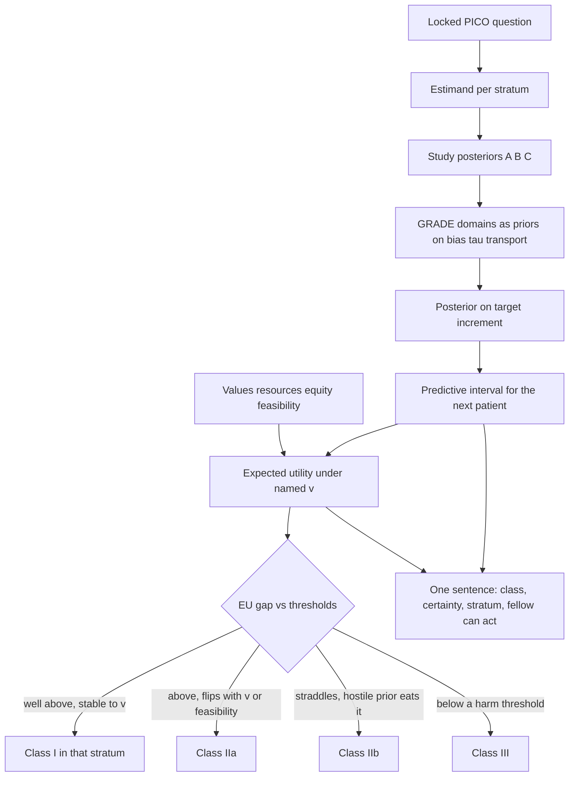

# From Posteriors to Guidelines: GRADE, Certainty, and Evidence-to-Decision

## Opening

A guideline sentence is a decision under a loss function that the panel almost never writes down. “Class I, Level A” is not a posterior probability. “We suggest” is not a credible interval. Certainty of evidence is not \(P(\delta > 0 \mid y)\). The panel that treats those four objects as synonyms will write a recommendation that no posterior, and no patient, can cash.

## Learning objectives

After working this chapter you should be able to:

- Map each GRADE domain — risk of bias, inconsistency, indirectness, imprecision, publication bias — onto a Bayesian object you could, in principle, put a posterior on.
- Explain why a large posterior probability of benefit is compatible with low certainty of evidence, and why a modest posterior mean can still support a strong recommendation.
- Write an evidence-to-decision (EtD) row as an expected-utility comparison, including values, resources, equity, and acceptability, not only the effect posterior.
- Apply the same discipline to diagnostic and prognostic questions, where the estimand is a likelihood ratio or a calibration slope rather than a treatment increment.
- Draft a class-of-recommendation sentence from prediction intervals and a named utility, and refuse to draft one from a \(p\)-value or from \(P(\delta > 0 \mid y)\) alone.

## Clinical vignette

You are the methodologist on a national stroke guideline panel. The question, locked last year, is: in adults with anterior-circulation LVO last known well 6–24 hours earlier, should EVT plus usual care be used rather than usual care alone? The panel has agreed to talk in 90-day utility-weighted mRS and in the simpler contrast \(P(\text{mRS } 0\text{–}2)\). Three posteriors sit in the evidence profile. They are **teaching posteriors**, built to look like the shape of the late-window literature without being a meta-analysis of named trials; each is summarized as Normal(mean, \(0.036^2\)), so every probability in the table can be reproduced by hand or with the R block below.

| Source (teaching) | Population | Posterior mean \(\delta\) on UW-mRS (EVT − control) | 95% ET interval | \(P(\delta > 0 \mid y)\) | \(P(\delta > 0.03 \mid y)\) |
| --- | --- | ---: | --- | ---: | ---: |
| A: tightly selected, imaging-rich RCT analogue | Age ≤ 80, NIHSS ≥ 10, core < 50 mL, mismatch | 0.14 | 0.07 to 0.21 | >0.999 | 0.999 |
| B: less selected RCT analogue | Broader core, some perfusion-ineligible | 0.08 | 0.01 to 0.15 | 0.98 | 0.91 |
| C: target-trial emulation in a national registry | Consecutive late-window LVO, treated and not | 0.04 | −0.03 to 0.11 | 0.86 | 0.61 |

Source A looks like the trials that made late-window EVT standard in selected patients. Source B looks like the next trial, the one that loosened imaging. Source C looks like the patients the guideline will actually meet at 02:00, including the ones A never enrolled. A voting member says, “A and B both have posterior probabilities above 0.95; that is high certainty; write Class I.” Another member says, “C includes zero; we cannot recommend this.” The chair asks you for one sentence in the house style: class of recommendation, level of evidence, and a qualifying clause that a night-shift fellow can act on.

Do not write the sentence yet. Write, in four bullets, what would lower your certainty in A, what would raise your certainty in C, whose values are missing from the table, and whether the recommendation is allowed to differ by imaging stratum.

## A guideline sentence is a decision, not a summary of \(p\)-values

The American Heart Association class of recommendation (I, IIa, IIb, III: no benefit, III: harm) and the GRADE language (strong / conditional; high / moderate / low / very low certainty) are two dialects of the same act: choose an action for a described patient, and say how sure you are that the action is the right one. Certainty is a property of the *body of evidence for a specified estimand*. Strength is a property of the *recommendation*, which also depends on values, costs, equity, and the shape of the loss. Collapsing them into “the evidence is strong” is the original sin of guideline prose.

A Bayesian panel does not escape this. It inherits a cleaner language for one piece — the posterior on the effect in a defined population — and a temptation to treat that posterior as the whole EtD. \(P(\delta > 0 \mid y) = 0.999\) in population A is a functional of one likelihood, one prior, and one estimand. It is not a warrant for a Class I sentence aimed at population C. It is not a warrant for ignoring symptomatic intracranial hemorrhage, futile reperfusion, or the fact that half the panel’s hospitals cannot offer on-call perfusion reconstruction at 02:00.

The object you owe the chair is

\[
a^{\star}(x) = \arg\max_{a} \mathbb{E}\bigl[U(a, \theta, x) \mid \text{evidence}\bigr],
\]

where \(x\) is the patient stratum (imaging-selected or consecutive late-window; age; prestroke mRS), \(\theta\) collects every uncertain input (effect, harm, baseline risk, resource use), and \(U\) is the panel’s explicit, contested utility. The class of recommendation is a discretization of \(a^{\star}\) and of the expected-utility gap. The level of evidence is a discretization of how much the posterior on that gap would move if the most fragile assumptions were relaxed. Those are different discretizations.

!!! tip "Clinical Pearl"
    When a member says “the posterior probability is 0.99, so Class I,” ask: probability of *what*, in *whom*, under *which prior*, and *valued how*? If any of the four is missing, you do not have a recommendation. You have a slide.

## GRADE domains as Bayesian objects

GRADE’s five downgrading domains were written in a frequentist dialect. Each one is already a Bayesian object. Naming the object does not make the judgment automatic. It makes the judgment a functional you can argue about.

**Risk of bias.** A design defect is a threat that the likelihood you wrote is not the likelihood that generated the data. Unblinded mRS, incomplete day-90 ascertainment, post-randomization imaging exclusions, and registry confounding are not “limitations.” They are missing arrows in the model (Chapter 24). The Bayesian version is a bias parameter \(b\) with a prior, and a posterior on \(\delta_{\text{target}} = \delta_{\text{study}} - b\). If you refuse to put a prior on \(b\), you are not being rigorous. You are setting \(b = 0\) with probability 1. A panel that downgrades for risk of bias without saying how far \(\delta\) might move has performed a ritual. A panel that reports \(p(\delta_{\text{target}} \mid y)\) under a skeptical bias prior and under \(b = 0\) has performed an analysis.

**Inconsistency.** Heterogeneity is a posterior on \(\tau\), or on a discrete difference between populations A, B, and C. It is not an \(I^2\). If the three teaching posteriors above are treated as exchangeable draws from a common mean, a hierarchical posterior on that mean and a naive inverse-variance pool *agree*: A, B, and C have the same 95% ET width (\(\pm 0.07\)), so they have the same sampling variance, and both estimators sit at \((0.14+0.08+0.04)/3 = 0.087\). Hierarchical reweighting toward the noisier study happens only when the widths differ — random-effects weights \(1/(\sigma_i^2+\tau^2)\) are more equal than inverse-variance weights \(1/\sigma_i^2\). The teaching table was built so that C is *not* noisier; it is a different estimand with the same precision. Refusing exchangeability is often the right scientific act: A is not a noisy version of C. GRADE “inconsistency” then splits into two questions. Are the studies estimating the same \(\delta\)? If yes, what is the posterior on \(\tau\)? If no, you do not have inconsistency. You have several questions, and the recommendation may have to split.

**Indirectness.** The study population, intervention, comparator, or outcome is not the one in the recommendation question. Bayesian name: a transport or extrapolation parameter. Source A’s \(\delta = 0.14\) is not indirect for the imaging-selected question; it is indirect for the consecutive late-window question. The gap between 0.14 and 0.04 is partly sampling noise and partly a different causal estimand. A prior on the transport increment — “we expect the effect in consecutive patients to be 30–70% of the effect in DAWN-like patients” — is an elicitable object. Pretending A answers the consecutive question and then “downgrading for indirectness” by one categorical notch is a lossy compression of that prior.

**Imprecision.** GRADE operationalizes imprecision with confidence-interval location relative to decision thresholds, and with information size. The Bayesian object is the posterior mass between the thresholds the panel has already named, or the posterior expected utility gap’s interval. A 95% ET interval of 0.07 to 0.21 that lives entirely above a pre-declared worthwhile increment of 0.03 is precise *for that threshold*. The same interval is imprecise for a threshold of 0.20. Imprecision is not a property of an interval’s width in the abstract. It is a property of an interval relative to the utility the recommendation will use.

**Publication bias.** A selection model on the study-level reporting process. The Bayesian version is older than GRADE: a model for \(P(\text{published} \mid \hat{\delta}, \text{se})\), or a selection function in a hierarchical meta-analysis. For late-window EVT the threat is not a file drawer of null RCTs so much as a file drawer of null registries and a literature of positive single-arm series. The teaching source C is the attempt to put that world on the table. Downgrading A and B for “possible publication bias” while ignoring C is backwards.

!!! note "Mathematical Detail"
    A compact GRADE-as-posterior setup for a single contrast: \(\delta_{\text{target}} = \delta_{\text{obs}} - b_{\text{bias}} - b_{\text{indirect}} + u\), \(u \sim \mathcal{N}(0, \tau^2)\), with priors on \((b_{\text{bias}}, b_{\text{indirect}}, \tau)\) elicited from the panel *before* they see the pooled number. The certainty rating then corresponds to a pre-declared functional — for example, whether the 95% ET interval for \(\delta_{\text{target}}\) lies entirely on one side of a threshold — not to a separate qualitative vote. The qualitative vote is how you set the priors when the panel will not sign a number for \(b\).

Upgrading domains in GRADE (large effect, dose–response, residual confounding against the observed effect) have the same translation. A “large effect” is posterior mass far from a null *and* a bias prior that cannot eat the gap. Residual confounding that would have pushed against the observed benefit is a signed prior on \(b_{\text{bias}}\). None of this requires the panel to become a Stan workshop. It requires the panel to stop using “large effect” as a synonym for “we were impressed.”

| GRADE domain | Bayesian object | What the panel must still judge |
| --- | --- | --- |
| Risk of bias | Prior and posterior on \(b_{\text{bias}}\) | How broken is the likelihood, in \(\delta\) units |
| Inconsistency | Posterior on \(\tau\), or a decision that estimands differ | Exchangeable or not |
| Indirectness | Transport parameter from study \(x\) to target \(x'\) | How much of A is allowed to speak about C |
| Imprecision | Posterior mass relative to a utility threshold | Where the threshold sits |
| Publication bias | Selection model on the evidence base | What is missing, and in which direction |
| Large effect (upgrade) | Mass far from null after a hostile bias prior | Whether “large” survives \(b \ne 0\) |

## Certainty is not \(P(\delta > 0 \mid y)\)

This is the sentence the vignette’s first voting member got wrong, and it is the sentence Bayesian enthusiasts get wrong in print.

\(P(\delta > 0 \mid y)\) is the posterior probability that a defined increment is positive, under a defined model and prior. Certainty of evidence is a qualitative or semi-quantitative judgment about how much that posterior — or the recommendation that uses it — would move if the model, the prior, the missing studies, the missing patients, and the mismatched population were allowed to be as hostile as a reasonable critic would allow. You can have \(P(\delta > 0 \mid y) = 0.999\) in A and low-to-moderate certainty that *late-window EVT benefits consecutive presenting patients*, because the 0.999 does not attach to that estimand. You can have \(P(\delta > 0 \mid y) = 0.86\) in C and moderate certainty about a small effect in consecutive patients, if C’s design is the one that matches the question and its bias prior is not catastrophic.

A second, independent confusion is with the strength of recommendation. GRADE already insists that a strong recommendation can rest on low-certainty evidence (a cheap, harmless intervention for a disastrous outcome) and that a conditional recommendation can rest on high-certainty evidence (a close trade-off that depends on values). Expected utility makes the same point without the theology. If the harm of withholding EVT from a patient who would have benefited is much larger than the harm of offering it to one who will not, the treatment threshold sits low (Chapter 14), and a modest posterior mean with a wide interval can still put most of the posterior above that threshold. Conversely, if the procedure is expensive, inequitably distributed, and harmful when futile, the threshold sits higher, and even a 0.999 in a selected trial may not clear it for the unselected.

!!! warning "Common Pitfall"
    Do not write “high certainty of benefit because the posterior probability was 0.99.” Write the estimand, the threshold, the bias and transport assumptions, and then a certainty word that tracks those assumptions. Journals that have started to accept Bayesian trials are already filling with the first sentence. Guideline panels do not have to copy them.

Teaching translation of the three posteriors, before any EtD:

| Question the posterior is allowed to answer | Best source | \(P(\delta > 0.03 \mid y)\) | Certainty for *that* question (teaching judgment) |
| --- | --- | ---: | --- |
| Imaging-selected late-window LVO, trial-like patients | A | 0.999 | Moderate-to-high: residual concern is transport to less expert systems, not the sign of \(\delta\) |
| Intermediate imaging, RCT-like care | B | 0.91 | Moderate: one analogue, looser selection, still not consecutive |
| Consecutive late-window LVO in ordinary systems | C, with A/B as priors on a transport increment | 0.61 | Low-to-moderate: confounding, missing data, measurement, and a small mean |

The >0.999, the 0.98, and the 0.86 do not appear in the last column. They answered a different question.

## Evidence-to-decision is expected utility with more arguments

The GRADE EtD framework asks the panel to walk through: desirable effects, undesirable effects, certainty, values, balance, resources, cost-effectiveness, equity, acceptability, feasibility. That list is a utility function written as a committee agenda. A Bayesian panel should treat it as such, not as a set of twelve unstructured votes.

Let \(\theta = (\delta^{+}, \delta^{-}, c, e)\) collect the benefit increment, the harm increment, the incremental resource cost, and an equity index (for example, the difference in expected benefit between a comprehensive center and a spoke that has to transfer). Let \(v\) collect value weights — how the panel, or the patients the panel claims to represent, trade mRS utility against hemorrhage, against time in transfer, against money. Then

\[
EU(a = \text{recommend EVT}; x) = \mathbb{E}\bigl[v^{\top} f(\theta, x) \mid \text{evidence}\bigr],
\]

and the same for \(a = \text{recommend against}\) and \(a = \text{recommend in a stratum}\). The “balance of effects” row is the first two components. The “resources” row is \(c\). The “equity” row is \(e\). Acceptability and feasibility are constraints or additional penalties: a recommendation that cannot be enacted at the spoke is a different action, not the same action with a footnote.

Two consequences follow.

First, the panel must name \(v\). A room of interventionalists, vascular neurologists, emergency physicians, a rehabilitation voice, and a patient representative will not share \(v\). That disagreement is not noise to be averaged away in a straw poll. It is the reason GRADE has a values row. Record the range. If the recommendation flips inside that range, the recommendation is conditional on values and should say so.

Second, equity is not a qualitative afterthought. Late-window EVT given only at comprehensive centers, only when CTP is available, only when the fellow can reconstruct the map, is a recommendation that allocates benefit to people who already live near those centers. Source A’s 0.14 increment, transported without an equity term, will produce a Class I sentence that widens a geographic gap. Source C’s 0.04, if concentrated in the same centers, may still widen it. An EtD that does not put a number — even a rough, elicited one — on the spoke-versus-hub difference has decided that the difference has weight zero.

!!! info "What ‘conditional’ actually means"
    A conditional (weak, Class IIa/IIb) recommendation is not a failed Class I. It is a statement that the expected-utility gap is small, or that it changes sign inside the range of reasonable \(v\), or that feasibility and equity constrain the action to a stratum. Writing “we suggest” and then using Class I verbs in the remarks is how panels smuggle a strong recommendation past a weak vote.

A teaching EtD slice for the vignette, still invented:

| EtD criterion | Teaching judgment | How it enters \(U\) |
| --- | --- | --- |
| Desirable effects | Meaningful in A; small in C | Posterior on \(\delta^{+}\) by stratum |
| Undesirable effects | sICH and futile reperfusion, both uncommon but severe | Posterior on \(\delta^{-}\); heavier weight if prestroke mRS ≥ 3 |
| Certainty | High-ish for A’s estimand; lower for C’s | Width of the EU gap under hostile bias/transport priors |
| Values | Most patients weight independence and survival well above procedural risk; some weight survival-with-mRS-5 as worse than death | Range of \(v\); check for flip |
| Resources | Procedure, transfer, ICU bed | \(c\); not zero at a capacity-constrained hub |
| Equity | Benefit currently accrues to imaged, transferable, urban patients | \(e\); a recommendation that *requires* CTP hardens this |
| Feasibility | 24/7 EVT is not universal; 24/7 CTP is less so | Constraint: do not write a sentence that is impossible at the spoke |

## Diagnostic and prognostic GRADE

The same machinery applies when the question is not “treat or not” but “test or not” or “believe this predictor.” GRADE for diagnosis and the GRADE approach to prognosis change the estimand. They do not change the logic.

**Diagnostic.** The evidence profile’s primary objects are sensitivity, specificity, likelihood ratios, and downstream consequences of true and false results (Chapter 11, Chapter 14). Certainty domains attach to those objects. Indirectness is especially common: a CTA-for-LVO accuracy study done at a comprehensive center with dedicated readers is indirect for the spoke overnight read. Imprecision is posterior width on the LR, or on the post-test probability at the pre-test the recommendation assumes. A “strong recommendation to test” is an expected-utility statement that the test–treat threshold and the test threshold of Pauker–Kassirer are both crossed for the named pre-test range. \(P(\operatorname{Se} > 0.90 \mid y) = 0.97\) is not that statement.

**Prognostic.** The objects are calibration, discrimination, and the increment in decisions when the predictor is added (Chapter 15’s decision-curve language). A model that predicts 90-day mRS after late-window presentation can have a gorgeous AUC in derivation and low certainty for use at a new hub, because transport of a predictor is a different problem from transport of a treatment effect. GRADE-style downgrading for “validation in a single center” is a transport prior. Write it that way: the posterior predictive distribution in a *new* center is wider than the posterior in the development center by an amount governed by \(\tau_{\text{center}}\). If you have no second center, \(\tau_{\text{center}}\) is a prior, and the certainty word should track that prior, not the derivation C-statistic.

!!! warning "Common Pitfall"
    Do not certify a prognostic score as “high-certainty” because a Bayesian hierarchical model produced tight intervals in the development sample. Tight intervals are what overfitting looks like when you have not left any data out. Certainty for a prognostic recommendation lives in the posterior *predictive* at a new site, not in the posterior mean of an AUC.

## Writing the recommendation from prediction intervals

A class-of-recommendation sentence should be a function of (i) the predictive distribution of benefit and harm in the *target* patient, (ii) the panel’s thresholds, and (iii) the EtD constraints. A posterior interval for a trial estimand is an input. A prediction interval — or a posterior predictive interval — for the next patient, or the next hospital, is closer to what the fellow at 02:00 needs.

For a new imaging-selected patient in a trial-like system, the predictive distribution of the UW-mRS increment, using source A and a modest between-system \(\tau\), might still live above 0.03. For a new consecutive late-window patient at an ordinary hub, drawing from a combination that *refuses* to treat A as exchangeable with C and instead uses A to inform a transport prior, the predictive interval might run from just below zero to 0.11, with about 0.8 of the mass above 0.03 — the R block below produces exactly this object. Those two intervals justify two sentences, not one.

House-style templates that keep the posterior honest:

- **Class I / strong, a named stratum.** “In patients who meet [imaging and clinical criteria], we recommend EVT. The panel’s posterior predictive interval for the UW-mRS increment in this stratum lies entirely above the pre-declared worthwhile difference of 0.03 under the stated bias prior. Values do not flip the decision. Feasibility is limited to centers that can offer the procedure.”
- **Class IIa / conditional, broader stratum.** “In consecutive late-window LVO, we suggest EVT when transfer and procedural risk are acceptable to the patient. The predictive increment is probably positive and possibly small; the interval includes values below the worthwhile threshold. The recommendation is sensitive to values placed on survival with severe disability and to local feasibility.”
- **Class IIb / more conditional.** “In patients outside imaging-selection criteria, the panel judged the predictive interval too wide, and too dependent on a hostile confounding prior, to do more than say that EVT may be considered in the context of a shared decision.”
- **Class III.** Reserved for a predictive interval that lives below a harm threshold, or for an action the equity and feasibility rows make actively damaging (for example, mandating a test that only a subset of hospitals can perform and that delays transfer).



The figure is the whole panel meeting. Skipping from “study posteriors” to “Class I” is the move the first voting member wanted. Everything between those two nodes is the methodologist’s job.

### For the biostatistician / methodologist

Do not pool A, B, and C as three estimates of one \(\delta\). Write a model with a target estimand \(\delta_x\) for each stratum \(x\), a within-study posterior (or a likelihood) for each source, and a transport map \(g(\delta_A \to \delta_C)\) with an elicited prior. A hierarchical model with partial pooling is appropriate only after the panel has agreed that the sources are noisy versions of one thing.

Certainty ratings can be pre-declared as functionals. Example: “moderate certainty” if, under the pre-elicited hostile bias prior, at least 0.75 of the posterior mass on \(\delta_{\text{target}}\) lies above the worthwhile threshold; “high” if that remains true under a still more hostile prior that the panel named in the protocol of the meeting. This is arbitrary. So is the four-word GRADE scale. The gain is that the arbitrary rule is written before the 0.999 is on the screen.

When the outcome is ordinal, do not let the panel vote on a binary mRS 0–2 posterior and then write remarks about “shift.” Give them the posterior on the UW-mRS, the posterior on \(P(\text{mRS } 5\text{–}6)\), and the predictive distribution of the next patient’s category under treat and under not. Strength of recommendation often turns on the tail, not on the independence cut.

```r
# Teaching combination of three late-window posteriors.
# Each source is summarized as a normal approximation on the UW-mRS
# increment. This is a communication device for a panel, not a
# substitute for a joint individual-patient model.

set.seed(20260818)

# Source-level posterior means and SDs (teaching).
src <- data.frame(
  name = c("A_selected", "B_intermediate", "C_consecutive"),
  mu   = c(0.14, 0.08, 0.04),
  sd   = c(0.036, 0.036, 0.036)   # 95% intervals ~ mu ± 0.07
)

# Draws from each source posterior.
S <- 8000
draws <- sapply(seq_len(nrow(src)), function(i) {
  rnorm(S, src$mu[i], src$sd[i])
})
colnames(draws) <- src$name

# Functionals the chair can read.
worthwhile <- 0.03
apply(draws, 2, function(d) {
  c(mean = mean(d),
    lo95 = quantile(d, 0.025),
    hi95 = quantile(d, 0.975),
    p_gt0 = mean(d > 0),
    p_gt_w = mean(d > worthwhile))
})

# Transport model for the consecutive-patient estimand:
# delta_C = alpha * delta_A + epsilon, with an elicited alpha.
# Teaching prior: alpha ~ Beta(4, 4) (mean 0.5, mass from ~0.15 to 0.85),
# epsilon ~ Normal(0, 0.03^2). Use source C as additional likelihood.

alpha <- rbeta(S, 4, 4)
eps   <- rnorm(S, 0, 0.03)
delta_C_from_A <- alpha * draws[, "A_selected"] + eps

# Combine with source C by a simple product-of-experts on a grid,
# here replaced by a precision-weighted blend of the two Gaussians
# after matching moments. Teaching only.
mu_tr  <- mean(delta_C_from_A)
sd_tr  <- sd(delta_C_from_A)
prec_c <- 1 / src$sd[3]^2
prec_t <- 1 / sd_tr^2
mu_tgt <- (prec_c * src$mu[3] + prec_t * mu_tr) / (prec_c + prec_t)
sd_tgt <- sqrt(1 / (prec_c + prec_t))
delta_target <- rnorm(S, mu_tgt, sd_tgt)

c(mean = mean(delta_target),
  lo95 = as.numeric(quantile(delta_target, 0.025)),
  hi95 = as.numeric(quantile(delta_target, 0.975)),
  p_gt0 = mean(delta_target > 0),
  p_gt_w = mean(delta_target > worthwhile))

# Value sensitivity: EU gap flips if v_harm / v_benefit exceeds
# the posterior mean of delta_plus / delta_minus.
# Teaching harms: sICH increment ~ Normal(0.02, 0.01^2).
harm <- rnorm(S, 0.02, 0.01)
ratio <- delta_target / pmax(harm, 1e-4)
quantile(ratio, c(0.1, 0.5, 0.9))
```

!!! example "R Deep Dive"
    Replace the normal approximations with draws from the actual trial and registry models before a real meeting. The structure does not change: name the target estimand, refuse naive pooling, elicit the transport prior *in the closed session before the combined number is shown*, and pre-declare the functional that will map the target posterior onto a certainty word.

## Worked solution to the opening vignette

**What would lower certainty in A.** Transport. A is not biased toward a false positive for *its own* estimand in any way the teaching table can see; \(P(\delta > 0.03 \mid y) = 0.999\) and the interval is away from the threshold. Certainty falls when the question silently becomes “all late-window LVO,” when the mRS was unblinded, when imaging exclusion happened after randomization, or when the next hospital is not a trial site. Those are indirectness and risk-of-bias priors, not a smaller \(P(\delta > 0 \mid y)\).

**What would raise certainty in C.** A pre-registered target-trial protocol, a richer confounder model with a bias analysis that does not eat the 0.04, better day-90 ascertainment (Chapter 24), and either a second registry that replicates the increment or a transport prior from A/B that the panel is willing to sign. The interval including zero is not, by itself, low certainty. It is imprecision relative to a threshold near zero. Relative to a worthwhile increment of 0.03 it is more serious: only 0.61 of the mass clears that bar.

**Whose values are missing.** Every patient’s, until you elicit them. The table has no row for survival-with-mRS-5 versus death, no row for transfer time, no row for a prestroke mRS of 3. The interventionalists’ \(v\) is not a substitute. The patient representative’s single \(v\) is not a substitute for the range.

**May the recommendation differ by imaging stratum?** Yes. It should. A and C are different estimands. A single Class I sentence for “late-window EVT” erases the only distinction the evidence actually supports. A split recommendation — strong in the imaging-selected stratum, conditional in consecutive unselected patients, more conditional still when imaging is unfavorable or unavailable — is the honest discretization of the three predictive intervals.

**The sentence.** One version a night-shift fellow can act on, teaching language, not a society’s official text:

“In adults with anterior-circulation LVO last known well 6–24 hours who meet trial-like imaging-selection criteria and who can be treated at a capable center, we recommend EVT plus usual care (Class I; moderate-to-high certainty for this stratum). In patients who do not meet those imaging criteria, or in whom perfusion imaging is not available, we suggest EVT only after a values-sensitive discussion of a probably small and possibly null increment (Class IIa; low-to-moderate certainty). We do not recommend making perfusion imaging a requirement for transfer to a capable center (equity and feasibility).”

The first voting member’s “A and B are 0.95, write Class I” produced a sentence that would have required CTP and would have overstated certainty for the patient C actually describes. The second member’s “C includes zero, we cannot recommend” produced no action for the patients A actually describes. Both members were answering a different PICO than the one the chair asked.

!!! tip "Clinical Pearl"
    Lock the strata before you show the combined number. A panel that sees 0.999 first will not write a split recommendation. A panel that writes the strata first will treat the 0.999 as the answer to one of the questions, which is all it ever was.

## Exercises

1. **Rewrite.** Take the first voting member’s sentence — “A and B both have posterior probabilities above 0.95; that is high certainty; write Class I” — and rewrite it as four true sentences, one each for estimand, certainty, strength, and stratum. Which of the four is the 0.95 allowed to support?

2. **Thresholds.** Using the teaching table, compute (by eye or by the R block) whether each source’s posterior interval lies entirely above \(\delta = 0\), entirely above \(\delta = 0.03\), and entirely above \(\delta = 0.10\). Draft the imprecision domain for each threshold. Why is “the interval is wide” not a complete answer?

3. **Diagnostic EtD.** A panel is writing a recommendation for automated LVO detection on CTA at spokes. Sensitivity posterior mean 0.88 (95% ET 0.78–0.95), specificity 0.82 (0.70–0.91), in comprehensive-center scans. Map risk of bias, indirectness, and imprecision onto Bayesian objects, and say whether a strong recommendation to *transfer on a positive flag* can coexist with a conditional recommendation to *withhold transfer on a negative flag*.

4. **Values flip.** Suppose the posterior predictive increment on UW-mRS in consecutive patients is 0.04 (95% ET −0.03 to 0.11) and the incremental harm (a constructed severe-hemorrhage utility) is 0.02 (0.01 to 0.04). For what range of \(B/H\) does the treatment threshold of Chapter 14 sit inside that predictive interval? What does the panel owe the fellow in that range?

## Further reading

- Guyatt GH, Oxman AD, Vist GE, et al. GRADE: an emerging consensus on rating quality of evidence and strength of recommendations. *BMJ*. 2008;336:924–926.
- Alonso-Coello P, Schünemann HJ, Moberg J, et al. GRADE Evidence to Decision (EtD) frameworks: a systematic and transparent approach to making well informed healthcare choices. 1: Introduction. *BMJ*. 2016;353:i2016.
- Hultcrantz M, Rind D, Akl EA, et al. The GRADE Working Group clarifies the construct of certainty of evidence. *Journal of Clinical Epidemiology*. 2017;87:4–13.
- Schünemann HJ, Mustafa RA, Brozek J, et al. GRADE guidelines: 21. Part 1. Study design, risk of bias, and indirectness in rating the certainty across a body of evidence for test accuracy. *Journal of Clinical Epidemiology*. 2020;122:129–141.
- Iorio A, Spencer FA, Falavigna M, et al. Use of GRADE for assessment of evidence about prognosis: rating confidence in estimates of event rates in broad categories of patients. *BMJ*. 2015;350:h870.
- Spiegelhalter DJ, Abrams KR, Myles JP. *Bayesian Approaches to Clinical Trials and Health-Care Evaluation*. Chichester: Wiley; 2004. Chapters on policy and decision.
- Parmelli E, Amato L, Oxman AD, et al. GRADE Evidence to Decision frameworks for adoption, adaptation, and de novo development of trustworthy recommendations: GRADE-ADOLOPMENT. *Journal of Clinical Epidemiology*. 2017;81:101–110.
- American Heart Association / American Stroke Association. Guideline methodology manuals and the current late-window EVT recommendation text. Read as a *genre*, then rewrite the sentence with the objects in this chapter named.
- Sutton AJ, Abrams KR. Bayesian methods in meta-analysis and evidence synthesis. *Statistical Methods in Medical Research*. 2001;10:277–303.
- Claxton K. The irrelevance of inference: a decision-making approach to the stochastic evaluation of health care technologies. *Journal of Health Economics*. 1999;18:341–364.

!!! success "Key Takeaway"
    A guideline sentence is an expected-utility decision for a named stratum, discretized into a class of recommendation and a certainty word. GRADE domains are priors and models — bias, \(\tau\), transport, threshold, selection — not a separate qualitative universe. Certainty is not \(P(\delta > 0 \mid y)\); strength is not certainty; source A’s 0.999 is not an answer about source C’s patients. Write the estimand, the predictive interval for the next patient, the values that could flip the decision, and the equity cost of requiring a test only some hospitals have. Then write one sentence a fellow can act on. If the sentence would be unchanged after deleting the posteriors, it was never using them.
