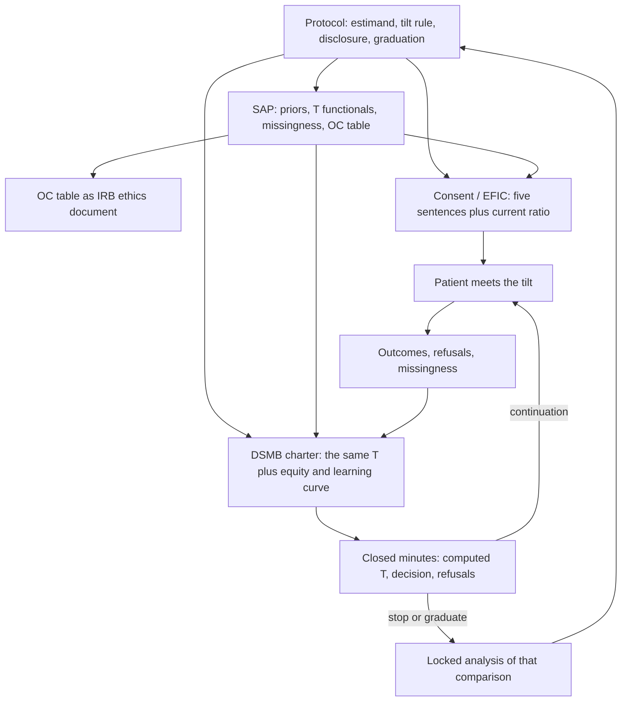

# Ethics, Consent, and Governance of Bayesian and Adaptive Research

## Opening

The first patient on a response-adaptive platform is not a philosophical example. Someone has to sign a form that says the next assignment may not be one-to-one, that a committee they will never meet is watching a posterior they will never see, and that the tilt toward the arm that is winning is the feature, not a failure of randomization. If the form cannot say those things in ordinary words, the platform is not ready for that patient. The ethics are not a cover letter on a finished design. They are a design constraint.

## Learning objectives

After working this chapter you should be able to:

- Treat clinical equipoise as a statement about a community posterior, not as a mood in the attending who is obtaining consent.
- Write a consent paragraph for response-adaptive randomization that names the tilt, the reason for the tilt, and the right to withdraw without translating “70/30” into “the computer thinks this is better for you.”
- Specify DSMB charter functionals — which posterior probabilities, which predictive probabilities, which equity splits — before the first look, and refuse a charter that only says “safety and efficacy will be monitored.”
- Read an operating-characteristics table as an ethical document: expected number treated on an inferior arm, expected false graduation, expected time to a correct drop.
- Keep four texts consistent: protocol, statistical analysis plan, consent form, and closed DSMB minutes.

## Clinical vignette

A multicenter Bayesian platform for spontaneous intracerebral hemorrhage has two active domains on the morning you are on call. Domain 1 randomizes intensive versus standard blood-pressure lowering in the first hour. Domain 2 randomizes minimally invasive evacuation versus best medical care in patients with a moderate-volume deep hematoma who present within 24 hours. You are consenting the first patient *at your hospital*. The platform has already enrolled 86 patients in domain 2 at other sites. The allocation probability this morning is 0.70 to evacuation and 0.30 to medical care. The open protocol says that adaptation begins after 40 patients, that the tilt is a function of the posterior probability that evacuation improves utility-weighted 180-day mRS by more than 0.03, and that allocation is capped at 80/20 until a pre-declared efficacy or futility rule fires.

The patient is 62, hypertensive, with a 28 mL left putaminal hemorrhage, NIHSS 14, GCS 13. He can repeat a short consent sentence back to you. His daughter is in the room. She says, “If the study already thinks surgery is better, why is there a 30% chance he gets medicine?” The night fellow says, “Just tell them it’s randomized, like any trial.” The research coordinator has the current allocation on a sheet and is not supposed to tell you which way this patient will go before consent is signed. You have ten minutes before the scan window for evacuation planning closes.

Do not improvise a metaphor. Write the three sentences you will say to the daughter about the 70/30 tilt, the one sentence you will not say, and the charter functional you hope the DSMB is looking at besides \(P(\delta > 0.03 \mid y)\).

## Equipoise is a posterior, not a mood

Freedman’s clinical equipoise is a claim about a community of competent practitioners: there is no consensus that one arm is inferior. In a Bayesian platform that claim has a natural translation. Let \(\pi_{\text{comm}}(\delta)\) be a distribution that represents the *community’s* uncertainty about the increment, not the PI’s hope and not the most recent enthusiast on social media. Equipoise, as a design permission, is the statement that \(\pi_{\text{comm}}\) still puts enough mass on both sides of a clinically relevant threshold that a randomized assignment is not a known harm.

That statement is time-stamped. After 86 patients, the *platform’s* posterior \(p(\delta \mid y_{1:86})\) is not \(\pi_{\text{comm}}\). It is the platform’s current belief. Clinical equipoise can survive a 70/30 tilt if the community — including people who discount this platform’s unblinded mRS, its learning curve for evacuation, and its selected sites — would still not agree that medical care is inferior. Clinical equipoise can fail even at 50/50 if the community has already moved, for example because a large external trial reported overnight. The ethical object is the community posterior, updated by the external world *and* by whatever of the platform the community is allowed to know. It is not the last closed-session slide.

Several impostors travel under the same name.

**Individual equipoise.** The consenting attending is personally unsure. Useful as a conscience check. Insufficient as a design justification: a confident attending can still enroll if the community is unsure, and an unsure attending should not enroll if the community has already decided.

**The posterior is not at \(\eta\).** “We have not crossed the efficacy bar, therefore equipoise holds.” This confuses a stopping rule with a moral fact. A platform can be at \(P(\delta > 0.03 \mid y) = 0.93\) with an 80/20 tilt, not yet at a graduation threshold of 0.99, and already past the point at which a reasonable outsider would say medical care remains acceptable. Whether that point has been reached is a charter question, not a software output.

**“Patients on the losing arm still help the likelihood.”** True, and not a reply to the daughter. Contribution to estimation is a public good. The patient’s interest is the care they receive. Adaptive allocation is the attempt to serve both. It does not make the 30% assignment to an apparently inferior arm vanish.

!!! tip "Clinical Pearl"
    If you cannot draw \(\pi_{\text{comm}}\) and \(p(\delta \mid y_{\text{now}})\) as two different objects, you are not ready to explain the tilt. The first is why the trial exists. The second is why the ratio is no longer 1:1. Consent must mention both. A DSMB that only watches the second will stop too late or too early, depending on its mood that morning.

A teaching picture of the vignette’s domain 2, invented counts:

| Object | Teaching value at n = 86 | Role |
| --- | ---: | --- |
| Community prior at launch, \(P(\delta > 0.03)\) | 0.45 | Permission to start |
| Platform posterior, \(P(\delta > 0.03 \mid y)\) | 0.84 | Input to the allocation function |
| Allocation to evacuation | 0.70 | What the daughter is asking about |
| PPoS to N = 300 of crossing \(\eta = 0.99\) | 0.62 | Whether continuing the *comparison* is still worth patients |
| \(P(\delta < 0 \mid y)\) | 0.04 | Mass still on “evacuation is worse” |
| Community posterior if the platform were fully public | unknown | The actual equipoise object; the charter must say how closed the posterior stays |

The last row is the uncomfortable one. Platforms often keep the direction of the tilt partly visible (sites see 70/30) while keeping the posterior itself closed. That split is coherent only if the charter says so, and only if the consent form does not pretend the assignment is still a coin.

## Consent for a ratio that can move

Ordinary RCT consent already strains language: randomization, uncertainty, the right to standard care outside the trial, the right to withdraw. Response-adaptive randomization adds a fact that families hear as a contradiction. “We do not know which is better” and “70% of patients now get surgery” cannot be the same sentence. They are not. The first is (if still true) a statement about \(\pi_{\text{comm}}\). The second is a statement about \(p(\delta \mid y)\) and a pre-declared mapping from that posterior to an allocation probability.

A consent form that is honest about RAR has to do five things in language a GCS-13 patient and a frightened daughter can use.

1. **Name the adaptation.** “The chance of being assigned to surgery versus medicine is not fixed at half and half. It can change as the study learns.”
2. **Name the reason.** “If early results suggest one approach is doing better, later patients are more likely to receive that approach. This is to reduce the number of people who get the worse option, while the study is still unsure enough to continue.”
3. **Name the current policy without claiming personal benefit.** “Today, about 7 in 10 participants are assigned to surgery and 3 in 10 to medicine. That does not mean surgery has been proven better for you. It means the study’s current information leans that way, and the rules we published before we started say we should lean with it.”
4. **Name the cap and the exit.** “The chance will not go past 8 in 10 until the study crosses a high bar or stops. You can leave the study at any time and receive the care your own doctors recommend.”
5. **Name the alternative.** “You can refuse the study and choose surgery, or choose medicine, or ask us to decide as we would if there were no study. Those choices are not punished.”

The sentence you will not say is the night fellow’s, and you will not say its Bayesian cousin either: “the computer thinks surgery is better for you, so you will probably get surgery.” The allocation probability is not a posterior predictive of *this* patient’s outcome under each action. It is a design functional of a population increment. This patient is 62 with a 28 mL putaminal clot; the 86 patients behind the tilt include other locations, other volumes, other ages, and a learning curve. Personalizing the tilt in the mouth of the consenter is a different trial — a covariate-adaptive or hierarchical one — and if you have not designed that trial you may not describe this one as if you had.

!!! warning "Common Pitfall"
    Do not hide the current ratio because you fear it will destroy consent. Families who discover the 70/30 after enrollment, from a nurse who thinks they already know, will correctly conclude that the form was the least honest object in the room. If the current ratio would make consent collapse, that is information about equipoise, not a reason to withhold the ratio.

There is a genuine remaining problem. A 70/30 tilt, described honestly, will change who consents. Patients who want surgery will sign; patients who want to avoid surgery will not. The enrolled population drifts toward surgical preference, and if preference correlates with unmeasured prognosis, the likelihood drifts with it. This is not a reason to lie. It is a reason to record the offer, the refusal, and the stated reason, and to put a selection model in the SAP (Chapter 24’s \(R\), now at the door rather than at day 180). Platforms that treat refused consent as a hole with no model will estimate an increment in people who wanted the tilt.

Delayed consent and exception from informed consent (EFIC) in emergency ICH raise a sharper version. A patient with GCS 9 cannot do the five-sentence dance. Community consultation for EFIC must then include the adaptation, not only the usual “we may enroll you in a study while you are unconscious.” A community that accepted 1:1 emergency randomization has not thereby accepted a 80/20 tilt they were never shown. The consultation materials are part of the four texts.

## The DSMB charter is a list of functionals

A charter that says “the board will monitor safety and efficacy and may recommend stopping” has not been written. A Bayesian DSMB needs the same objects the design already has, named as the board’s inputs, plus the objects the design is tempted to ignore.

**Efficacy functional.** The pre-declared \(P(\delta > \delta_0 \mid y) > \eta\), or the PPoS rule, with the look schedule. The board’s job is not to invent a new \(\eta\) because this morning’s posterior is exciting. The board’s job is to check that the functional was computed on the locked estimand, under the locked analysis prior, with the locked population.

**Futility functional.** PPoS to the feasible \(N\), or a posterior probability of a worthwhile effect that has collapsed. Stopping for futility is an ethical act: it frees patients from a comparison that will not answer. It is also a scientific act that the SAP must pre-declare, or the board will argue PPoS versus “it looks flat” for an hour.

**Harm functional.** Not only deaths. A posterior on excess severe disability, on re-bleed, on procedure-related injury, computed in the whole cohort and in pre-declared subgroups (age ≥ 80, volume > 40 mL, infratentorial, anticoagulant-associated). A platform that adapts on UW-mRS and watches only mortality will tilt toward an arm that saves lives into mRS 5.

**Equity functionals.** Allocation probabilities, outcome posteriors, and consent-refusal rates split by site, by language, by transfer status, by sex, by race and ethnicity as the protocol defined them. A 70/30 tilt that is 85/15 at well-resourced sites and 55/45 at safety-net sites is a different experiment in different bodies. A harm signal concentrated in transferred patients is not “noise in a subgroup.”

**Learning-curve functional.** For an operative arm, calendar time or operator volume belongs in the model. The board should see a posterior that allows early surgical outcomes to be worse than late ones. Otherwise the tilt will lock onto “medicine looks better” because the first twenty evacuations were the hospitals’ first twenty evacuations.

**External-evidence functional.** What will the board do if a competing trial reads out? The charter should say whether the analysis prior stays locked, whether an external-data model is pre-specified, and whether equipoise is re-opened as a community-posterior question. Silence here is how platforms sleepwalk past a changed world.

!!! note "Mathematical Detail"
    Every charter functional is a \(T(\{ \theta^{(s)} \}, \text{data, time})\). Write \(T\) in the charter the way you would write it in the SAP. “Concern for harm in the elderly” is not a \(T\). “Recommend a hold on further enrollment of age ≥ 80 if \(P(\delta_{\ge 80} < 0 \mid y) > 0.80\) and at least 20 such patients have 180-day outcomes” is a \(T\). The second can be simulated. The first can only be performed.

The closed session then has a script. Compute the pre-declared \(T\)s. Compare them to the pre-declared bars. Look at the equity splits and the learning curve as mandatory diagnostics, not as optional plots if time remains. If a member wants a new functional — “what if we used mRS 0–3 instead” — that request goes in the minutes as a sensitivity, not as a silent replacement of the estimand. A board that redefines success in closed session has just rewritten the protocol without the people who signed consent.

## Operating characteristics are an ethical document

Chapter 10 treated the OC table as what regulators and a DSMB use to trust a design. It is also what an IRB and a community consultation use to decide whether the design is allowed to meet a patient. The ethical content lives in particular cells.

**Expected number treated on an inferior arm.** Under a truth where evacuation is better by the worthwhile increment, how many patients does the design assign to medicine? Under the reverse truth, how many does it assign to surgery? RAR is sold on shrinking these numbers. The OC table tells you whether the sale is real at your sample size and your adaptation schedule. A tilt that begins at patient 40, caps at 80/20, and sits on noisy ordinal outcomes may save three inferior assignments over a 300-patient comparison. Three is not zero. It is also not the brochure.

**Expected number treated on a superior arm that the design failed to recognize.** The false-futility rate. Dropping evacuation when it is truly better, because the first surgeons were learning, is an ethical harm to every subsequent patient who would have been offered a graduated arm.

**False graduation.** Declaring evacuation standard when the truth is a null or a harm. The type I analogue. In a platform this is not only a statistical embarrassment. It is a policy event: the graduated arm becomes the new control, and the next domain inherits it.

**Expected time to a correct decision.** Patients outside the trial, and patients at sites that have not yet opened, live in this cell. A slower, better-calibrated design has a moral cost that a 1:1 trial with a long tail also has. The comparison is not “adaptive versus ethical.” It is this design’s expected calendar time versus a feasible alternative’s.

**Subgroup OC.** The same cells, for age ≥ 80, for transfer-ins, for anticoagulant-associated ICH. A design that looks beautiful in the marginal OC and spends older patients on the inferior arm is not an ethical design with a subgroup limitation. It is a design whose loss function forgot a group.

!!! info "What to hand the IRB"
    Not the grant’s power at the hopeful \(\delta\). The OC table under a null, under a worthwhile increment, under a harm, and under the design prior, with expected \(n\) on each arm, expected false graduation, and the equity splits you will actually watch. If the IRB cannot read it, sit with them and read it. An unread OC table is not an ethical document. It is a supplement.

Teaching OC fragment for domain 2, invented, 1:1 versus RAR with a 40-patient burn-in and an 80/20 cap, maximum \(N = 300\):

| Truth | Design | Pr(graduate evacuation) | E[n on inferior arm] | E[duration, months] | Comment |
| --- | --- | ---: | ---: | ---: | --- |
| \(\delta = 0\) | 1:1 | 0.03 | — | 48 | Type I analogue |
| \(\delta = 0\) | RAR | 0.04 | — | 46 | Slightly sloppier type I |
| \(\delta = 0.06\) | 1:1 | 0.78 | 150 | 48 | Half the patients on medicine |
| \(\delta = 0.06\) | RAR | 0.76 | 118 | 47 | Saves ~32 inferior assignments |
| \(\delta = -0.04\) (surgery worse) | RAR | 0.02 | 96 on surgery | 36 | Futility helps; not magic |
| Design prior | RAR | assurance 0.55 | 130 on currently worse | 44 | The world the IRB is actually sending patients into |

Those cells are **teaching numbers**. The qualitative lesson is what you take to the board: RAR at this \(n\) and this endpoint buys a modest reduction in inferior assignments, almost no time, and a small type I tax. If the ethical justification of the tilt was “far fewer patients on the loser,” the OC has not delivered “far fewer.” You may still run RAR. You may not advertise a benefit the simulation does not show.

## Equity is a design parameter

Adaptive machinery inherits and can amplify the selection already built into stroke and ICH research. Comprehensive centers open first. Transfer-in patients have already survived a filter. Language other than English slows consent and increases missing day-180 mRS (Chapter 24). An operative arm has a learning curve that is steeper at sites that do fewer evacuations. Response-adaptive randomization, applied globally, will tilt toward the arm that is winning *in the enrolled population at the open sites*. If that population is younger, more often imaged, more often English-preferring, and more often sitting in a high-volume operative shop, the tilt is a recommendation about those patients dressed as a recommendation about ICH.

Practical consequences for a platform that does not want this to be a footnote:

- **Site-open order is an allocation.** Staggered activation of safety-net and non-English-dominant sites is a scientific decision. Put it in the protocol, not in the operations appendix.
- **Do not adapt on a pooled posterior that the charter never splits.** A hierarchical model with site and language effects, and adaptation that cannot starve a site whose posterior disagrees with the pool, is more work. It is also the difference between a platform and a device for exporting one system’s practice.
- **Measure refusal.** If the 70/30 tilt is consented at 40% in one language and 80% in another, the likelihood is a selected likelihood. Report that in the closed session as an equity functional.
- **Pre-declare groups that cannot be dropped by accident.** If anticoagulant-associated ICH is a domain you claim to care about, it needs its own look, or at least a rule that the global tilt cannot send those patients 80/20 on the basis of everyone else.

!!! warning "Common Pitfall"
    Do not repair an equity problem by putting a social-determinant covariate in the outcome model and then adapting on the marginal posterior anyway. The model will adjust the estimate. The next patient will still be assigned by the global tilt. Adaptation is an allocation of care. Adjusting the likelihood does not allocate.

## Four texts that have to be the same trial

A Bayesian adaptive platform generates a thicket of documents. Four of them have a special status: they are the texts that a patient, a reviewer, a board member, and a future reader use to decide whether the thing that happened was the thing that was allowed. They must describe the same experiment.

**The protocol.** Scientific aims, estimands, populations, domains, adaptation rules in words, consent policy including how the current tilt is disclosed, data that remain closed, and what happens when an arm graduates. The protocol is the public promise.

**The statistical analysis plan.** The same rules in functionals and models: analysis prior, design prior, \(\delta_0\), \(\eta\), PPoS definition, missing-data model, measurement-error model if any, hierarchical pieces, site effects, the locked primary analysis for a graduated comparison, and the simulation that produced the OC table. The SAP is allowed to be more technical than the protocol. It is not allowed to be more *permissive*. A SAP that adds an unmentioned covariate-adaptive twist, or that changes \(\delta_0\) from 0.03 to 0, has rewritten the promise.

**The consent form (and the EFIC consultation script).** The same adaptation, in the five sentences above, with a slot for the current ratio if the protocol said the ratio would be disclosed. No claim that participation is in the patient’s medical best interest. No claim that the prior was uninformative. No claim that the study “uses Bayesian statistics to find the best treatment faster” without the OC table’s modest numbers somewhere in the information sheet.

**The closed DSMB minutes.** What \(T\) was computed, what the value was, what the board did, and what it refused to do. Minutes that say “the board reviewed the Bayesian analyses and recommended continuation” are not minutes. They are a press release for a folder nobody will read until a lawsuit. A future reader — a regulator, a journalist, the next platform’s methodologist — should be able to reconstruct the decision from the minutes plus the SAP.



Inconsistencies that should be treated as protocol deviations, not as style:

- Consent says 1:1; protocol says RAR after 40.
- Protocol says the current ratio is disclosed; coordinator sheet is hidden from the family.
- SAP’s primary estimand is UW-mRS; closed session graduates on mRS 0–2.
- Charter watches mortality; adaptation watches UW-mRS; consent mentions “recovery.”
- OC table assumed MAR and complete mRS; 22% of scores are heading out of county (Chapter 24) and nobody updated the simulation.

!!! tip "Clinical Pearl"
    Read the four texts in one sitting, out loud, with a coordinator and a patient representative in the room. Every place a listener hears two experiments is a place you will later have to explain to a board that is less friendly than this one.

### For the biostatistician / methodologist

Your job at design is to make the ethical objects computable. Equipoise as \(\pi_{\text{comm}}\) needs an elicited community prior, recorded, with names and dates, not a vague “experts were uncertain.” Consent needs a sentence that remains true when the allocation is 50/50 and when it is 80/20; write both versions. The charter needs \(T\)s you can ship as a locked script. The OC table needs the inferior-arm counts and the equity splits, not only power and type I.

At a look, do not hand the board a notebook. Hand them the pre-declared table of \(T\)s, the same table under one hostile analysis prior, the equity splits, and a one-page narrative that does not recommend an action unless the charter asked the statistician to recommend. Recommendation is the board’s. Computation is yours. Blurring those is how unblinded statisticians become unblinded voting members without the appointment.

RAR estimation is not ethically optional. Report the posterior at the stopping time under the analysis prior, and report a pre-declared estimator that the SAP said would be the public number (Chapter 10). If those two disagree in the third decimal, the minutes should say so. If they disagree in the second, the four texts were not describing the same functional.

```r
# Teaching RAR path for an ICH domain.
# Binary teaching endpoint: "good" 180-day outcome.
# Allocation from a simple current-posterior probability,
# burn-in 40 at 1:1, then p_assign = 0.2 + 0.6 * P(p_surg > p_med | y),
# capped later at 80/20 by construction of that map.

set.seed(20260818)

rdir <- function(a, b) {
  # Posterior P(p1 > p2) for two independent Betas via Monte Carlo.
  mean(rbeta(4000, a[1], b[1]) > rbeta(4000, a[2], b[2]))
}

simulate_rar <- function(p_true = c(surg = 0.38, med = 0.30),
                         n_max = 300, burn = 40) {
  n <- c(surg = 0, med = 0)
  s <- c(surg = 0, med = 0)
  assign_surg <- logical(n_max)
  for (i in seq_len(n_max)) {
    if (sum(n) < burn) {
      ps <- 0.5
    } else {
      pp <- rdir(1 + s, 1 + n - s)
      ps <- 0.2 + 0.6 * pp          # lives in [0.20, 0.80]
    }
    arm <- if (runif(1) < ps) "surg" else "med"
    y   <- rbinom(1, 1, p_true[arm])
    n[arm] <- n[arm] + 1
    s[arm] <- s[arm] + y
    assign_surg[i] <- arm == "surg"
  }
  list(n = n, s = s, prop_surg = mean(assign_surg),
       final_pp = rdir(1 + s, 1 + n - s))
}

# Inferior-arm count when surgery is truly better.
set.seed(20260818)
reps <- replicate(400, simulate_rar()$n["med"], simplify = TRUE)
c(mean_inferior = mean(reps),
  q10 = quantile(reps, 0.10),
  q90 = quantile(reps, 0.90))
```

!!! example "R Deep Dive"
    Replace the binary endpoint with an ordinal draw, put a learning-curve term on the surgical success probability that decays over the first 30 evacuations, and recompute expected inferior-arm counts. If the ethical brochure assumed the first block, and the simulation of the actual operative arm looks like the second, the brochure is the document that has to change. Not the consent verb tenses.

## Worked solution to the opening vignette

**Three sentences to the daughter.** “This study is still unsure enough, across the doctors who designed it, that both surgery and medicine remain acceptable care for a person like your father; that is why there is a study at all. As the study has learned from 86 people so far, it has started to assign more people to surgery — today about 7 in 10 — because the early results lean that way, and the rules written before we started say we should lean with them. That is not the same as knowing surgery is better for him; if we already knew, we would not still be randomizing, and you could choose surgery outside the study.”

**The sentence you will not say.** “The computer thinks surgery is better for him, so he will probably get the better treatment.” You will also not say the night fellow’s “just tell them it’s randomized, like any trial,” because it is not like any trial, and she already knows the ratio.

**The charter functional besides \(P(\delta > 0.03 \mid y)\).** At least one harm functional that is not all-cause death — posterior probability of excess mRS 5–6, or of procedure-related deterioration — *and* an equity split of the tilt and the outcomes by site and by transfer status, *and* a learning-curve look at whether the surgical posterior is being carried by late cases at high-volume sites. PPoS to the feasible \(N\) belongs in the same closed packet, because a 70/30 tilt with a PPoS of 0.15 is a different ethical object from a 70/30 tilt with a PPoS of 0.62: the first is a comparison that should probably stop, not a comparison that should keep assigning 30% to medicine in the name of adaptation.

On the ten-minute clock: if the daughter’s question has revealed that the family wants surgery and will not accept a 30% chance of medicine, that is a refusal, not a failure of explanation. Offer surgery outside the platform if it is available and appropriate. Record the refusal. Do not re-explain until the 70/30 sounds like 100/0. The tilt is a fact about the design. It is not a bargaining chip.

!!! warning "Common Pitfall"
    Do not “make them comfortable with 70/30” by inflating the meaning of 0.84. Comfort is not the endpoint of consent. Understanding of uncertainty, of the tilt, and of the alternative is the endpoint. A family that understands and refuses is the system working.

## Exercises

1. **Consent rewrite.** The night fellow’s script is: “It’s randomized, like any trial; the computer just helps us learn faster.” Rewrite it into the five required contents, in fewer than 180 words, without the words posterior, Bayesian, or allocation probability. Then mark the one clause a GCS-13 patient might still not have.

2. **Equipoise objects.** At launch, \(\pi_{\text{comm}}\) puts probability 0.45 on \(\delta > 0.03\). At n = 86 the platform posterior puts 0.84 on the same event. A competing trial reads out overnight with a frequentist interval that sits entirely below zero in a slightly different population. Which object moved, which object should the DSMB recompute first, and what sentence goes into the consent form tomorrow morning if the platform continues?

3. **Charter functionals.** Write three \(T\)s for domain 2: one efficacy, one harm, one equity. Each must be computable from a posterior and a sample-size floor. Then write the action the board is pre-authorized to take if that \(T\) crosses its bar. If you cannot name the action, the \(T\) is not yet a charter item.

4. **OC as ethics.** Using the teaching OC table, a community advisor says, “So the adaptive design saves 32 people from the worse arm when surgery is truly better, and it slightly increases false graduation when there is no difference. Is that a good trade?” Answer in one paragraph for the advisor and one paragraph for the IRB, using different cells of the table.

## Further reading

- Freedman B. Equipoise and the ethics of clinical research. *New England Journal of Medicine*. 1987;317:141–145.
- London AJ. Learning health systems, clinical equipoise, and the ethics of response adaptive randomization. *Journal of Medical Ethics*. 2018;44:409–415.
- Hey SP, Kimmelman J. Are outcome-adaptive allocation trials ethical? *Clinical Trials*. 2015;12:102–106. And the replies in the same issue: read both sides before you write a consent paragraph.
- Berry SM, Carlin BP, Lee JJ, Müller P. *Bayesian Adaptive Methods for Clinical Trials*. Boca Raton: CRC Press; 2010. Especially the chapters that treat stopping as a decision.
- Adaptive Platform Trials Coalition. Adaptive platform trials: definition, design, conduct and reporting considerations. *Nature Reviews Drug Discovery*. 2019;18:797–807.
- U.S. Food and Drug Administration. *Adaptive Design Clinical Trials for Drugs and Biologics Guidance*. 2019. Pair with FDA. *Guidance for the Use of Bayesian Statistics in Medical Device Clinical Trials*. 2010.
- National Research Council. *The Prevention and Treatment of Missing Data in Clinical Trials*. Washington, DC: National Academies Press; 2010. Missingness is a governance problem as well as a likelihood problem.
- Wendler D, Dickert NW, Silbergleit R, Kim SYH, Brown J. Targeted consent for research on standard of care interventions in the emergency setting. *Critical Care Medicine*. 2017;45:e105–e110.
- Ellenberg SS, Fleming TR, DeMets DL. *Data Monitoring Committees in Clinical Trials*. 2nd ed. Chichester: Wiley; 2019.
- Gillespie M, et al. Equity considerations in adaptive trial design and reporting — read the current CONSORT-equity and ACE materials alongside this chapter’s equity functionals.

!!! success "Key Takeaway"
    Equipoise is a community posterior with a time stamp. Response-adaptive randomization is an ethical offer only if consent can name the tilt without converting it into a promise, if the DSMB charter watches pre-declared functionals rather than a mood, if the operating-characteristics table shows a real reduction in inferior assignments at the \(n\) you will actually enroll, and if equity splits are part of those functionals rather than a discussion paragraph. Protocol, SAP, consent, and closed minutes are four copies of one experiment. When they diverge, the patient was consented to a trial you did not run. The first patient at your hospital, facing a 70/30 sheet, is the audit.
