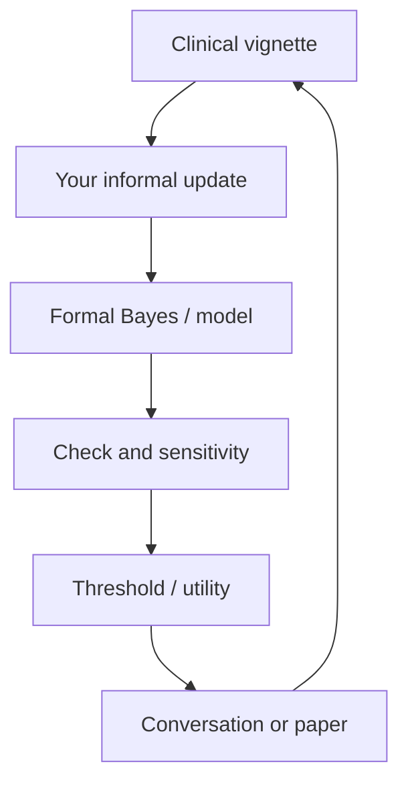

# How to use this book

## Opening

This is not a cookbook of `brms` recipes and not a philosophy of science seminar. It is a single argument about how a neurologist should change her mind and then act.

## The pedagogical loop

You will be asked to write down a number *before* the formal solution. That is not a quiz. It is how you notice base-rate neglect, anchoring, and availability in your own System 1.

## Callout boxes

| Box | Meaning |
| --- | --- |
| Clinical Pearl | Something you can use on service tomorrow |
| Common Pitfall | A mistake this book has watched people make |
| Mathematical Detail | Optional formality; skip on first read if you wish |
| R Deep Dive | Copy-paste R, usually `brms` |
| Key Takeaway | The chapter in one breath |

## Software

Install the stack in [Appendix A](appendices/a-r-setup.md). Examples are self-contained. They use **teaching numbers** — invented counts that illustrate a calculation, not extracted cells from a copyrighted table.

You do not need to run any R to benefit from Parts I, IV, V, and the vignettes in Part VI. Parts II and III, and the models in Chapters 21–24, are richer if you do.

## What this book is not

- Not a substitute for [Gelman et al., *Bayesian Data Analysis*](http://www.stat.columbia.edu/~gelman/book/), McElreath’s *Statistical Rethinking*, or a mathematical statistics sequence.
- Not institutional tPA, EVT, or ICH policy.
- Not a claim that Bayesian computation makes a biased study unbiased. Pair this book with [Critical Appraisal for Neurologists](https://rkalani1.github.io/CRIT-APP/).

## Suggested paths

**Weekend path (8–10 hours):** Chapters 1–3, 9 (estimation section only), 14–16, one case in 18.

**Course path (a quarter):** Parts I–II, then 11, 14–17, 19, 21, 25. Assign exercises; solutions live in [Appendix C](appendices/c-solutions.md).

**Research path:** 4–10, 13, 17, 20–26, Appendix B. Pair Chapter 16 with 21 when the question is “this patient, not that trial.”

!!! success "Key Takeaway"
    Read for the update, not for the software. Software is how we make the update inspectable. The clinical act is still: start with a prior, listen to the likelihood, walk the posterior to a threshold, and say the uncertainty out loud.
